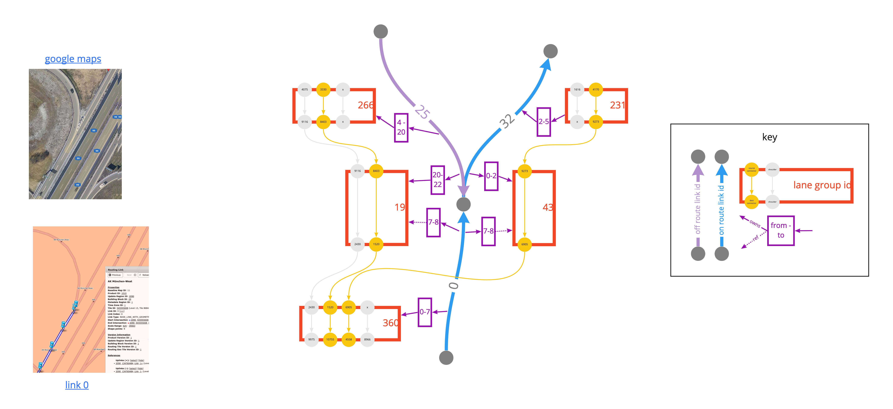

// Copyright (C) 2021 TomTom NV. All rights reserved.
//
// This software is the proprietary copyright of TomTom NV and its subsidiaries and may be
// used for internal evaluation purposes or commercial use strictly subject to separate
// license agreement between you and TomTom NV. If you are the licensee, you are only permitted
// to use this software in accordance with the terms of your license agreement. If you are
// not the licensee, you are not authorized to use this software in any manner and should
// immediately return or destroy it.

= Overlapping Segments Filter

== Status

Implemented

== Context

In the maps delivered by MapScape, we find that there are many arcs that define more than one lane group over the same validity range.  For example, consider https://nds.tomtomgroup.com/webviewer/42286/?action=FeatureInfo%3Flang%3DNULL%26poiCategoryCollectionId%3D0%26iconCollectionId%3D0%26mode%3DNEAREST_LINK%26lon%3D1272711.2949639%26lat%3D6137183.1027005%26scale%3D1066.364792069048%26disputantId%3D0%26theme%3DDEFAULT%26routingService%3D0%26routeType%3DTIME_WITH_PENALTY%26vehicleType%3DPERSONAL_CAR%26labeling%3Dtrue%26icons%3Dtrue&zoom=18.999999999864816&lat=48.18217&lon=11.43288&layers=FFFBFFFFFFFFF000FFFTTT0000TT&&poiCategoryCollectionId=0&iconCollectionId=0&disputantId=0&lang=NULL&theme=DEFAULT&routingService=0&routeType=TIME_WITH_PENALTY&vehicleType=PERSONAL_CAR&labeling=true&icons=true[this highway merge].  Lane groups 19 and 43 both cover the validity range 0 to 1 on link ID 0.

Our current implementation of the `LaneGuidanceBuilder` assumes that arcs have non-overlapping lane groups.  It calculates the start and end offset on route of the resulting lane segments by accumulating the length of the on-route lane groups in sequence.  When lane groups overlap, this causes the offsets to be larger than expected.

Furthermore, we are incorrectly marking these lane segments as being on route, simply because they are referenced by an on-route arc.  In fact only one of the parallel lane groups connects to the rest of the route.  The others should be marked as being off-route, to avoid confusion for clients.

== Decision

After connectivity between lane segments has been established, we will analyse the connectivity graph to decide which segments are truly on the route.  All others will be marked as off-route.

To do this, we will:

* Identify a set of start segments at the start of the lane guidance scenario
* Identify a target segment, initially the last segment in the scenario
* attempt to find a path to the last segment
* If no path is found, change the target to the previous segment and keep trying
* Any segments not in the path that was found will be marked as off-route

== Consequences

* In principle, there may be multiple paths through the lane guidance scenario.  This algorithm will find only one, and it is not defined which path it will find.
* If there is a break in connectivity between the lane segments, perhaps due to a map bug, all segments after the break will be marked as off-route
* The BFS is not very efficient, and may take significant runtime in very large lane guidance scenarios
