// Copyright (C) 2018 TomTom NV. All rights reserved.
//
// This software is the proprietary copyright of TomTom NV and its subsidiaries and may be
// used for internal evaluation purposes or commercial use strictly subject to separate
// license agreement between you and TomTom NV. If you are the licensee, you are only permitted
// to use this software in accordance with the terms of your license agreement. If you are
// not the licensee, you are not authorized to use this software in any manner and should
// immediately return or destroy it.

= Lane Arrow Synthesis at Complex Intersections

== Status

Implemented

== Context

https://jira.tomtomgroup.com/browse/NAV-56976[Epic link: Simple Lane Guidance in Complex Intersections]

Currently we have implemented simple lane guidance for highway
junctions and simple intersections in cities.  However there are
several problems with multi-lane intersections in cities, causing
incorrect arrows to be synthesised.

Diagrams taken from https://miro.com/app/board/o9J_llhixvo=/?invite_link_id=585666636395[this Miro board].

=== Current Implementation

==== Purpose of arrow synthesis:

For each furcation in the road network along the route, we want to have one on-route lane segment containing arrows.

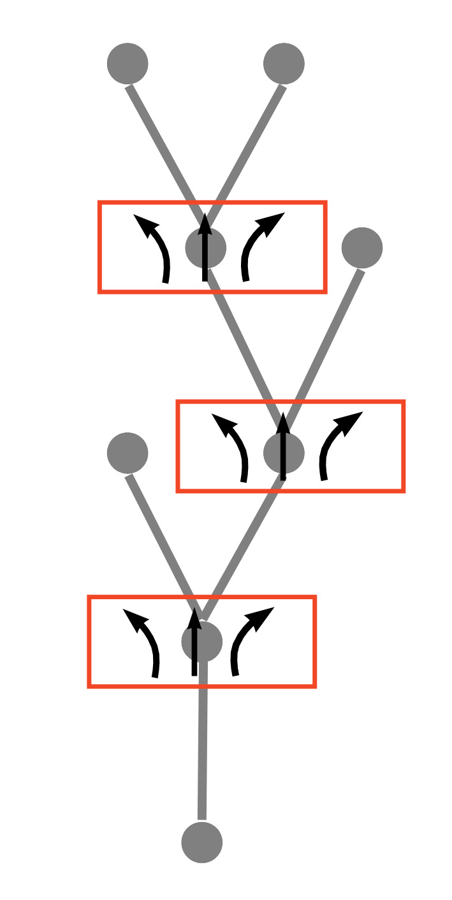

==== Source and Target segments:

One confusing aspect of arrow synthesis is that it combines
information from two different road models in the map, the routing
model consisting of arcs and the lane model consisting of lane groups.
Both of these model the furcations in the road, but they very often
place the furcation at different places.  For example, here in the
routing model the arc A1 diverges into the arcs A2 and A3.  However in
the lane model the lane group LG2 diverges into the lane groups LG3
and LG4, with the point of divergence happening rather later along the
road.  That is, LG2 covers a portion of A2 and A3.

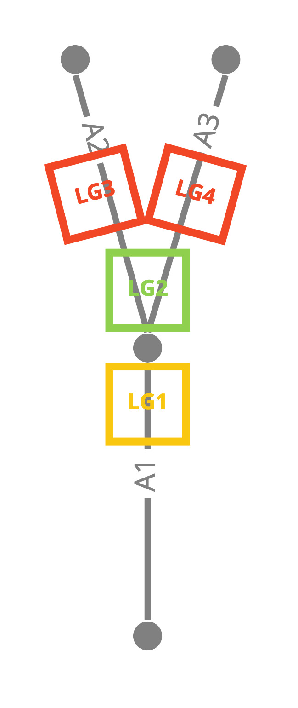

For this reason we need to work with two different lane segments at
the same time.  The Source Segment corresponds to the lane group where
the lane model diverges.  At that point we assign arrows to lanes, so
it is the "source" of the arrows.  Then there is the Target Segment,
which corresponds to the arc where the routing model diverges.  This
is the maneuver point, and the place where the arrows actually have to
be recorded.  This is therefore the "target" of the arrow synthesis.

[#current_identifying_furcations]
==== Identifying Furcations

A furcation is defined as a node with one on-route arc and outgoing arcs, one of which is on the route.

The incoming arc to the furcation is the starting point for arrow synthesis.  This is called the "target arc".  In the example below, the target arc is A1.

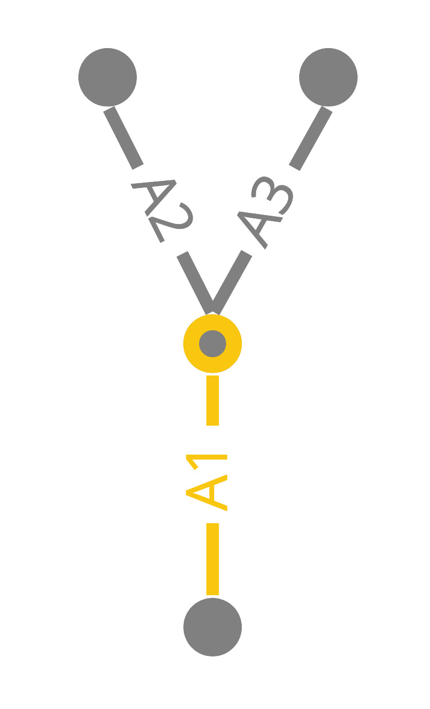

For all arcs at the furcation, we record the relative angle to the target arc in a map:

[literal]
A1 -> 0°
A2 -> -30°
A3 -> 30°

==== Identifying the Target Segment

Next we need to choose the segment that will hold the arrows.  This is called the "target segment".

The target segment is the last lane group before the furcation.  In this case, it is LG3.

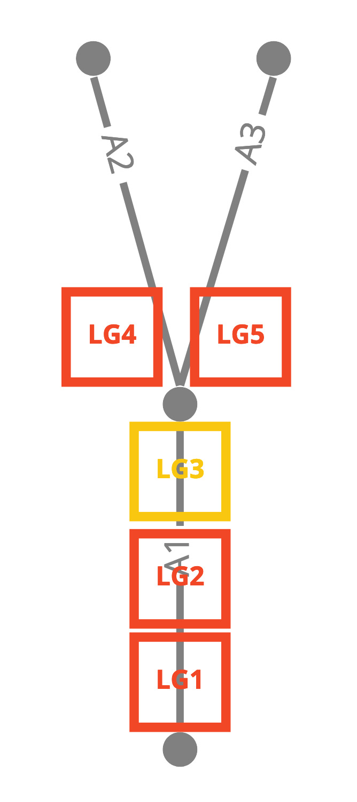

We can find that because when we read the arcs and lane groups, we make a mapping:

[literal]
A1 -> LG1
A1 -> LG2
A1 -> LG3
A2 -> LG4
A3 -> LG5

We can choose the last lane group corresponding to the target arc A1.

==== Target Segments Covering Multiple Arcs

Suppose that in fact the lane group is long and extends over the previous arc:

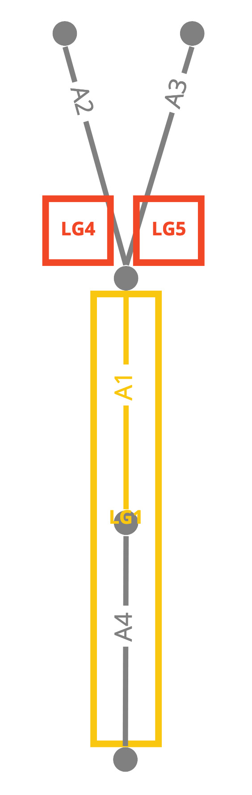

In this case there will be a mapping from A4 -> LG1, but A1 will not map to any lane group.

Therefore, we must search backwards from A1 through the road network until we find an arc with a lane group.

The last segment on that arc is the target lane segment.

This does not affect the choice of target arc: it is still A1, and LG1 is still the relevant lane group.

==== Parallel Lane Groups

If the end of the arc has multiple lane groups in parallel, it is ambiguous which one to choose.

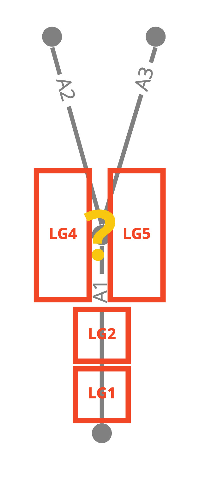

This should not happen at complex intersections.  The spec suggests
that each arc leading to the intersection should end in one
unambiguous lane group.

We believe there could be such cases where there is a physical
separation between two sets of lanes on one road, and the FTX block
models this as two lane groups where the SD map models it as a
single arc.  We will investigate this in
https://jira.tomtomgroup.com/browse/NAV-63608[NAV-63608].

==== Identifying the Source Segment

Having determined the target arc and the target segment, the next step
is to find a source segment.  We will determine the arrows of the
lanes in the source segment, and copy those to the target segment.

One important simplifying aspect of this algorithm is that we can
reliably search forward for a source segment, we never have to look
backwards.  The source segment might be the same as the target
segment, but if it was earlier it would not cover the maneuver point.

To find the source segment we move forward on the route until  we find a segment which connects to multiple outgoing segments.

We don't want to synthesise arrows in the source segment itself,
because it comes after the maneuver.  Showing arrows here would be
confusing for the driver.  Note however that target and source segment
often coincide.

==== Synthesising Arrows

The next step is to synthesise arrows for each outgoing lane connection in the source segment.

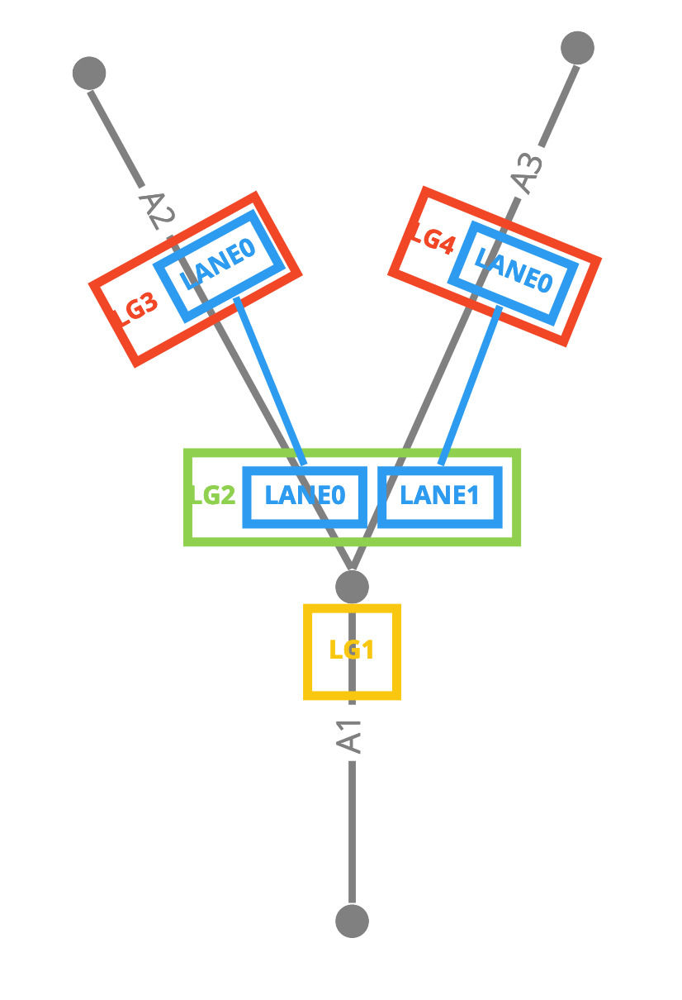

In this case LG2 has two lanes, each of which connects to one outgoing lane.

* For each lane in LG2, for example LANE1
** For each connection, for example the one to LG4 LANE0
*** Find the arc key of the segment, in this case A3
*** Backtrack until we find an arc that has an angle recorded in step 2
*** Quantise that angle to produce an arrow
*** Add that arrow to the lane in the source segment

[#current_assigning_arrows]
==== Assigning the Arrows

Then we use lane connectivity to match those arrows in the source
segment to the corresponding lanes in the target segment, and store
the arrows in the target.

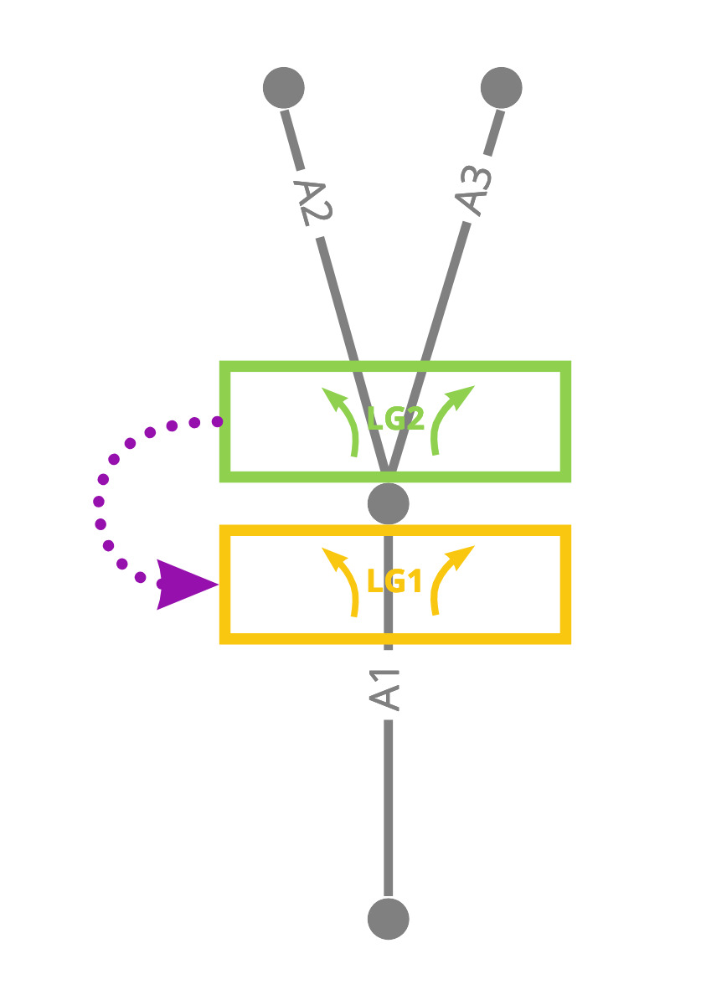

[#lane_groups_same_arc]
==== Lane Groups on the Same Arc

This relies on the segments after the source segment having different
source arcs.  If they lie on the same arc, they will all have the same
angle.

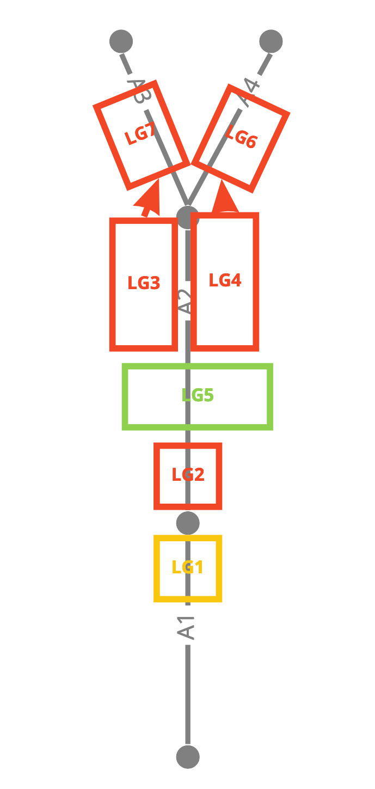

Here LG5 is the source segment, because it's the first segment that splits, into LG3 and LG4.  But LG3 and LG4 both lie on arc A2.

It is possible that this situation does exist right now.  In this
case, however, arrow synthesis is not the major problem.  The real
problem is that our algorithm would assign offsets on route for LG3
and LG4 that put them in sequence, rather than in parallel.  This
would create incorrect offsets for the later of the two, and all
subsequent lane groups.

Therefore, if this situation does arise, it is a bug in lane group reading, not directly connected to the arrow synthesis algorithm.

==== Looking Forward Through Arcs and Lane Groups

The source segment may be several steps away from the furcation, both
in terms of arcs and segments.  By the time the segment connectivity
splits, the angle of the arc may not represent the angle of the
furcation.  See the example below, known as the "tuning fork"
scenario:

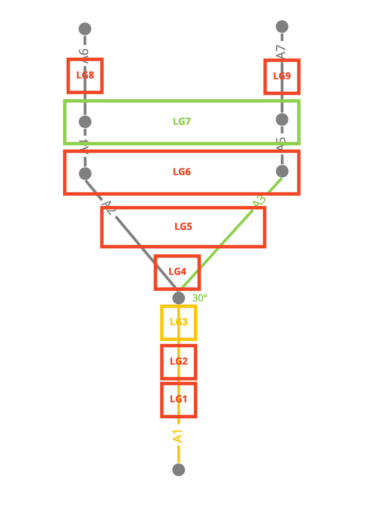

In this case we start at the target segment LG3, and the incoming arc / target arc A1.

We search forward to find the first segment which joins to multiple
other segment, which in this case is LG7, and that is the source
segment.

Next, for each lane in LG7, we find the outgoing connections.  One of
these leads to LG9.  We look up the associated arc, which is A7.  From
there we look backwards until we find an arc that is in the table of
angles.  In this case, that is A3.

Then the angle is available: 30°

This is very common at highway exits.  At the furcation itself there
are two branches, one that goes straight and another that goes
slightly right.  But the right-hand branch quickly straightens out to
run parallel with the left-hand branch.  The arrow should be
calculated at the bifurcation point.

[#current_internal_arcs]
==== Internal Arcs

An "internal arc" is one marked as a complex intersection or plural
junction.  These should generally be treated as a single maneuver.  So
when we are looking backwards to find the angle at the junction, we
should stop if we encounter an internal arc.  This will lead to the
angle being calculated between the incoming arc and the first external
arc between the junction and the discovered outgoing lane segment.  If
the discovered outgoing segment is already on a plural junction, we
will not make any effort to look further forward, instead directly
using the arc associated with the lane segment.

Suppose that in the above example, the arc A3 is marked as a plural
junction.  As before we find LG7 as the source segment and LG9 as one
of the outgoing segments.  From LG9 we find the associated arc A7.  In
the current algorithm we will backtrack to A3 and use that as the
angle for the arrow.  This will produce a "slight right" arrow.

In fact the correct place to stop would be A5.  This has an angle of 0°, which should produce a "go straight" arrow.

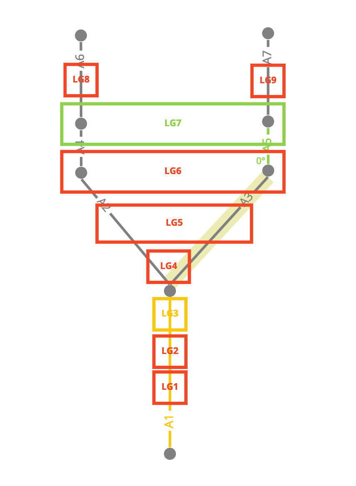

This is one problem we need to fix to make complex intersections behave correctly, see <<proposal_internal_arcs>>.

== Proposal

[#proposal_internal_arcs]
=== Handling Internal Arcs

See <<current_internal_arcs>>.

Currently to find the arc to use to calculate the angle, we backtrack
from the source segment arc to the first arc directly adjacent to the
furcation (which will be the first arc with an angle recorded in the
map). Instead we should stop if we find a plural junction arc, and
the angle should be taken from that arc.

This is planned as https://jira.tomtomgroup.com/browse/NAV-63420[NAV-63420].

[#proposal_assigning_arrows]
=== Calculate Relative Angles From Source Segment

See <<current_identifying_furcations>> and <<current_assigning_arrows>>.

Currently we calculate all relative angles at a furcation as soon as
it is found.  Due to <<proposal_internal_arcs>> we will now not
necessarily use those immediately outgoing arcs for angle
calculation. So do not calculate these angles at the start, instead
calculate them after the source segment has been identified.

This is complicated because we need to assemble all the arcs at once,
so that they can be distributed over the possible quantisations to
generate arrows.

For example, in the following case there are 5 outgoing arcs from the furcation.  The purple arcs are plural junction arcs, so the arcs used for the angle calculation are A7, A8, A9, A10, and A11.

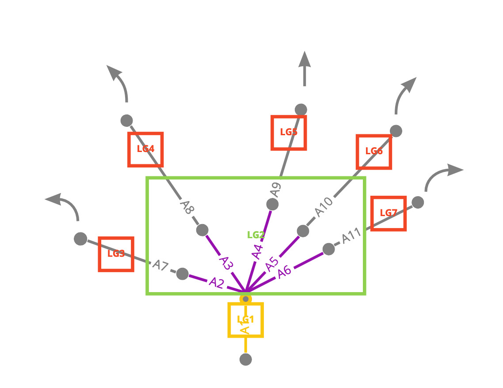

Normally A9 would be quantised as a slight right turn.  However, in
the context of the other arrows nearby, it makes sense to classify it
as straight on, to avoid confusion with the neighbouring options.
This distribution of available quantised values is only possible if
all the angles are considered at the same time.

This is planned as https://jira.tomtomgroup.com/browse/NAV-63419[NAV-63419].

== Consequences

* When searching backwards for the furcation arc, if there is a change
  in the lane configuration along the way, we will need to come up
  with a more sophisticated algorithm for assigning arrows to the
  target segment, see <<proposal_internal_arcs>>.
* If the segments after the source segment lie on the same arc, arrows
  (and offsets) will be incorrect, see <<lane_groups_same_arc>>.
