// Copyright (C) 2018 TomTom NV. All rights reserved.
//
// This software is the proprietary copyright of TomTom NV and its subsidiaries and may be
// used for internal evaluation purposes or commercial use strictly subject to separate
// license agreement between you and TomTom NV. If you are the licensee, you are only permitted
// to use this software in accordance with the terms of your license agreement. If you are
// not the licensee, you are not authorized to use this software in any manner and should
// immediately return or destroy it.

= Lane Guidance Behaviour at Roundabouts

== Status

Proposed

== Context

This is a proposal for the behaviour of the `LaneSegmentListener` on
big and small roundabouts.  Until now this behaviour has been
undefined, but we must implement an acceptable solution in an
https://jira.tomtomgroup.com/browse/NAV-57813[upcoming epic].

== Problem Description

NK2UI and the lane guidance view being developed by eSolutions have two different approaches to providing lane guidance.  NK2UI has a section of the Next Instruction Panel (NIP) that represents the lane configuration at just one upcoming point, which is where the maneuver must be made.  The eSolutions lane guidance represents the lane configuration of the entire route and side roads between the current car position and the maneuver point.

In either case, lane segments are exposed in the API as a number of lanes, each of which has a number of arrows, each of which can be either recommended or not.  In addition, lanes themselves may be either recommended or not.

We need to define an appropriate set of arrows, and how to mark the current maneuver segment, so that both NK2UI and the eSolutions lane guidance will show clear directions to the driver.

== Roundabout Types

There are two aspects to roundabouts that affect their behaviour in the instruction engine:

* Size: either "big" or "small".  The size refers to the length of the route on the roundabout.  Therefore the same physical roundabout may be big or small depending on which route is taken.  The threshold is currently 80m.  The instruction engine generates additional "exit roundabout" instructions for "big" roundabouts.
* Number of lanes: either "one" or "many".

These two aspects produce four different combinations.

https://nds.tomtomgroup.com/webviewer/42820/?action=GetRoute%3FSRS%3DEPSG%3A3857%26lon0%3D612054.01571258%26lat0%3D6695066.6698965%26scale0%3D2132.7295838497803%26lon1%3D612341.2523074%26lat1%3D6695335.3943615%26scale1%3D2132.7295838497803%26zoomTo%3Dtrue%26panTo%3Dtrue%26lang%3DNULL%26poiCategoryCollectionId%3D0%26iconCollectionId%3D0%26disputantId%3D0%26routingService%3D0%26theme%3DDEFAULT%26routeType%3DTIME_WITH_PENALTY%26vehicleType%3DPERSONAL_CAR%26labeling%3Dtrue%26icons%3Dtrue&zoom=17.99999999999759&lat=51.41594&lon=5.49932&layers=FFFBFTFFFFFFF000FFFTTF0000T&poiCategoryCollectionId=0&iconCollectionId=0&disputantId=0&lang=NULL&theme=DEFAULT&routingService=0&routeType=TIME_WITH_PENALTY&vehicleType=PERSONAL_CAR&labeling=true&icons=true[Here] is a "small", multi-lane, roundabout route:

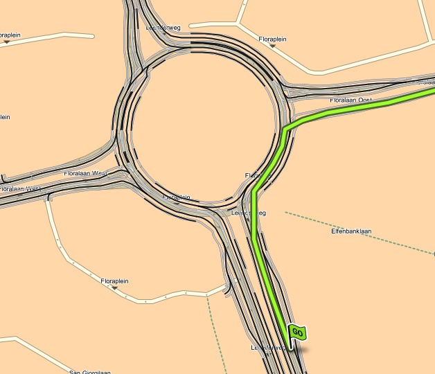

https://nds.tomtomgroup.com/webviewer/42820/?action=GetRoute%3FSRS%3DEPSG%3A3857%26lon0%3D612053.17886282%26lat0%3D6695070.5268999%26scale0%3D2132.729583855126%26lon1%3D611666.2156332%26lat1%3D6695197.7231466%26scale1%3D2132.729583855126%26zoomTo%3Dtrue%26panTo%3Dtrue%26lang%3DNULL%26poiCategoryCollectionId%3D0%26iconCollectionId%3D0%26disputantId%3D0%26routingService%3D0%26theme%3DDEFAULT%26routeType%3DTIME_WITH_PENALTY%26vehicleType%3DPERSONAL_CAR%26labeling%3Dtrue%26icons%3Dtrue&zoom=17.99999999999759&lat=51.41593&lon=5.49642&layers=FFFBFTFFFFFFF000FFFTTF0000T&poiCategoryCollectionId=0&iconCollectionId=0&disputantId=0&lang=NULL&theme=DEFAULT&routingService=0&routeType=TIME_WITH_PENALTY&vehicleType=PERSONAL_CAR&labeling=true&icons=true[Here] is the same multi-lane roundabout with a "big" route:

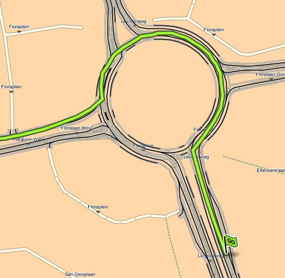

https://nds.tomtomgroup.com/webviewer/42286/?action=GetRoute%3FSRS%3DEPSG%3A3857%26lon0%3D1257127.4441689%26lat0%3D6141211.1283092%26scale0%3D1066.364792069048%26lon1%3D1257195.2224507%26lat1%3D6141140.6627828%26scale1%3D1066.364792069048%26zoomTo%3Dtrue%26panTo%3Dtrue%26lang%3DNULL%26poiCategoryCollectionId%3D0%26iconCollectionId%3D0%26disputantId%3D0%26routingService%3D0%26theme%3DDEFAULT%26routeType%3DTIME_WITH_PENALTY%26vehicleType%3DPERSONAL_CAR%26labeling%3Dtrue%26icons%3Dtrue%26attributeHighlightingQuery%3Droundabout%253CSFA.1%253E&zoom=18.99999999999759&lat=48.20611&lon=11.29355&layers=FFFBFTFFFFFFF000FFFTTF0000T&poiCategoryCollectionId=0&iconCollectionId=0&disputantId=0&lang=NULL&theme=DEFAULT&routingService=0&routeType=TIME_WITH_PENALTY&vehicleType=PERSONAL_CAR&labeling=true&icons=true&attributeHighlightingQuery=roundabout%3CSFA.1%3E[Here] is a "small", single-lane roundabout route:

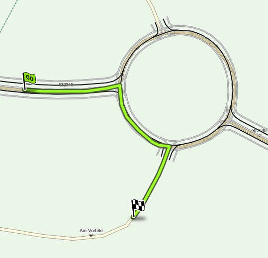

Finally, https://nds.tomtomgroup.com/webviewer/42286/?action=GetRoute%3FSRS%3DEPSG%3A3857%26lon0%3D1257128.7862371%26lat0%3D6141211.0225331%26scale0%3D1066.3647919274606%26lon1%3D1257179.5453027%26lat1%3D6141293.1327863%26scale1%3D1066.3647919274606%26zoomTo%3Dtrue%26panTo%3Dtrue%26lang%3DNULL%26poiCategoryCollectionId%3D0%26iconCollectionId%3D0%26disputantId%3D0%26routingService%3D0%26theme%3DDEFAULT%26routeType%3DTIME_WITH_PENALTY%26vehicleType%3DPERSONAL_CAR%26labeling%3Dtrue%26icons%3Dtrue%26attributeHighlightingQuery%3Droundabout%253CSFA.1%253E&zoom=18.99999999999759&lat=48.20624&lon=11.29353&layers=FFFBFTFFFFFFF000FFFTTF0000T&poiCategoryCollectionId=0&iconCollectionId=0&disputantId=0&lang=NULL&theme=DEFAULT&routingService=0&routeType=TIME_WITH_PENALTY&vehicleType=PERSONAL_CAR&labeling=true&icons=true&attributeHighlightingQuery=roundabout%3CSFA.1%3E[here] is the same single-lane roundabout with a "big" route:

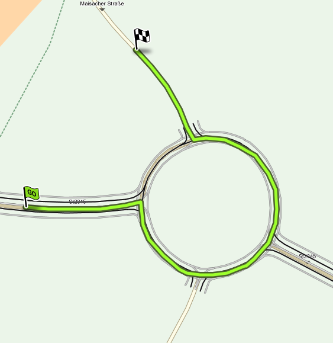

== Proposed Solution

The proposed behaviour would be the same regardless of whether the roundabout is single-lane or multi-lane, and whether it is "big" or "small".

* On the lane segments immediately before the roundabout (and after any other side roads), all the lanes should have a single arrow pointing straight, regardless of the physical geometry of those lanes.
* Before entering the roundabout, the lane segment immediately before entering the roundabout will be marked as the maneuver segment.  So the driver will be shown the correct lane to enter the roundabout for their destination.
* While on the roundabout, the maneuver segment immediately before leaving the roundabout will be marked as the maneuver segment.

This is represented diagrammatically below:

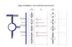

=== Arrows at the Roundabout Entrance

These arrows will be represented as straight because the only meaningful alternative would be to represent them as "turn right".  And this could be misinterpreted as indicating that the driver should take the first exit.

By keeping the arrows straight, it suggests to the driver that the ultimate direction of the lanes is not important at this stage.  Instead, the focus is on which lane is highlighted.

=== Switching the Maneuver Segment

Typically maneuver segments are intended to be static information.  However, in this case we want to use the maneuver segment to trigger a change in behaviour of the Next Instruction Panel, to switch from the lane configuration at the entrance to the lane configuration at the exit.  Updating the lane guidance scenario with a changed maneuver segment is a convenient way to achive this.

== Examples

Here is shown how a U-turn maneuver would be represented on each of the above roundabouts.  Note that in both these cases the instruction engine would treat them as "big" roundabouts and supply a separate exit instruction.  However, as indicated above, we will produce the same lane guidance behaviour in both cases.

In each example there are three snapshots of the lane guidance scenario as seen by the client, at three different car positions along the route.  The cyan chevron represents the current car position.  Each block of arrows represents a lane segment, with recommended arrows in green and not recommended arrows in red.  The maneuver segment is indicated with a blue box.

The images are taken from https://miro.com/app/board/o9J_ljiUKHI=/?invite_link_id=922872932294[this Miro board].

=== Multi-Lane Case

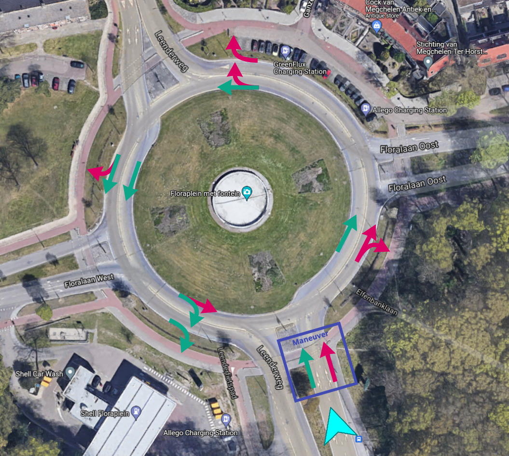

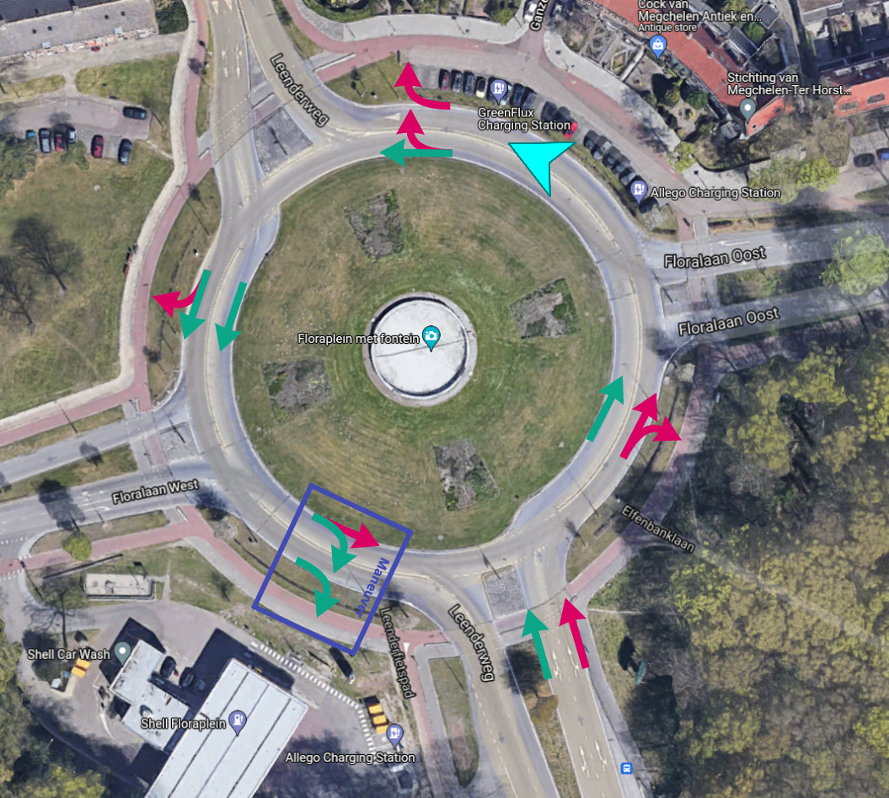

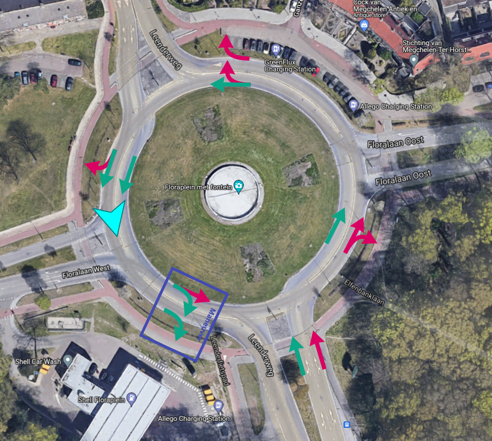

=== Single Lane Case

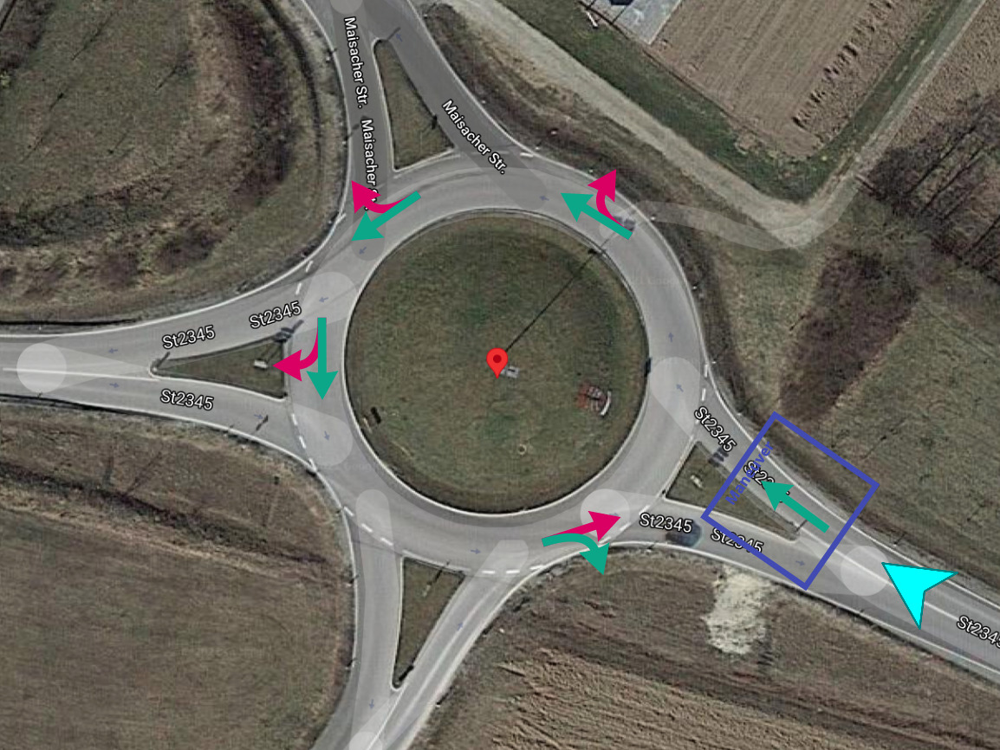

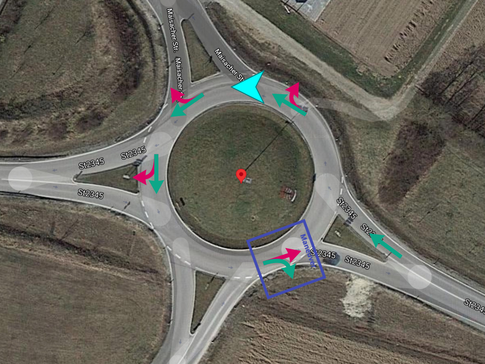

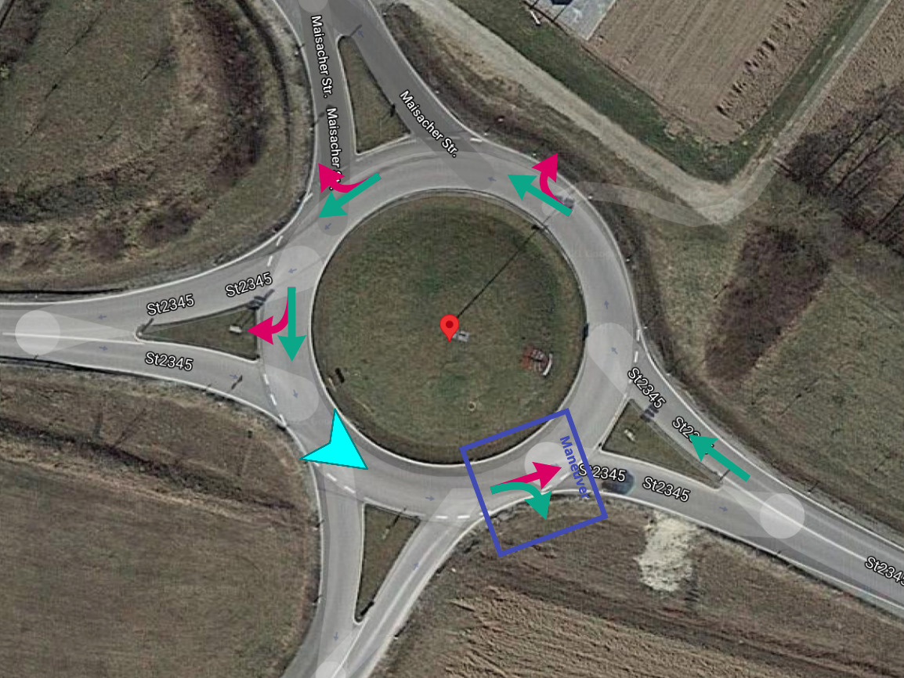

== Consequences

* While approaching an intermediate exit on the roundabout, the Next Instruction Panel will be indicating the maneuver at the later, intended exit.  This may be confusing.

Note that we have this same problem at ordinary crossroads too.
