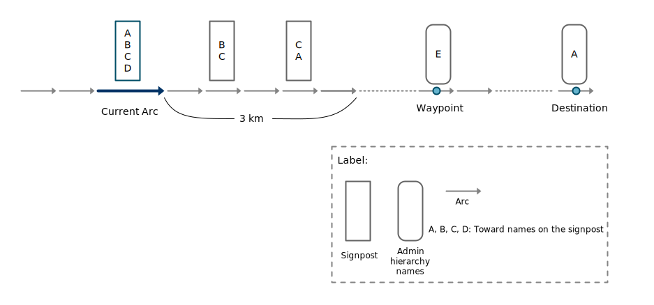

// Copyright (C) 2022 TomTom NV. All rights reserved.
//
// This software is the proprietary copyright of TomTom NV and its subsidiaries and may be
// used for internal evaluation purposes or commercial use strictly subject to separate
// license agreement between you and TomTom NV. If you are the licensee, you are only permitted
// to use this software in accordance with the terms of your license agreement. If you are
// not the licensee, you are not authorized to use this software in any manner and should
// immediately return or destroy it.

= Signpost toward name selection algorithm

== Status

Implemented (In NAV-31522 and NAV-31524)

== Context

A signpost usually has multiple toward names. The goal of the algorithm is to select a toward name that is most relevant to the current route. i.e., The selected toward name is the destination of the route, or a place where the route will pass through.

== Decision

The signpost toward name selection algorithm of NK1 consists of four steps:

. *Signpost look ahead:* Search nearby signposts ahead of the current location in a specific range 3km. Check whether the toward names of nearby signposts and current signpost are matched.
. *Signpost look behind:* Search nearby signposts behind of the current location in a specific range (8 arcs). Check whether the toward names of nearby signposts and current signpost are matched.
. *Destination name strings:* Check whether the toward names of current signpost match the administrative hierarchy name strings of the current destination. The current destination can be a waypoint or the final destination of a route.
. *Name strings between current location to destination:* Take severals sample locations between the current location to the current destination. Check whether the administrative hierarchy name strings of the sample locations match the toward names of current signpost.

To understand how importance these steps are, we did some experiments by enabling/disabling the above steps, running the instruction regression tests of NK1, and measuring the matched percentage of toward names. The details can be found in https://confluence.tomtomgroup.com/display/NAV/Most+useful+toward+information+selection+algorithm+comparison[this documentation]. We found that *Signpost look ahead* and *Destination name strings* are the two crucial steps which affect matched percentage the most. *Signpost look behind* only affects the matched percentage a little bit. The implementation requires line backward traversal, which is currently not supported in NK2 instruction engine. *Name strings between current location to destination* also does not help the matched percentage too much. The implementation requires line forward traversal to the current destination, which could be a long distance and largely impact the performance of the instruction generation. For online routing, the extra time for polyline resolving will be required.

Therefore, we decided to implement *Signpost look ahead* and *Destination name strings* in NK2 instruction engine. The implementation of *Signpost look ahead* is straightforward. As for *Destination name strings*, there will be a question: How to provide the addresses (i.e., administrative hierarchy names) of the waypoints and the destination of a route to instruction engine? For onboard routing it should be no problem. However, for online routing, several reverse geocodings for waypoints and the destination will need to be performed, which are time-consuming and will need to load extra tiles in advance. After discussing with routing and guidance teams, we decided to rely on client to provide the addresses when planning a trip (i.e., use TripPlan::SetDestination(const place::Place&) instead of TripPlan::SetDestination(const place::Coordinate&)).

== Algorithm

Here is the brief explanation of the signpost toward name selection algorithm in NK2. The toward name is chosen according to the scoring. All toward names of the current signpost will be scored. The score is determined by the following rules:

* The order of toward name on the current signpost. The first toward name usually means that it will be arrived first by following the signpost path thus has a higher score.
* If the toward name appears on the next signposts ahead in 3 km, the score is increased according to how many next signposts does it appear, and the distance of the next signpost to the current signpost.
* If a destination appears on the current signpost, the score of the matched toward name is increased. The matching is started from the destination that is most close to the current signpost according to the offset on route. If match is not found, then keep searching for the next destination until a match is found or the final destination is reached.
* If the destination also appears on the next signposts, the score of the matched toward name is increased.
* If the destination does not appear on the next signposts, the scores of other toward names are increased. It is for penalizing the matched toward name. Regarding why the penalty is required, please refer the https://confluence.tomtomgroup.com/display/NAV/Toward+name+selection+case+study+-+The+penalty+for+destination+not+on+the+next+signposts[case study documentation].

Here is an example scenario which elaborates the scoring process of the toward names in details:

1. The scores are initialized by 100 - 1 * i where i is the index of the toward name on the current signpost.
* (A, B, C, D) =  (100, 100-1*1, 100-1*2, 100-1*3) = (100, 99, 98, 97)
2. Search next signposts ahead 3 km. If the toward name appears on the next signposts, the score is increased by 100 - 1 * i - 2 * j where i is the index of next signposts and j is the index of toward name on the corresponding signpost.
* (A, B, C, D) = (100, 99, 98, 97) + (0, 100, 100-2*1, 0) + (100-1*1-2*1, 0, 100-1*1, 0) = (197, 199, 295, 97)
3. Try to match destinations to the toward names of the current signpost. The match is started from the the waypoint (E). The waypoint does not match the toward names of the current signpost. Then we try the final destination (A) and it does match. The score of A is increased by 200.
* (A, B, C, D) = (197, 199, 295, 97) + (200, 0, 0, 0) = (397, 199, 295, 97)
4. The destination (A) also appears on the next signposts. The score of A is increased by 200.
* (A, B, C, D) = (397, 199, 295, 97) + (200, 0, 0, 0) = (597, 199, 295, 97)
5. If the destination (A) does not appear on the next signposts, the scores of other toward names will be increased by 400 (In this example scenario this step will not be processed).
* (A, B, C, D) = (397, 199, 295, 97) + (0, 400, 400, 400) = (397, 599, 695, 497)
6. Choose the toward name with the highest score.
* A is chosen as the best toward name.

== Consequences

The algorithm has been implemented in NK2 instruction engine (SelectTowardName() in instruction_utils.cpp)
