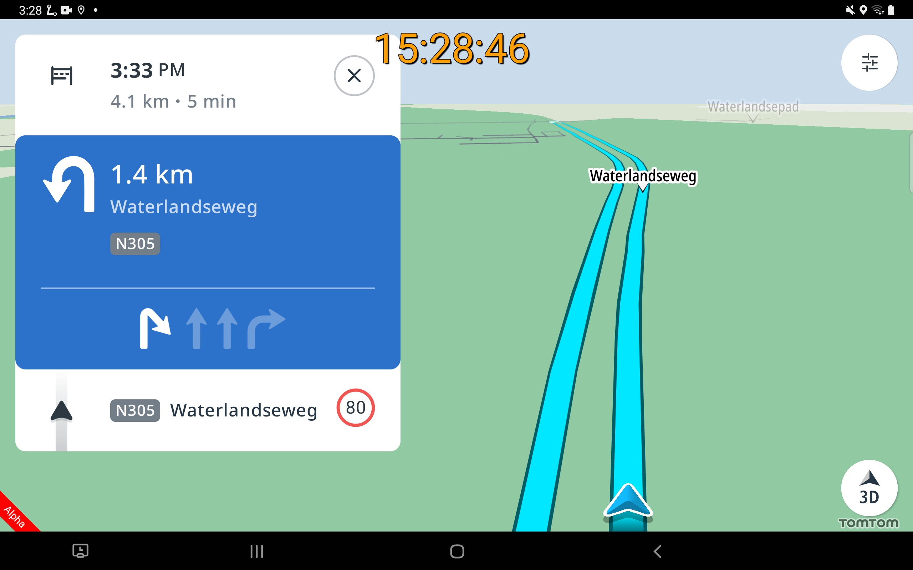
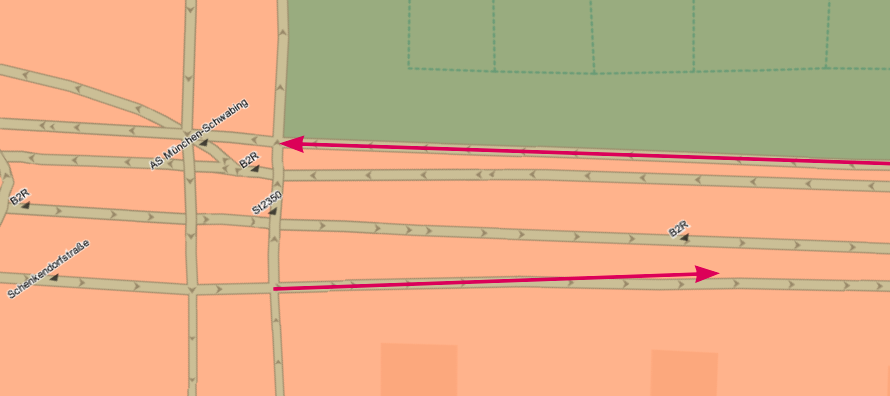
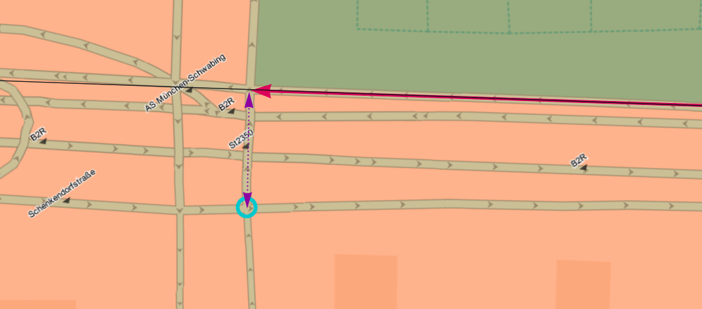
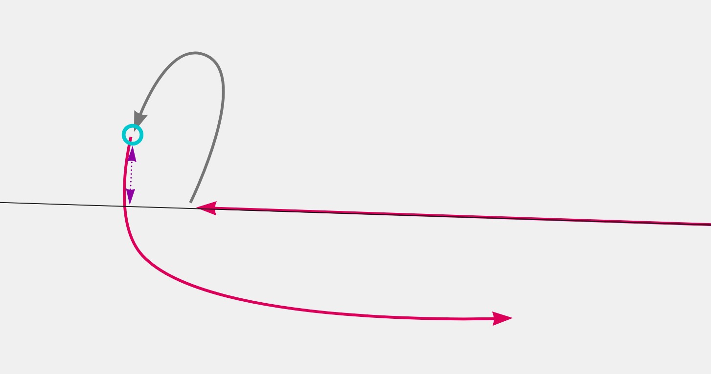
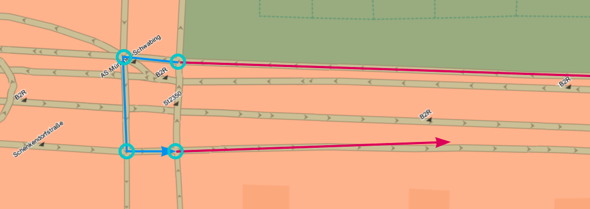

// Copyright (C) 2018 TomTom NV. All rights reserved.
//
// This software is the proprietary copyright of TomTom NV and its subsidiaries and may be
// used for internal evaluation purposes or commercial use strictly subject to separate
// license agreement between you and TomTom NV. If you are the licensee, you are only permitted
// to use this software in accordance with the terms of your license agreement. If you are
// not the licensee, you are not authorized to use this software in any manner and should
// immediately return or destroy it.

= Synthesising U-Turn arrows for Lane Guidance

== Status

Implemented

== Context

A bug was reported https://jira.tomtomgroup.com/browse/NAV-65969[NAV-65969] concerning a
confusing arrow in the left-most lane indicating that the driver can
turn sharp right:

This is caused by the U-turn being somewhat "Q-tip shaped".  Cars
driving along a major road that wish to U-turn first exit onto a slip
road, which slightly curves to the right, then turns left in a u-turn
of more than 180°, before finally turning right again.

Here is another example showing the arc coming into the U-turn and the
arc going out:

The arrow synthesis algorithm usually uses the angle between the
incoming and outgoing arcs to decide which angle to use:

As a result the synthesised arrow is a slight right.  This kind of
configuration is pretty usual around controlled access roads, so this
bug has a high impact.

== Basic Solution

The solution is to clamp the angle within the range 180° to -180°.
Angles of larger magnitude would only synthesise a U-turn arrow.

The hard part of this solution is deciding how large the angle
truly is.  Comparing the angles directly will always be ambiguous.

== Rejected Alternative

One solution is to decide which on side of the incoming arc the tail
point of the outgoing arc lies:

If it lies on the left, then this cannot be a right turn, so a left
U-turn is the maximum allowed turn angle.

However, this approach is not always correct.  Since arcs can be
curved, the tail may be on the right side of the outgoing arc while
the head is on the left:

== Accepted Approach

Instead, to calculate the total angle, we sum the angles of each
junction along a path from the incoming arc to the outgoing arc, along
with the curvature of the arcs.  This is then clamped to the range
180° to -180°.

This approach has been implemented in two classes:

* `ContinuousPathMaker` finds a path from an incoming arc to an outgoing arc via a set of intermediate arcs
* `AngleDeltaAccumulator` computes the total angle change along a path of connected arcs

The intermediate arcs are taken as the set of arcs that contains or
references the lane group found to be the source lane group.  See
xref:2021-11-05T15:59:03+0100-arrow-synthesis-complex-intersections.adoc[Arrow
Synthesis at Complex Intersections] for more information about the
source lane group.

== Consequences

* The `ContinuousPathMaker` reimplements a path-finding algorithm.
  This could be simplified.
* The curvature of an arc is computed from the difference in angle
  between the ends.  This is ambiguous if arcs curve by more than
  180° - which many do, especially at cloverleaf junctions.  This
  could be mitigated by examining angles between shape points rather
  than junctions.
* This implementation assumes that all the necessary intermediate arcs
  share the same lane group.  This appears to be true for the majority
  of cases examined.  In future it may be necessary to extend the set
  of intermediate arcs beyond that one lane group, to cover the remaining
  situations.  This is being tracked in https://jira.tomtomgroup.com/browse/NAV-71307[NAV-71307].
