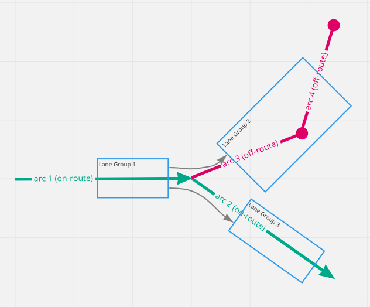

// Copyright (C) 2022 TomTom NV. All rights reserved.
//
// This software is the proprietary copyright of TomTom NV and its subsidiaries and may be
// used for internal evaluation purposes or commercial use strictly subject to separate
// license agreement between you and TomTom NV. If you are the licensee, you are only permitted
// to use this software in accordance with the terms of your license agreement. If you are
// not the licensee, you are not authorized to use this software in any manner and should
// immediately return or destroy it.

= Collecting off-route arcs to be used to generate lane guidance scenario

== Status

Implemented

== Context

Multiple bugs (
https://jira.tomtomgroup.com/browse/NAV-71821[NAV-71821]
https://jira.tomtomgroup.com/browse/NAV-71819[NAV-71819]
https://jira.tomtomgroup.com/browse/NAV-69689[NAV-69689]
) were reported for cases where the lane arrows synthesized for SLG maneuver segments change depending on the route that is taken through a complex intersection.

We found that all the bugs had the same root cause which is related to the collection of off-route arcs that are provided to the lane guidance builder.

The arrow synthesizer uses the angles between connected lane segments to decide which arrows to generate.
And the angle of a lane segment comes from the angle of the arc it belongs to.
The key point here is that most of the lane groups span multiple arcs.
So it is up to the lane guidance builder to make sure that the lane segment's angle comes from the correct one of the multiple arcs it spans.

This doesn't constitute a problem for lane segments created from lane groups of on-route arcs.
On-route arcs are already in order: during the process of reading lane groups from these arcs, it is safe to set the angle of a lane group from the first arc it is seen in.

The problem arise when setting the angle of lane groups from off-route arcs.
Before the solution explained here, `GetOffRouteArcs()` was providing the list of off-route arcs in no specific order.
This meant that it was possible that the lane guidance builder gets the angle of a lane segment from an arc that has no direct connection to the route.

[link=https://miro.com/app/board/uXjVOMXgoww=/?moveToWidget=3458764519782809939&cot=14]

For example, in the image above, the angle of _Lane Group 2_ should come from _arc 3_ to be able to synthesize the correct lane arrow between _Lane Group 1_ and _Lane Group 2_.
Before this change, since the order of the off-route arcs were not deterministic, it was possible that the _arc 4_ was fed to the lane guidance builder before _arc 3_, resulting in assigment of an incorrect angle to the generated lane segment.

== Solution

Solution was found in modifying the behaviour of `GetOffRouteArcs()`.
This function now returns the off-route arcs in order of their distance from the route.
This ensures, when processing off-route arcs, that the lane guidance builder first collects the lane groups from arcs that are touching the route (i.e. tail node of the arc is on route).
These lane groups' angles will then be set correctly since it comes from the correct arc.
