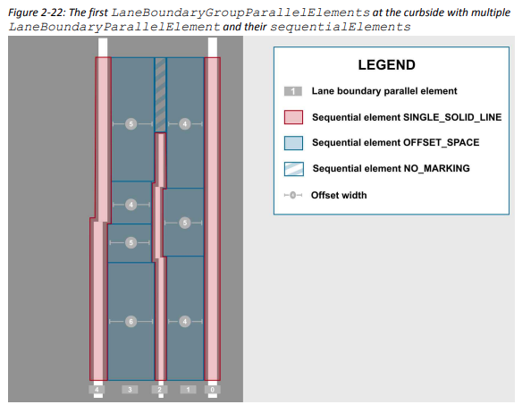
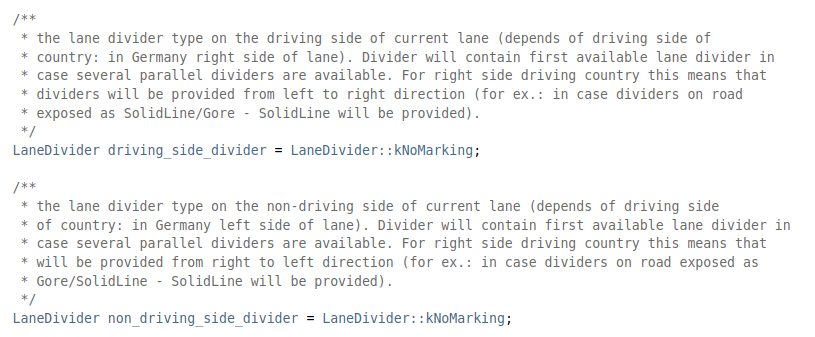
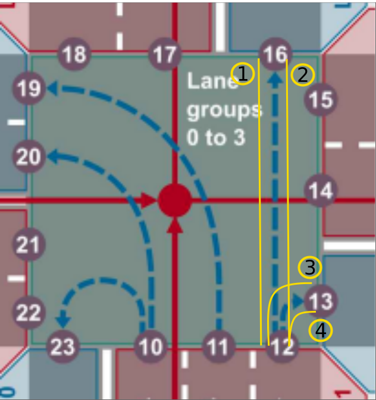

// Copyright (C) 2022 TomTom NV. All rights reserved.
//
// This software is the proprietary copyright of TomTom NV and its subsidiaries and may be
// used for internal evaluation purposes or commercial use strictly subject to separate
// license agreement between you and TomTom NV. If you are the licensee, you are only permitted
// to use this software in accordance with the terms of your license agreement. If you are
// not the licensee, you are not authorized to use this software in any manner and should
// immediately return or destroy it.

= Changing the lane segment splitting logic to take into account only the dividers that belong to the tracks that are part of the route

== Status

Proposed

== Context

Lane connectivity elements (LCE) in a lane group are separated by lane boundaries (internally called "lane dividers").
These lane boundaries are defined as a sequence of boundaryElements in a laneBoundaryGroup.
Each boundaryElement can contain multiple parallelElements and each parallelElement can contain multiple sequentialElements to model the lane dividers on the road.
This structure efficiently models the lane dividers inside a lane group.

LaneSegments that form a LaneGuidanceScenario has a limitation in this regard.
Each Lane of a lane segment can contain only one type of divider per each side of the lane.

This limitation of LaneSegments means that we (might) need to create multiple LaneSegments from a single lane group.
i.e. for each unique set of dividers along a lane group, we need a new LaneSegment.

This is accomplished by the "LaneSegmentSplitter".
What happens is

1. We first create a single LaneSegment for the whole lane group with no lane divider information in it
2. This initial LaneSegment is fed to the LaneSegmentSplitter
3. LaneSegmentSplitter uses the LaneDividerReader to read the boundary elements of the lane group from map data access
4. Splitter uses this information to split the initial segment to as many segments as needed and fills in their lane divider fields

== Problem

Incorrect segmentation:
Lane segments contain "lanes".
Lane groups contain "lane connectivity elements".
This means that we "fuse" the LCEs with the same source connector id together to form a "lane".
This is OK but what about the dividers?
Let's say we have 3 LCEs for a lane.
3 LCEs have 6 dividers (one for each side of each LCE).
For the lane generated out of these, we need to drop the number of dividers to 2 (one for each side of the lane).
Today we do this by taking the most curbside divider of the most curbside LCE and taking the most middle-side divider of the most middle-side LCE and use them as the dividers of the created lane.
This is obviously wrong as we might be leaving some important dividers out of the equation.

For a visualization of the problem, see the diagram for a lane group below.
Let's say the LaneSegmentsSplitter is processing lane number #0 (most curbside lane).
It has two LCEs: 12-13 and 12-16.
The current approach would take dividers #1 and #4 to decide where to split the segment.
Which is obviously wrong.

== Proposed Solution

The proposal is to modify to lane group splitting logic.
Instead of the "divider selection logic" explained in the <<Problem>> section, the proposal is to pick the LCE that is on the current route and have the LaneSegmentSplitter use the dividers of this LCE to create the segment splits.
The user story https://jira.tomtomgroup.com/browse/NAV-61903[NAV-61903 LaneDividerReader should pick the right divider from multiple tracks] is created to implement this solution

If we look at the diagram for the example lane group again.
This proposal suggests that, opposed to mixing their dividers, the LaneSegmentSplitter should first find out which of the two LCEs 12-16 and 12-13 are on the route, and do the splitting according to the dividers of this LCE only.
So if, say, if the route is turning right, we will take dividers #3 and #4 to split the segment.

If none of the LCEs are on route we will retain the existing logic, in which we take the left-side divider from the left-most LCE and the right-side divider from the right-most LCE.
