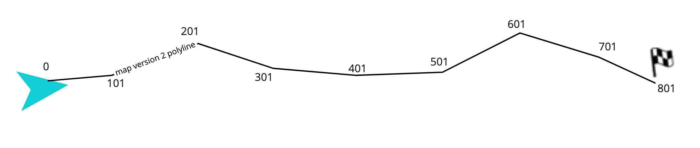
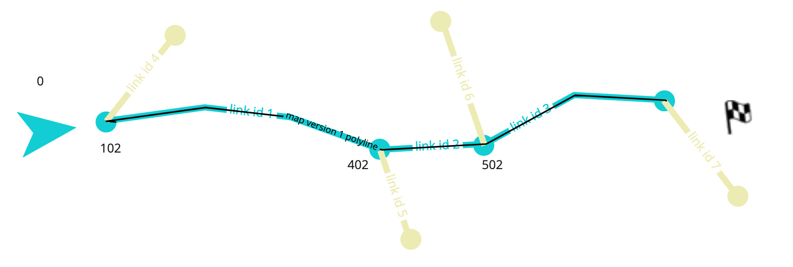
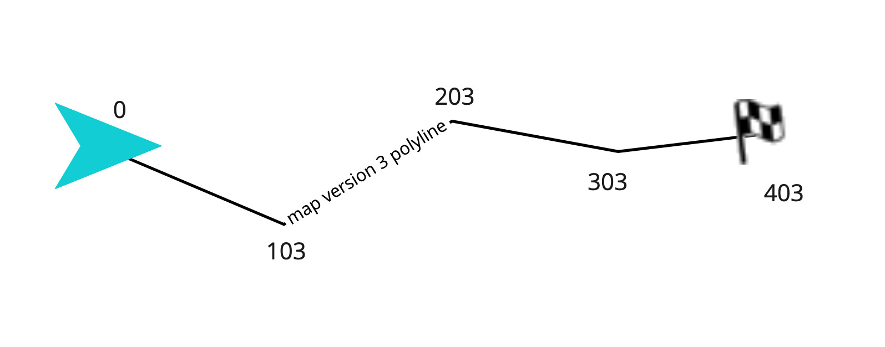
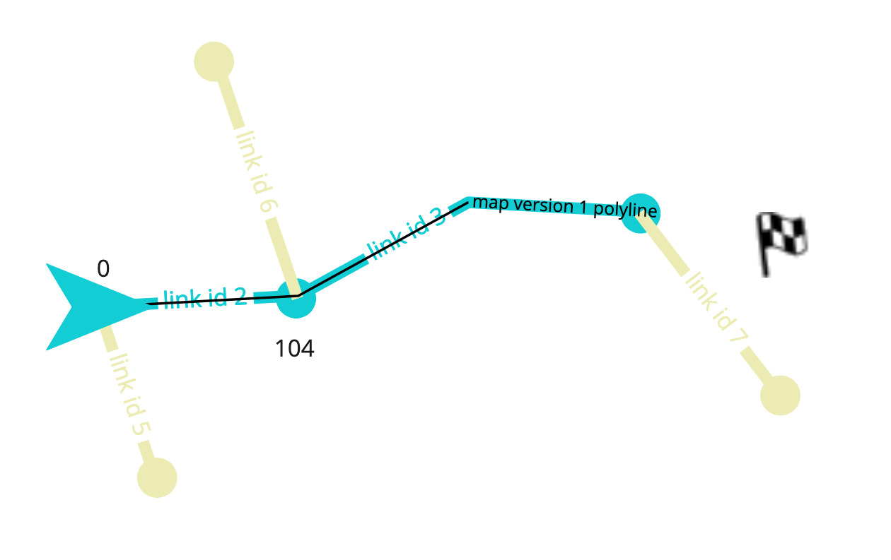
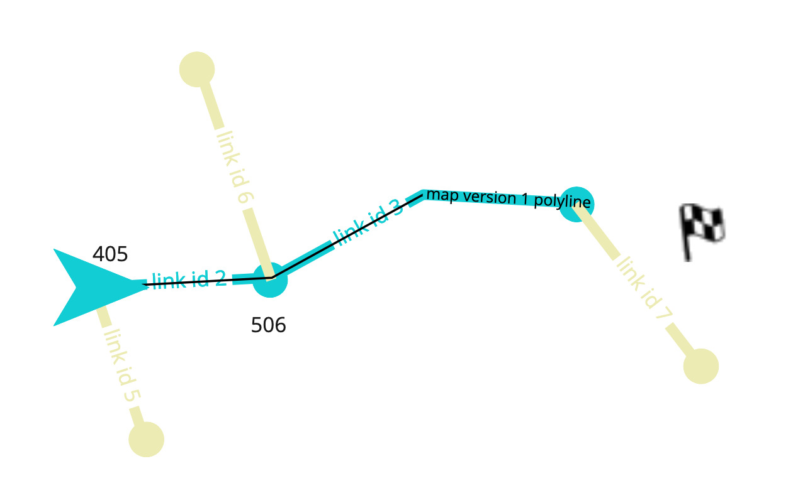
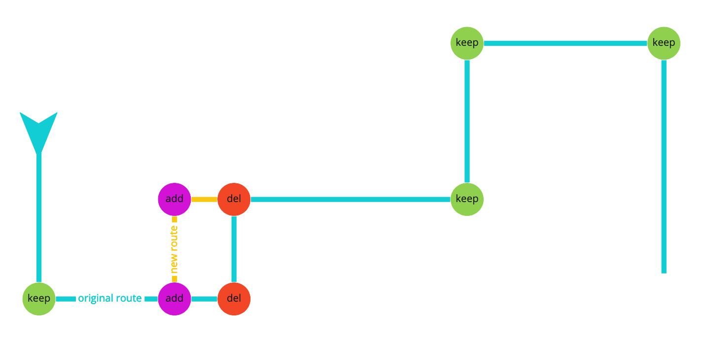

// Copyright (C) 2021 TomTom NV. All rights reserved.
//
// This software is the proprietary copyright of TomTom NV and its subsidiaries and may be
// used for internal evaluation purposes or commercial use strictly subject to separate
// license agreement between you and TomTom NV. If you are the licensee, you are only permitted
// to use this software in accordance with the terms of your license agreement. If you are
// not the licensee, you are not authorized to use this software in any manner and should
// immediately return or destroy it.

= Guidance Problems Caused By Route Stitching

== Status

Accepted

== Summary

The Onboard Guidance system calculates instructions using an onboard
map which may be different to the map used to calculate the route.
The differences cause the offsets of route points to be slightly
different between the two.  In addition, the route polyline is
reconstructed every 60s on both maps, starting from the current car
position.  "Stitching" these new routes onto the previous old route is
a difficult problem due to inherent uncertainties - and is partially
solved in two areas, routing and guidance.  Right now the data
relevant for the instruction generation are unstable due to the
stitching.  This causes instruction generation to restart from the
current car position, causing repeated or inconsistent instructions.

== Problems

We have a large number of bug reports in which we see that route
updates are the ultimate cause of the negative user experience.  Some
examples of this:

* https://jira.tomtomgroup.com/browse/NAV-75399[NAV-75399] - caused by
  shifting offsets
* https://jira.tomtomgroup.com/browse/NAV-72944[NAV-72944] - caused by
  changing arc keys (not tail but head was cut, so no matching arc was
  found)
* https://jira.tomtomgroup.com/browse/NAV-75242[NAV-75242] - caused by
  changing arc keys (the number of arcs changes, which affects whether
  or not a u-turn is generated)

== Route Stitching Process

To explain how route stitching works I will present a stylised
example.  In this example I imagine that there is an online route
planner and onboard instruction generation.  Although they are all
using the same basic map, there are several different versions of the
map that may be used.  I label these maps version 1, version 2, and
version 3.

=== Initial Route Planning Response

The process begins when a route is planned from an origin to a
destination.  The route returned by online planning consists of a
polyline with offsets.  That is it is a sequence of coordinates which
represent both the start and end nodes of NDS map links as well as
individual shape points along those links.  There is no distinction
made in the results between nodes and shape points.  Each pair of
coordinates also is marked with an offset along the route.

=== Map Matching to Onboard Map

In this example assume that the online routing service is using map
version 2, while the onboard map is on version 1.  So the next step is
to match the polyline to arcs from this version 1 map.

The result of this is a sequence of arcs, each with a start offset on
route.  However the arcs in the map version 1 are slightly different
lengths to the arcs used for route planning version 2.  To maintain
consistency with the onboard map, the offsets on route should reflect
the lengths of the arcs in the onboard map version 1.  Therefore the
offsets will be slightly different to those reported from the online
route planning response.

Also note that these errors are positively correlated with distance
from the start of route, since the small differences in the arcs
accumulate over the route.

=== Next Route Update Response

Every 60 seconds (or so, this can vary) the route polyline is
automatically reconstructed.  To do this, the portion of the original
route polyline from the current car position to the destination is
sent to the server.  Usually the physical route will be the same.
However the map may be different yet again - in this example I imagine
that the routing service is now using map version 3.  Even if the same
roads are taken, the coordinates will be slightly different and the
arc lengths and offsets will be slightly different.

Furthermore, there may be errors introduced due to the fact that the
polyline sent to the online service was map-matched to map version 1.
The online routing service needs to then map that back to map version
2 again to compute a fresh route.

=== Map Matching Remainder of Route

This new map fragment then gets map matched again, and again to the
onboard map version 1.  This, of course, will produce offsets relative
to the current car position, which will not match at all the offsets
of the corresponding arcs in the original arc list.  And even if no
diversion is made, the list of arcs only starts from the current car
position.

=== Recalculating Offsets

The trip service adjusts the offsets of the replanned route so that
they again are relative to the original start of the route.  This is
calculated in `StitchRoute`, as the distance along the polyline from
the route origin to the origin of the updated part.

Note that this also introduces an uncertainty, since "distance along
the polyline" is different than the sum of the discarded arc lengths.
This still relies on a map-matching step, and uncertainty in the input
can produce different outcomes when arcs are close together.

=== Stitching the Route

It is now necessary for the `IterableArcBuffer` to process this new
sequence of arcs.  Here is a summary of the algorithm:

* search for last arc of old sequence in new arc sequence
** failure {f0}: abort with message "Last common arc not found, abort
   route merge, arc buffer will be regenerated."
** success: compare overlapping arcs of both sequences (these are all
   arcs before last common arc found in previous step)
*** failure1 {f1} (number of overlapping arcs of new sequence is
    bigger than the ones of old sequence): abort with message "One or
    more arcs were unexpectedly added, abort route merge, arc buffer
    will be regenerated."
*** failure2 (arc key mismatch {f2a} or offset mismatch more than 5m
    {f2b}): abort with message "Overlapping arc keys and/or arc
    offsets differ, abort route merge, arc buffer will be
    regenerated."
*** success: all arcs behind last common arc are appended to the old
    sequence, update completed

One important detail, however, is that if the offset of an arc that
appears in both the old and new routes has changed by more than five
meters, then stitching will be deemed to have failed.  There are also
many other conditions in which stitching is considered failed.

If stitching fails, the consequence is that the updated route is
treated as a brand new route.  This can cause distracting effects like
duplicate instructions.  However, since the route ID is the same, we
do not send an empty list of instructions to the client.  This at
least prevents "flickering" of the next instruction panel.

== Reasons Why Routes Change

We have identified the following classes of reasons that map data
changes:

* Onboard map updates.  It is understood that onboard map updates are
  unlikely to work smoothly.  However these should be very rare.
* Online route planning chose a slightly different route ({f0}, {f1},
  {f2a} in the above algorithm)
* Accumulated error exceeds 5m even though route is essentially the
  same ({f2b} in the above algorithm)

These are mostly straightforward, but the exception is when online
route replanning chooses a slightly different route.

=== Route Change Without Changing Route

When the routing engine genuinely changes its mind about which route
should be taken, the trip service signals that the old route has been
removed and a new route taken its place.  In this case we do expect
occasional repeated instructions or other sub-optimal guidance.

However, it seems that for "small" deviations, the route might be
considered to actually be the same route.  In this case we don't get
an `OnRoutesChanged` callback, rather we just get `OnPathChanged`.

An example would be if the route decides to take a left-right dogleg
turn one cross-street earlier than originally planned.  But the rest
of the route stays the same.  We still need to clarify the exact
circumstances when this kind of thing can occur.

In these cases the intention is that instructions are not recalculated
for the whole route, only the one or two affected upcoming
instructions should be recalculated.  However, this would be very
difficult for Guidance to develop.

== Solutions

=== Increase Precision of Polyline Reconstruction

At the moment coordinates in route responses are to a precision of
just 5 decimal places.  This corresponds to an error of up to
approximately 1m.  More typically we would use 7 decimal places,
corresponding to an error of approximately 1cm, aligned with the
precision of other measurements.  Adding an extra two decimal places
of precision may well reduce the error enough to make route stitching
work.

This work item is being tracked as
https://jira.tomtomgroup.com/browse/NAV-76215[NAV-76215].  Although it
is initially assigned to the Routing team, it could equally well be
picked up by Guidance.

=== Return More Route

This is not actually a solution to the above problems, but is related.

The returned partial route could include several kilometers of arcs
from before the current car position.  This is currently tracked as a
Routing work item
https://jira.tomtomgroup.com/browse/NAV-40811[NAV-40811], which is
blocking the Guidance work item
https://jira.tomtomgroup.com/browse/NAV-62846[NAV-62846].  In this
case we would better be able to generate correct Guidance even if the
route stitching fails.

=== Store Offset Before Request

The offsets might be made more accurate by having the trip service
note the offset of the start position of the route when making a
request for a route update and using that offset to recalculate the
offsets of the returned arcs.

This is currently being worked on in https://jira.tomtomgroup.com/browse/NAV-72063[NAV-72063].

=== Make Map Resolving More Stable

We could also improve the situation by re-resolving onboard map
references only when needed, not for every route update.  This is
being tracked by
https://jira.tomtomgroup.com/browse/NAV-54491[NAV-54491], although
it's not clear that this will actually be worked on.

=== More Robust Stitching

We could add more heuristics to the route stitching on the
`IterableArcBuffer` end.  For example we could search for a common
sequence of arcs, and then allow wider tolerance of offsets if a
larger number of arcs match.

== Decisions

There are several initiatives on the Routing side already underway
that will make the arc sequence exposed by the Route much more stable.
These are:

* https://jira.tomtomgroup.com/browse/NAV-76215[NAV-76215] increase coordinate precision
* https://jira.tomtomgroup.com/browse/NAV-72063[NAV-72063] persist current route offset
* https://jira.tomtomgroup.com/browse/NAV-40811[NAV-40811] request route before car position
* https://jira.tomtomgroup.com/browse/NAV-54491[NAV-54491] only update when needed

There are two JIRAs that are now with Routing to examine why the route
arcs changed in unexpected ways:

* https://jira.tomtomgroup.com/browse/NAV-75242[NAV-75242]
* https://jira.tomtomgroup.com/browse/NAV-72944[NAV-72944]

There may be ways for us to work around these specific cases, but with
the current problems in route stability it is not possible to develop
a solution.

Therefore we decided:

1. we will allow at least the Routing work that is currently underway to complete
2. we will then work with Routing to analyse cases that are still a
problem to determine why and how the route changed
3. we will treat any cases remaining as separate bugs to be fixed as
special cases in our own stitching logic

== Resources

Diagrams taken from
https://miro.com/app/board/uXjVOE5PFxc=/?invite_link_id=560164509023[this
Miro board].
