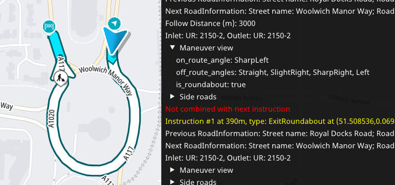
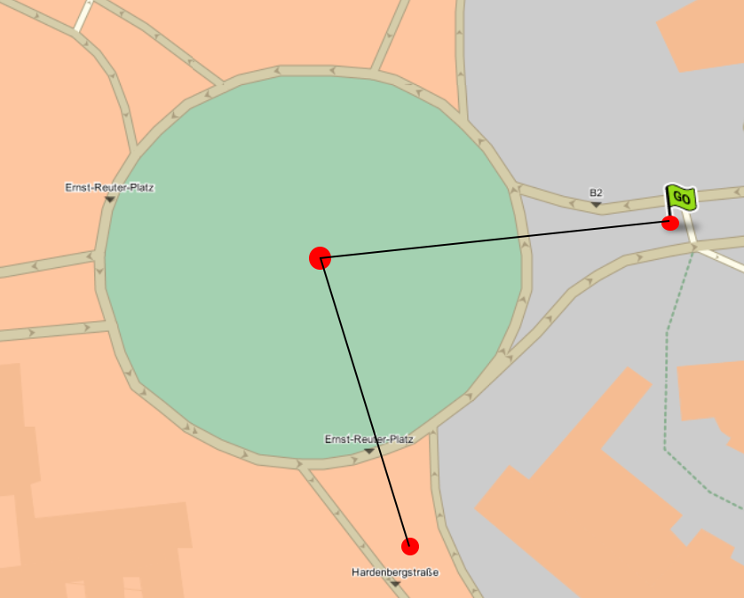
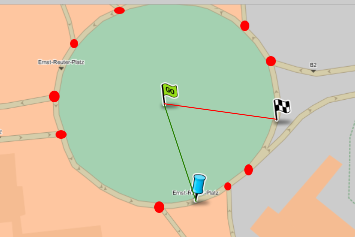
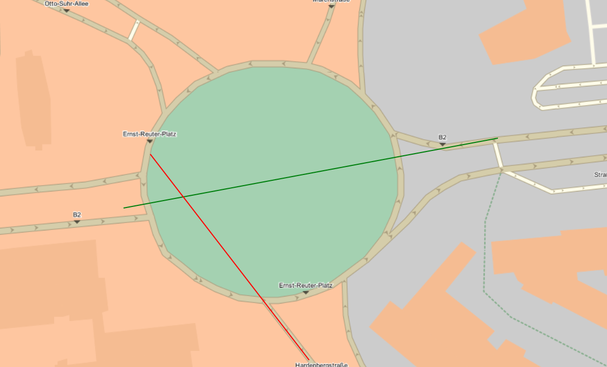

// Copyright (C) 2022 TomTom NV. All rights reserved.
//
// This software is the proprietary copyright of TomTom NV and its subsidiaries and may be
// used for internal evaluation purposes or commercial use strictly subject to separate
// license agreement between you and TomTom NV. If you are the licensee, you are only permitted
// to use this software in accordance with the terms of your license agreement. If you are
// not the licensee, you are not authorized to use this software in any manner and should
// immediately return or destroy it.

= Roundabout Angle Calculation

== Status

Implemented

== Context

We have a story to https://jira.tomtomgroup.com/browse/NAV-80016[Improve angle detection for roundabout exits] and https://jira.tomtomgroup.com/browse/NAV-81278[U-turn's detection sometimes doesn't work for roundabouts].

Predecessor can be found here: <<2020-07-30T13:52:47+0200-roundabout-angle>>

Unfortunately predecessor sometimes detects incorrect direction

== Decision

Calculate the angle between 3 points:

* entry point
* center point of the roundabout
* exit point

To prevent inconsistency due to curvature that usually happens closer to roundabout the distant points are used.
Distant points are points situated at some distance on a line. In the algorithm the distance is roundabout radius.

In case exit and entry are part of "V-shape" entrance or are parallel roads of the same logical road, the middle point between distant points on the entry and exit lines are taken.

== Tested alternatives

=== Alternative 1

Use middle point between roundabout entry and exit on the roundabout.

Rejected in some cases wrong angle is calculated due to position junction of entry-exit.

=== Alternative 2

Use relative angle between distant point heading. Can be considered as improvement of original algorithm.

Rejected bad results for "V-shape".

=== Comparison doc base on NIE regression test cases

link:2022-06-16T16:27:52+0300_roundabout-angle-v3/comparison.pdf[]
