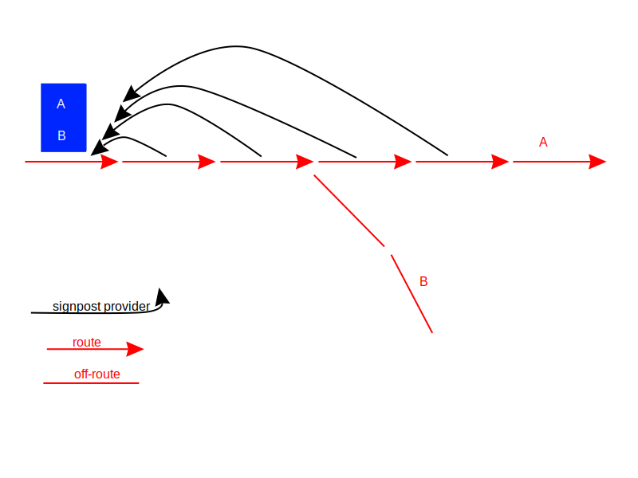

// Copyright (C) 2023 TomTom NV. All rights reserved.
//
// This software is the proprietary copyright of TomTom NV and its subsidiaries and may be
// used for internal evaluation purposes or commercial use strictly subject to separate
// license agreement between you and TomTom NV. If you are the licensee, you are only permitted
// to use this software in accordance with the terms of your license agreement. If you are
// not the licensee, you are not authorized to use this software in any manner and should
// immediately return or destroy it.

= Non-contiguous signpost paths

== Problem description.

Quite often signposts are located not at the incoming line of the maneuver, but few lines before, and signpost paths
are non-contiguous. See examples in https://jira.tomtomgroup.com/browse/NAV-102988.

In this case Situation Handlers fail to find the signpost and attach it to the instruction, as they look for the
signposts of the incoming line. This is especially true for Turns on regular roads, however the issue can be seen on
motorways with Forks/Exits, if a signpost is two or more lines away from the furcation point (not always, but exact
conditions considered not very important).

Currently, signpost digesting pipeline looks like this: +
Line::GetSignpostPathTo() -> SignpostPathFetcher::GetSignpostPath() -> SituationHandler +
SignpostPathFetcher::GetFollowingSignpostPaths() -> SignpostPathSituationAnalyzer::SelectTowardName() -> SituationHandler

Situation handler gets a signpost via SignpostPathFetcher and then applies SignpostPathSituationAnalyzer to it to select
the best toward name, which in turn also calls SignpostPathFetcher to collect more signposts after the current one.

== Potential solutions.

=== Handle the issue on the level of Situation Handler
This should try to find a signpost within some distance before the maneuver point, not only on the incoming line of the
maneuver. This would require going backwards along the route, which contradicts the overall processing model currently
used, as to do it right we would need whether to get rid of arc/line-on-route iterators or make them bidirectional.

Pros: Not loading unnecessary signposts.

Cons: Both ways require an API change and significant rework. Also, it might be expensive or not possible to go
backwards, reloading already evicted tiles or hitting invalidated route data.

=== Handle it in SignpostPathFetcher layer.
As all signpost usages happens via SignpostPathFetcher, it is possible to handle the problem there. For this it can
become stateful and keep track of the latest started signpost paths. +
When a signpost path is requested for the (incoming line, outgoing line), SigpostPathFetcher could check the opened
signpost paths and select one if applicable. This logic is not needed for GetFollowingSignpostPaths.

Pros: Probably the least amount of changes. +
Cons: SignpostPathFetcher looks like a temporary crutch for the lacking support of signposts in mock maps, therefore it
is not wise to increase its responsibilities. +
SignpostPathFetcher would load a signpost and investigate its paths for every line on route with a signpost, even
if it is not used at the end. It would become one mechanism of collecting the data along the route, which should either
be fed line-by-line or pull data itself when asked for the next signpost. This makes InstructionEngine more complicated
and might have performance impact as well, if it tries to read signposts from already evicted map tiles.

=== Handle it in the Junction Model layer.
When a signpost is found on a Line, all consecutive Lines from the beginning of the signpost path up to its end
(exclusive) can refer to the same SignpostPath. Therefore, it would not matter which Line to ask for a signpost, any of
them returns all relevant signpost paths.

When creating a LineOnRoute (L) with a signpost (S), the LineOnRoute provider will also create and cache more lines on
route as long as they don't have their own signpost and S doesn't end on those lines. +
Additionally, the propagation distance is capped to 1km. This is to prevent cases when none of the signpost paths are
found on the route. The lines created in this way maintain a back pointer to L. +
When asked for signpost information, these lines can return data from L (their signpost provider).

N.B. the initial approach of preloading and creating all SignpostPaths along the route proved to be expensive. +
N.B. if multiple lines refer to the same signpost, this skews the signpost name scores. This was fixed by making sure a
signpost is collected only once when calculating scores.

Pros: probably the cleanest design. Junction Model purpose is to provide simplified view to the map, hiding unnecessary
details and peculiarities of the map data.
Cons: The approach would work only for signpost paths starting on route, supporting the same semantics for off-route
Lines would be expensive as it would require exploring all possible paths from the given line in order to find the
signpost path destination arcs and connect the links in between.

== Proposed solution:

Handle it in the Junction Model.
