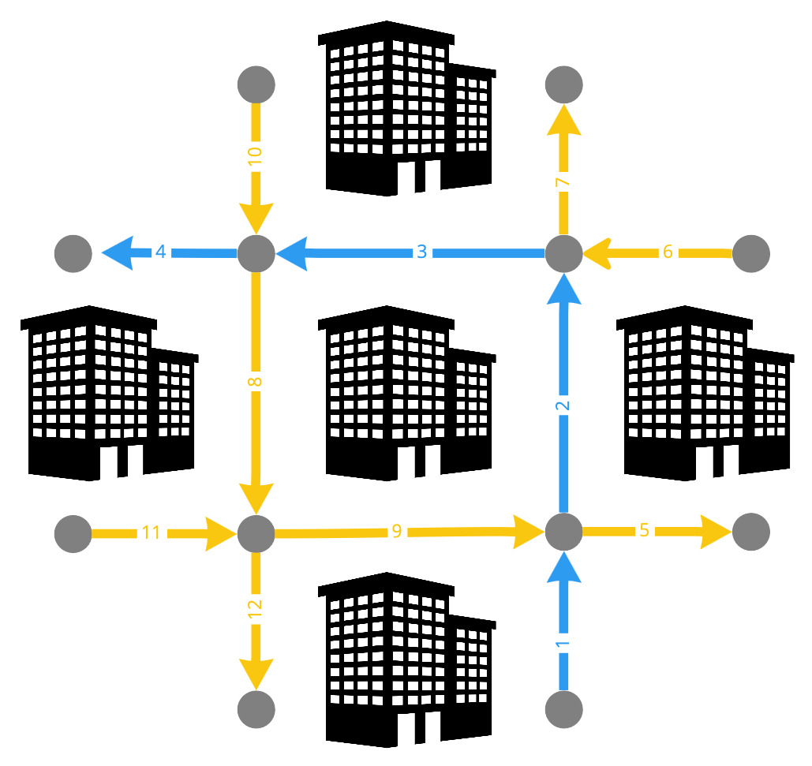
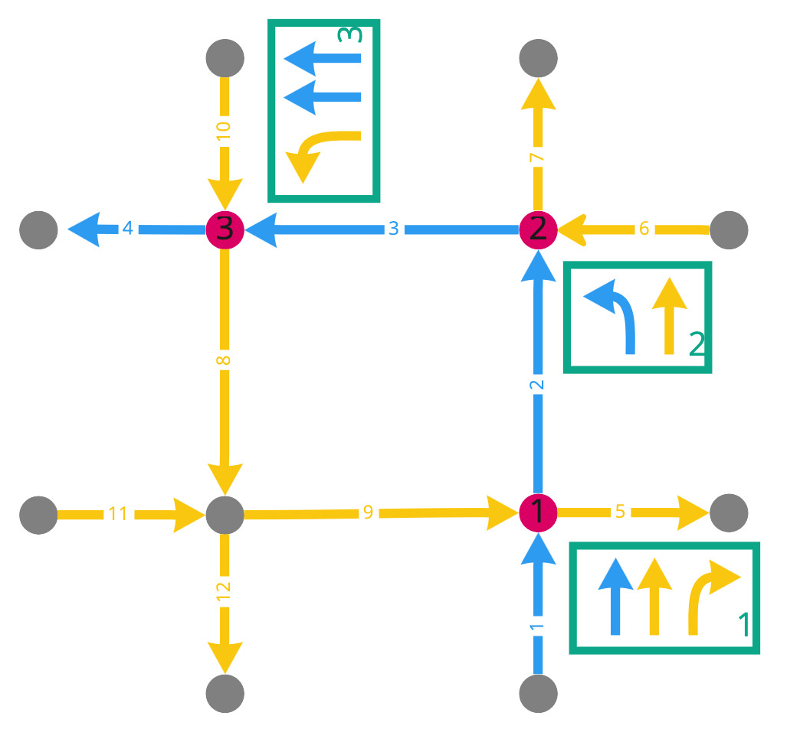
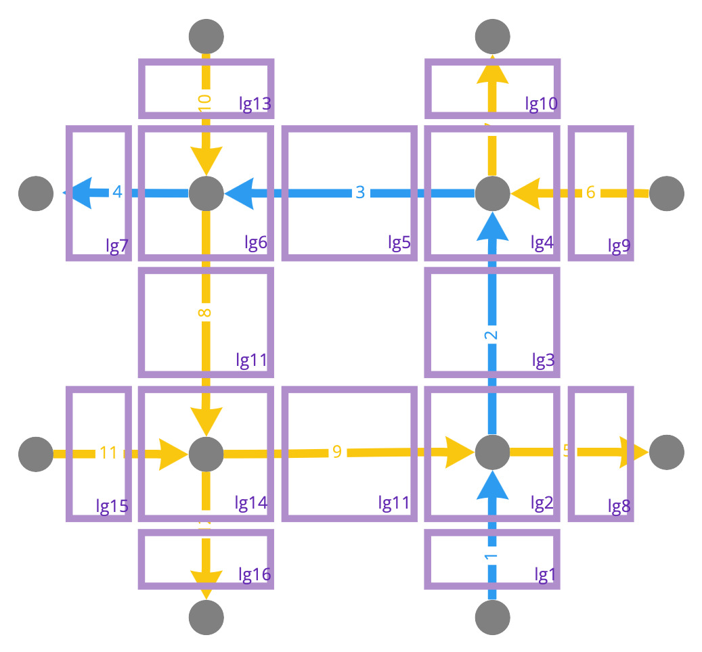
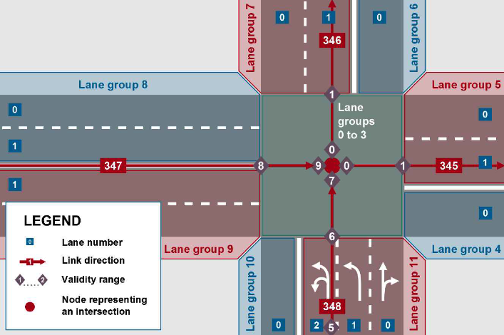
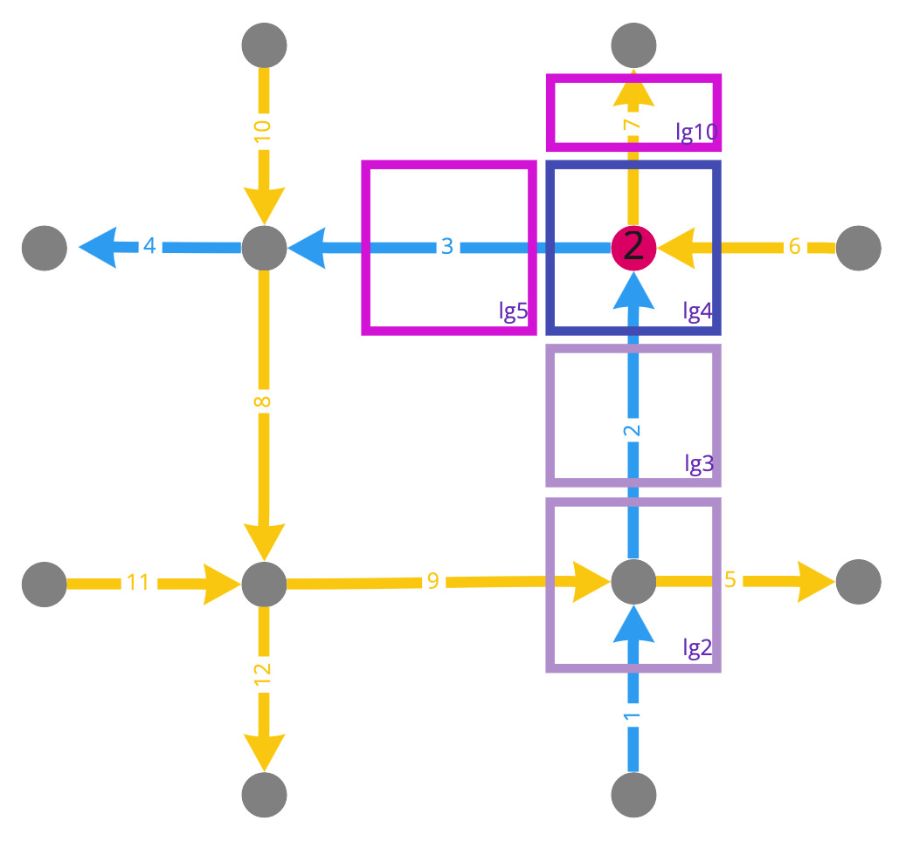
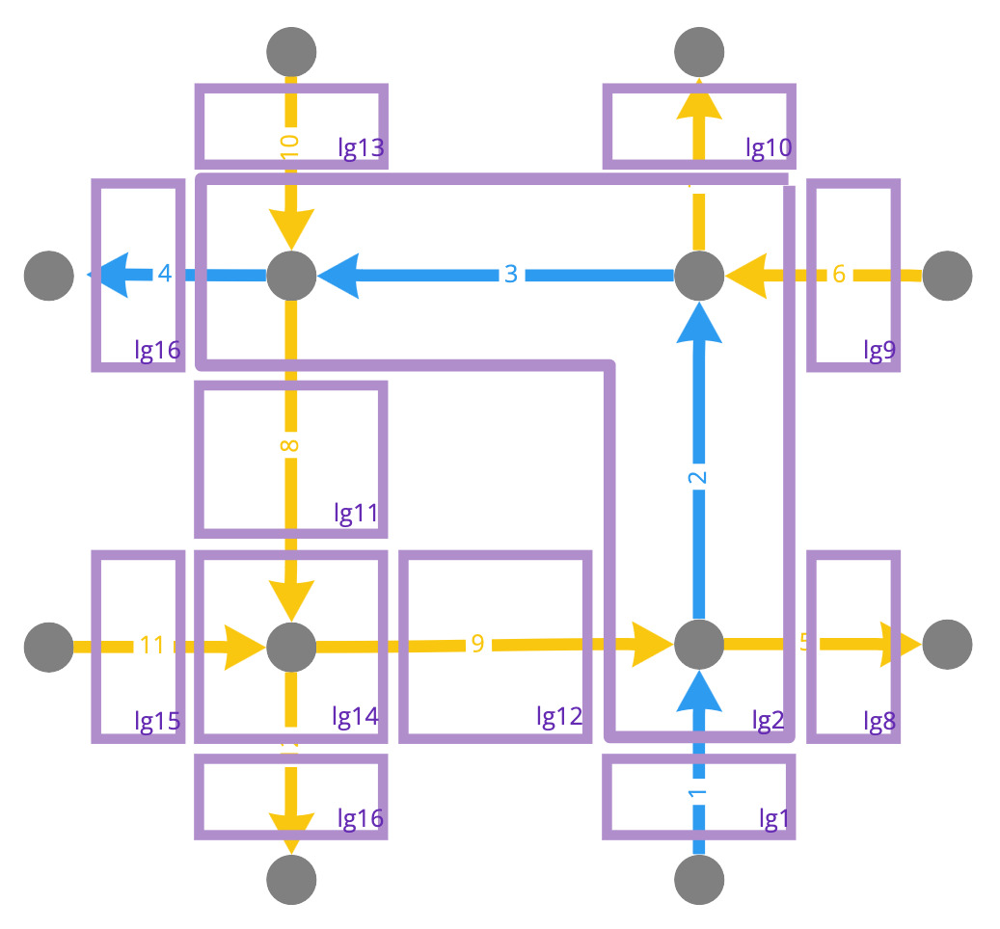
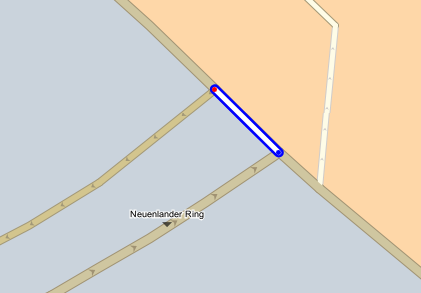
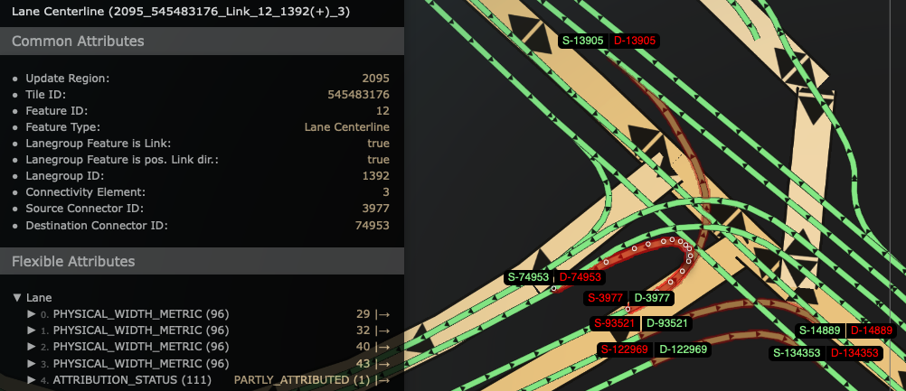
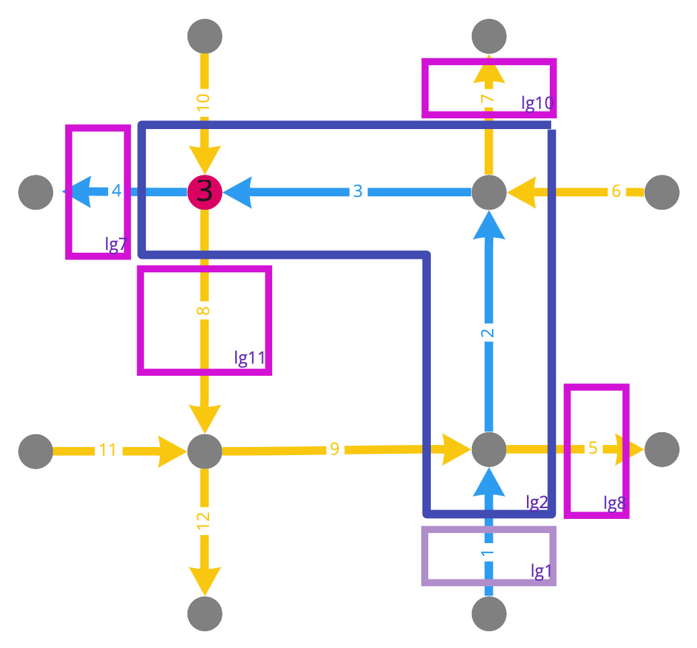

// Copyright (C) 2018 TomTom NV. All rights reserved.
//
// This software is the proprietary copyright of TomTom NV and its subsidiaries and may be
// used for internal evaluation purposes or commercial use strictly subject to separate
// license agreement between you and TomTom NV. If you are the licensee, you are only permitted
// to use this software in accordance with the terms of your license agreement. If you are
// not the licensee, you are not authorized to use this software in any manner and should
// immediately return or destroy it.

= Lane Arrow Synthesis at Long Lane Groups

== Status

Proposed

== Context

https://jira.tomtomgroup.com/browse/NAV-106530[Wrong segments is chosen for angle calculations]

We have identified a set of lane arrows being synthesised incorrectly
because the wrong arc is being used for the angle calculations.

=== Current Implementation

The output of the Lane Guidance component is a lane guidance scenario.
This is more than just the lane configuration around a particular
maneuver.  A lane guidance scenario covers 1000m before and 300m after
the maneuver, and if that region around multiple instructions
overlaps, they are combined into one longer scenario.

==== Example

Consider the following road network, with a route marked in blue.  To
simplify things, assume all roads are one-way.  However, this is not
simply an intersection of two dual carriageways, there are four
separate roads here.



Diagrams taken from https://miro.com/app/board/uXjVMays-ks=/?share_link_id=76926256635[this Miro board].

==== Desired Result

This scenario includes three road junctions, marked below in red.
Assume that all three belong to one lane guidance scenario.  Of these
three, two of them simply require the driver to go straight, and do
not require instructions.  Only the junction labelled "2" is a
maneuver.  Therefore, of the three lane guidance segments shown (in
green), only the one labelled "2" is a maneuver segment.



However, the ambition of the Lane Guidance component is to provide
correct lane guidance throughout the scenario, that reflects the lane
configuration the driver sees at that point.  So once the driver
passes junction 2, the scenario must contain arrows telling the driver
to go straight, as shown in lane segment 3.

Now, it is true that currently no clients take advantage of this extra
information, and we have no UX concept of how that should look.
Currently, only the maneuver segment is ever displayed to the driver.
This may change in future.  We could imagine some kind of route tube
display, in which successive lane configurations are presented all at
once as a sequence.  Or some kind of 3D perspective on the whole
scenario could be displayed, with synthesised arrows added along the
whole route as labels.  Clients have expressed interest in using the
scenario this way.  And we do currently synthesise arrows with that
purpose in mind.  It is possible that this is unnecessary and the
functionality should be removed.  I do not intend to address that
topic in this document.

==== Lane Groups

The map data consists of two networks.  The first, the routing layer,
consists of arcs, and we have already seen that.  The second is the
FTX lane data layer.  It consists of lane groups.  These are shown as
purple rectangles.  These are translated by Lane Guidance into lane
segments.



Note that instead of connecting junctions in the road network, lane
groups cover a junction for a finite distance.  Other lane groups
cover the uninterrupted road stretches in between.  This is described
in the FTX Lane spec.



==== Arrow Synthesis

For arrow synthesis, we need to determine the outgoing directions by
comparing the angle of an incoming arc to the angles of the available
outgoing arcs.  This involves several steps:

1. Start with an incoming arc to a furcation.  This is called the
"target arc".
2. Find the corresponding lane segment, corresponding to the incoming
lane group to the bifurcation.  This is the last lane segment of the
target arc.  It is called the target segment.  This is done in
`FindTargetSegment`.
3. Find the source segment.  For this discussion, assume the target
and source segments are the same.  More discussion of how they can be
different is in https://github.com/tomtom-internal/navigation-instruction-engine/blob/3b4a85696ec087112e52bd4c6ab3b7fc99b34a95/documentation/architecture/src/adr/2021-11-05T15:59:03+0100-arrow-synthesis-complex-intersections.adoc[the previous ADR].  This is done in `GetSourceSegment`.
4. Find the outgoing segments from the source segment.  This provides
a mapping from each lane in the source segment to one or more outgoing
segments.
5. Find the arcs corresponding to each of those outgoing segments.
You now have a mapping from each lane in the source segment to one or
more outgoing arcs.
6. Calculate angles between each outgoing arc and the incoming arc we
started with.  These last three steps are all in
`GetAnglesForConnectedSegments`, which is called from
`PopulateLaneArrows`.

For example, consider the maneuver at junction 2:



1. The incoming arc, the target arc, is arc 2.
2. The target segment is the last segment of arc 2, in this case lane
group 4, coloured blue in the diagram.  Lane groups 2 and 3 are not
relevant for arrow calculation.
3. The source segment is also lane group 4.
4. The outgoing segments are lane group 5, lane group 10, coloured pink in the diagram.
5. The outgoing arcs are 3 and 7 respectively.
6. The corresponding angles relative to the target arc 2 are -90° and 0°.

==== Finding Furcation Arcs

But I started this description halfway through - how do we get the
incoming arc to a furcation in the first place?  The answer is we
iterate backwards through the route arcs of the scenario and attempt
to generate arrows for all of them as if it was a furcation.  If in
fact it is not a furcation, arrow calculation will fail.

But why backwards?  The answer is that we want to generate arrows for
segments starting from as late a destination as possible.  When an arc
is a plural junction, there are multiple arcs that may trigger arrow
synthesis in the same segment.  We want to use the destinations later
in the route for these arrows.  I've omitted discussion of plural
junctions because it's not relevant to the problem.

==== Long Lane Groups

With that in mind, consider what would happen if lane group 2 was
extended along the whole of arcs 2 and 3, and then some.



This is pretty unlikely for this example, you wouldn't model a
distance of two whole city blocks this way.  But there's nothing
technically wrong according to the spec.  And this is a legitimate way
to model certain smaller complex junctions.  For example,
https://nds.tomtomgroup.com/webviewer/44809/?action=FeatureInfo%3Flang%3DNULL%26poiCategoryCollectionId%3D0%26iconCollectionId%3D0%26mode%3DNEAREST_LINK%26lon%3D979573.07477761%26lat%3D6993187.3494571%26scale%3D1066.3647919248922%26disputantId%3D0%26theme%3DDEFAULT%26routingService%3D0%26routeType%3DTIME_WITH_PENALTY%26vehicleType%3DPERSONAL_CAR%26labeling%3Dtrue%26icons%3Dtrue%26attributeHighlightingQuery%3D*%25231392%2520*%253CATC.16705%253E&zoom=19&lat=53.05506&lon=8.79964&layers=FFFBFFFFFFF000FFFTTF0000TT&poiCategoryCollectionId=0&iconCollectionId=0&disputantId=0&lang=NULL&theme=DEFAULT&routingService=0&routeType=TIME_WITH_PENALTY&vehicleType=PERSONAL_CAR&labeling=true&icons=true[this arc]
is taken from the `BERMEN-20` test route at (53.0549955,8.7997377):



Looking at the lane data, you can see that a single lane group, 1392, more than covers this arc:



So let's continue using the more extreme example above, so that we can see how dramatic the failure can look.

As we iterate backwards, the first furcation we would encounter is
number 3, and we would attempt to generate arrows for it:



1. The incoming arc, the target arc, is arc 3.
2. The target segment is the last segment of arc 3, in this case lane
group 2.
3. The source segment is also lane group 2.
4. The outgoing segments are lane groups 7, 8, 10, and 11.
5. The outgoing arcs are 4, 5, 7, and 8 respectively.
6. The corresponding angles relative to the target arc 3 are 0°, 180°, 90°, and -90° respectively.

In particular, the recommended arrow will be the one between the two
on-route arcs 3 and 4, which is 0°, i.e. "go straight".  This is
definitely the wrong guidance.  And other angles will be pretty messed
up too.  For example the right turn onto arc 5 will be represented as
a u-turn.

The key problem here is that we used the wrong target arc, arc 3.  To
calculate the correct angles, we should have used arc 1.  That is, the
arc that arrives into the source segment.

== Proposal

The code that does this is `SynthesizeArrows`.  Omitting irrelevant
detail, it looks like this:

```
void SynthesizeArrows() {
  for (auto arc_iter = std::rbegin(on_route_arc_keys_); arc_iter != std::rend(on_route_arc_keys_);
       ++arc_iter) {
    const auto arc_key = arc_iter->arc_key;
    auto target_segment = FindTargetSegment(arc_iter);
    const auto source_segment = GetSourceSegment(*target_segment, arc_key);
    PopulateLaneArrows(source_segment, arc_key);
  }
}
```

My proposal is that instead of passing `arc_key` to
`PopulateLaneArrows`, we find the first arc (ordered by route offset)
associated with the target segment and use that key instead.

The hard part is finding the right arc.
In the example, we want to find arc 1, instead of arc 4.

Currently we have an object `InternalLaneSegments` which acts as a
dictionary of lane segments.  You can look up a segment by
`SegmentId`.  You can also look up a segment by `UniqueLaneGroupId`,
which can be calculated from a `LaneGroup`.  However, lane groups can
be split into multiple segments, so the corresponding function is
`GetLastSegmentByLaneGroupId`.  It also maintains a mapping from
`LaneGroup` to arcs.  Note that multiple arcs may be associated with
on `LaneGroup`, so this is a one-to-many mapping.
This data is populated as the on-route arcs are added.
In the example above, it would hold this information:

[cols="1,1"]
|===
|Lane Group |Arc IDs

|lg1
|1
|lg2
|1,2,3,4
|lg3
|4
|===

We already have the necessary arc ID, 1, in this data.
So we could use
this data that we already maintain to retrieve the first arc key
associated with a segment.

However, the arcs associated with a lane group are stored as a set.
We need these to be ordered.  So we could either use a vector, and
rely on arcs being added in the correct order.  Or we could add a
route offset as an argument to `AddArcKey`, and keep the mapping
sorted.

Once we change `InternalLaneSegments` in this way, we can add a
`GetEarliestArcBySegment` function.  Then in `SynthesizeArrows`, we can
use that function to obtain a `target_arc_key`.  And finally we pass
this key to `PopulateLaneArrows` instead of `arc_key`.

== Consequences

Completely unknown.  We would need to do mass testing to see what the
results really look like.
