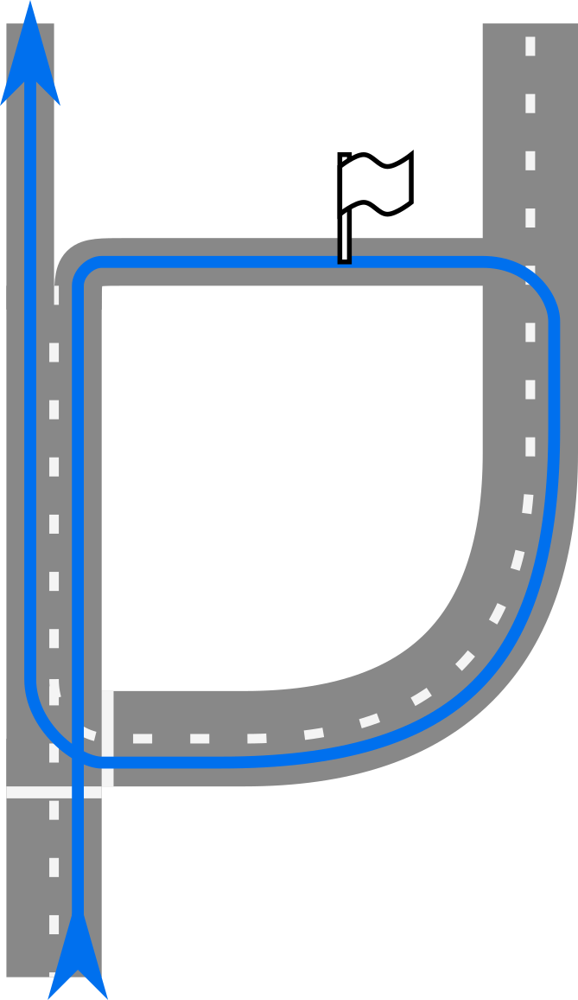
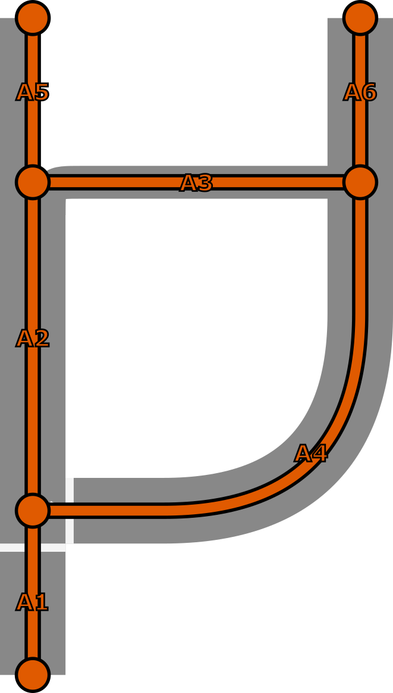
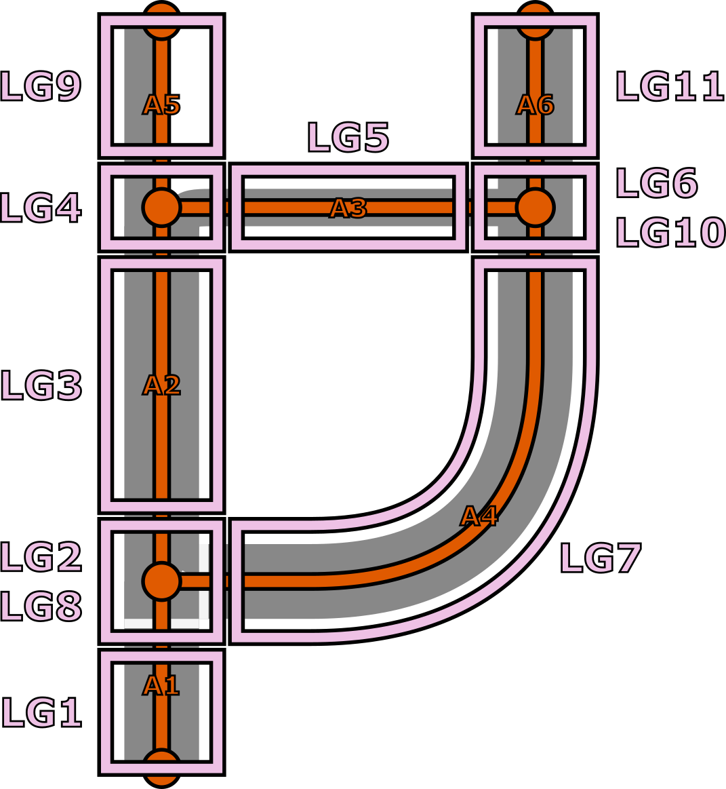
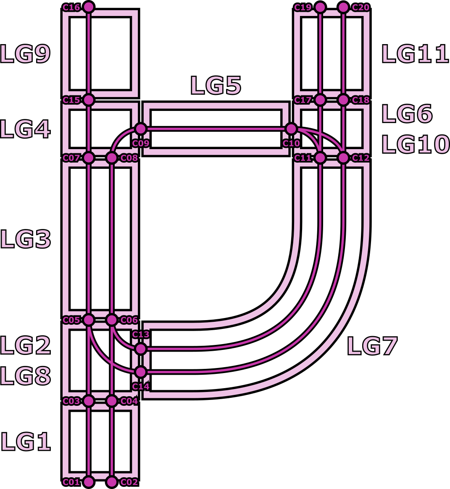
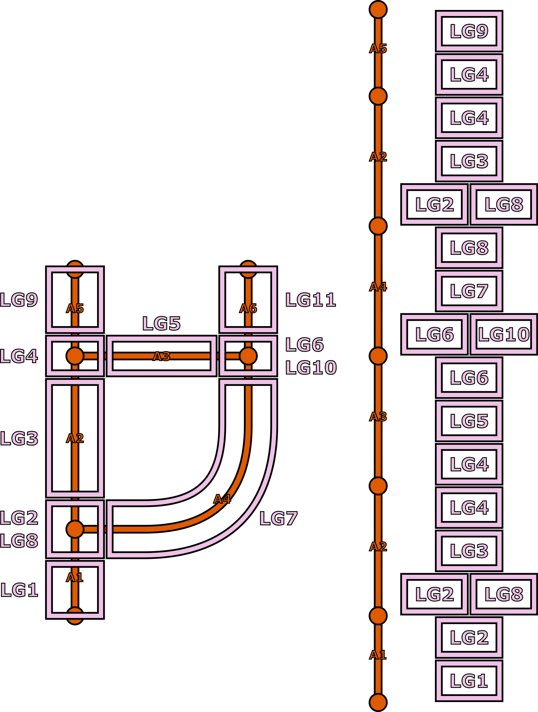
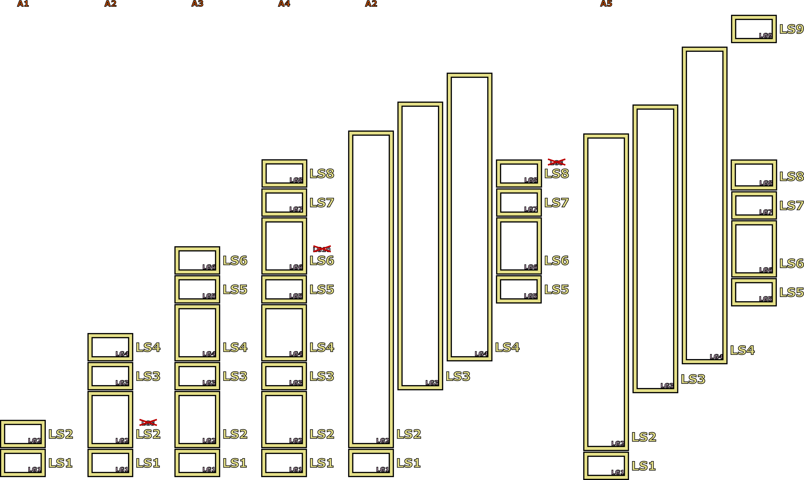

// Copyright (C) 2021 TomTom NV. All rights reserved.
//
// This software is the proprietary copyright of TomTom NV and its subsidiaries and may be
// used for internal evaluation purposes or commercial use strictly subject to separate
// license agreement between you and TomTom NV. If you are the licensee, you are only permitted
// to use this software in accordance with the terms of your license agreement. If you are
// not the licensee, you are not authorized to use this software in any manner and should
// immediately return or destroy it.

= Creating Extra Lane Segments In Route Loops

This is the first ADR in the scope of implementing route loops support in NIE's lane guidance. See also:

. link:2023-04-21-lane-guidance-route-loops[Creating Extra Lane Segments In Route Loops] [this document]
. link:2023-04-26-lane-guidance-lane-groups-sequencing[Sequencing Lane Groups Only By Adjacent Arc Connectivity]

== Status

Proposed

== Problem

There is a customer bug report https://jira.tomtomgroup.com/browse/NAV-107679[NAV-107679] concerning a route that does a U-turn at a dead end, where no lanes are being recommended.  There are also some incorrect arrows being generated.

There is a general category of routes in which the same FTX lane group appears more than once.  This is common where there are U-turns, or where there is a waypoint.  In such cases our output lane guidance model really requires separate lane segments for each appearance of the lane group.

When we originally wrote the `LaneGuidanceBuilder`, we chose to postpone consideration of these cases until later, because it was simpler to assume a one-to-one mapping between lane groups and lane segments.  It's now time to find a way to handle these cases.

== Example

Consider the following route.  Due to the waypoint, there is a loop in the route, and it drives along the same road twice.

The relevant routing layer data (nodes and arcs) looks like this:

In the Lane FTX layer, the road network is divided into lane groups.  Typically there are lane groups covering the bulk of an arc, and separate lane groups covering junctions.  At junctions, there must be separate overlapping lane groups for each incoming arc.  For example, at the bottom there is a junction where A1 and A4 are both incoming arcs and A2 is the outgoing arc.  Therefore we need lane group LG2 to model the connectivity starting from A1, and LG2 to model the connectivity starting from A4.

Within each lane group, lane connectivity is modelled as a number of lane connectivity elements.  Each lane connectivity element connects a source connector ID with a destination connector ID.  Connectivity across lane groups is implied by sharing the same connector ID.

== Building a Lane Guidance Scenario

The `LaneGuidanceBuilder` constructs a scenario iteratively by considering one arc at a time along the supplied `RouteStretch`.  It's easier to visualise the data available if we unwrap the data into a line.

The data access layer allows us to retrieve the set of lane groups corresponding to an arc, along with the start and end offsets along the arc of each lane group.

Note that A1 and A2 both have a reference to a portion of lane group LG2.  So we will "see" LG2 twice in succession, first when processing A1, then when processing A2.  Also note that A2 has references both to LG2 and LG8, which are in parallel along the same portion of the arc.  Finally, note that due to the route loop we will eventually process A2 a second time, and "see" LG2 for the third time.

When we see a new lane group, we create a corresponding lane segment.  When we see a lane group that was already processed, we extend its length with the new range.  When we see two lane groups in parallel, we must decide which of them belongs to the route, based on connectivity. The second ADR addresses this part: link:2023-04-26-lane-guidance-lane-groups-sequencing[Lane Guidance Lane Group Sequencing]

Here is how the lane scenario looks as we process each arc.  Clearly, things go haywire when we hit A2 for the second time.  We extend LS2 using the new offset on the route, causing it to be extremely long and overlap many other lane groups.

== Fixing the Lane Segments

The first change to support route loops is to create separate lane segments for each appearance of a lane group on the route.

This is a simpler change than you might expect.  We have a single object `InternalLaneSegments` that acts as an index of lane segments, both by segment ID and by lane group ID.  It is already capable of indexing multiple lane segments under a single lane group ID, because in a later step segments will be split according to lane dividers, and there will be multiple adjacent lane segments corresponding to a single lane group.

As the `LaneGuidanceBuilder` processes lane groups, it asks `InternalLaneSegments` if the lane group already exists, so that it can extend the existing lane segment instead of creating a new one. The `InternalLaneSegments` object can simply say "no" if the last added segment has a different lane group id. This will cause `LaneGuidanceBuilder` to create a new lane segment instead.

This holds under the assumption that a lane group and its references should always be read in contiguous fashion, with no other lane groups in between.

== A Better Way (Refactoring Idea)

This is all rather convoluted and hard to understand, because the existing `LaneGuidanceBuilder` was explicitly designed without taking into account route loops.  It was designed on the assumption that lane groups correspond to a contiguous sequence of lane segments, and lane groups have a single start and end offset along the route.  The above design is an attempt to adapt that structure when the assumption is broken.  It's surprising that this works at all.

A better approach would be to separate the lane group model from the route view.  The existing `CLaneGroup` structure exposed by the data access layer isn't adequate on its own for us to manipulate, because there are indirect references to other structures via opaque identifiers, and no overall indexes.  We can and should build our own structure that conveniently allows navigating from a lane group to a lane connectivity element to a connector to another lane connectivity element to another lane group.  Then on top we should have another structure that models the route view of the data.  This would keep the interfaces clean and easy to debug.

This would represent a very large refactoring.  The above design can be considered a stepping-stone to that outcome, in that it allows us to build up a suite of tests that ensure the correct behaviour.
