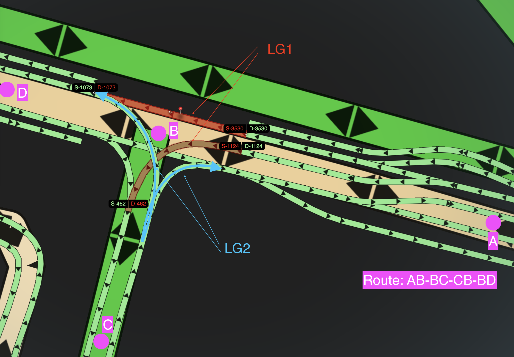

// Copyright (C) 2021 TomTom NV. All rights reserved.
//
// This software is the proprietary copyright of TomTom NV and its subsidiaries and may be
// used for internal evaluation purposes or commercial use strictly subject to separate
// license agreement between you and TomTom NV. If you are the licensee, you are only permitted
// to use this software in accordance with the terms of your license agreement. If you are
// not the licensee, you are not authorized to use this software in any manner and should
// immediately return or destroy it.

= Sequencing Lane Groups Only By Adjacent Connectivity

This is the second ADR in the scope of implementing route loops support in NIE's lane guidance. See also:

. link:2023-04-21-lane-guidance-route-loops[Creating Extra Lane Segments In Route Loops]
. link:2023-04-26-lane-guidance-lane-groups-sequencing[Sequencing Lane Groups Only By Adjacent Arc Connectivity] [this document]

== Status

Proposed

== Background

The lane guidance code reads lane groups from a sequence of arcs on the route,
and tries to to establish a connected sequence of lane groups on the route. For
that, LaneConnectivityMap is used to store both source and destination
connectors, for *all* arcs on the route.

== Problem

When the code sees overlapping lane groups, it tries to break a tie and keep
only one of them based on which of them is connected to anything that it has
seen previously on the route.

When the tie cannot be decided, our code throws a towel and makes an arbitrary
decision to skip adding the first of this pair of parallel lane groups. This
results in a broken connectivity between lane segments, which causes an LLR
failure and no lanes are recommended.

== Example
This approach failed in the customer bug report https://jira.tomtomgroup.com/browse/NAV-107679[NAV-107679].

Here is an intersection through which the route goes twice: first in AB-BC
turning left, then in CB-BD also turning left.

The lane group LG1 is first seen by code when processing the arc BC. It gets
added to the LaneConnectivityMap with both connectivity elements. However, the
connectivity element ABD (3530-1073) should not be added, because it does not
lead to the next arc on the route BC.

When the code approaches the intersection B for the second time, this time
turning left, it sees both LG1 and LG2 starting at the same offset 0 in the arc
BD. Now it has to break a tie, but it finds that previous connector ABD from LG1
and as the code is written, LG2, which happens to be read first, is discarded.

== Proposed Solution

We are proposing to rely only on the connectivity of the *single previously
added lane group* when breaking a tie. The connectivity should contain:

. *Destination connectors*:
.. The most frequent case is when one lane group follows another and they are
both stored in the same arc.
.. But there are also occurrences on the arc borders, where
one lane group from the previous arc is connected to another lane group on the
next arc without any shared lane groups between these arcs. One of the reasons
for this is when the previous lane group is stored not in a base link, but
in a road geo line.
+
Example on the map HCP3_EUR_44_221G0_IR037 (ProductId 44970): lane group 833
at 48.160048 11.601325 does not belong to the arc of the next lane group,
because it's stored in the Road GeoLine instead of the previous base link on the
route. Database Inspector search query: "LaneGroupId_2090_545554687_RoadGeoLine_3_833(+)"

. *Source connectors*: this is a frequent occurrence at the intersections, where
the same lane group is referenced at the next arc.

For breaking ties, we should check the *source connectors* of the candidate lane
group against the previously stored connectivity.

For the example case, this will exclude the connector ABD from being found when
breaking a tie between LG1 and LG2 when processing the second turn through
intersection B.

== Consequences

This is a simplification of the lane group sequencing algorithm. The original
code uses LaneConnectivityMap for (at least) two independent use-cases:

1. Deciding which LGs of a particular arc to keep in the route and which ones to
ignore.

2. Providing data for connecting lane *segments* later in the code.

This change excludes the global connectivity map from use case #1, operating
under the assumption that adjacent lane groups should always be connected. This
is a simplification of both the implementation and the mental model of how lane
groups are stored in the source data. In fact, I would argue that any case (if
it exists) where non-adjacent lane groups are connected should be classified as
a map bug.

The ultimate goal would be to get rid of the global connectivity map as it tries
to stuff all scenario connectivity into one container (which breaks for route
loops and self-crossing loops), and is a hard-to-understand piece of logic
preventing us from making further improvements in lane guidance quickly.
