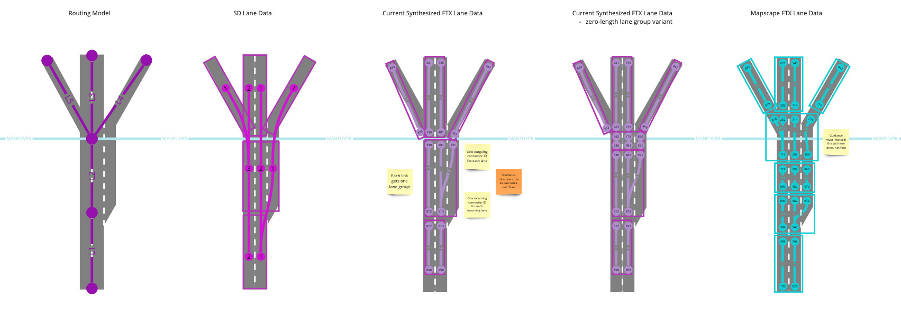
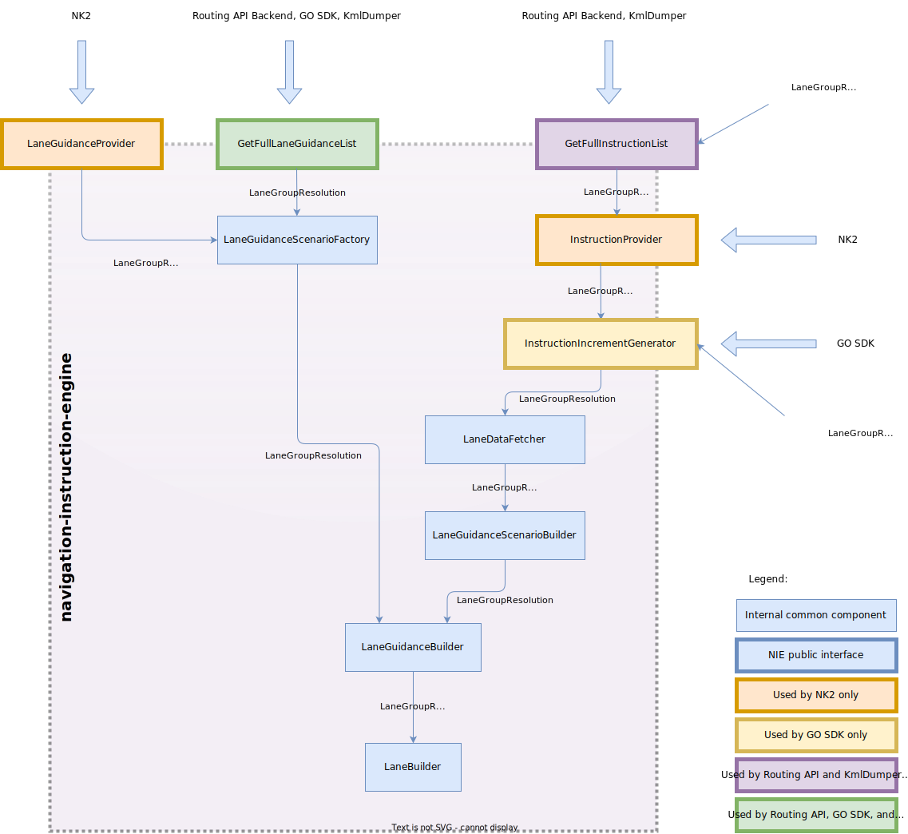
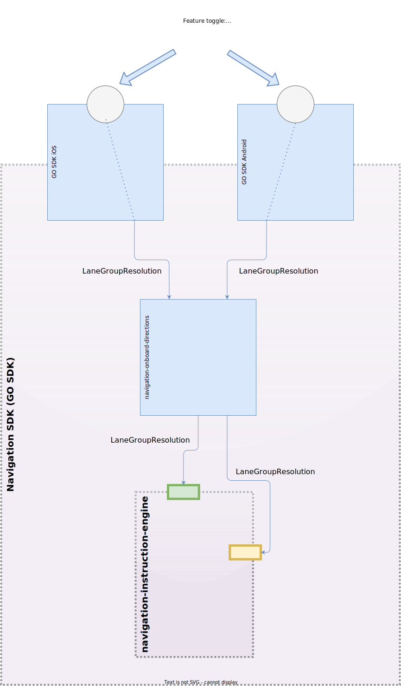
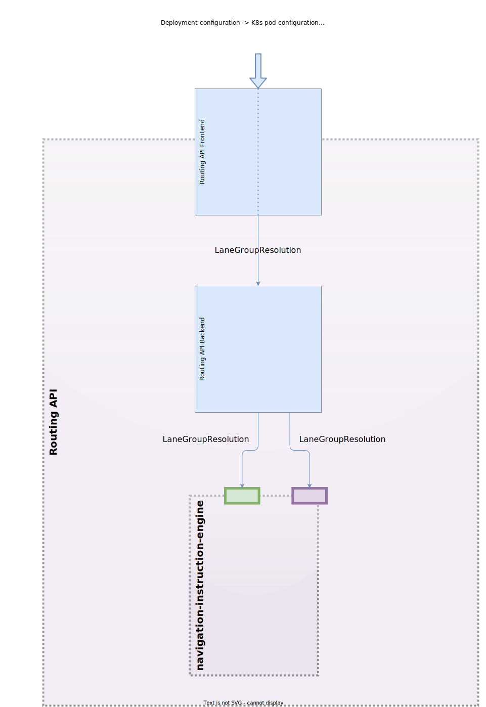
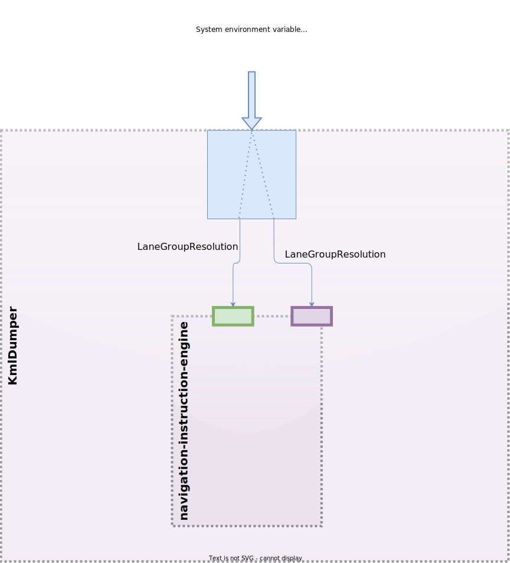

// Copyright (C) 2021 TomTom NV. All rights reserved.
//
// This software is the proprietary copyright of TomTom NV and its subsidiaries and may be
// used for internal evaluation purposes or commercial use strictly subject to separate
// license agreement between you and TomTom NV. If you are the licensee, you are only permitted
// to use this software in accordance with the terms of your license agreement. If you are
// not the licensee, you are not authorized to use this software in any manner and should
// immediately return or destroy it.

= Software Switch for TomTom Map Lane FTX Data

This ADR is about the software switch which is set externally by client to enable handling TomTom Server 3.0 map FTX data and produce correct number of lanes.

== Status

Accepted

== Background

Currently TomTom maps create one lane group for each arc, based on the SD lane data describing that arc.  However, this is a poor match for the FTX lane model, as exemplified by MapScape maps, which create separate lane groups spanning junctions as well as lane groups describing the bulk of the arc.  This is shown in the below diagram:

To deal with this we implemented an alternative logic for determining lanes from lane connectivity elements (https://github.com/tomtom-internal/navigation-instruction-engine/pull/342[link to PR]).  Instead of creating one lane per unique source connector ID, as in the current implementation, we will create one lane per lane connectivity element.

The key question is how would our software know whether to apply the original or the alternative logic?

There are several constraints that limit the solution space:

. It is impossible to determine based on presence of specific data or attribute in the NDS map: current TomTom maps have SD lane data *and* FTX lane data, and this would stay true also for next versions of the TomTom map, even if and when the lane group modelling will change to the desired form.  Therefore automatic detection based on the above is not feasible.
. It is impossible to rely on a specific map provider id (for example, TomTom), since future maps with lane group modelling would also will be produced by TomTom.  In addition, same problem might persist for an external map provider, for example Zenrin.  Therefore automatic detection based on provider id is not feasible.
. The solution needs to be delivered quickly, therefore solutions that have a significant risk factor would be less preferred.

== Alternatives

=== Alternative 1: Automatic detection based on other specific field in TomTom NDS map

We reviewed the possibility to use an attribute or property of the NDS map to mark the map as "map with incorrectly modelled lane groups".  The idea was that current TomTom maps would be marked as such and released again, and the software would decide on the logic based on the value of that attribute.

The following attributes were considered:

. Supplier ID: Easy and available, but not sufficiently detailed to distinguish for instance a solution with "proper" or "improper" intersection modelling from TomTom NDS compiler process.  One also can’t detect if data are coming from Orbis or Genesis, which may be important in the future.
. Internal Name: This cannot be used because it is already used in NDS compilation process internally and it cannot get updated because it is stored in an not versioned table.
. Any other place to be identified. This place needs to fulfill the following requirements:
.. Information in versioned part of NDS.
.. Ideally easy and safe to manage in NDS compiler and/or configuration.
.. Easy and stable detectable in lane application.
.. No harm on any existing processes and content and somehow possible in conditions of NDS specification.

Pros:

. Automatic solution, transparent for the client.
. Solution local to Instruction Engine.
. Clean-up (removal of the feature once not needed) will be local and easy.

Cons:

. Current TomTom maps need to be re-released and delivered to customer.
. Choosing any of the above attributes would be risky in the given timeframe, since the safety should be thoroughly checked in terms of effect on the NDS compiler and the map release process.  In addition, since map re-release is required, the estimated overall time for Ops compilation is 7-9 days for Europe.  In total this would exceed the allotted timeframe, and the risk would be not finding a "safe" enough attribute to store this property.
. Other map providers such as Zenrin, will not store this information, even though their lane group modelling might resemble that of TomTom.

=== Alternative 2: Read number of lanes from SD lane data, if available

The proposal is to use the presence of the `NUM_LANES` attribute in the SD lane data for the arc being considered.  To make this more robust, in case SD data is accidentally added to an otherwise correct FTX map, we could trigger it only when there is also a lane group that spans the entire arc.  This makes sense, since NUM_LANES only makes sense when applied to an entire arc.  If/when a TomTom map with correct lane group modelling appears, it would naturally disable this solution.

Pros:

. Automatic solution, transparent for the client.
. Works for any map provider; no map provider needs to take anything into account and/or provide additional information.
. No map re-release is needed.
. Solution local to Instruction Engine.
. Clean-up (removal of the feature once not needed) will be local and easy.

Cons:

. Risky in terms of product stability.  It was given as a fact that if this solution is selected, a stable branch of Instruction Engine for HCP3 without this change will have to be created and maintained, since such data-based logic selection compromises product stability, a risk which can not be taken at this stage.

=== Alternative 3: Manual selection of logic by the client

This solution implies no automatic detection whatsoever.  The client will choose the logic based on a predefined switch (boolean or enum).  The client in this case is whoever consumes our SDK with the current TomTom map, and any other potential map which has lane groups modelled in a similar way.  By default, this switch will be off, therefore clients that in the first place only use a "properly" modelled map would not need to know about the switch, leaving HCP3 unaffected and therefore without need to branch off Instruction Engine for stability.

The meaning is that all the upstream components will have to be aware of the ability to toggle the logic, and will have to propagate the value further down to Instruction Engine.  Instruction Engine public API will be extended to accept the switch value.  This would affect components of two products:

* GO SDK (for onboard Guidance)
* Routing API (for online Guidance)

Pros:

. Not a risky solution

Cons:

. BMW as the current external client of the solution will have to be informed to toggle the switch, and later, once a "properly" modelled map is released, informed to stop doing that.
. A whole bunch of components will need to be modified with this switch.
. Clean-up (removal of the feature once not needed) will be wide and more involved.

== Decision

Alternative 3 (Manual selection of logic by the client) was selected as the least risky solution.  Given the stage of the product and the extremely tight release timelines, a longer but safe implementation was preferred over the risky ones which involve unknowns.

= Implementation details

The switch name is _Lane Group Resolution_, and it can have two modes:

. `LinkAndCrossLink` - indicates that lane group covers both link and cross-link areas.  This is the model according to which Lane Guidance was designed, and to which MapScape maps adhere.  The end goal is to have TomTom map modelled this way.
. `RoutingLinkOnly` - indicates that lane group covers link areas only, without cross-link.  This is the model implemented currently for TomTom maps.  For this mode alernative logic should apply, as described in the beginning of this ADR.

This setting should be propagated from the SDK public interface (for SDK users), or set per Routing API deployment (since a single deployment serves a single map, which is uniformly modelled).

== Instruction Engine diagram

==== Explanation

The core logic is implemented in `LaneBuilder::AddLane`: this is where the decision to create one lane per lane connectivity element is applied.  The direct caller of it is `LaneGuidanceBuilder::CreateLanes`, which creates lanes for the scenario based on connectivity elements.  Then, there are several code paths that invoke `LaneGuidanceBuilder`:

* `LaneGuidanceScenarioFactory` which is used by:
** the NIE public function `GetFullLaneGuidanceList`, which in turn is used by GO SDK onboard, Routing API Backend, and KmlDumper.
** `LaneGuidanceProvider`, which is used by TripService of NK2.  Here no configuration by TripSevice is needed, since NK2 only serves HCP3 with MapScape map.  Therefore `LaneGuidanceProvider` always creates `LaneGuidanceScenarioFactory` in `LinkAndCrossLink` mode.
* `LaneGuidanceScenarioBuilder` which is used by `LaneDataFetcher`, which is used to provide lane data on stretches to assist instruction generation.  The latter is created and owned by `InstructionIncrementGenerator`, which is either directly used by GO SDK onboard, or indirectly through `InstructionProvider` which in turn is either directly used by NK2 TripService, or by the NIE public function `GetFullInstructionList` (used in Routing API Backend and by KmlDumper to fetch all instructions at once).

== GO SDK diagram

==== Explanation

GO SDK implements experimental feature toggles to allow the client toggle different non-productized features.  A feature toggle is exposed in the Android or iOS SDK and is implemented in the native language.  A feature toggle is a boolean, and can be either ON or OFF.

The default and desired mode, given a "properly" modelled map, is `LinkAndCrossLink`.  Therefore the introduced feature toggle is called `resolveLaneGroupByRoutingLinkOnly`.  When off, it translates to lane group resolution of `LinkAndCrossLink` (default), and when on - to `RoutingLinkOnly`.  It is then expected from the client that desires to get optimal lane guidance on an "improperly" modelled map to switch this feature toggle on.

Internally the translated `LaneGroupResolution` mode is passed to `navigation-onboard-directions` and from there to the respective public interfaces of NIE: `InstructionIncrementGenerator` and `GetFullLaneGuidanceList`.

== Routing API diagram

Routing API deployments are configured independently.  Each deployment serves a single map, which is uniformly modelled ("properly" or "improperly").  This allows to select the lane group resolution at deployment time, which is also the time the served map is known and set.  That is, for current Server 3.0 TomTom map deployments, this mode will be set to `RoutingLinkOnly`.  If not set, the default would be `LinkAndCrossLink`, since this is the ultimately desired mode, once the map allows for this.

The Routing API Frontend is configured through the deployment configuration, and the setting is propagated into the Routing API Backend, which in turn respectively calls the public interfaces of NIE: `GetFullInstructionList` and `GetFullLaneGuidanceList`.

== KML Dumper diagram

KmlDumper operates on a single OD pair, or on a set of OD pairs.  This way or the other, it operates on a single map, which is modelled either way.  Therefore the lane resolution mode should be set at startup time.  For simplicity it was decided to use an environment variable `LANE_GROUPS_ROUTING_LINK_ONLY`, which when set effectively runs NIE in `RoutingLinkOnly` mode, and otherwise by default `LinkAndCrossLink`.

This environment variable is set conditionally only for specific maps in the regression tests.  This is done from CMake file, and as of writing of this ADR, set only for the cut Server 3.0 map which is part of the NIE regression tests.

== NK2 SDK

It has already been mentioned that the chosen solution is made this way that the default lane resolution mode is `LinkAndCrossLink`, which is suitable for interpretation of MapScape map.  NK2 SDK serves the HCP3 project only, which uses a "properly" modelled MapScape map.  For this the default lane resolution mode on the NIE public interface boundary is `LinkAndCrossLink`.  TripService will therefore use NIE in this mode, without any modifications needed.

= Consequences

. Client (BMW) has to be notified about this change and convinced to make use of the GO SDK feature toggle.
. No support for map updates: the system can not operate in mixed `LinkAndCrossLine` and `RoutingLinkOnly` modes.  The map the system works with must be uniformly modelled.
. Internal and external interfaces are polluted in sake of a workaround.
. Cleanup process will be more involved.
