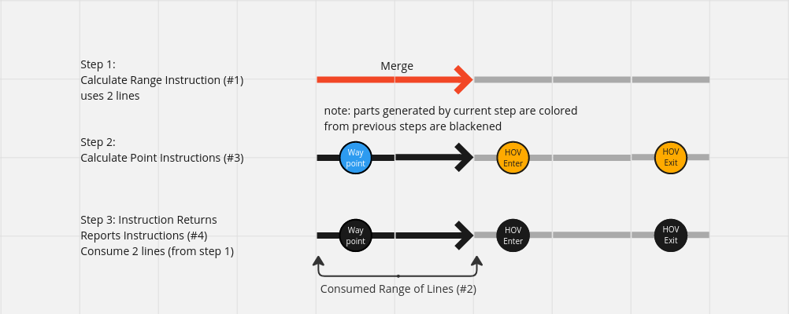
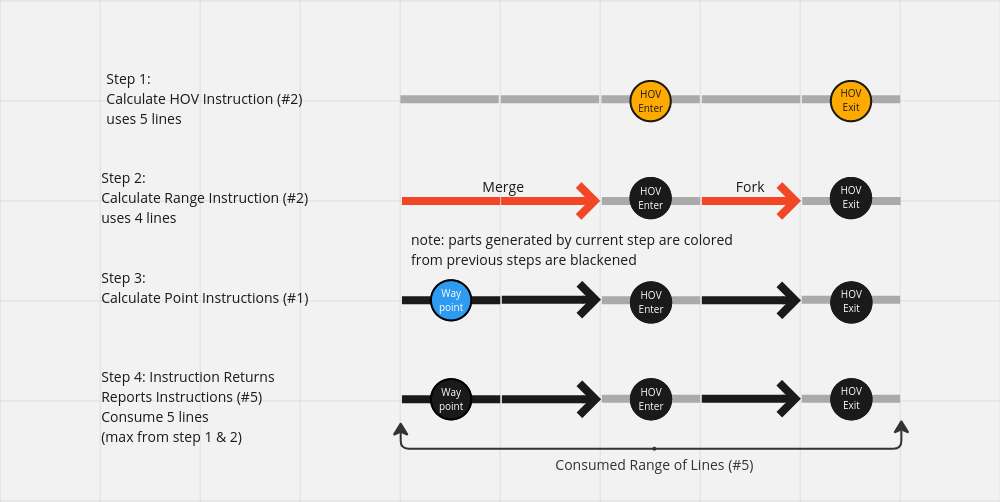

// Copyright (C) 2023 TomTom NV. All rights reserved.

= HOV Situation Handlers Computation Step
:toc:
:icons: font

== Context

Currently, there are only two types of situation handlers, that are used to generate
instructions along the route. They are categorized as into _point_ and _range_.
To understand the difference between two types, it is necessary to look into how the instruction engine
handles generation of instructions.

=== Ranged Handlers For Situations

Ranged handers are the most common handler for situations in the instruction generation.
These handlers 'consume' lines where they generated instructions on.
This prohibits further instructions being generated on the same lines by different ranged handlers.

Example situations: roundabouts, turns at intersections, highway exits, forks, etc...

An exception to this rule are point situation handlers that can generate instruction inside the consumed lines.

=== Point Handlers For Situations

In this kind of situation handlers we generate instructions that are sometimes
on the same lines as situations handled by the ranged handlers.
So we are not allowed to consume the line after instruction generation.
So the same line may contain a single ranged instruction but multiple point instructions.

Currently HOV situations are computed as part of this group.
The problem which arrises from this decision is described later in this document.

Example situations: Tollgates, Waypoints

=== Problem of current computation

HOV situations are somewhat out of the ordinary here.
On the one hand, they describe a concept which represents a situation over a long range and time period (HOV lane),
on the other hand, other instructions in the same range should not be prevented.
This is in contrast to the ranged handlers, which summarize short ranges with single instructions.
While HOV situations could be described as a long range indicating a mode of driving
that is almost orthogonal to our concept of maneuver stretches for the ranged handlers.

For that reason, we need to look ahead for a distance of several miles to detect HOV entry or exit
and generate the HOV instruction a few miles ahead.  +

As result, the line where we generate the HOV instruction lies outside of the increment
dictated by the previously ranged handler.
Originaly point handlers were designed to operate exactly inside that increment,
to what HOV handler doesn't conform.

This currently leads to a situation where we generate instructions outside the range of consumed lines.
For this reason, we also compute and generate the same HOV instruction multiple times.
This is de-duplicated and thus not passed to the client,
but this shows a problem with the current design.

==== Current computation

1. generate at maximum of one instructions per call to InstructionEngine::Generate via the range situation handlers +
(this might extend the initial range of one line)
2. call for every line in the (extended) range the point situation handlers

== Proposed Solution

Introduce a dedicated HOV Situation Handlers computation step before the Ranged Situation Handlers computation.

=== Long Ranged Handlers For Situations

These situation handlers are a mixture of point and range handlers.

Since the HOV situation handler can create instructions that are far ahead of
the currently processed line we need to keep track of how far away it generated that instruction.
Returning from InstructionEngine::Generate will therefor be postponed until the end offset
of last_processed_line, from RunRangedHandlersForSituationsUpTo,
will exceed the last offset of RunLongRangedHandlersForSituations.

The current implementation runs all HOV situation handlers and uses the furthest processed_line
for setting the end of the RunLongRangedHandlersForSituations computation step.
As result, HOV situation handlers are computing situations along range WITHOUT
preventing further instructions in the same range to be generated.

In the end InstructionEngine::Generate consumes the range including the one from the HOV instructions.
This is to make sure the next call to generate DOES NOT produce the same instruction again,
since the line was consumed in the end.

Example situations: HOV (entry / exit)

==== Changed computation

1. generate HOV instructions and save the used range
2. ranged handler run on this range +
(this might extend the initial range)
3. call for every line in the (extended) range the point handlers

=== Expected Consequences

==== Cons:

* multiple consecutive line iteration loops
* The instruction engine will have same bigger increments, +
    since HOV instructions now can consume lines.

==== Pros:

* When an HOV instruction is generated, all lines up to that HOV instruction are consumed.
* As result the next call to instruction engine will not generate the same instruction again.
* This a avoids the need for the instruction increment generator to call
the instruction engine multiple times for same stretch of lines
and to de-duplicate the instructions, afterwards.
* The instruction increment generator keeps the same increment size for its consumers

== Discarded Alternatives
* Introduction of backward line on route iterator and making the HOV handler look backwards. +
  This has the potential to simplify the HOV handler for the current specification. +
  This was addressed by ticket https://jira.tomtomgroup.com/browse/NAV-117682[NAV-117682]
  and the related https://github.com/tomtom-internal/navigation-instruction-engine/pull/581[PR #581].
* Making the HOV handler look backwards without the line_on_route-- operator by using trivial connectivity and some speculation. +
  This seamed not fitting for archiving  the target, as it might create an additional lane ftx access overhead we tried to circumvent in the first place.
* Keeping continuous (maybe faked) lane level route outside the instruction engine +
  For example: A history of visited route lines and their lane segments. +
  This seamed like a viable solution for some time but would have required an even bigger refactoring.
* Making the HOV handler less 'forward-looking' +
  This created to many regressions, and would not adhere to the current specification.
* Giving the IncrementGenerator the possibility to disable HOV computation for some iterations. +
  This looked like polluting the interface of instruction engine with state for really specific task. If we want to keep a state, we probably should strive for a more unified or generic solution.

== Future Work

* Another possible improvement would be to remove the last_process_line field from the output +
    and end_iter from the inputs of point handlers to more accurately communicate +
    that they do not consume lines.
* It is probably possible to achieve further significant improvements +
    in the area of readability and structure by generalizing the current pipeline structure.
