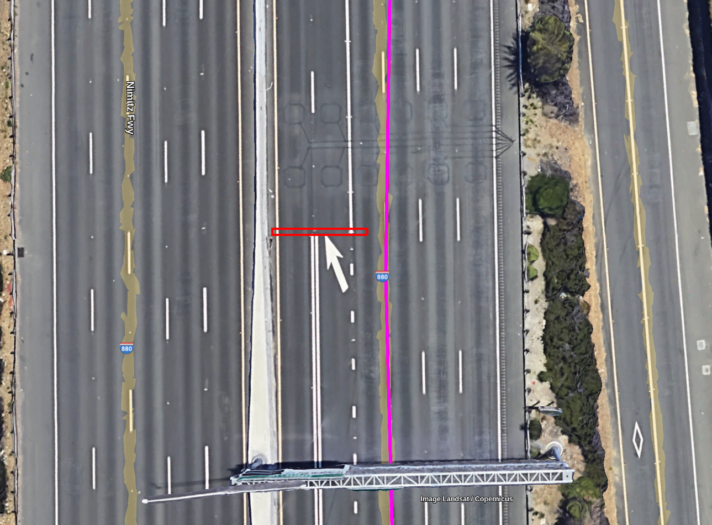

// Copyright (C) 2023 TomTom NV. All rights reserved.
//
// This software is the proprietary copyright of TomTom NV and its subsidiaries and may be
// used for internal evaluation purposes or commercial use strictly subject to separate
// license agreement between you and TomTom NV. If you are the licensee, you are only permitted
// to use this software in accordance with the terms of your license agreement. If you are
// not the licensee, you are not authorized to use this software in any manner and should
// immediately return or destroy it.

= Ignore Tiny Segments for HOV Entries and Exits

== Status

Implemented

== Context

There are situations where two or more dividers change at very much
the same position. In the map these changes are not modelled perfectly
and there is a small overlap where the one divider change has not
happened yet, but the other one has. Consequently we create a tiny
segment where the divider situation does not reflect reality.

One example is the following:

The red rectangle indicates a small segment where all dividers are open.

== Current Implementation

We do not check the length of segments when determining whether
HOV lanes can be entered or exited.

== Problem

We create EnterHOV and ExitHOV instructions where it is not possible to
enter or exit.

== Proposal

Ignore "tiny segments" that supposedly do not reflect the real situation
on the road.

As a threshold for "tiny" we arbitrarily chose 5 meters. No thorough data
analysis has been carried out to determine an exact threshold. Mass tests
were run to verify that we do not ignore valid segments.

== Consequences

* (positive) issue is fixed
