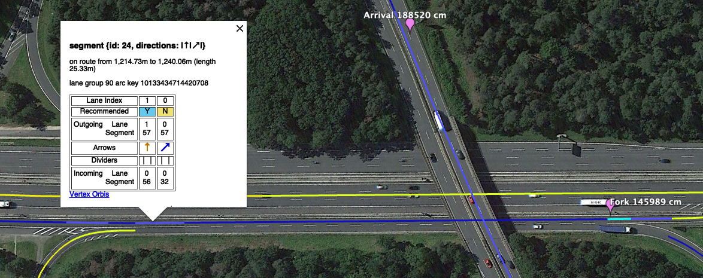
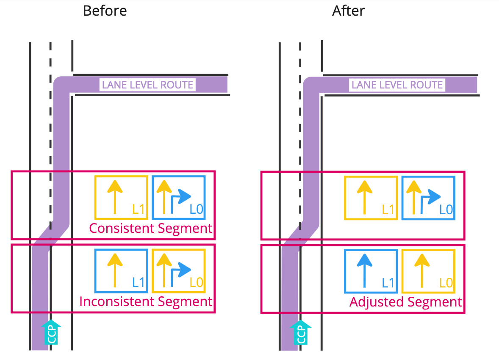

// Copyright (C) 2023 TomTom NV. All rights reserved.

= Propagating Lane Arrows at Forced Changes

== Status

Implemented

== Problem

We have a bug report
https://jira.tomtomgroup.com/browse/NAV-119019[NAV-119019] concerning
lane segments with no recommendations.

This situation contains a forced lane change.  The driver must enter
in the left-hand land, and exit in the right-hand lane.  The
lane-level router will recommend the right-hand lane as early as
possible.  However, for the segment concerned, there is a solid
divider separating the lanes.  Therefore the lane-level router
recommends the left-hand lane in this segment, and the right-hand lane
in the following segment.

The problem is that the "bear right" arrow is the recommended arrow in
both segments, because it has been propagated backwards from the
arrows at the maneuver point.  Since this arrow is only in the
right-hand lane, we have a situation where the recommended arrow is in
a non-recommended lane, and the recommended lane has no recommended
arrow.

== Proposal

During arrow propagation we will detect "inconsistent" lane guidance,
in which there are recommended lanes and recommended arrows but no
recommended lanes with recommended arrows.  If the segment after the
inconsistent segment is consistent, and if there is a divider
crossability change between the segments, we will assume that the
inconsistency is due to this change in divider crossability.

In this situation we will no longer blindly copy the arrows backwards.
Instead we will synthesise a new set of arrows that all go straight.
Any arrow in a lane that is on route (according to the LLR) will be
recommended, others will not be recommended.

Image taken from https://miro.com/app/board/uXjVM7Si2IM=/[this Miro board].

== Consequences

* Some straight, recommended arrows will be placed in lanes that are
  not reachable from the driver's route.  This is considered
  acceptable, since the lane guidance widget will only show those
  recommended arrows if the lane is also recommended, which it
  can't be.
