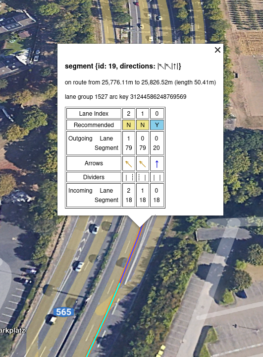
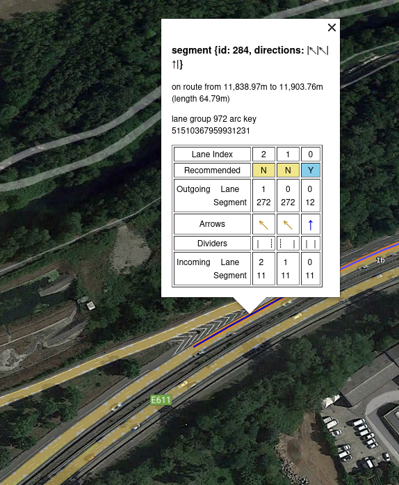
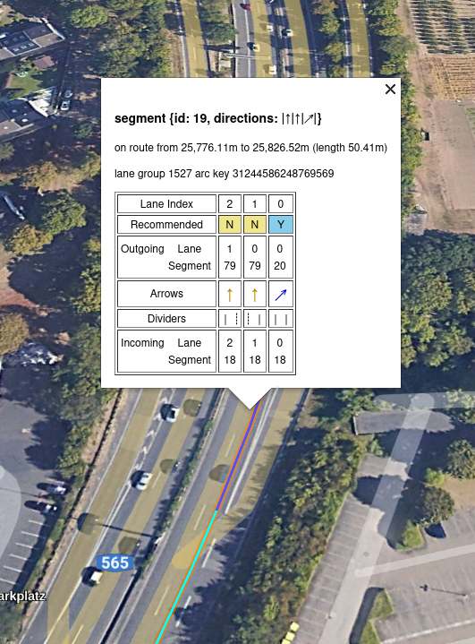
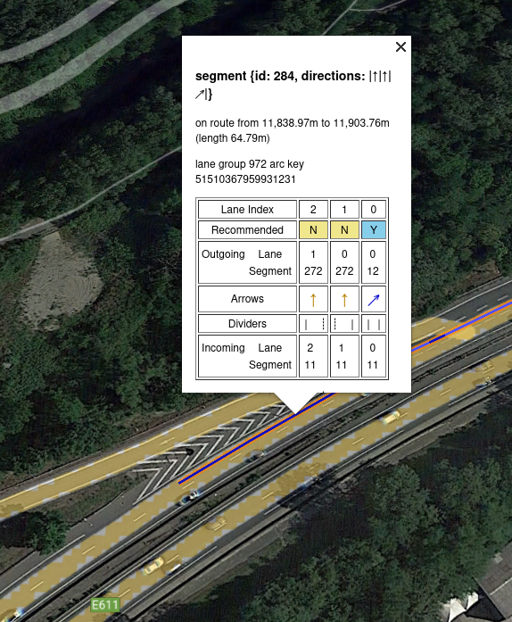
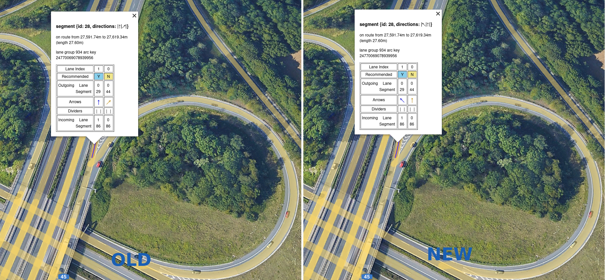

// Copyright (C) 2023 TomTom NV. All rights reserved.
//
// This software is the proprietary copyright of TomTom NV and its subsidiaries and may be
// used for internal evaluation purposes or commercial use strictly subject to separate
// license agreement between you and TomTom NV. If you are the licensee, you are only permitted
// to use this software in accordance with the terms of your license agreement. If you are
// not the licensee, you are not authorized to use this software in any manner and should
// immediately return or destroy it.

= Use instruction direction for arrow angle generation

== Status

Proposed

== Context

During arrows generation for a lane segment, a set of different angles is used. It generates the corresponding
arrows calculating the minimal cost of assigning an angle to a given arrow.

== Current Implementation

Currently, the algorithms assigns the arrows enforcing a different set of arrows for angles that could be assigned
to the same sector (arrow). It does this by assigning a hefty penalty for assigning the same arrow for different
angles.

== Problem

There are situations in which the arrows generated do not align with the angle of the instruction or the road geometry,
and it can lead to confusion to the driver.

In the next example in Bonn, the instruction is to exit the highway to the right
and the arrows generated are based on the angles from road geometry. It successfully creates different arrows for
different routes, but the arrow does not show the instruction to exit to the right.

In the next example in Lyon, the instruction generated at that segment is a fork right, but the arrows generated show
the recommended arrow to be straight, instead of slight right as the instruction.

== Proposal

Use the instruction direction to guide the AngleQuantizer on the required/desired angle to be used in the arrows'
generation. When calculating the minimal cost of the arrow combinations, if the required arrow is not present on the
generated arrows, it will include a penalty; thus forcing the arrows to contain said arrow and aligning with the
instruction in that lane segment.

The angle quantizer will accept an optional with the QuantizedAngle required. In case the angle is not received, it
will still produce the current arrows combination. The current proposal will only affect the result of maneuver
lane segments' (and its propagated lane segments) arrows.

The alignment of the arrows desired is chosen depending on the instruction type, so that the required arrow
corresponds to the situation on the road following the next rules.

[cols="1,1"]
|===
|InstrunctionType | Required Arrows

| Switch Highway +
 Fork +
 EnterHov +
 ExitHov +
 Exit
| SlightRight +
 SlightLeft

| Merge +
 Roundabout +
 ExitRoundabout
| Straight

| Turn +
 Obligatory Turn
| UTurn/Back +
 Sharp Left +
 Left +
 Slight Left +
 Straight +
 Slight Right +
 Right +
 Sharp Right

| Remaining instructions
| Straight

|===

It is important to note that the penalty for not having the forced angle shall be
smaller than the already implemented penalty for assigning the same arrow for different angles.

== Consequences

The arrows generated are consistent with the direction of the arrow of the instruction in all scenarios. The positive
aspect of this is that the driver always receives a corresponding arrow that matches the instruction direction. Here is
shown the same situations in Bonn and Lyon.

Unfortunately, this consistency also comes with some drawbacks that need to be addressed. In this example in Dortmund,
the instruction is a fork left, so the recommended arrow generated is slight left instead of the old arrow generated
using simple arrow generation.

