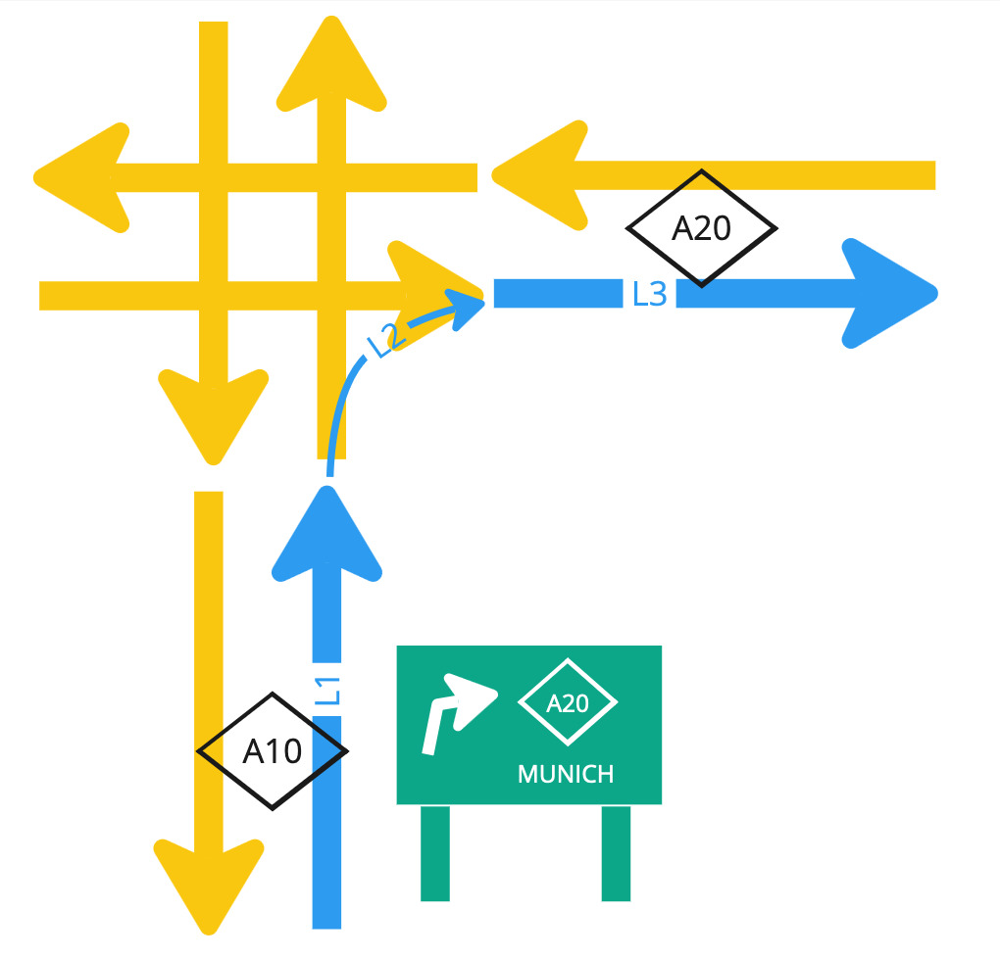

// Copyright (C) 2023 TomTom NV. All rights reserved.
//
// This software is the proprietary copyright of TomTom NV and its subsidiaries and may be
// used for internal evaluation purposes or commercial use strictly subject to separate
// license agreement between you and TomTom NV. If you are the licensee, you are only permitted
// to use this software in accordance with the terms of your license agreement. If you are
// not the licensee, you are not authorized to use this software in any manner and should
// immediately return or destroy it.

= Origin of the Country and State Code for Road Shields

== Status

Implemented.

== Background

The country and state codes for road shields is a three and two character code
respectively that are used to identify the country and state of a road shield
in order to retrieve the correct shield image.  This is specific to HCP3 maps
where the icons are retrieved directly from the map data by the client by
lookup into the DB table and retrieval of roadNumberDisplayClass.  In contrast,
in TomTom maps the icons are retrieved from the server by the client using a
dedicated API call.  The country and state code is not used in TomTom maps, but
rather a "reference" is used.  Nevertheless the country and state code of the
road shield are provided along for client use.

The road shield comes as part of the previous or next road information.  For
next road information, whenever the signpost for the maneuver exists, the
road shield is taken from the directional information in the signpost,
rather than the maneuver outgoing road.

At times due to map shortcomings country or state code can not be retrieved.
This results in HCP3 customer tickets like NAV-118634 and NAV-119168.
Such shortcomings have been discovered so far in the existing HCP3 Europe
and North America maps.  Their essence and effect are described below.

== The problem

:genesis_update_region: https://nds.tomtomgroup.com/webviewer/45357/?action=FeatureInfo%3Flang%3DNULL%26poiCategoryCollectionId%3D0%26iconCollectionId%3D0%26productId%3D17771286%26updateRegionId%3D4234%26disputantId%3D0%26theme%3DDEFAULT%26routingService%3D0%26routeType%3DTIME_WITH_PENALTY%26vehicleType%3DPERSONAL_CAR%26labeling%3Dtrue%26icons%3Dtrue&zoom=17.999999999983554&lat=51.39703&lon=6.17164&layers=BFFFFFFFTTF0TT&&poiCategoryCollectionId=0&iconCollectionId=0&disputantId=0&lang=NULL&theme=DEFAULT&routingService=0&routeType=TIME_WITH_PENALTY&vehicleType=PERSONAL_CAR&labeling=true&icons=true[update region]

:genesis_metadata_region: https://nds.tomtomgroup.com/webviewer/45357/?action=FeatureInfo%3Flang%3DNULL%26poiCategoryCollectionId%3D0%26iconCollectionId%3D0%26productId%3D17771286%26updateRegionId%3D4234%26metadataRegionId%3D0%26disputantId%3D0%26theme%3DDEFAULT%26routingService%3D0%26routeType%3DTIME_WITH_PENALTY%26vehicleType%3DPERSONAL_CAR%26labeling%3Dtrue%26icons%3Dtrue&zoom=17.999999999983554&lat=51.39703&lon=6.1721&layers=BFFFFFFFTTF0TT&&poiCategoryCollectionId=0&iconCollectionId=0&disputantId=0&lang=NULL&theme=DEFAULT&routingService=0&routeType=TIME_WITH_PENALTY&vehicleType=PERSONAL_CAR&labeling=true&icons=true[metadata region]

:hcp3_update_region: https://nds.tomtomgroup.com/webviewer/45445/?action=FeatureInfo%3Flang%3DNULL%26poiCategoryCollectionId%3D0%26iconCollectionId%3D0%26productId%3D1010%26updateRegionId%3D2149%26disputantId%3D0%26theme%3DDEFAULT%26routingService%3D0%26routeType%3DTIME_WITH_PENALTY%26vehicleType%3DPERSONAL_CAR%26labeling%3Dtrue%26icons%3Dtrue&zoom=17.999999999983554&lat=43.67155&lon=7.20421&layers=FFFBFFFFFFF000FFFTTF0000TT&&poiCategoryCollectionId=0&iconCollectionId=0&disputantId=0&lang=NULL&theme=DEFAULT&routingService=0&routeType=TIME_WITH_PENALTY&vehicleType=PERSONAL_CAR&labeling=true&icons=true[update region]

:hcp3_road_link_named_object: https://nds.tomtomgroup.com/webviewer/45410/?action=FeatureInfo%3Flang%3DNULL%26poiCategoryCollectionId%3D0%26iconCollectionId%3D0%26productId%3D1110%26updateRegionId%3D7150%26namedObjectId%3D34317%26panTo%3Dtrue%26zoomTo%3Dtrue%26disputantId%3D0%26theme%3DDEFAULT%26routingService%3D0%26routeType%3DTIME_WITH_PENALTY%26vehicleType%3DPERSONAL_CAR%26labeling%3Dtrue%26icons%3Dtrue&zoom=12.670253010612493&lat=41.28274&lon=-96.059&layers=FFFBFFFFFFF000FFFTTF0000TT&&poiCategoryCollectionId=0&iconCollectionId=0&disputantId=0&lang=NULL&theme=DEFAULT&routingService=0&routeType=TIME_WITH_PENALTY&vehicleType=PERSONAL_CAR&labeling=true&icons=true[road link named object]

:hcp3_signpost_named_object: https://nds.tomtomgroup.com/webviewer/45410/?action=FeatureInfo%3Flang%3DNULL%26poiCategoryCollectionId%3D0%26iconCollectionId%3D0%26productId%3D1110%26updateRegionId%3D7150%26namedObjectId%3D134220238%26panTo%3Dtrue%26zoomTo%3Dtrue%26disputantId%3D0%26theme%3DDEFAULT%26routingService%3D0%26routeType%3DTIME_WITH_PENALTY%26vehicleType%3DPERSONAL_CAR%26labeling%3Dtrue%26icons%3Dtrue&zoom=17.999999999852168&lat=41.31958&lon=-96.06966&layers=FFFBFFFFFFF000FFFTTF0000TT&&poiCategoryCollectionId=0&iconCollectionId=0&disputantId=0&lang=NULL&theme=DEFAULT&routingService=0&routeType=TIME_WITH_PENALTY&vehicleType=PERSONAL_CAR&labeling=true&icons=true[signpost named object]

:hcp3_mismatching_arc: https://nds.tomtomgroup.com/webviewer/45410/?action=FeatureInfo%3Flang%3DNULL%26poiCategoryCollectionId%3D0%26iconCollectionId%3D0%26mode%3DNEAREST_LINK%26lon%3D-10694177.68261%26lat%3D5059786.3728098%26scale%3D2132.72958416507%26disputantId%3D0%26theme%3DDEFAULT%26routingService%3D0%26routeType%3DTIME_WITH_PENALTY%26vehicleType%3DPERSONAL_CAR%26labeling%3Dtrue%26icons%3Dtrue&zoom=17.999999999852168&lat=41.32145&lon=-96.06832&layers=FFFBFFFFFFF000FFFTTF0000TT&&poiCategoryCollectionId=0&iconCollectionId=0&disputantId=0&lang=NULL&theme=DEFAULT&routingService=0&routeType=TIME_WITH_PENALTY&vehicleType=PERSONAL_CAR&labeling=true&icons=true[cannot be matched]

:genesis_signpost_named_object: https://nds.tomtomgroup.com/webviewer/45357/?action=FeatureInfo%3Flang%3DNULL%26poiCategoryCollectionId%3D0%26iconCollectionId%3D0%26productId%3D17705750%26updateRegionId%3D4061%26namedObjectId%3D124082434%26panTo%3Dtrue%26zoomTo%3Dtrue%26disputantId%3D0%26theme%3DDEFAULT%26routingService%3D0%26routeType%3DTIME_WITH_PENALTY%26vehicleType%3DPERSONAL_CAR%26labeling%3Dtrue%26icons%3Dtrue&zoom=17.999999999852168&lat=41.31954&lon=-96.07025&layers=BFFFFFFFTTF0TT&&poiCategoryCollectionId=0&iconCollectionId=0&disputantId=0&lang=NULL&theme=DEFAULT&routingService=0&routeType=TIME_WITH_PENALTY&vehicleType=PERSONAL_CAR&labeling=true&icons=true[signpost named object]

:genesis_matching_arc: https://nds.tomtomgroup.com/webviewer/45357/?action=FeatureInfo%3Flang%3DNULL%26poiCategoryCollectionId%3D0%26iconCollectionId%3D0%26mode%3DNEAREST_LINK%26lon%3D-10694274.758272%26lat%3D5059901.1588565%26scale%3D4265.45916833014%26disputantId%3D0%26theme%3DDEFAULT%26routingService%3D0%26routeType%3DTIME_WITH_PENALTY%26vehicleType%3DPERSONAL_CAR%26labeling%3Dtrue%26icons%3Dtrue&zoom=16.999999999852168&lat=41.32288&lon=-96.06664&layers=BFFFFFFFTTF0TT&&poiCategoryCollectionId=0&iconCollectionId=0&disputantId=0&lang=NULL&theme=DEFAULT&routingService=0&routeType=TIME_WITH_PENALTY&vehicleType=PERSONAL_CAR&labeling=true&icons=true[matching_arc]

In case the road shield information is taken from the signpost directional
information (i.e. the signpost exists and contains directional information),
the country and state code of the road shield is currently retrieved as
follows:

* The country code is resolved from the signpost directional name named object.
The lookup happens as follows: the named object points to an
{genesis_update_region}; the update region links to a
{genesis_metadata_region}, from which the country code (and the sub-country
code, a.k.a state code) can be retrieved.  The problem begins when an
{hcp3_update_region} links to several metadata regions, for example France,
Monaco, and Italy.  In such case, `map_data.GetCountryCode(namedObject)`
reverts to object "contained in" relations which should normally exist for
all the named objects, however for HCP3 exists only for road link named objects
{hcp3_road_link_named_object}, but not for signpost directional
information named objects.  And in such case the call to `GetCountryCode()`
will return an empty country code.

* The state (or sub-country) code is retrieved from an arc that has the same
road name/number as contained in the signpost directional information named
object. For example this {genesis_signpost_named_object} can be paired to a
{genesis_matching_arc}. However due to the nature of the raw data some maps
put the road number with or without cardinal information in the signpost or
the arc, creating a mismatch, which prevents `map_data.AnyArcOfStreet(name_ref)`
from finding such arc.  The result is a failure which leads to an empty state
code.  An example in the HCP3 North America is a directional information road
number "NE-133" {hcp3_signpost_named_object}, whereas the arc we would expect
to be returned {hcp3_mismatching_arc}, since its road number is "NE-133 North",
i.e. has a suffix "North".

The reasons the country and the state codes are retrieved differently are
historical.  When the functionality was introduced in the Instruction Engine
the data access API had no way to retrieve state code by named object.  With
time retrieval of country code by named object has evolved to be more
sophisticated, and had no equivalent functionality for state codes.  Also
perhaps the success rate of state code retrieval by locating an arc was higher
than relying on direct lookup by the named object metadata region.

*Note:* it is important to note that at the time of writing of this document
MapScape are working on introducing proper "contained in" relations to the
signpost named objects.  The work however will not complete on time and a code
change is required for the official software release for HCP3.

== Possible solutions

=== First approach: Update `AnyArcOfStreet` to ignore the cardinal information (suffix) in the road number

This solution would require a change in the search algorithm to ignore the
cardinal information in the road.  The problem with this approach is that it
solves the problem partially (only for state codes).  Calling a similar
algorithm also for country code would have caused some regressions with TomTom
maps, plus introduced higher runtime complexity, compared to O(1) complexity of
fetching either code by the named object.

=== Second approach: Use the country and sub-country code from the road link where the signpost is located

The simple solution that would work is to where no country and sub-country code
are present already, take them from the arc where the signpost is located.
Since the "contained in" relations are correct for road links in any map we
have so far encountered, this method would always return a valid value.

In the following diagram the signpost is located on arc L1.  The signpost says
it is going towards the A20.  The appropriate country and state code to use is
the code where the A20 itself is located, L3.  However, if there is no such
regional information on that arc, we will fall back to retrieving this
information from the arc where the signpost is located, L1.  This is
appropriate for directional information like "A20", since the signpost is
likely to be in the same region as the destination road.  It is not appropriate
for "towards" information like "Munich", since the destination will frequently
be far away in a different region.

(Diagram taken from https://miro.com/app/board/uXjVMrDsE9Q=/[this Miro board].

However, some cases can still exist where the road pointed in the directional
information would be in a different region, therefore this approach is not
100% safe in terms of correctness.

=== Accepted approach: future-proof three-step fallback-based hybrid approach

The following pseudo-code is proposed:

. For country code:
.. Retrieve the country code by signpost directional information named object
metadata region lookup.
.. If failed, try to locate a matching arc according to the signpost
directional information.
.. If failed, fetch the country code from the arc where the signpost is
located.
. For state code:
.. (*) Retrieve the sub-country code by signpost directional information named
object metadata region lookup.
.. If failed, try to locate a matching arc according to the signpost
directional information.
.. If failed, fetch the sub-country code from the arc where the signpost is
located.

(*) As mentioned earlier the data access API does not contain a method to
retrieve the sub-country code by a named object.  Therefore, at the current
moment since the fix is to be delivered quickly the step 2a will be skipped and
2b will be directly invoked (for state code only).  In parallel relevant work
for the data access team is identified and will be submitted to implement such
API method, and then both country and state codes can be aligned, and expected
to work once the HCP3 maps will contain the proper "contained in" relations.

== Mass test analysis

Mass tests are showing big improvement not only on HCP3 maps but also on TomTom
(Orbis and Genesis) maps both in the US and Europe - seems some map
inconsistencies exist also there.  The occurrences of maneuver road shields in
Europe not having a country code, or maneuver road shields in North America not
having a state code, have been reduced to a minimum. Note that it is still rare
for North American road shields to have a country code, but in practice this
doesn't cause significant problems.

The original tickets NAV-118634 and NAV-119168 have been fixed too with this
approach.

== Consequences

* Consistency between country and sub-country codes (same approach in the
fallback will be taken to retrieve both).  However this will be true only
once the step 2a will be put in place.
* More complex code with more code paths and possibilities for output.
