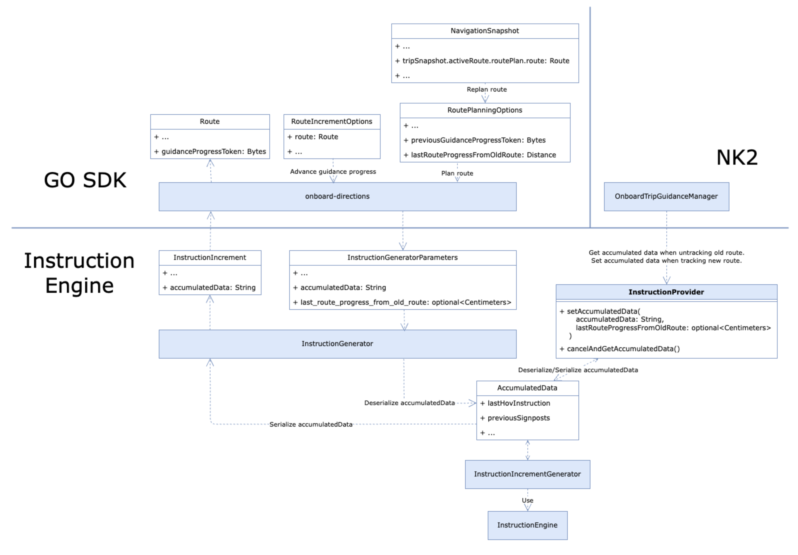

// Copyright (C) 2023 TomTom NV. All rights reserved.
//
// This software is the proprietary copyright of TomTom NV and its subsidiaries and may be
// used for internal evaluation purposes or commercial use strictly subject to separate
// license agreement between you and TomTom NV. If you are the licensee, you are only permitted
// to use this software in accordance with the terms of your license agreement. If you are
// not the licensee, you are not authorized to use this software in any manner and should
// immediately return or destroy it.

= Store accumulated data in instruction engine client

== Status

Accepted

== Context

Following xref:./2023-10-05-accumulated-data-management.adoc[Accumulated data management] design decision,
the proposal is the Alternative #2 - Store accumulated data in the instruction engine client. This ADR discusses the solution in detail.

== Current Implementation

=== NK2
Instruction provider is kept in NK2 OnboardTripGuidanceManager.

The instruction provider is alive as long as the navigated route. When the navigated route is changed, the instruction provider is recreated.

It uses another thread to generate instructions for the navigated route.

=== GO SDK
Instruction generator is a stack object. It is created when it needs to generate instructions for a route and destroyed when it finishes.

Instructions can be generated incrementally. It uses the same thread as the caller.

Unlike NK2, which generates instructions only for the navigated route, GO SDK needs to generate instructions for all planned routes.

== Problem
Currently, there is no such mechanism to store accumulated data in the instruction engine client.
In order to store the accumulated data in the instruction engine client, we need to answer the following questions:

- The format of accumulated data stored in the instruction engine client.
- How to manage the lifecycle of the accumulated data?
- How to carry the accumulated data from the previous navigated route to the new routes?
- How to hide the implementation detail of accumulated data from the instruction engine client?

== Proposal
Store accumulated data by serialized binary data

The accumulated data is stored in a serialized binary data. It can be a string.

The instruction engine client stores the serialized binary data. It doesn't know the implementation details of the accumulated data.

The instruction engine will serialize the accumulated data and pass it to the instruction engine client when the instruction generation is finished.

The instruction engine will deserialize the binary data from instruction generation request.

=== NK2
NK2 OnboardTripGuidanceManager keeps an instance of the binary data.

When the navigated route is changed and the new navigated route is close to the old one, OnboardTripGuidanceManager gets the accumulated data from instruction provider and set it to the new instruction provider.
And the last route progress from the old route is also passed to instruction provider for adjusting the route offsets in the accumulated data.

=== GO SDK
Introduce a new class GuidanceProgressToken to store the serialized binary data.
GuidanceProgressToken will be added to Route object and RoutePlanningOptions.

When instruction generation finishes, the serialized binary data will be passed to GO SDK and stored in GuidanceProgressToken.

When the route is being replanning, the GuidanceProgressToken is carried from the route in NavigationSnapshot to the new RoutePlanningOptions.

When advancing guidance progress, the GuidanceProgressToken can be obtained from the Route object.

Risk:

Serialization/Deserialization happen for each incremental guidance generation. If the route and the distance between instructions is very long (> 1000km), and road attributes change very frequently, it may cause some performance issues.

However, the above situation can hardly happen. Even it happens, it shouldn't be noticeable because:

- The worst case only happens in the last parts of route. Before the driver reaches there, the computation should have been completed.
- The computation runs in background thread.
- The data size isn't actually very large. In the worst case, the data is still less than 1MB.

== Another alternative Considered

The accumulated data is stored in a heap object.

The instruction engine client only stores the reference of the heap object. It doesn't know the implementation details of the heap object.

The instruction engine client is responsible for managing the lifecycle of the heap object. But the creation and destruction of the heap object are still in the instruction engine.

The reference of the heap object will be passed to instruction engine.

=== NK2
NK2 OnboardTripGuidanceManager keeps a unique_ptr of the heap object. The raw pointer is passed to instruction provider before instruction generation starts.

When the navigated route is changed, the unique_ptr is reset and a new heap object is created.
But if the new navigated route is close to the old one, the unique_ptr will not be reset and the last route progress from the old route is passed to instruction provider for adjusting the route offsets in the accumulated data.

The unique_ptr is touched only when instruction generation is not running.

=== GO SDK
Introduce a new class GuidanceProgressToken to store the reference to the heap object. The heap object will be destroyed when GuidanceProgressToken is destroyed by GC.
GuidanceProgressToken will be added to Route object and RoutePlanningOptions.

When onboard-directions calculate instructions for a route, the heap object is created and the reference is passed to the instruction engine. When instruction generation finishes, the reference to the heap object will be passed to GO SDK and stored in GuidanceProgressToken.

When the route is being replanning, the GuidanceProgressToken is carried from the route in NavigationSnapshot to the new RoutePlanningOptions.

When advancing guidance progress, the GuidanceProgressToken can be obtained from the Route object.

Risks:

- Lifecycle management could be hard. Route and RoutePlanningOptions could be destroyed by GC. That makes us hard to know when the heap object will be destroyed.
- It could happen that the heap object is destroyed when the instruction engine is still using it. We need to carefully handle this.
- Asymmetric heap object creation/destruction is handled manually.

== Consequences

After the proposal is implemented, the scenarios mentioned in xref:./2023-10-05-accumulated-data-management.adoc[Accumulated data management] can be addressed.
Situation handlers can define their own accumulated data. They only need to implement the serialization/deserialization logic. The data will be stored in instruction engine client and given to situation handlers when needed.
