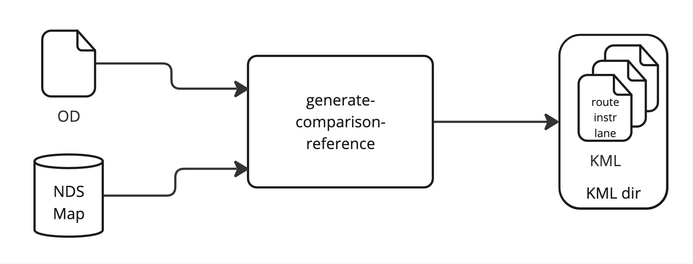
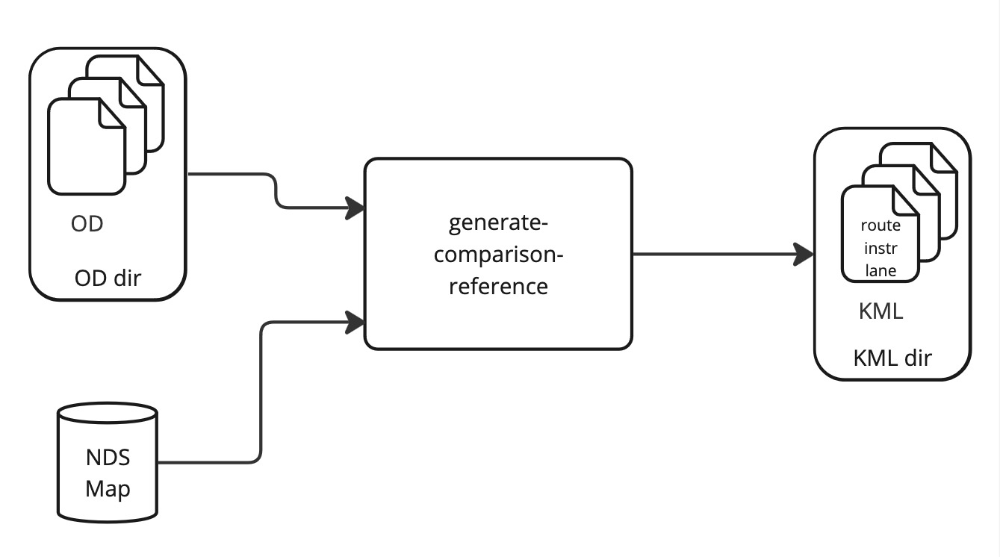
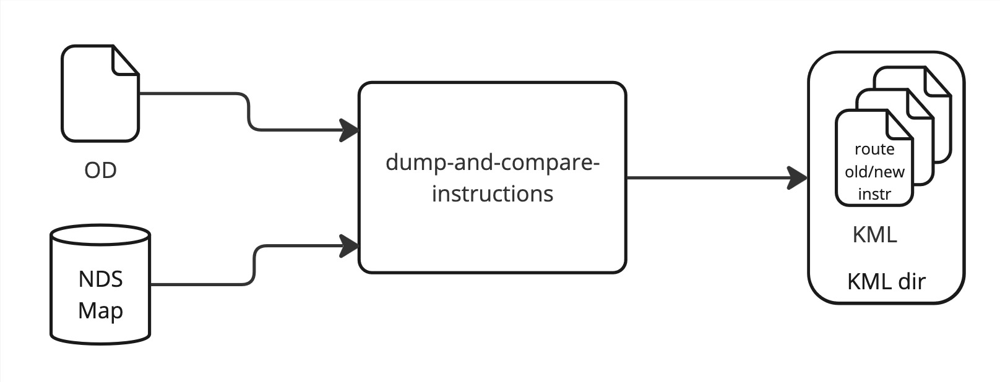
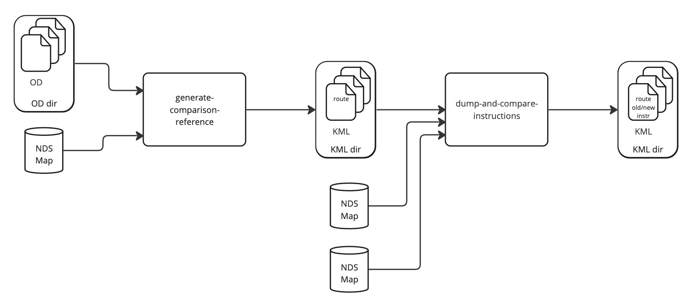
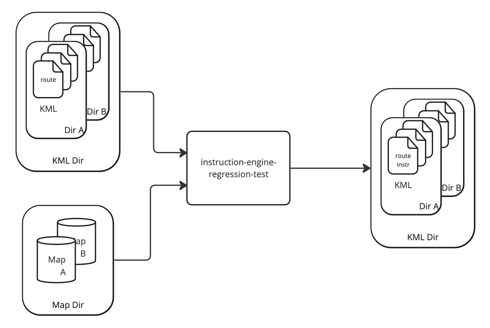
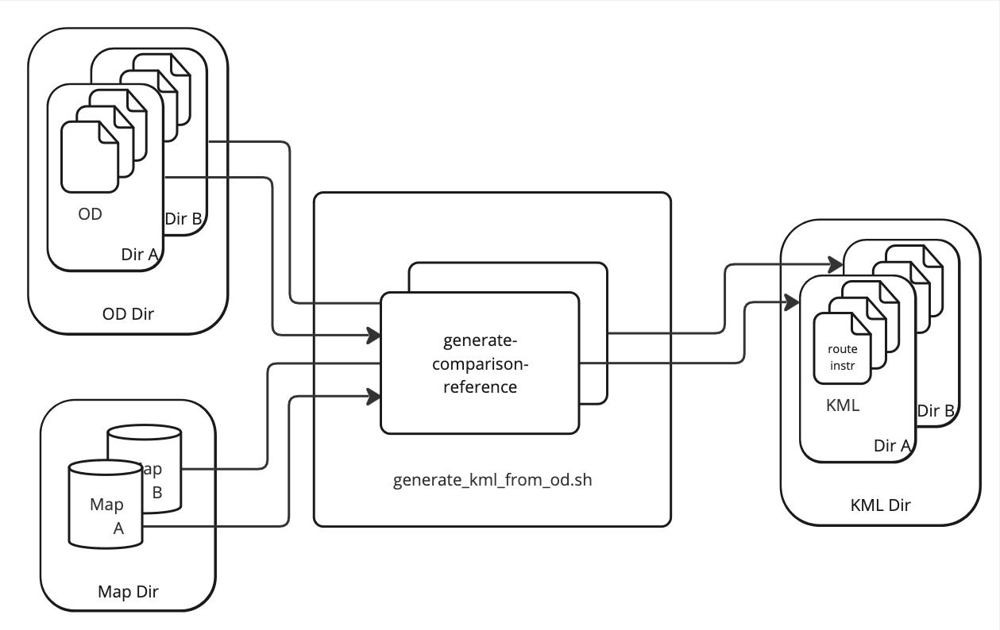
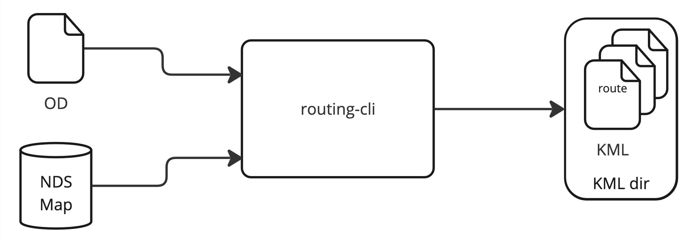
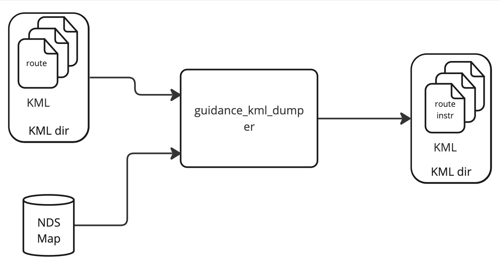
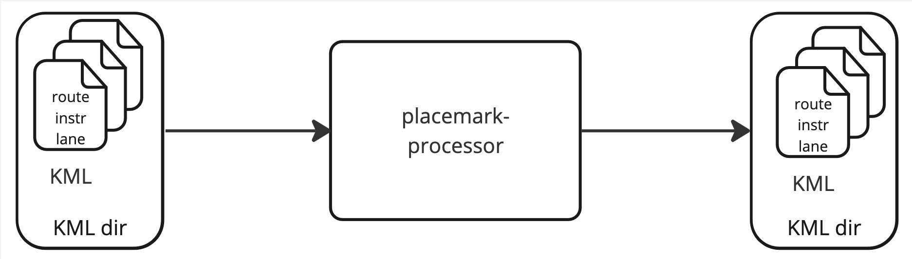

// Copyright (C) 2018 TomTom NV. All rights reserved.

= Common Configuration of Quality Tools

== Status

Implemented

== Background

The Guidance Quality Tools are a collection of Python modules designed
for analysing the behaviour of the instruction engine in realistic
scenarios.  The tools are used both for investigating individual
issues, and for testing large numbers of routes and collecting
statistics.  Various tools are built around specific workflows
according to the requirements of Guidance engineers.

The tools are also used as quality gateways in automated testing.  In
particular, they form the core implementation of regression tests,
used in continuous integration (CI).  They are also automatically used
to gather quality statistics as each new Orbis map arrives.  The
resulting statistics are used to decide when the map is ready for use.

As a quality gateway, it is critical that the results are correct and
trustworthy.  This requires that the quality tools themselves have
their own automated tests run in CI.  It also requires a clean design
with clear separation of concerns, to make it harder to introduce
subtle bugs.

We should recognise that there is a conflict between on the one hand
the need for engineering tools that rapidly evolve around the
requirements of engineers in their day-to-day work, and on the other
hand well-tested, reliable, consistent, predictable quality gateway
benchmarks.

This document describes a design that can improve the testing and
design of the quality tools, while at the same time improving their
adaptability to new engineering requirements.  The design focuses on
the way engineers specify inputs and outputs to the tools.

== Survey of the Tools

Here I describe a selection of the tools most relevant to our work as
engineers.  There are some tools not described in detail, but these
are all similar to other tools.  For each, I focus on the inputs and
outputs, since this is the area I would like to streamline.

Diagrams taken from https://miro.com/app/board/uXjVNGffqnY=/[this Miro
board].

=== File Types

To understand the operation of the tools, the first thing to bear in
mind is the purpose and contents of the files involved.

==== OD Pairs

An OD pairs file defines a number of routes by their Origin and
Destination coordinates.  Each route is also given an identifier,
often human-readable.  There is also a departure time, although this
is rarely relevant for Guidance purposes.

This file format was designed around the requirements of Routing
"smoke tests" for NavKit 1.  It is commonly used by Routing tools, but
is not used by third-party tools.

There are a number of standard route sets used for testing in
Guidance:

* A set of a few thousand curated "smoke test" routes inherited from
  NavKit 1, one OD pairs file each for regions such as Europe and
  North America
* A set of a million or so randomly-selected anonymised customer
  routes, one OD pairs file for each country

==== KML

KML, short for "Keyhole Markup Language", is a standard for
representing geographical information in an XML file.  It is used by
many third-party tools, notably Google Earth and the OpenLayers
toolkit.  It is used to represent arbitrary geometrical information to
be superimposed on a map, and includes the ability to specify colour,
line width etc.  It also allows giving a "description" to each
geometric object, which can be arbitrary HTML, and which will appear
in a popup bubble when clicked.  Finally, arbitrary structured data
can be attached to each object, usually invisible to GUI tools.

The Quality Tools use KML as both input and output.  We use KML as a
container.  Each tool reads its relevant input out of one part of the
KML, and writes its output as a new part of the KML.  For example when
comparing two different instruction engine versions on the same route,
we run a tool that reads the route out of the KML and adds
instructions.  By running the same tool twice, we can end up with a
single file that contains the route and two different sets of
instructions.  A third tool can then read the two sets of instructions
and detect the differences.

The following categories of information stored in KML files are
relevant here:

* Route Origin and Destination
* Route Polyline
* Arc Keys for the continuous sequence of links that make up the route
* Instructions, the output of the instruction engine, stored as
  structured data
* Lane Segments, the output of the lane guidance builder, stored as
  structured data
* Comparison, the result of comparing two related Instructions or Lane
  Segments

=== generate-comparison-reference

This tool is a general-purpose tool for running the instruction
engine.  It allows dumping data into the KML in various "modes":
`polyline`, `arc`, `instruction`, `laneguidance`, and `both` which
will dump both instructions and lane guidance at the same time.  This
makes it quite flexible.

The basic usage produces a set of KML files, one for each route, from
an OD pair file:

It is also able to process any number of OD pairs files in a single
directory at once:

An important common usage is for reproducing customer bug reports on a
single route.  For this case engineers manually construct an OD pairs
file with that one route and use the tool as normal.

=== dump-and-compare-instructions

This is designed for comparing instructions produced by two different
versions of the instruction engine, and is commonly used for testing
code changes before committing them.  It runs the instruction engine
twice, accumulating two different sets of instructions in each KML
file, and then runs more tools to compare the two instruction sets and
generate statistics.  This same flow is also useful for running the
same instruction engine version on two different maps, to compare the
effect of the map data on instruction generation.

Often it is useful to compare multiple OD pairs files of routes all at
once.  This tool only accepts a single OD pairs file, but the effect
can be achieved by using `generate-comparison-reference` first in
`polyline` mode, and using these KML files as the input.

=== Regression Tests

These tests are our first line of defense against accidental
regressions introduced by code changes.  We have a fairly small
selection of routes, and the "golden set" of instructions is stored in
KML data and checked into the instruction engine repository.  As part
of the usual build process, locally and in CI, the instructions are
regenerated and compared against the stored copy.  Any changes are
flagged as a build failure.

If the responsible engineer is sure the changes are desirable, they
re-run the build with an additional flag that updates the guidance
data.  In this case the results are stored as the new golden copy.
These KML changes then form part of the pull request and are reviewed
along with the code changes.

In case an engineer wants to add or modify the routes themselves there
is yet a third way of running the regression tests, in which the
golden copies are regenerated from the original OD files (also checked
into the repository).  This goes further than just updating the
guidance data, in that the routes themselves are also regenerated.

The regression tests differ from the previous two tools in that they
cannot use complete maps, which are too large for routine development.
Instead they use stripped-down maps of only a single update region.
However, one region is not enough to cover all important Guidance
features.  Therefore there are several maps that must be used.  To
organise the routes and the maps, there is a directory of maps, a
directory of OD pairs files, and a directory of KML files.  Within the
OD pairs and KML directories, there are subdirectories for each map.

There are two regression test scripts, one each for instructions and
lane guidance, which share a common implementation.  To run or update
the regression tests, the inputs are the KML files and the maps, and
the output is another directory of sorted KML files.

To regenerate regression test routes, a different script is used,
`generate_kml_from_od.sh`.  This loops over each map directory and
runs `generate-comparison-reference`.

=== Implementation

All of these tools are built out of three basic components:

* `routing-cli`, which builds KML files including polyline and/or arcs
  out of KML files.footnote:[In fact `routing-cli` uses a JSON
  representation of the input routes, and our tools convert OD pairs
  files to JSON files first.  However this is not relevant to this
  discussion.]
* `guidance_kml_dumper`, which takes KML files with route arcs as
  input, runs the instruction engine, and populates the KML file with
  instructions or lane guidance data.
* `placemark-processor`, actually a large collection of utilities for
  manipulating the data in KML files for analysis or annotation.

The inputs and outputs are shown below:

Importantly, these tools are constrained in the types of input they
can accept.  The `routing-cli` can only process one OD pairs file at a
time.  Tools that handle multiple OD pairs files must loop over the
files and run `routing-cli` separately for each one.  Similarly, the
`guidance_kml_dumper` can only process one map at a time.  Tools that
handle multiple maps must loop over the maps and run
`guidance_kml_dumper` separately for each one.  The
`placemark-processor` tools, meanwhile, can always operate over the
entire dataset in one run.  So all three of these have different modes
of invocation.

== Points Of Improvement

There are several aspects to this that can be improved.

=== Shared Loop Infrastructure

As noted, it is necessary for various Quality Tools to run loops so
that they can invoke other tools.  This has resulted in duplicated
code as each tool implements its own loops.  This in turn requires
extra testing to fully cover all the possible modes of invocations of
complex tools.

It would be advantageous to separate this infrastructure out into a
separate unit that can be tested on its own.  We can then simplify the
integration testing of the entire tools by only testing the simplest
mode of operation.

=== Common User Interface

All of these tools share similar command-line arguments for
configuring their inputs.  However, there is no mechanism to enforce
standardisation, using the same argument to control the same
behaviour.

In addition to learning potential quirks of each tool's command line
arguments, engineers must also hold a mental model of which tools have
which capabilities.  This is becoming increasingly complex as other
engineers add features to support their own workflows.

=== Shared Feature Set

For example, `generate-comparison-reference` directly supports a
directory of OD pairs files as input, whereas
`dump-and-compare-instructions` does not.  There is no technical
reason for this.  Rather no engineers found a need for this use case -
or, if they did, the solution of running
`generate-comparison-reference` was available and good enough.  The
result is a slightly more confusing and inefficient workflow, but not
to the point that it's worth anyone's time to implement the missing
feature.

Meanwhile, neither of those tools support multiple maps as input, even
though there are cases where this would be quite convenient.  Again,
there are workarounds available, and thus not enough business value to
justify adding more features.

If these features were separated into a shared implementation, the
missing features could be filled in "for free".  This would also allow
building an aggregate business case for currently unimplemented
features.  In particular, it would be nice to have support for a
single route defined on the command line by Origin and Destination
coordinates https://jira.tomtomgroup.com/browse/NAV-91111[NAV-91111].

== Decision

We will implement a separate class, `RouteSet`, which will be shared
by all these tools.

It will have the following features:

=== Command Line Argument

A single function will add all the possible command line arguments for
controlling input maps, input OD pairs files, input KML directories,
and output KML directories.  This will give all these commands the
same command line interface.

=== Iteration over OD pairs files

The class will provide an iterator over OD pairs files.  When invoking
an external program such as `routing-cli`, the implementation can use
this iterator to control the iteration, regardless of whether the user
asked for one OD pairs file or many.  The iterator will also provide
access to the relevant map configuration.

=== Iteration over maps

The class will provide an iterator over maps.  When invoking an
external program such as `guidance_kml_dumper`, the implementation can
use this iterator to control the iteration, regardless of whether the
user asked for one map or many.

The iterator will also provide access to another `RouteSet` object
limited to only that map.  This will allow further iteration over OD
pairs files, allowing `routing-cli` to be called as well.

== Consequences

* Command line arguments might not be equally intuitive for all tools.
* Additional features will be introduced to tools that may not often
  be used.
