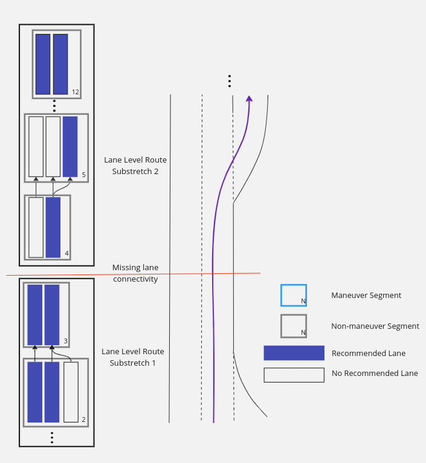
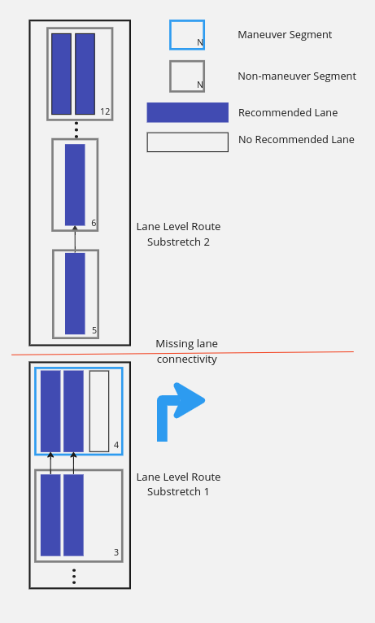
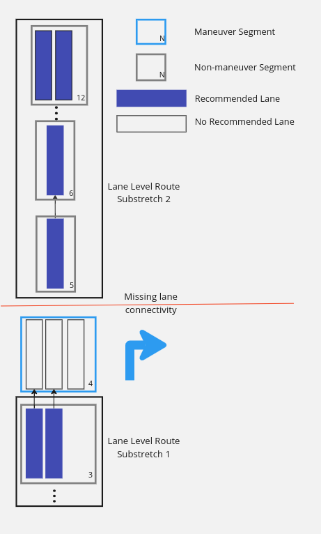

// Copyright (C) 2023 TomTom NV. All rights reserved.

= Lane level route on substretches of route

== Status

Accepted

== Context

To provide lane level guidance, we use the lane level router, which allows us to find
the best routes to the final lanes of the current lane guidance scenario.
In order for lane level router to succeed it needs to have lane level connectivity,
meaning that at least one lane in any on-route lane segment is connected to the next
on-route lane segment.

== Problem

If there is a segment on route that doesn't have a connection to the next segment on route,
we discard the already computed lane level route, leaving the Lane Guidance Scenario
without any lane recommendations.

Arrow recommendations are also affected by it, since the results of the lane level router
are being used to confirm that the lane is on route (ArrowSynthesizer::PopulateLaneArrows):

[source, cpp]
----
if (is_lane_on_route_ && is_recommended) {
  auto result = is_lane_on_route_(connected_lane.segment_id, connected_lane.lane_id);

  if (result.has_value()) {
    is_recommended = *result;
  } else {
     ...
  }
  ...
}
----

`is_lane_on_route_` being a lambda passed to ArrowSynthesizer to use the Lane Level Router
results to see if it is connected to some lane of the final on-route segment.

== Proposal

Allow Lane Level Router to stop and restart after an error in lane level connectivity.
By doing this, we allow to have lane guidance scenarios with recommended lanes and do not
discard the already computed results.

However, this approach needs to be considered throughout, specially on when and where to
restart the calculation of the subsequent lane level route substretch.

The proposed solution modifies the output of the Lane Level Router. Currently lane level route
can only contain one stretch for the whole lane guidance scenario with all it's data
encapsulated in `LaneLevelRouterData`;

[source, cpp]
----
struct LaneLevelRouterData {
  LaneLevelRoutes lane_level_routes;
  LaneLevelRouteConnectivity lane_level_connectivity;
};
----

The proposed new substretch of lane lavel route is the following:

[source, cpp]
----
struct LaneLevelRouteSection {
  size_t start_segment_index;
  size_t end_segment_index;
  LaneLevelRoutes lane_level_routes;
  LaneLevelRouteConnectivity lane_level_connectivity;
};
----

This allows to have substretches of lane level route containing the same data as before,
but valid only for the substretch of route, as well as additional data denoting the start
and finish of this substretch. This indices correspong to the `LaneSegments` passed to the
Lane Level Router. In an ideal scenario, the result of Lane Level Router will contain
only one `LaneLevelRouteSection` with `start_segment_index = 0` and
`end_segment_index = lane_segments.size() - 1`.

The Interface and result of the Lane Level Router will need to be modified to return a
vector of `LaneLevelRouteSection` and we will need to provide other useful functions to properly handle
the use cases of the clients of the LLR. Thus, `LaneLevelRouteSections` was created.

[source, cpp]
----
class LaneLevelRouteSections {
 public:
  // Used to easily build the substretches
  friend LaneLevelRouteSectionsBuilder;

  // Retrieve all the sections available
  std::vector<LaneLevelRouteSection> GetRouteSections() const;

  // Helper functions
  std::unordered_set<size_t> GetSegmentLanesThatLeadToDestination(size_t segment_index) const;
  bool IsEmpty() const;
 protected:
  // Used by friend LaneLevelRouteSectionsBuilder
  void AddLaneRouteSection(LaneLevelRouteSection&& section);
 private:
  std::vector<LaneLevelRouteSection> sections_;
};
----

Previous Interface of Lane LevelRouter:

[source, cpp]
----
LaneLevelRouterData ComputeLaneLevelRoutes(
        const LaneSegments& lane_segments, const VehicleAttributes& vehicle_attributes);
----

Proposed new interface:

[source, cpp]
-----
LaneLevelRouteSections ComputeLaneLevelRouteSections(
        const LaneSegments& lane_segments, const VehicleAttributes& vehicle_attributes);
-----

=== Stop current LaneLevelRouteSection

The stop condition of current `LaneLevelRouteSection` is any route substretch that does not have
connectivity to the next segment on-route. This means that the cost to go from all
lanes of this segment, to the final segment on route is infinite.

=== Restart calculation of next LaneLevelRouteSection

Whenever we restart the calculation of the `LaneLevelRouteSection`, we will have
the following structure of `LaneLevelRouteSections`:

[source, cpp]
----
{
  S_0,   // start_segment_index of substretch 1
  E_0,   // end_segment_index of substretch 1
  {...}, // lane_level_routes of substretch 1
  {...}  // lane_level_connectivity of substretch 1
},
{
  S_1,   // start_segment_index of substretch 2
  E_1,   // end_segment_index of substretch 2
  {...}, // lane_level_routes of substretch 2
  {...}  // lane_level_connectivity of substretch 2
},
{
  ...   // more substretches
}
----

Every `S_N` and `E_N` are the indices of the `LaneSegments` passed to the Lane Level Router
and cannot overlap.

To restart the calculation of the next `LaneLevelRouteSection` there are two alternatives
considered, for which the results of the lane recommendations are affected.

==== Alternatives for restarting lane level route

===== __Alternative #1: Start from the next segment after stop__

After an error in lane connectivity, we start from the lane segment immediately
after the substretch has been completed. This allows for the possibility of always
having contiguous substretches on the route.

Using this approach means that there is a possibility that the missing lane
connectivity does not affect the lane recommendations; although in some cases it
may lead to confusing or contradicting lane recommendations to the substretch that
follows, for example:

.Missing connectivity from LaneSegment #3 to #4

Consider the following lane connectivity in Figure 1, LaneSegment #3
is not connected to LaneSegment #4, thus, the first substretch goes from LaneSegment
#4 to LaneSegment #12. We restart the LLR from LaneSegment #3 and all the lanes
are recommended, unlike LaneSegment #4, that only has one lane recommended.
This needs to be accepted as a possible outcome of this algorithm and is not
a direct safety problem, as the rightmost lane is recommended in both LaneSegments.

.Missing connectivity from maneuver LaneSegment #4 to #5 alternative 1

Another example of this alternative is shown in Figure 2 LaneSegment #4 is a
Maneuver segment and is not connected to LaneSegment #5.
We restart the LLR from LaneSegment #4 to the end of the segments.
The lane recommendations in LaneSegment #4 only contain the two leftmost lanes,
but the maneuver is to turn right. This situation is seen on BERMEN-23 route on
HCP3 map. As we don't have connectivity at that region, there is no proper
way to asses any combination of lane recommendations; and using only intuition
*these are wrong lane recommendations*; as the only 'safe' assumption of a lane
used to turn right, would be the right lane.

The `LaneLevelRouteSections` would look like this:

[source, cpp]
----
{
  0,     // start_segment_index
  3,     // end_segment_index
  {...}, // lane_level_routes from LaneSegment #1 to LaneSegment #4
  {...}, // lane_level_connectivity from LaneSegment #1 to LaneSegment #4
},
{
  4,     // start_segment_index
  11,    // end_segment_index (end of Scenario)
  {...}, // lane_level_routes from LaneSegment #5 to LaneSegment #12
  {...}  // lane_level_connectivity from LaneSegment #5 to LaneSegment #12
}
----

===== Alternative #2: Start from the next non-maneuver segment after stop

In this alternative, after finding an error in connectivity, we start the next
lane segment that is not a maneuver segment, thus skipping LaneSegment #4.
This results in the same behaviour as in Alternative #1, except for the
example above (Figure 2). In that situation, the LLR would then start
from LaneSegment #3, resulting in the following `LaneGuidanceScenario` in
Figure 3:

.Missing connectivity from maneuver LaneSegment #4 to #5 alternative 2

The `LaneLevelRouteSections` would look like this:

[source, cpp]
----
{
  0,     // start_segment_index
  2,     // end_segment_index
  {...}, // lane_level_routes from LaneSegment #1 to LaneSegment #3
  {...}  // lane_level_connectivity from LaneSegment #1 to LaneSegment #3
},
{
  4,     // start_segment_index
  11,    //end_segment_index (end of Scenario)
  {...}, // lane_level_routes from LaneSegment #5 to LaneSegment #12
  {...}  // lane_level_connectivity from LaneSegment #5 to LaneSegment #12
}
----

=== Decision

The decision is to use *Alternative #2*, as it is the most conservative approach,
avoiding having blind lane recommendations at maneuver segments with missing
connectivity.

=== Consequences

We might have lane segments with lane recommendations that are not possible when
there are connectivity errors. We deliberately will not recommend any lanes at
maneuver segments with missing connectivity.
