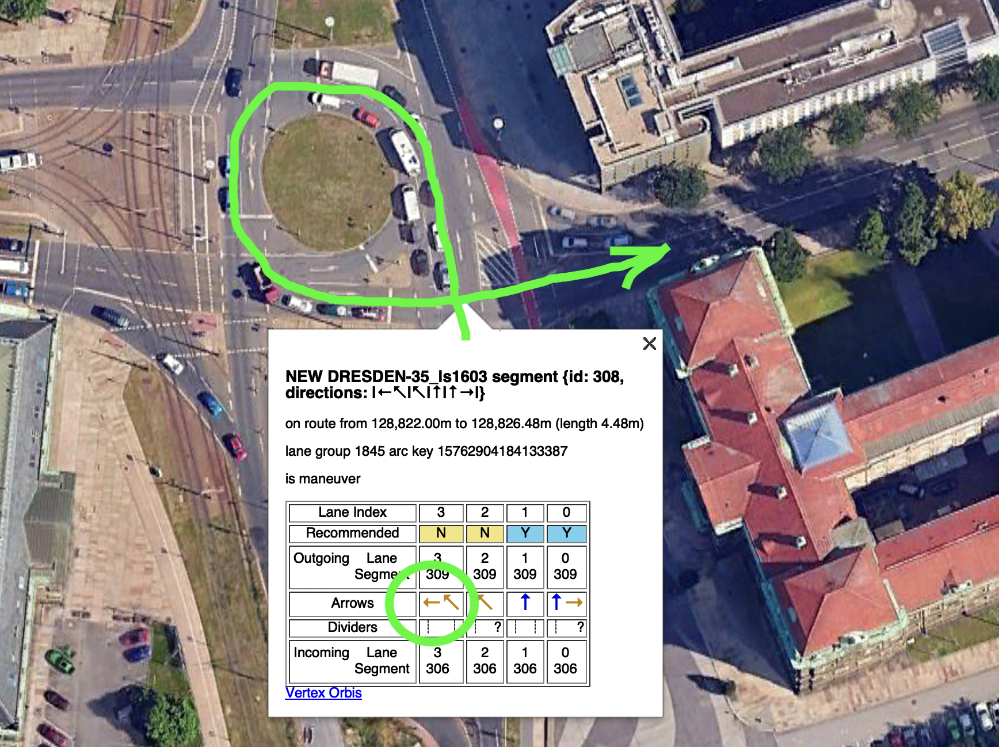
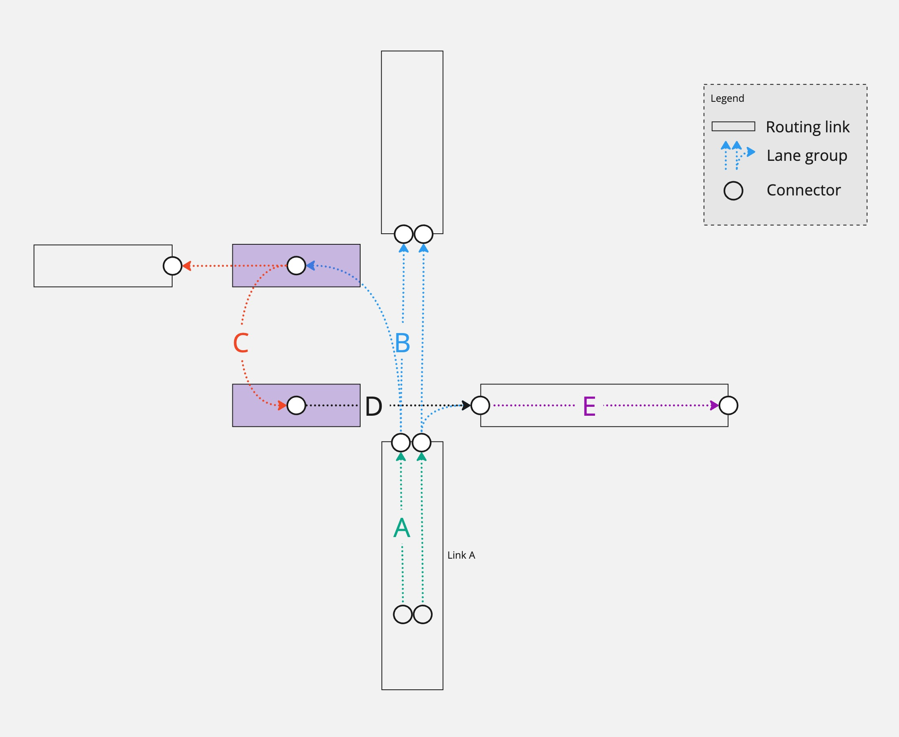
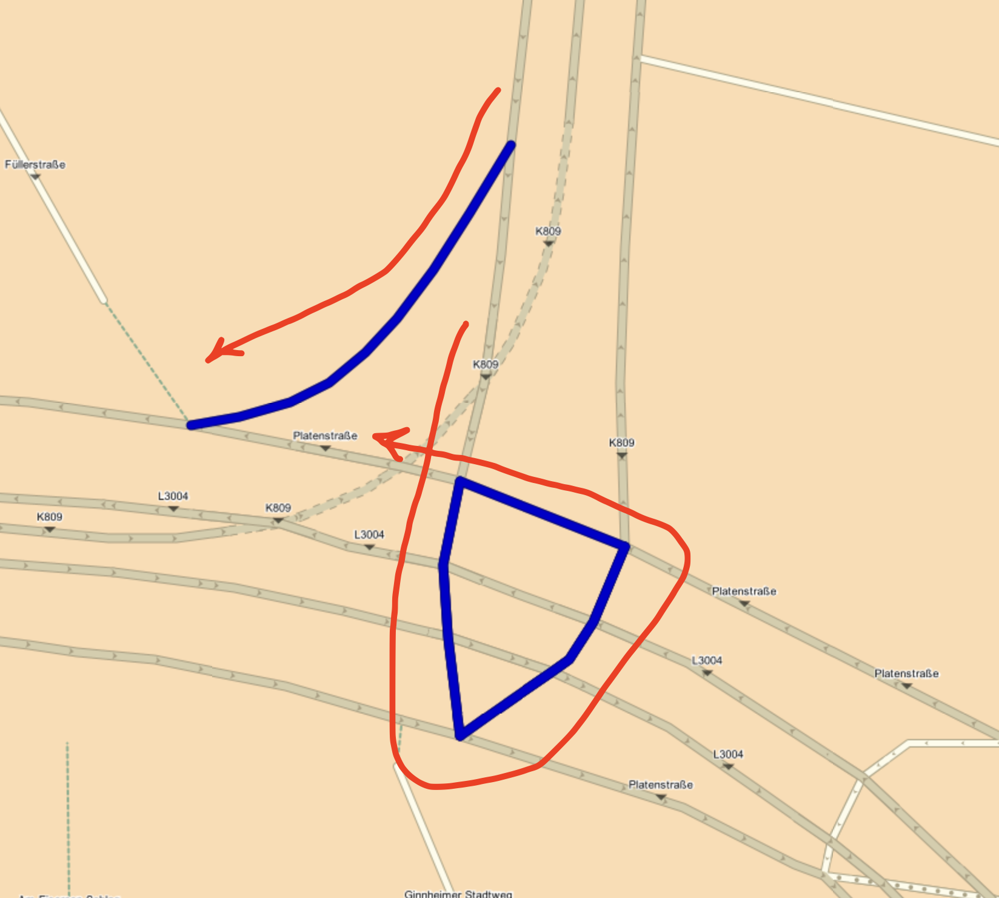
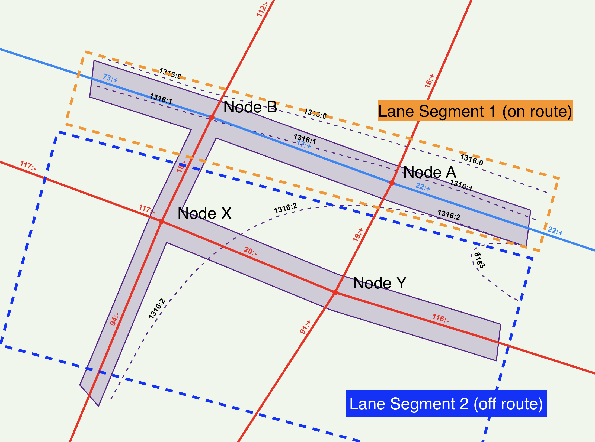

// Copyright (C) 2021 TomTom NV. All rights reserved.
//
// This software is the proprietary copyright of TomTom NV and its subsidiaries and may be
// used for internal evaluation purposes or commercial use strictly subject to separate
// license agreement between you and TomTom NV. If you are the licensee, you are only permitted
// to use this software in accordance with the terms of your license agreement. If you are
// not the licensee, you are not authorized to use this software in any manner and should
// immediately return or destroy it.

= Lane Path Loops Inside Plural Junctions

=== Problem

Spurious (extra, redundant) arrows in lane guidance appear in rare cases on plural junctions, where
lane data connectivity forms a loop inside the junction (see Figure 1)

.Extra arrow in the left-most lane (NAV-131609)

More examples can be found in:

* Mass tests, https://jira.tomtomgroup.com/browse/NAV-131609, several cases.
* A customer bug https://jira.tomtomgroup.com/browse/NAV-132222

=== Background

Looped lane connectivity at the intersections is a known source of issues in lane guidance. This usually surfaces to a user as the leftmost lane going to the right (however, this arrow will be patched later by SegmentAngles to a non-conflicting, but a nonetheless wrong sharp left).
To address looped connectivity issues, we recently implemented a Dijkstra traversal that finds all outgoing lane segments at plural junctions and ignores any overlapping paths and loops in the lane data. See the https://github.com/tomtom-internal/navigation-instruction-engine/pull/484[PR #484] for details.

=== Analysis

The current Dijkstra code is able to detect loops in paths on the *segment* network. Meaning, if there is more than one path on the intersection that leads to the same segment, then the longer path is discarded. See Figure 2 for example: the path ABCDE is longer than the path AE, so the former is discarded and no arrow is produced for it.

.Lane group path ABCDE is discarded because of a shorter path AE.

However, there are cases where due to map modeling or peculiarities of the lane segment representation, there will be *no loops* in the segment network.

Example: https://jira.tomtomgroup.com/browse/NAV-132222[NAV-132222] (the route comes from north). Due to a road topology design, a right turn should only be performed before the plural junction through an independent slip road. Using Figure 1 as illustration, there is no lane path AE, but the path ABCDE still exists and is legal. However, the customer does not expect it.

.NAV-132222: Turn right is not legal, but after doing a loop is still possible.

There is still a loop in the lane path, but it does not occur in the segment network. The only level where the self-crossing happens is the routing node level. Which, at the time of writing, is not captured by the internal lane segment model.

=== Proposed solution

The Dijkstra algorithm needs information about the node network to detect self-crossings. Each lane segment will store a *set* (see <<anchor>>) of nodes it encloses or is adjacent with.

For every plural junction, a node on the route which first goes into the intersection will be chosen as the incoming node.

For each path found in Dijkstra traversal, every new lane segment on the path will be checked for overlap with the incoming node. If there is an overlap, it means this lane path crossed itself and the path should be discarded.

[[anchor]]
=== Enclosed nodes cannot have order

This is an observation regarding the current internal lane segment model, which should help in understanding the current solution.

Unfortunately, due to a limitation of our internal model, LaneSegment object can and will span over the whole intersection, discarding all the topological relations between nodes adjacent to plural junction arcs, which leads to inability to establish an order for the sequences of nodes on a particular path.

Figure 4 demonstrates how a single lane group (#1316), marked by the purple area, will be represented internally. There will be two lane segments created:

* Lane Segment 1 will be on route and will contain nodes A,B and arcs on route.
* Lane Segment 2 will be off route and will contain nodes X,Y and arcs 18, 20, 19, 94, 116. All *in random order*.

.Off-route part of lane group 1316 loses topological relation between nodes X and Y

=== Results

Mass tests of the proposed change have been analyzed in https://jira.tomtomgroup.com/browse/NAV-132780. There have been 27 changes in mass tests, and a part of them are due to unrelated fix (missing u-turns), but everything except 1 change is improvement.
