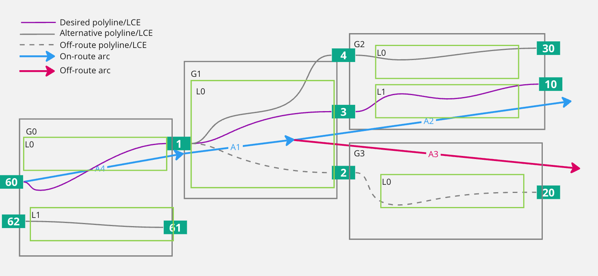
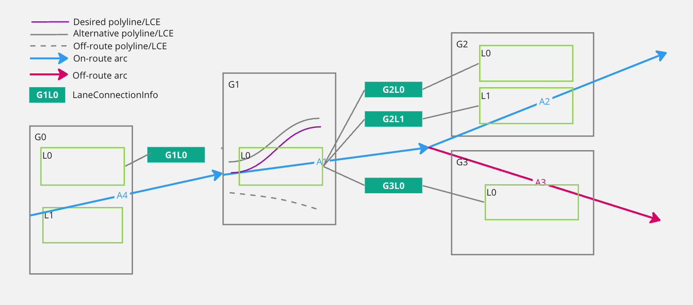
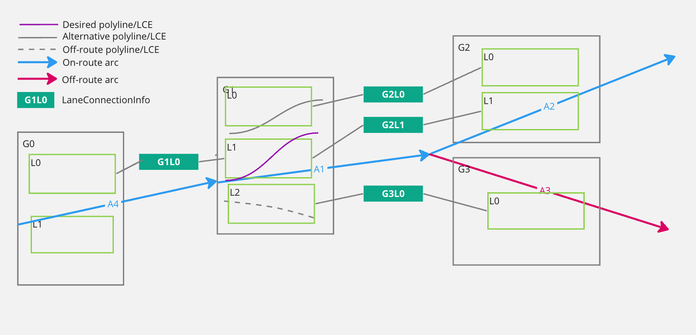
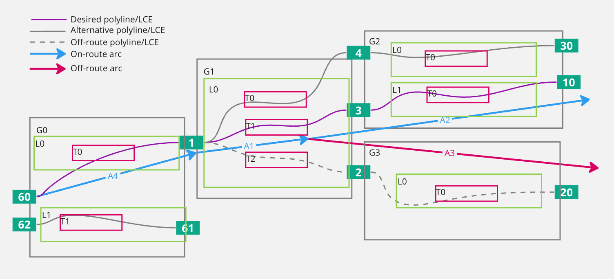
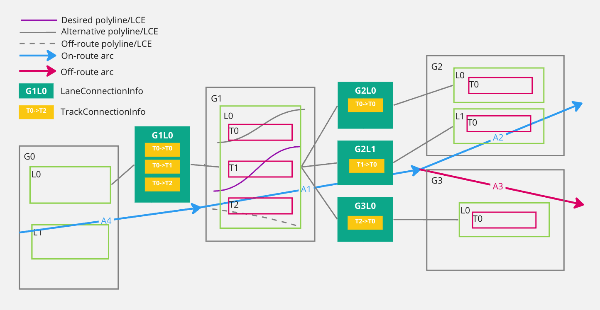
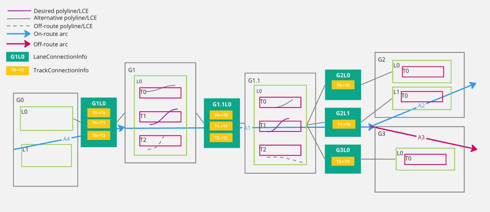
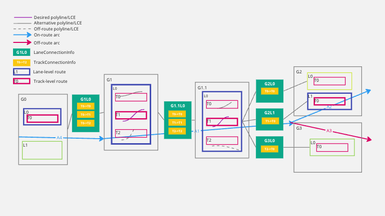

// Copyright (C) 2023 TomTom NV. All rights reserved.

= Track-level routes: polylines for lane-level routes

== Status

Approved for implementation

== Context

We currently compute lane-level routes in the LaneGuidanceBuilder class and
output them as a set of lane recommendations for each lane segment. We now need
to also expose proper lane-level routes as a sequence of connected steps with
lane geometry, so that the lane-level route can be drawn on the tarmac. This
requires us to project the lane-level route down to the lane connectivity
element (LCE) level so that we can extract the correct geometry for the route.

== Conventions used

* *LCE* will indicate an FTX lane connectivity element. A lane connectivity
element represents an arc in the lane graph, but also contains the geometry of
that arc. Situations where lanes split and merge and complex junctions can be
modelled by many more LCEs than what a driver would perceive as lanes.

* *G#* will indicate a lane group, e.g. G1, G2, etc.

* *L#* will indicate a LaneInfo object (a lane in the lane guidance builder)

* *T#* will indicate a track (a representation of an FTX lane connectivity element or LCE)

* *A#* will indicate an arc

* *C#* will indicate a connector ID.

* *Track* will indicate the lane guidance builder representation of an LCE

* Since some of these elements form a hierarchy, they can be combined to
indicate a specific lane or track, e.g. G2L0T3 will represent lane group 2, lane
0, track 3. We will also denote LCEs by using their connector ID, e.g. C1C2 will
represent the LCE that connects connector 1 to connector 2.

== Problem

Besides the obvious need to load geometry for LCEs, we need represent them
internally and we need to be able to project lane-level routes on LCEs to
generate LCE-level routes.

Our modeling of the lane data cannot currently provide this information because
of the way we model LCEs. In our code we currently create LaneSegments from FTX
lane groups and then create LaneInfo object from LCEs.

The mapping between LaneInfo objects and FTX LCEs is not one-to-one though. If
two LaneConnectivityElements share the same source connector ID they will be
represented as one lane.

In the image, we can see a very common situation where lane group 1 (G1 from now
on) has three FTX lane connectivity elements, indicated by C1C4, C1C3 and C1C2
respectively. They all share C1 so our current algorithm bundles these LCEs and
only creates lane G1LO to represent them all.

=== Handling topology

We need to preserve lane topology so that lane network can be traversed for
lane-level routing and arrow generation. To preserve topology we need to
represent the connections  C1C4 -> C4C30, C1C3 -> C3C10, and C1C2 -> C2C20. We
represent this with LaneConnectionInfo objects that represent the connection
between two LaneInfo objects. In the above case we would have the following
representation:

The problem with this approach is that the we don't have a direct mapping
between LaneInfo objects and LaneConnectionInfo objects. Because of our LCE
bundling, we have lost the topology of the LCEs and we cannot project lane-level
routes on LCEs.

As an example, when we generate a lane-level route through this example scenario
at the LaneInfo level, we produce a sequence of steps like this: G0L0 -> G1L0 ->
G2L1.

If we tried to project this route down to LCEs we would have a problem. Even
assuming we had the polylines for the three LCEs in G1, we would not be able to
pick the proper one (C1C3) because we have lost the link with LCEs.

Also notice that both on-route LCEs (C1C3 and C1C4) are eligible for a
lane-level route and we cannot, a priori, pick one of them without a computed
lane-level route and full LCE-level topology.

=== HCP3 vs. Genesis/Orbis maps

HCP3 and Genesis/Orbis currently model lane situations in different ways, and we employ different ways to match LaneInfo objects with LCEs.

Our modeling of HCP3 LCEs follows the example above.
Modeling Orbis/Genesis maps uses a different lane counting method where every LCE becomes a lane. The above situation would translate into the following model if the Orbis/Genesis lane counting mode was used:

This presents less of a problem because we can directly map LaneInfo objects to LCEs, so it would be possible for the current code to reconstruct LCE-level routes from LaneInfo-level routes and deliver the correct polyline with a simpler approach than the one proposed here. This is not the case for HCP3 maps so the produced polylines for HCP3 maps would be often wrong.

== Proposal

=== Constraints

The current code relies on some assumptions that we need to preserve:

* The number of LaneInfo objects must not change. Changing it would affect the
both the lane recommendations and arrow generation and would result in too many
lanes being displayed when using HCP3 maps.

* The connectivity between LaneInfo objects should also not change. We rely on
this connectivity to generate lane recommendations and arrows and changing the
downstream code would be too risky and expensive.

* Segment splitting must also not change because most of the downstream code
relies on the current way of splitting segments.

The additional requirements are:

* Reconstructing the correct LCE-level route from a  LaneInfo-level route must be possible.

=== Proposed solution

We propose to extend the LaneInfo and LaneConnectionInfo objects in a way that will be transparent to most of the current code, but can be used during the projection of the lane-level-route down to LCE-level polylines.

To represent and store the LCE-level information we propose to add a new object TrackInfo, which maps one-to-one with LCEs and contains the geometry of the LCE and the index of the LCE in its owning lane group.
A vector of TrackInfo objects will be added to the LaneInfo object.

[source, cpp]
----
struct TrackInfo {
  TrackId track_id;
  Polyline polyline;
}

struct LaneInfo {
  // Existing fields
  std::vector<TrackInfo> tracks;
};
----

This would allow us to store the geometry of the LCEs and will be used in
projection. The TrackId is used to reference the Track in the projection code
and in connections.

Tasks needed to add (multiple) tracks to lanes and to load polylines are
captured in
https://jira.tomtomgroup.com/browse/NAV-140546[NAV-140546].

To track topology at the LCE level we propose to extend the LaneConnectionInfo
object:

[source, cpp]
----
struct TrackConnectionInfo {
  TrackId source;
  TrackId destination;
};

struct LaneConnectionInfo {
  // Existing fields
  std::vector<TrackConnectionInfo> track_connections{};
};

----

This would result in the following diagram for the example scenario:

Having a list of TrackConnectionInfo objects and not just one allows us to correctly model
connecting to a lane with multiple tracks, like in the example above. It also
helps us model connectivity during segment splitting.

The vector should be treated as a list, the order of TrackInfo objects in the
vector is not important and we will not rely on it.

=== Splitting segments

We split segments so that divider types are constant throughout a segment. This
simplifies the lane-level-routing algorithm and the data structures.

Adding TrackInfo objects for LCEs in a LaneInfo creates a situation where two
lanes connect one-to-one through tracks and that information needs to be
preserved. Luckily, the proposed changes in the LaneConnectionInfo object can
also handle this situation.

In the following image, we are splitting G1 into G1 and G1.1. Notice  how the
TrackConnectionInfo objects in G1.1L0 correctly represent the LCE-level
connectivity after the split.

When splitting a segment, we will also split the TrackInfo objects by splitting
their polylines.

=== Projecting the lane-level route

To project a lane-level route on tracks we can use the TrackConnectionInfo
objects to pick the correct TrackInfo object for each LaneInfo object.

The trick is to realize that, while we cannot use this information to move
forward through lanes splits, we can use it to move backwards, and we are not
susceptible to lane merges because lane merges creates two lanes. Let's consider
the example scenario below with a lane-level route G0L0 -> G1L0 -> G1.1L0 -> G2L1.

Assuming the route ends with a single-track lane we can easily project down to
tracks by starting at the end and moving backwards through TrackConnectionInfo
objects. In the following, read the connections from right to left since we are
going backwards:

* G2L1 is a single-track lane so we can project it to G2L1T0
* Follow G2L1T0 to reach G1.1L0T1 using the TrackConnectionInfo object
* Follow G1.1L0T1 to reach G1L0T1   (ditto)
* Follow G1L0T1 to reach G0L0T0   (ditto)

NOTE: For this to always work does require that the last segment contains no lane
splits on recommended lanes. This may need some attention when delimiting scenarios.
The occurrence of this problem is likely very rare, a possible solution is to cut the segment we cannot resolve from the end of the scenario and that could work seamlessly when delivering continuous lane guidance.

=== Marking tracks as recommended

Optionally, we may consider adding a recommended flag to TrackInfo objects and
set it when we reconstruct the routes. The meaning of the flag would be to
indicate that there is at least one lane-level route going through this track.
While this information is inherently more ambiguous than track-level routes,
future clients like HCP3 that rely on the lane recommendation flag may prefer
this approach.

=== Decision

After extensive discussion we agreed the solution is valid and will implement it as proposed.
