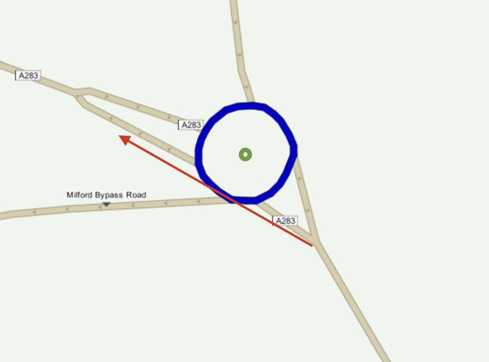
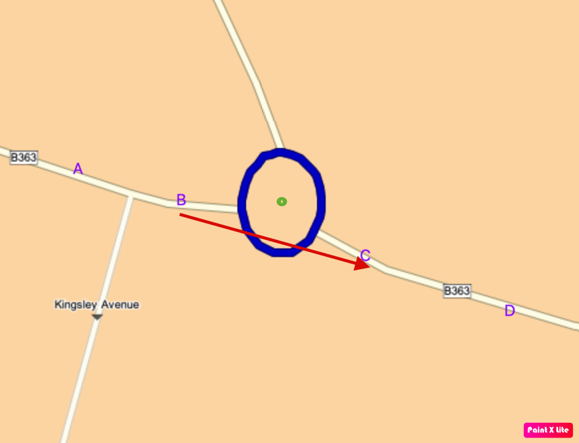
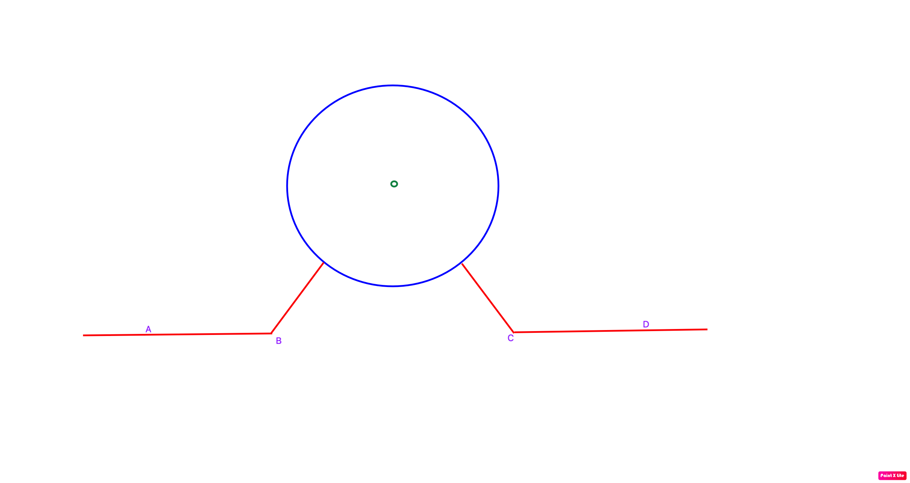

// Copyright (C) 2024 TomTom NV. All rights reserved.
//
// This software is the proprietary copyright of TomTom NV and its subsidiaries and may be
// used for internal evaluation purposes or commercial use strictly subject to separate
// license agreement between you and TomTom NV. If you are the licensee, you are only permitted
// to use this software in accordance with the terms of your license agreement. If you are
// not the licensee, you are not authorized to use this software in any manner and should
// immediately return or destroy it.

= Roundabout Straight Direction Detection

== Status

Proposal

== Context

There is https://jira.tomtomgroup.com/browse/NAV-106615[a bug complaining about roundabout direction].
The expected direction is straight, but the algorithm returns right or left.

Predecessor can be found here: <<2022-06-16T16:27:52+0300_roundabout-angle-v3>>

It calculates roundabout angle based on 3 points: entry, center and exit.

However, sometimes the entry line does not lead to the center. The entry line can lead to the exit line directly.
For these cases, the algorithm will generate wrong direction.

For example:

image::2024-04-11-roundabout-straight-direction-detection/small_roundabout.png[]

The current algorithm will generate right direction for the first case and left direction for the second case.
But for both cases the direction should be straight.

== Proposed solution

=== Design principles
When the entry and exit line touch the roundabout tangentially, although from roundabout center perspective it could be left or right, from driver perspective the direction is straight.
We want to identify such case and return straight direction.

=== Algorithm
Firstly, approximate the route to a simple polyline.
If the polyline fulfills the following criteria, the exit direction is straight. Otherwise, fallback to current algorithm.

1. It is almost straight
2. It touches the roundabout

==== Approximate the route to a simple polyline
The simple polyline is formed by 4 distant points.

A: 30 meters before the entry point.

B: 10 meters before the entry point.

C: 10 meters after the exit point.

D: 30 meters after the exit point.

Note: If the entry/exit lines are less than 30 meters, the algorithm selects the continuation line to continue.
This is the current algorithm to calculate distant point. For more detail about detecting continuation, please refer to
_RoadContinuationDetector_ class.

==== Check if the simple polyline is almost straight
If the following angle changes are within straight direction, the simple polyline is considered straight.

- From AB to BC
- From BC to CD
- Accumulated angle change from AB to CD

==== Check if the simple polyline touches the roundabout
The simple polyline touches the roundabout if the distance from the roundabout center to line BC is less than the roundabout radius.
This check is to avoid classifying the following case as straight direction.

=== Applied cases
This algorithm only applies to small roundabouts with radius less than 30 meters.
This threshold is defined in the https://confluence.tomtomgroup.com/display/FlaminGO/NIE_010.1+-+Generic+Roundabout+Instruction#NIE_010.1GenericRoundaboutInstruction-Detectionofstraightdirection.[spec] at the time of writing this ADR.

For larger roundabouts, it is not easy for the driver to judge whether it is straight or not. And the roundabout geometry can vary more.
It is hard to guess driver perspective and judge whether the lines touch roundabout tangentially.
Thus, we fall back to the current algorithm based on pure roundabout geometry.

== Tested alternatives

=== Alternative 1

Calculate the angle change from the entry line to the exit line.
If the angle change is within straight direction, return straight direction and set the angle to zero.
Otherwise, keep the angle as it is.

This alternative fails to solve many cases where the entry line and the exit line curve for a little bit.
This kind of curvature is map data limitation.

=== Alternative 2
Based on the predecessor algorithm, project the center point onto line BC to get a new center point.
And calculate the angle change based on the new center point.

This approach is more general. It can also solve some cases for left/right direction.

However, it causes some negative impact caused by imprecise map data. The entry line can be curved.
But that curvature is not always correct and can affect this algorithm significantly.
