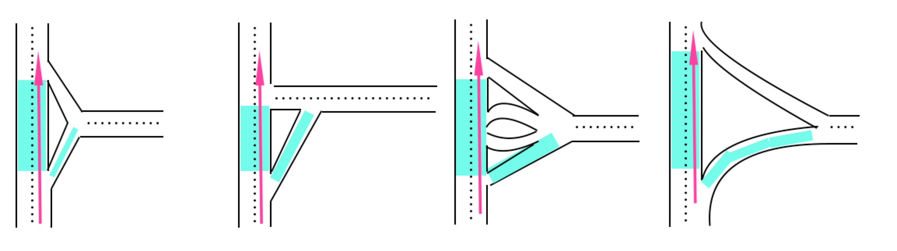

// Copyright (C) 2024 TomTom NV. All rights reserved.

= Fork at intersections with plural links

== Status

Implemented

== Context

Non-motorway fork handler (`ForkHandler`) is more specialized and is naturally sequenced before handlers that provide Turn instructions for intersections with plural links (`TurnAtComplexSituationHandler`).

Some valid fork situations may have plural links immediately after the bifurcation point. We would like to have a simple logic in the ForkHandler that is able to dismiss cases that should be handled by TurnAtComplexSituationHandler and produce Turns.

Examples of intersections with plural `lightblue` links that should not be handled by `ForkHandler`.

== Decision

Use the following logic:

* Traverse plural links on both the on-route and off-route paths at bifurcation.
* Find the number of reachable exits for each path. `Reachable` here means every link is drivable (`IsDrivable`), and every transition between links is allowed (`IsTurnAllowed`).
* This is not a fork if there is more than one reachable exit present for either path.
* This is not a fork if the angle between a single on-route and single off-route exit is more than 30 degrees.

== Consequences

* `ForkHandler` will stop providing Fork instructions at intersections with plural links.
* These case will be handler by the `TurnAtComplexSituationHandler`
