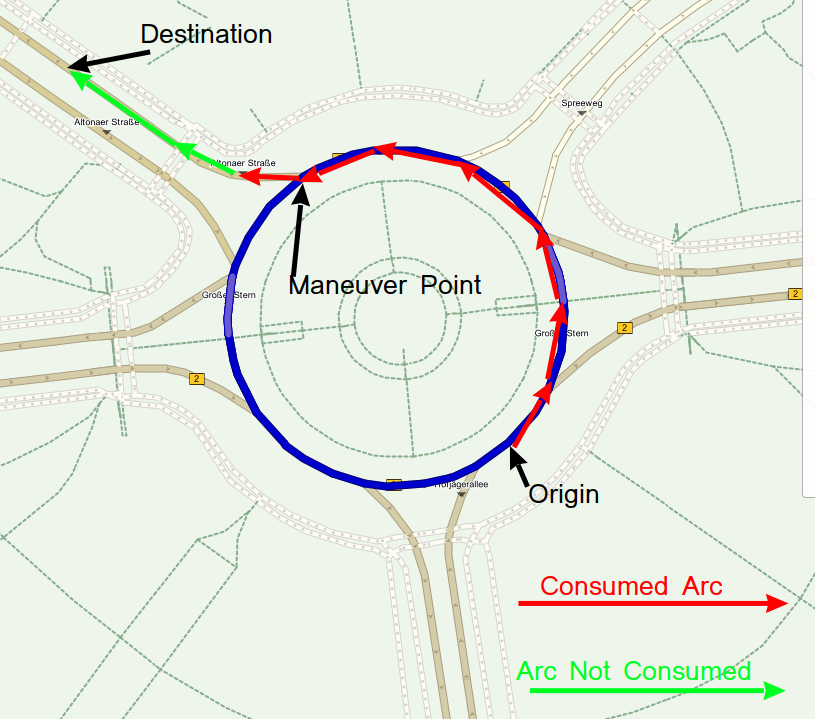

// Copyright (C) 2024 TomTom NV. All rights reserved.

= Create a standalone exit roundabout instruction in case of deviation inside the roundabout

== Context

For the https://jira.tomtomgroup.com/browse/GOSDK-20745[Adjust maneuvers after deviation inside a roundabout] the instruction engine needs to be able to generate a standalone (without enter) exit roundabout instruction in case of deviation inside the roundabout. Similar behavior is expected in case the route starts on the roundabout.

== Proposed solution

We will introduce a "StandaloneRoundaboutExitHandler".
This handler will be successful if the current arc is a roundabout arc. It will consume arcs until and including the exit arc.

N.b. It does not matter if this new handler is before or after the "normal" roundabout handlers. But it has to be called before the TurnHandler.

The reasoning is that the StandaloneRoundaboutExitHandler has to start on a roundabout arc to act, whereas the normal RoundaboutHandler has to start on a non-roundabout arc to act. This means that these handlers are exclusive with each other, at most one of them will execute, thus their relative order is not relevant.

Additionally, if this acts after the turn handler, we will get a turn instead of an exit roundabout at the roundabout exit.

=== Generated instruction

The generated ExitRoundabout instruction will not contain a corresponding (Enter)Roundabout instruction. So no exit number or exit angle are going to be generated.

The instruction maneuver point will be where the last arc with roundabout flag on the route ends:

=== Permissive handler

This handler requires very "little" to succeed: any series of roundabout arcs that ends on a non-roundabout arc is enough. As a consequence, this will succeed also in case of "broken" roundabout data in the map. Specifically turbo roundabouts, but any incomplete/broken roundabout will be absorbed by this handler.

More precisely this means that, in case of a broken roundabout, the instruction engine will generate a standalone exit roundabout instruction. We consider this to be better than the current situation, where we generate a turn for the exit, so we accept this slight inconsistency (exit without enter in case of broken roundabout).

==== Alternative design

The handler could be implemented to only succeed in case of a start in a roundabout and not in case of a failed roundabout model construction.
Here, we would construct the roundabout model from any arc behind the start in the roundabout. If the model construction fails, we would not generate the standalone exit roundabout instruction.
This avoid situations that are "Turn right" (in reality to enter the roundabout) followed by a "In 50m, exit the roundabout".

Since the alternative design is more complex and does not lead to obviously better results, since the first Turn is the actual issue, we decided to go with the simpler design.

=== Implementation detail

We decided to not use the `RoundaboutHandler` inheritance hierarchy, this will be on its own. This is quite simple and does not require building the roundabout model, so inheriting the `RoundaboutHandler` would be overkill.
