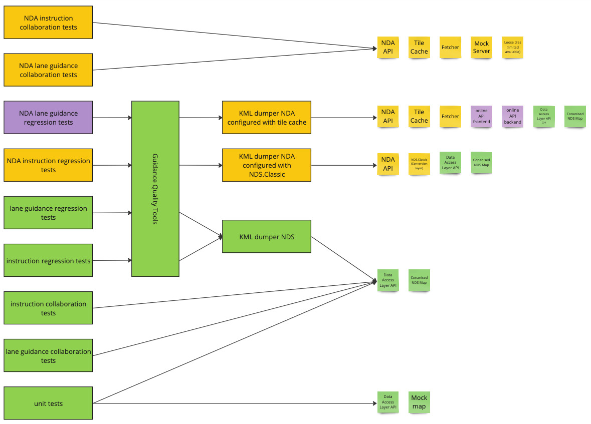

// Copyright (C) 2018 TomTom NV. All rights reserved.

= Map Access Stacks for Testing

== Context

We have https://jira.tomtomgroup.com/browse/NAV-110886[an epic to port
lane guidance to the NDA map access API] so that it can be used with
future map services.  As part of that, we will be
https://jira.tomtomgroup.com/browse/NAV-141626[implementing lane
guidance regression tests through that API].

While refining this, it became clear that the number of map access
"stacks" underlying the instruction engine has grown significantly
since the project was started, especially recently.  It is now
difficult to hold this knowledge in one engineer's head.

== Glossary

Here are some terms that are used throughout this document:

:fn-mockmap: footnote:[The name "mock map" goes against the usual usage in the industry. Typically in testing a "mock object" is an interface with no implementation.  Tests need to set up the expected calls with their return values in advance, one by one.  A "fake object" is a functional, independent implementation, but greatly simplified compared to the "real" implementation.  An example is a fake HTTP server which returns a predefined set of headers and a response stored in a file instead of actually querying over the network.  As such, what we call "mock maps" would better be described as "fake maps".  We also do have true mock interfaces to maps at various API levels, so the terminology gets very confusing.  In this document, "mock map" refers to the definition above.]

[glossary]
DAL:: "Data Access Layer".  An old API for accessing map data, specifically from NDS maps.
GXL:: A standardised XML format for describing graphs.  In TomTom we use it for describing road simple networks in order to test specific test cases.
Guidance Quality Tools:: A collection of Python libraries and scripts for running mass tests, in particular Regression Tests.
Instruction Engine Repository:: A git repository holding Guidance business logic, including both instruction and lane guidance generation.
Instruction Engine:: The Guidance business logic and supporting components that generates instructions.
Lane Guidance Builder:: The Guidance business logic and supporting components that generates lane guidance.
Map Access Stack:: The set of software components between Guidance business logic and the raw map data.  May be in-process, or involve IPC at some layers.
MapAccessTraits:: A C++ template parameter in the Trait design pattern, defining types for accessing map data in a somewhat API-independent way.
Mock Map:: An implementation of the Data Access Layer for NDS maps, but which uses artificial test data specified in a test.   Sometimes the data is read from GXL files.{fn-mockmap}
NDA:: "Navigation Data Access".  A new API for accessing map data.
NDS:: A public standard for distributing maps as digital files.
NavTiles:: Another name for Tile Cache.
Tile Cache:: A NavKit2 subsystem that provides map data from an online API serving one tile at a time.  For performance, tiles are cached on disk.

== History

Lane guidance is currently part of the instruction engine repository,
and shares much of the same infrastructure.  Traditionally, this has
been fairly straightforward: both instruction engine and lane guidance
access the map via the NDS Data Access Layer API.  This in turn
accesses an NDS map held on disk.

=== Conanised Maps

For automated tests within the instruction engine repository, we mimic
this setup by using "conanised" maps.  These are real NDS maps, although sometimes they are trimmed down to save space.  They are then
packaged into conan packages, together with their keystore.  This
approach is used for regression tests, collaboration tests, and some
unit tests.

=== Mock Maps

For smaller tests, especially unit tests, a full NDS map is overkill.
And in fact, it would often be too hard to find a real-life example of
the intended edge case.  For these cases we use mock maps, with road
geometry designed by an engineer.  Some mock maps are constructed by
lines of C++ code, others are built in GXL files.  Either way, then
mock map API uses the same API as the "real" Data Access Layer API.

=== Tile Cache and Map Access Traits

Originally, it was intended that NK2 would operate in three modes:

1. Online mode, using the Routing API
2. Onboard full map mode, with an entire region map stored on the
device
3. Onboard tile cache mode, using only map tiles cached on the device

Onboard tile cache mode was eventually dropped, since no customer
asked for it by the time we began promoting GO SDK instead.  However,
tile cache mode would have had a different API.  As such, it was
necessary to abstract the Data Access API throughout the instruction
engine.  As a result, many classes are templates, parameterised by
`MapAccessTraits`.

== Instruction Engine on NDA

For onboard instruction generation in GO SDK, the instruction engine
had to be ported to use the NDA API.  This works with a tile service
(such as NDS.Live or NavTiles) which also caches some tiles locally.

=== Collaboration Tests

For testing this work, it is enough to configure map access to use a
mock server, which serves a small number of tiles stored in the
repository.  This is used by a small number of instruction engine
collaboration tests.  These tests are designed to exercise and
validate the NDA API together with the instruction engine.  They are
not designed to thoroughly test instruction engine business logic,
which is rather tested by unit tests and regression tests.

=== Regression Tests

For instruction regression tests, we need a far greater variety of
test cases, which require a large amount of map data.  In practice,
the best source of these are the existing conanised NDS maps.  So for
these regression tests, we use "NDS.Classic".  This is an [NDS.Classic
backend](https://github.com/tomtom-internal/adas-dataaccess-nds) of
NDA that allows an NDS map to be used via the NDA API.  This allows
the instruction engine business logic to be tested in detail through
the NDA API with a large amount of map data.

However, this is not a configuration that will ever be deployed for
customers.

== Lane Guidance on NDA

We are now also porting the lane guidance component to use the
NDA API.  This will also work with a tile service.

=== Collaboration Tests

We have a small number of collaboration tests that serve as a basic
exercise of the NDA API.  Like the instruction NDA collaboration
tests, it is enough to run these on a small number of tiles.
Therefore, it uses the same stack as the instruction NDA collaboration
tests.

=== Regression Tests

A difference to the instruction engine regression tests is that this
stack will run onboard the device, whereas the instruction engine only
has current plans to be run in the Routing API online.  Therefore the
regression test solution used for instruction regression tests is not
sufficient, since it does not test the full map stack.

But the solution used by the collaboration tests is also not suitable,
because this only provides access to a handful of tiles.

Therefore, yet a third NDA stack is used.  This uses tiles actually
served from the NK2 tile cache server.  This runs as two processes, a
front end and a back end.  The back end accesses conanised NDS maps.

Note that there are plans to run back-to-route instruction generation
onboard.  The intent is that NDS.Live will be used.  But this is not
yet at the stage of implementing it as regression tests.

=== Guidance Quality Tools

Regression tests all rely on KML dumper as the C++ entry point for
exercising the Lane Guidance business logic.  However, this tool is
deliberately minimalist, reading the route as a set of arc IDs from a
KML file.  It has no capacity for routing.  It also cannot manage and
update collections of test cases.

For these purposes we have developed a suite of Python tools, Guidance
Quality Tools.  For this discussion, this forms an extra layer that is
a Python wrapper around the C++ executable Guidance KML Dumper.

== Diagram

This picture summarises the stacks described above:

Taken from https://miro.com/app/board/uXjVK8yHOsw=/[this Miro board].

== Future

In the future we expect the NDA API to grow to include some kind of
access to large amounts of map data, whether that is via a large local
file that can be conanised, or via an efficient tile server suitable
for automated testing.

Hopefully there will also be an NDA equivalent of NDS mock maps that
can be used for unit tests of odd use cases.

With this, we can collapse our stacks back to something resembling the
original structure developed for Navkit 2.
