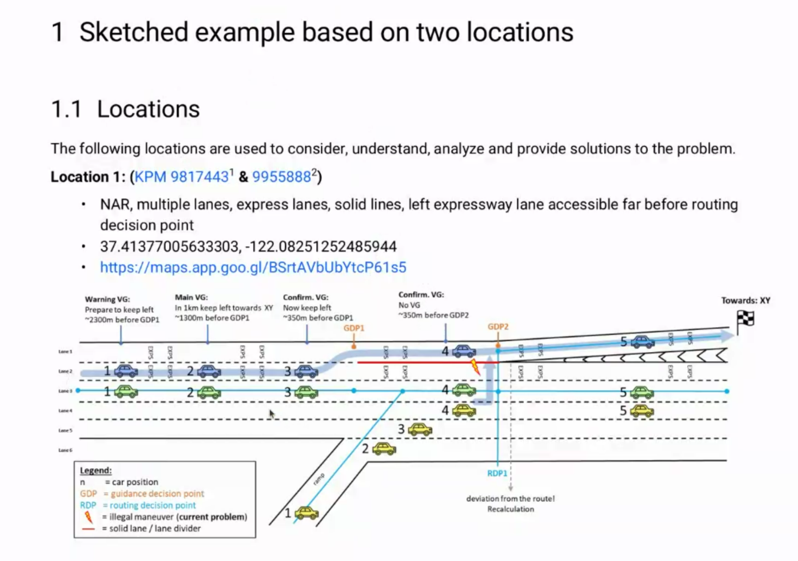
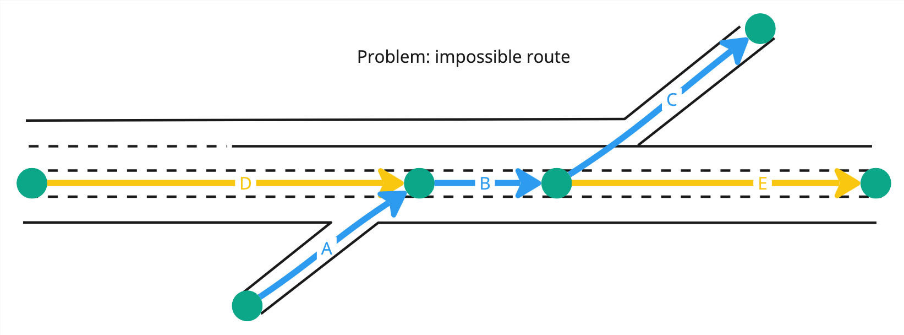
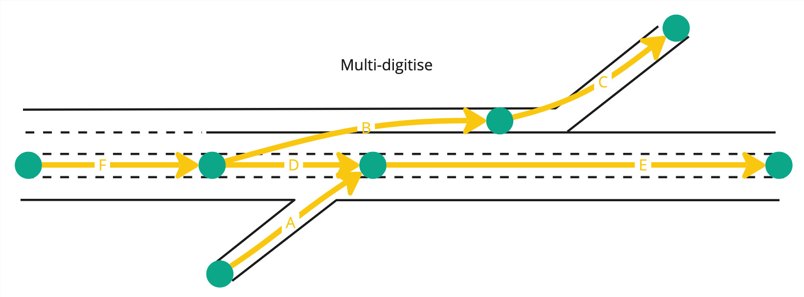
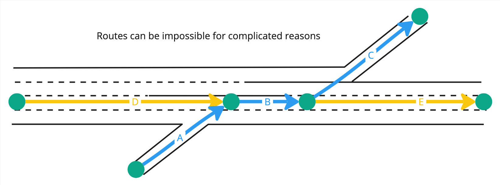
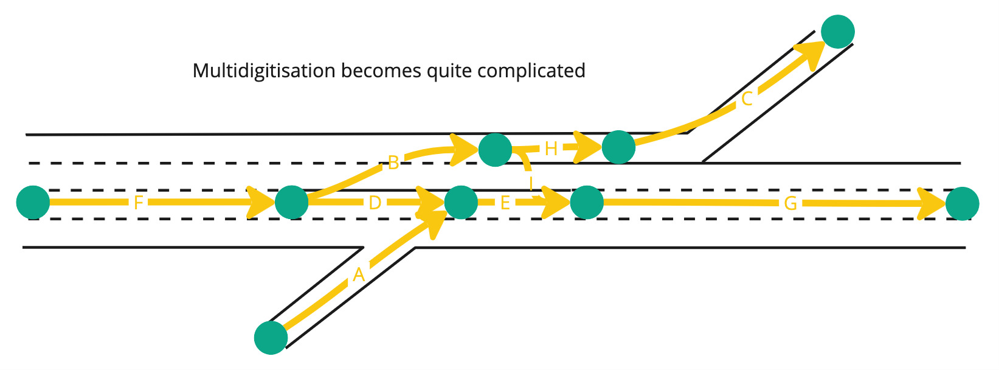
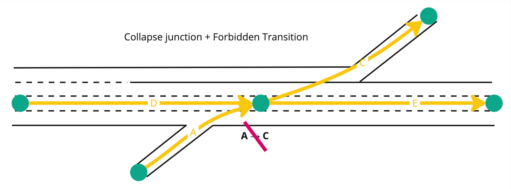
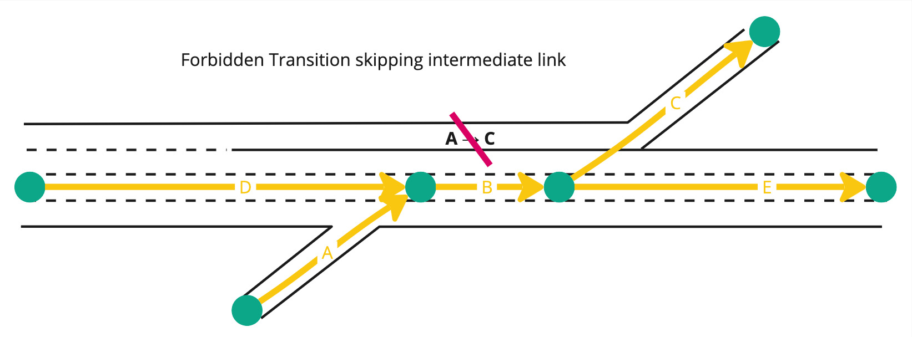
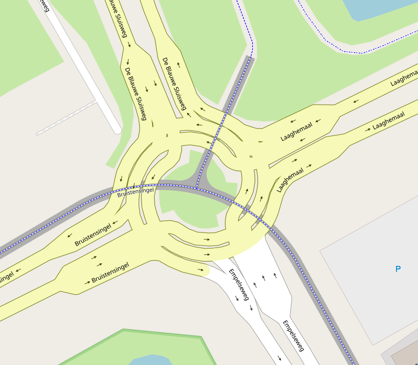

// Copyright (C) 2018 TomTom NV. All rights reserved.

= Early Required Lane Change

== Context

We have a request from Audi to deal with certain situations where a
solid divider requires changing into the required lane long before the
routing network would suggest the actual "maneuver" occurs.

This diagram illustrates two problematic cases:

1. In reality the yellow car cannot join the road on the ramp and take
the exit towards XY, even though the routing layer allows this
sequence.
2. In order to take the exit towards XY, the blue car must be in the
correct lane far in advance of the bifurcation point in the routing
layer.

== Routing Problem

We take it as a given that the routing engine must be able to find a
correct route using only the data in the routing layer.

A naive encoding in the map may look like this, and enable an
impossible route through A, B, and C:

One commonly-used approach to fixing this problem is to multi-digitise
the highway link.  In effect this treats the portion after the divider
becomes solid as a different road.

However, not all impossible transitions are as topologically simple.
Here is an example with a less obvious routing decision point:

Multidigitising this results in a quite complex network:

However, it should be noted that situations like this are unlikely to
be encountered in practice.  This is partly because road designers are
also UX specialists, and are deliberately trying to avoid trapping
drivers in maze-like networks.

Another option in NDS maps is to mark certain transitions as
forbidden.  However, this only works as a bitmask at junctions.  In
order to forbid the incorrect transition here, the link B would need
to be collapsed down to a single junction.

An ideal solution would be to capture in the routing layer that only
the transtion from A to C is forbidden, but other routes through B are
allowed.  However, we have been unable to identify a way to encode
that information in an NDS map.

Diagrams taken from https://miro.com/app/board/uXjVK6KS3IY=/[this Miro board].

== Guidance Problem

From the above solutions, multi-digitisation also solves the problem
of directing the car to the correct lane early enough.  By introducing
an artificial bifurcation into the road network, Guidance will
naturally produce "fork" instructions at exactly the relevant point.

However, multidigitisation produces separate problems.  In Guidance we
attempt to produce intuitive instructions that mirror the driver's own
understanding of the road network.  For a driver, there is a
significant conceptual difference between changing lanes on a single
road and choosing one path at a fork between two roads.

Using the same instruction for both could cause driver confusion.  For
example, we might tell the driver "take the exit onto the A1" at a
point where no such exit is visible.  Instead, we mean the driver
should change into the right-hand lane in preparation for taking an
exit that is upcoming.  It would be better to provide guidance that
says this explicitly.

There are also difficulties displaying simple lane guidance (SLG).
This shows an abstract representation of the lane configuration based
on the number of lanes.  From the driver's point of view, they may be
on a 6-lane highway.  The fact that some of those lanes have solid
dividers does not change the way they count.  Multidigitisation may
result in the system interpreting this as a 4-lane road, with another
road in parallel.  For the driver, being told to take one of the
left-hand 2 lanes out of 4, when there are clearly 6 lanes on the
road, may lead to errors.

Multi-digitisation has been used in some other contexts to resolve
ambiguity in routing, but at the cost of clarity of guidance.  An
example is turbo roundabouts.  For example,
https://www.openstreetmap.org/#map=19/51.71944/5.34555[here] the
roundabout has been encoded with every lane as a separate road.
Guidance at this roundabout is quite chaotic, consisting of numerous
fork and turn instructions.  This is one reason Guidance developers
prefer maps to avoid multi-digitisation where possible.  It is best to
model the road in a way that matches an intuitive driver
understanding.

=== Explicit Lane Change Instructions

A more long-term solution would be for Guidance to explicitly detect
lane decision points and add extra instructions for these.  In the
case of the original example, this would produce two instructions: one
to change lanes, another to actually take the fork.  In this example,
once the driver is in the correct lane, the fork is the natural
continuation of that lane, and only one instruction is required.
However, for the more complex lane configuration, two instructions may
still be required.  Audi provides a second example where that would be
a more practically useful approach:

image::2024-07-03-early-required-lane-change/example2.png[width=500]

Since the instruction engine does have access to lane data, this is
something that could be implemented.  This is in contrast to the
routing engine, which for performance reasons must confine itself to
the routing layer.

Implementing this functionality would be quite a complicated work
package.  At present there is no planned work to implement this.

=== Decision

Multi-digitisation is most likely to solve the problems in practice.
This approach does produce difficulties for Guidance, and map makers
should strive to encode the situation on the road in a way that
mirrors road users' expectations.  However, multi-digitisation is an
approach that is unlikely to ever actively mislead the driver.
