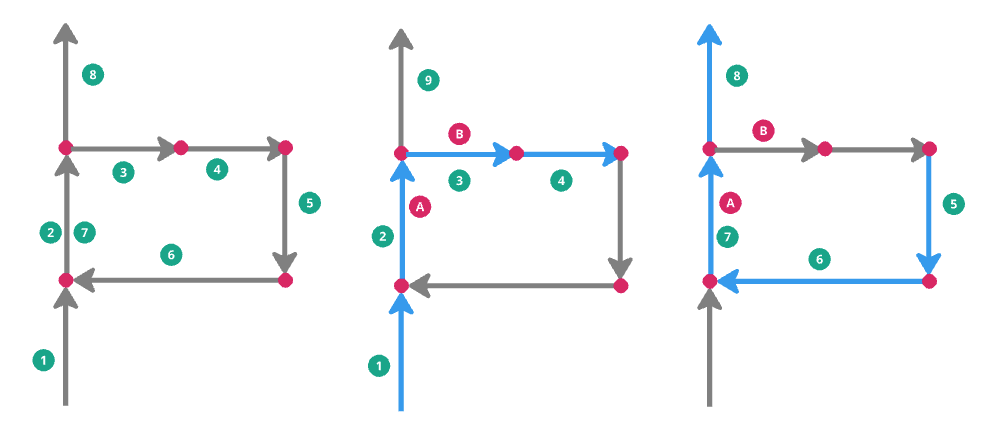
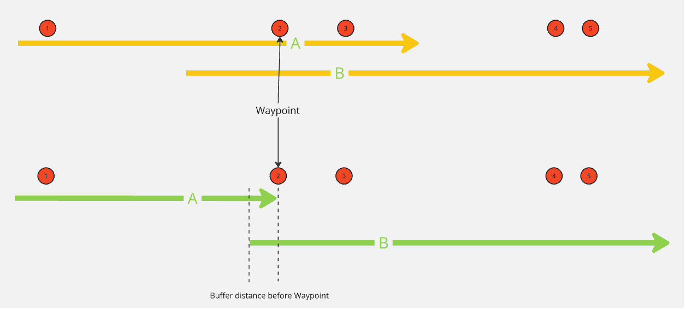
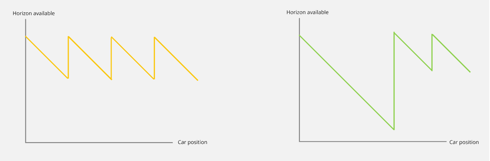

// Copyright (C) 2024 TomTom NV. All rights reserved.

= Continuous Lane Recommendations with route loops

== Status

Implemented

== Context

With continuous lane recommendations, we must always have lane recommendations for a given distance ahead of current
position.

== Problem

On routes that contain a Waypoint, it can happen that a route will go through the same set of arcs twice, once before
reaching the waypoint and another time after the waypoint to continue on the route.

This route loops make lane guidance code detect the same lane groups and connectivity twice, which we identify as an
error in the lane connectivity and end up removing lane and arrow recommendations for some of the repeated segments.

In the example route we have two legs of the route, one before the waypoint, and another after the waypoint.
The arcs are following the sequence of arcs 1-8 in that ascending order. The arc 2 appears twice on the route, always
on-route, whilst the arcs 3 and 8 appear once on-route and once off-route, depending on the leg of the route.

As we cannot differentiate between the legs of the route, the lane level router cannot determine which lanes to recommend
at a given point and creates incorrect recommendations for the conflicting ars/lane groups.

== Proposed solution 1: Split scenarios at waypoint

We split the scenarios generated when we encounter a waypoint instruction instead of the usual horizon distance needed
by continuous lane guidance. This will ensure that the arc keys used for the generation of the scenario do not repeat
and it will not create wrong recommendations.

This solution will contradict with the required distance for continuous lane guidance, since the generated scenario will
not have the required horizon ahead of the vehicle. This was discussed with CARIAD and agreed it was a sensible approach
to avoid the route loops problem, even if we fail our promise of the scenario length.

On the example of the image, we have in yellow the old way of computing the lane guidance scenarios. We have an overlap
between the scenarios A and B and we guarantee the horizon of the scenarios fulfills the client requests. On the green
scenario, we do not generate a new scenario past the Waypoint instruction and we only generate a scenario once the vehicle
passes through the instruction.

Plotting the horizon available in function of the current car position would look something similar to the following image.
The driver would usually stop driving at that location and no lane guidance will be shown for it until driving is resumed.
In the old way of calculating the scenarios, we will consistently try to have at least the required horizon distance.
With the new behaviour, if we encounter a Waypoint instruction, we will not provide the needed distance, until we go
through the waypoint instruction. To pass a waypoint instruction, the car needs to be `kDistanceBeforeHardStopAllowed`
before the instruction, this allows the lane guidance provider to be able to compute the subsequent scenario before we
reach the destination.

== Proposed solution 2: Using ArcKeys with offsets

Use the offset of the arc key on route as a way to differentiate when an arc key appears more than once on route.
This problem solves when an arc appears twice on route as we will be able identify the segment at which the next segment
is connected to.

This approach will not work with current codebase with off-route segments though, as the off-route segments currently
don't have any offset on-route. This was discarded since it is only a partial solution.

== Decision

As it was discussed with CARIAD. the solution to split the scenarios when we encounter a Waypoint instruction is the
preferred one, as it is simple to implement and breaking our promise of the horizon distance is not a deal breaker for them.
