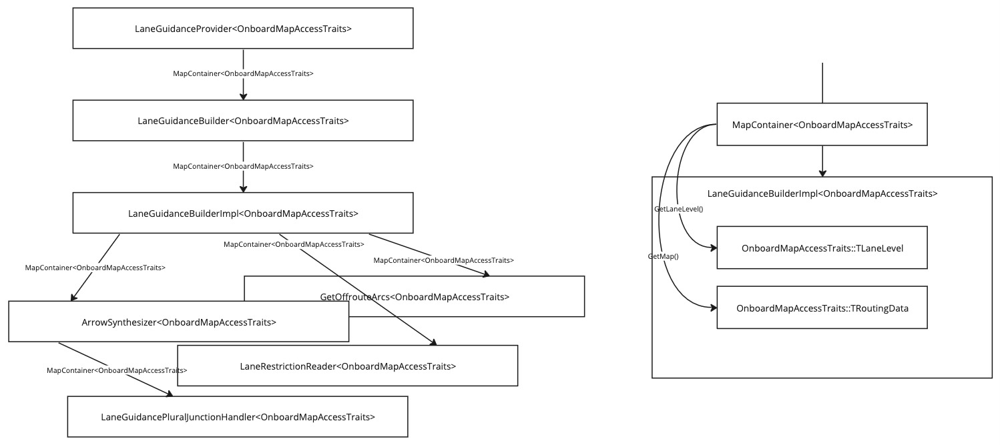
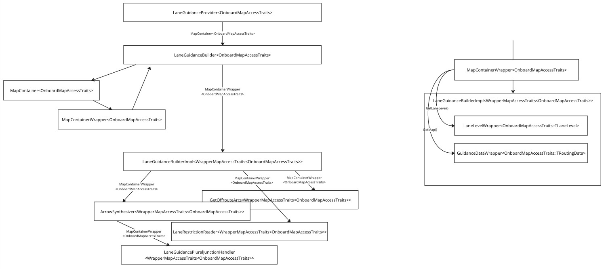
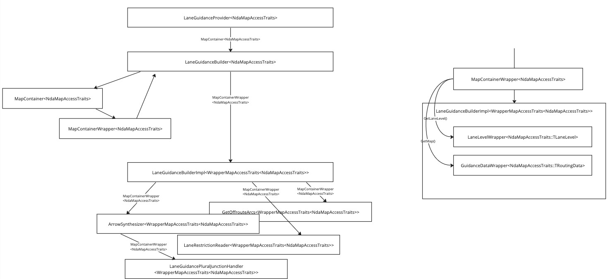

// Copyright (C) 2018 TomTom NV. All rights reserved.

= Map Access Wrapper for NDA

We have an epic to https://jira.tomtomgroup.com/browse/NAV-110886[port
the lane guidance to NDA].  We require that the lane guidance
component provide the same quality of lane guidance, with the same
API, as for onboard NDS maps, but using the NDA interface instead.

== History

=== `MapAccessTraits`

The instruction engine was originally designed to operate with muliple
different map sources, in particular full-onboard and tile-cache
modes.  However, the design assumption then was that although the
implementations would be different, the map API would remain
more-or-less the same.  We therefore made many of our classes
templates, with the template parameter being a set of map traits.  The
traits object defined an alias for the map object class, and for each
of the classes used in the API of that map object.  The intention was
that any small differences in the API could be adapted using this
templates class.

As the NK2 project evolved, the idea of using tile cache mode was
abandoned.  And so in practice, the only map access traits used in
production were the onboard map access traits.  Other map access
traits were used by tests.

We now are coming back to using the tile cache mode after all, years
later.  However, the API is very different, in effect a complete
redesign.  This makes it a poor fit for the `MapAccessTraits` template
parameter design we originally implemented.

=== Junction Model

Meanwhile, another design choice of the instruction engine was to use
our own map abstraction layer, the Junction Model.  This was done
because we knew that map APIs come and go, and we would likely
eventually want to use an API very different to the NDS
implementation.  This is especially true since the API design is in
practice not very well suited to Guidance requirements (despite that
being the intended purpose of the API).  It also uses a "well model"
design pattern that is very poorly understood by developers, and
likely redundant with recent versions of C++.  Finally, the API was
developed quite some time ago, and doesn't use subsequent C++ features
and conventions - in particular, it uses a custom iterator
implementation, incompatible with standard C++ algorithms.

The design called for the instruction engine to use only the Junction
Model to interact with the map.  Unfortunately, the
`LaneGuidanceBuilder` did not follow this rule, and instead accessed
the map directly.  This was a poor design choice, but one that has
been locked in by years of development.

== "Plan A": Junction Model for Lane Guidance

The generally agreed correct solution is to bite the bullet and
migrate all lane guidance code to access the map through the Junction
Model after all.

We began working on https://jira.tomtomgroup.com/browse/NAV-140222[A
spike to size that work].  An initial rough estimate of the amount of
work required came to 16 story points, or about 2-3 sprints of work.
However, this came with significant risk.  In particular, an
experiment was made to implement one small piece of the plan,
refactoring `ConnectivityWriter` to depend on `LaneSegment` instead of
`LaneSegmentInternal`.  This effort already turned up a missing piece
of work: that there is no way to look up a `LaneSegment` by its ID.
This suggests that the effort is not merely large, but very risky.

Our delivery plan requires delivering a working prototype of lane
guidance on NDA within two sprints.  We therefore concluded that the
Junction Model approach cannot reliably deliver the required results
in time.

== "Plan B": Map Access Wrapper

An alternative approach was suggested early in the design process.  We
could keep most of the lane guidance code the same, by wrapping the
new NDA API inside an adapter class that exposes the same API as the
NDS API.  This could then take advantage of the `MapAccessTraits`
templatisation.

This involves creating four new template classes:

1. `GuidanceDataWrapper`: replicates the "main" API of the NDS map
interface.
2. `LaneLevelWrapper`: replicates the FTX lane-level data API of the
NDS map interface.
3. `MapContainerWrapper`: replicates the API of `MapContainer`, but
returns the above two wrappers instead of the underlying map objects.
4. `WrapperMapAccessTraits`: wraps a parameter set of traits, but with
the map object types replaced by wrappers.

Note: the name `TRoutingData` is used throughout, even though the
object is actually of type `CGuidanceData`.  Both `CGuidanceData` and
`CLaneLevel` inherit from `CRoutingData`.  So this is very confusing.
I use the name `GuidanceDataWrapper` instead of `RoutingDataWrapper`
to avoid perpetuating this confusion.

Diagrams below taken from
https://miro.com/app/board/uXjVKW6-jZA=/[this Miro board].

Consider the following representation of the current call chain from
`LaneGuidanceProvider`, to `LaneGuidanceBuilder`, to
`LaneGuidanceBuilderImpl`, and onwards to many other classes:

Throughout the call stack, a `MapContainer` is passed through, which
has `OnboardMapAccessTraits` as the template parameter.  Each class
can call `GetMap()` and `GetLaneLevel()` member functions of the
`MapContainer`, and these return
`OnboardMapAccessTraits::TRoutingData` and
`OnboardMapAccessTraits::TLaneLevel` respectively.  This means all
classes using these traits require an NDS map and will be using the
NDS map API.

With the new structure, the `LaneGuidanceProvider` and
`LaneGuidanceBuilder` are parameterised by `OnboardMapAccessTraits` as
before.  However, `LaneGuidanceBuilder` constructs a new
`MapContainerWrapper` using the supplied `MapContainer`, and passes
this down to `LaneGuidanceProviderImpl`.  LaneGuidanceProviderImpl is
no longer parameterised by `OnboardMapAccessTraits`, but rather
`WrapperMapAccessTraits<OnboardMapAccessTraits>`.  `GetMap()` and
`GetLaneLevel()` return
`GuidanceDataWrapper<OnboardMapAccessTraits::TRoutingData>` and
`LaneLevelWrapper<OnboardMapAccessTraits::TLaneLevel>` respectively.

This will allow also exposing a `LaneGuidanceProvider` parameterised
by `NdaMapAccessTraits`.  The `GuidanceDataWrapper` and
`LaneLevelWrapper` will need template specialisations for this case.
However, all the rest of the lane guidance code should remain the
same.

This approach has been verified in
https://jira.tomtomgroup.com/browse/NAV-142601[NAV-142601].

The final additional piece is `GetOffRouteArcs`.  This is called by
`LaneGuidanceScenarioFactoryImpl`, not by `LaneGuidanceBuilder`.
There are two possible approaches.  One is to define a whole new set
of template specialisations for `GetOffRouteArcs` that use the
NDA API.  Alternatively, we could wrap the existing implementation
inside an interior `Impl` class, and have the outer class instantiate
this with `WrapperMapAccessTraits` as the specialisation.
