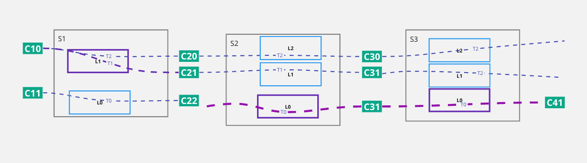
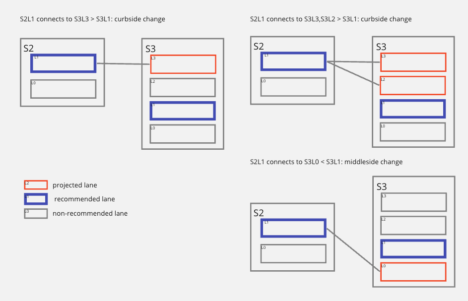

// Copyright (C) 2023 TomTom NV. All rights reserved.

= Improve track selection for lane changes when projecting lane-level routes

== Status

Approved for implementation

== Context

Due to the need to provide accurate, drawable polylines for lane-level routes,
we added support for modeling lane connectivity elements (LCEs) in the lane
guidance builder as tracks. This was detailed in another
link:2024-03-29T07:03:05+0100-lane-level-route-polylines.adoc[ADR].

The above document describes how to add track-level connectivity information,
and how said information can be used to project lane-level routes onto tracks to
obtain track-level polylines.

The proposed algorithm correctly performs track selection when moving from a
connected lane to a connected lane. What is not covered, and is the focus of
this document, is the algorithm to select the correct track when a lane change
is involved.

== Conventions used

We will use the following convention as in the original
link:2024-03-29T07:03:05+0100-lane-level-route-polylines.adoc[ADR]

* *LCE* will indicate an FTX lane connectivity element. A lane connectivity
element represents an arc in the lane graph, but also contains the geometry of
that arc. Situations where lanes split and merge and complex junctions can be
modelled by many more LCEs than what a driver would perceive as lanes.

* *G#* will indicate a lane group, e.g. G1, G2, etc.

* *L#* will indicate a LaneInfo object (a lane in the lane guidance builder)

* *T#* will indicate a track (a representation of an FTX lane connectivity element or LCE)

* *A#* will indicate an arc

* *C#* will indicate a connector ID.

* *Track* will indicate the lane guidance builder representation of an LCE

* Since some of these elements form a hierarchy, they can be combined to
indicate a specific lane or track, e.g. G2L0T3 will represent lane group 2, lane
0, track 3. We will also denote LCEs by using their connector ID, e.g. C1C2 will
represent the LCE that connects connector 1 to connector 2.

== Lane changes in the lane-level router

A crucial insight for understanding the track-projection/selection process is
realizing that the lane-level router moves sequentially through connected lanes,
and lane changes only happen **inside a segment**.

So, the lane-level router  has two different "movement" modes:

- segment-to-segment movement, where the route advances from one segment to
another

- in-segment lane changes, where the router switches  from one lane to another
**within the same segment**.

This distinction is important for a couple of reasons:

- The lane-level router can only move through segments using **connected
lanes**.

- Lane connectivity information as we store is **useless for in-segment lane
changes**, since we are moving through lanes of the same segment.

== Problem

Once this behavior is understood, it is easy to see that the
link:2024-03-29T07:03:05+0100-lane-level-route-polylines.adoc[ADR] only deals
with segment-to-segment movement, and does not cover in-segment lane changes.

In case of lane changes we cannot use the track connectivity information to select the
current track, and we need a different algorithm.

As an example, consider the following scenario where the color purple is used to
indicate recommended lanes and tracks:

Here we see a partial lane-level route, S1L1-> S2L0 -> S3L0. The track selection
problem arises when we need to project the route at S1, coming from S2 and going
backwards. Processing in reverse, we have selected S3L0T0 because it only has
one track, and we selected S2L0T0 following the track-level connectivity
information. We now need to select the proper track at S1L1, but S1L1 has two
tracks (T0 and T1) and we cannot use the track-level connectivity information to
select the correct track because S2L0 and S1L1 are not connected.

== Proposed solution

The general idea of the solution is to find out whether the lane change happens
towards the curb or towards the middle of the road, and then select the
"closest" track. In the image above for instance, (remember that lane changes
happen inside segments) we are changing lane inside S2 from S2L1 to S2L0 moving
curb-side. This , so we should select S1L1T1 because it's the curbmost track and
drawing S1L1T1 and then joining in with S2L0T0 will result in a smooth joint
with no crossing of lane polylines. For instance, S1L1T2 would be a bad choice
because it is further away from the destination track S2L0T0 and joining it with
S2L0T0 would result in a crossing of lane polylines.

To determine the direction of the change, we can leverage the guarantee the
lane-level router gives us that we are moving to the next segment through a lane
connection. In this case S1L1 flows into S2L1. If we follow this connection and
consider the lane we end up in, we have effectively projected S1L1 into S2L1
and, now being in the same segment S2, we can use the lane indexes in S2 to determine
which side of the road we are moving to. In this case, when looking at S1L0 we project it
to S2L1, then we see that the recommended lane in S2, S2L0, has a lower
index than S2L1, so we are moving towards the curb. We can then select S1L1T1 as
the curbmost track in S1L1.

Notice that we could instead have projected S1L1 to S2L2 but, since we only care about the
sign of the difference between lane indices, nothing would have changed.

Finally, when selecting the curb-/middle-most track, we also need to discard tracks that
do not connect to the target segment, as they are not valid candidates.

== Examples

Consider the following examples:

== Pseudocode
Following is a pseudocode implementation of the algorithm. Note that we know we
are dealing with a lane change, so it is not possible to have X ==
B.target_lane.

[source, pseudo]
----
When looking at two segments A and B
  Find one connection in A.target_lane.outoing_connections that connect to B
  X = index of the track that it connects to
  is X > B.target_lane ?
    pick the curb-most on-route track in A.target_lane
  else
    pick the middle-most on-route track in A.target_lane
----

== Alternatives

We considered geometry-based approaches, but discarded them for their fragility
and complexity. These would be based on finding out on which side of the target
polyline the source polyline lies and variations thereof, but the proposed
approach handles all cases and is much simpler.

== Decision

We accept the proposed algorithm for implementation.
