// Copyright (C) 2018 TomTom NV. All rights reserved.

= Length of Lane Recommendations

== Summary

This document describes a problem reported by Cariad concerning how to
display lane recommendations in a coherent way.  The problem concerns
when the lane-level router "splits" lane groups into multiple lane
segments due to changes in divider.  Consumers of our lane
recommendations need to read the corresponding lane groups from the
maps in order to render the lane geometry.  But the splitting leads to
ambiguities that may lead to visual artifacts.

The intermediate solution is to split each lane geometry according to
the relative proportions of the lane group represented by each lane
segment.  This cannot be considered a complete solution.  However,
this document presents reasons why this is unlikely to lead to serious
problems in practice.

== Example

This document will use a single example.  A three-lane highway has an
exit.  There is an awkward solid divider adjacent to the exit.

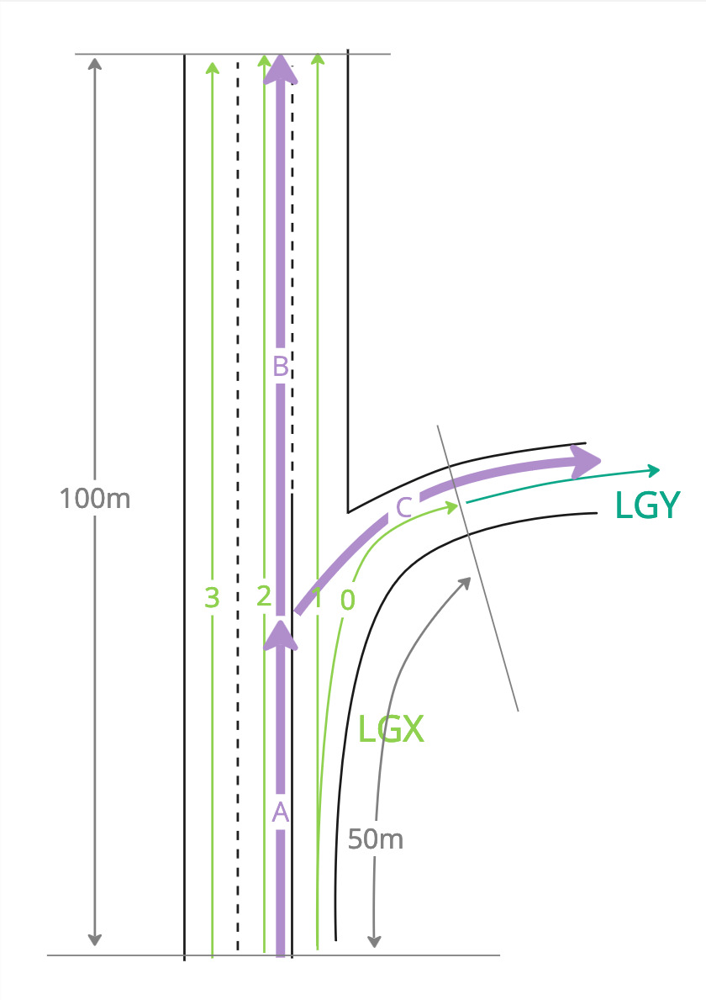

Here the link model consists of links A, B, C. The lane model consists
of lane groups LGX and LGY.  The length of LGX is either 100m or 50m,
depending on which of the lane connectivity elements 0, 1, 2, 3 you
follow.

There is a divider change between lane connectivity elements 1 and 2.
The lane guidance API requires lane segments to have consistent
dividers along their entire length.  Therefore, we split LGX into two
segments SX and SZ.  This split is only in a logical sense.  The exact place the
dividing line splits each lane, represented by the red dotted line, is left undefined.

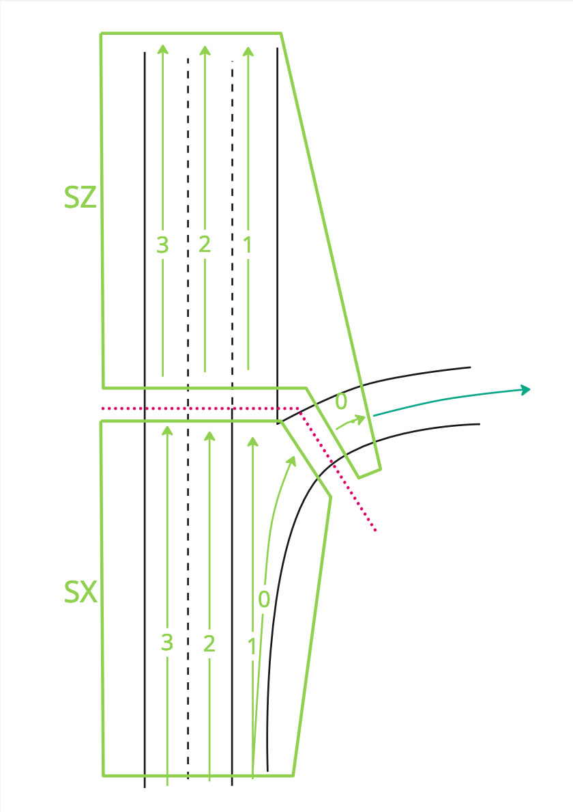

Suppose that for whatever reason, the lane-level router decides that
the right-hand lane is a poor choice.  This may be because it
undergoes splits or merges, or is inaccessible from earlier maneuvers
without lane changes.  Topologically, the lane-level router may then
recommend using the middle lane until the divider allows changing into
the right-hand lane.  This is unlikely with real road designs, but
this example is designed to explore the possible failure modes.

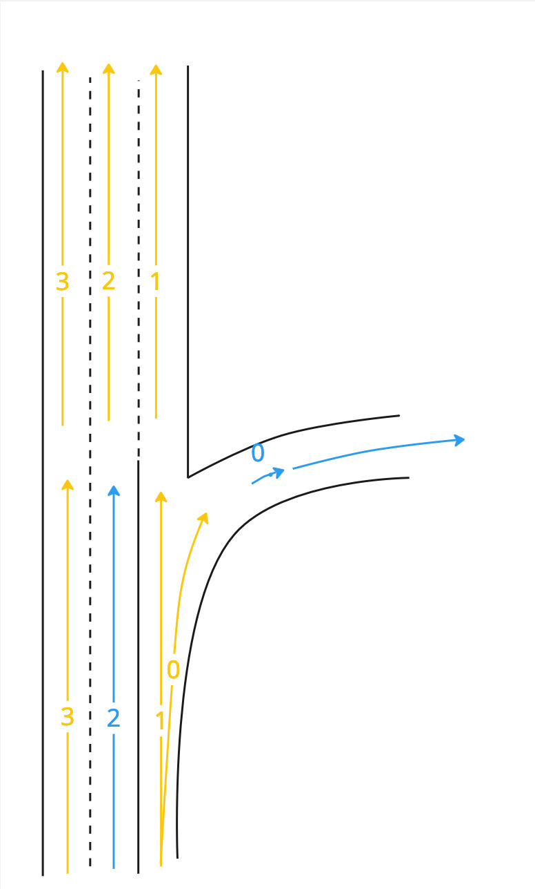

Now suppose that a client wishes to render these recommendations.  It
needs to read the geometry from the map.  This is represented as a
sequence of coordinates for each lane connnectivity element.

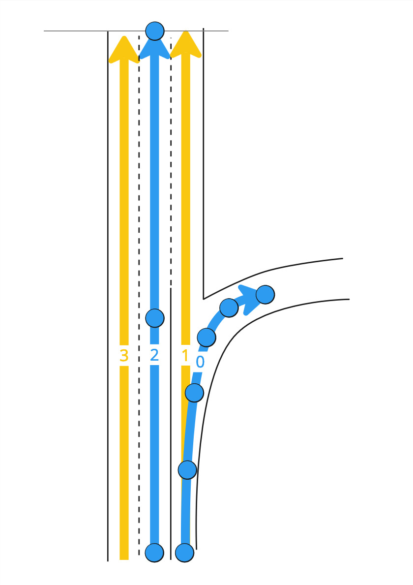

In this example, the lane guidance API exposes that SX (corresponding
to LGX) has lane connectivity element 2 recommended, and SZ (also
corresponding to LGX) has lane connectivity element 0 recommended.
The API does not expose lane geometry, so the client needs to figure
out which points of the geometry from the map correspond to these
recommendations.

To do this, the client first needs to establish all the segments that
correspond to LGX, together with their offsets.  In this case that is
SX from 0 to 50m, and SZ from 50m to 100m.  Therefore, the total
length of LGX on the route is 100m, and SX and SZ are each 50% of
that.  Our suggestion to clients is that they map this proportion onto
each individual lane.

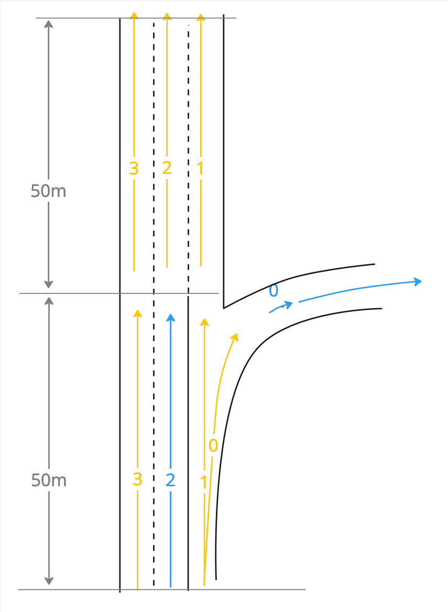

Consider SZ lane connectivity element 0.  If you calculate the total
length of the geometry, let's say it is 50m.  Then the idea is that
the second 50% of that is the last 25m.  The client would be expected
to cut the lane connectivity element geometry accordingly.

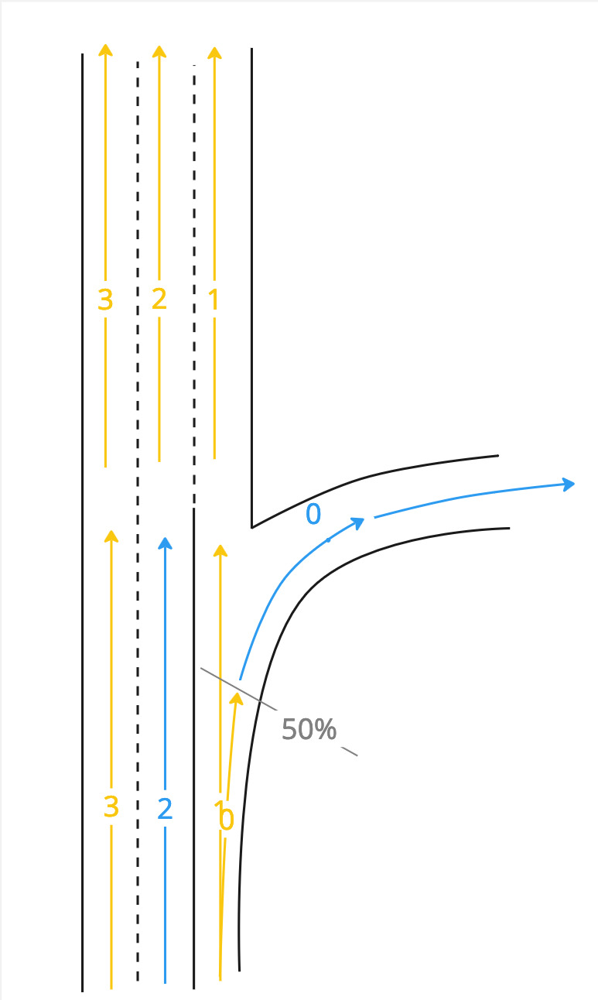

But notice that this split is well before the divider change.
Meanwhile, applying the same technique to the recommendation of SX
lane connectivity element 2, we would calculate 50% of 100m as 50m,
putting the split exactly where the divider really does change.  If
the client attempts to render this, the results will look ridiculous:

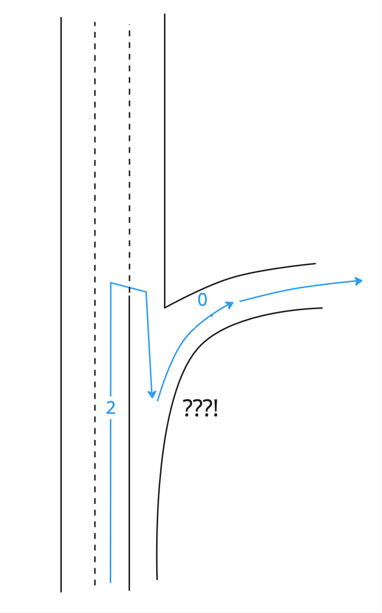

=== Mitigation

However, this is not possible in practice, because this is failing to
take into account the chosen route.  The length used as the
denominator of the fraction should be taken from the route through which the lane
group is used.  This naturally mitigates the problem.

Suppose the chosen route is straight ahead.  In that case links A and
B would be on-route links, and link C an off-route link.

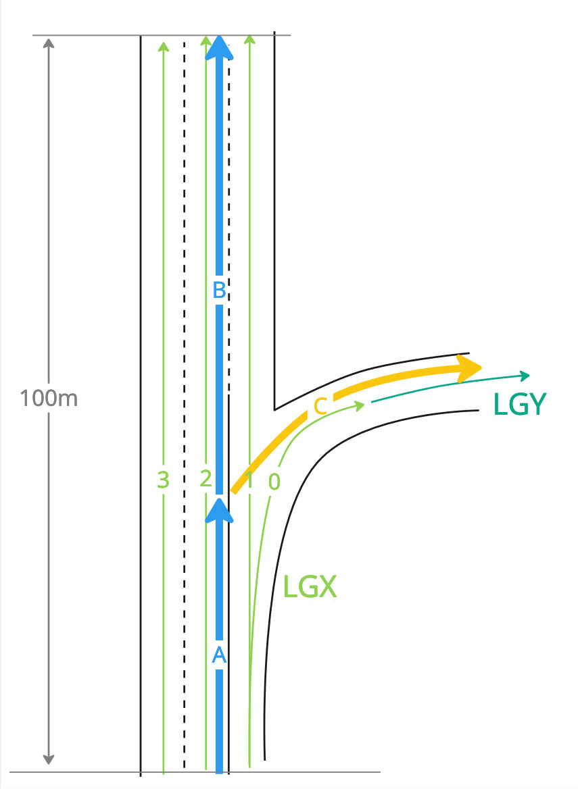

The total length of LGX would be computed only in terms of the
on-route links.  In this case that adds up to 100m.  The divider
change happens halfway along this length, therefore 50m.

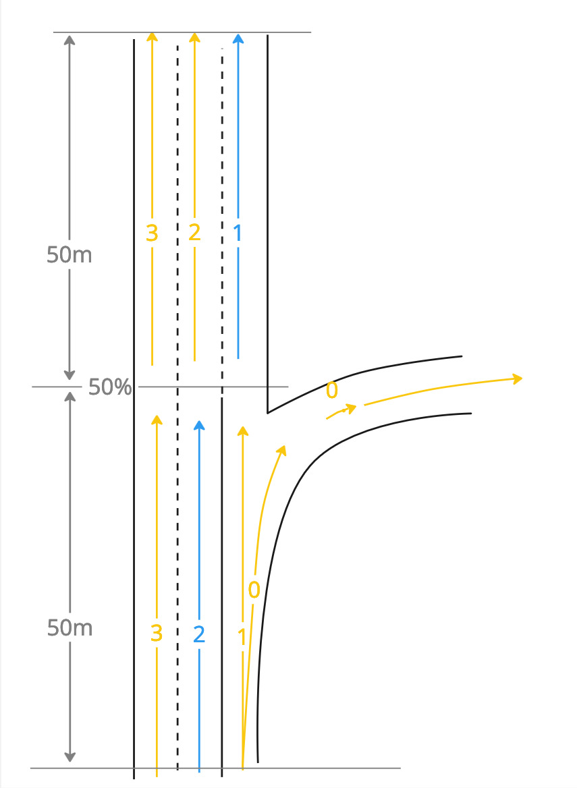

SX and SZ would each be reported by the API as being 50m long.  This
is the appropriate distance for all recommended lanes, and the result
would be rendered without problems.

Suppose instead that the chosen route takes the exit.  In that case A
and C would be on-route links, and link B an off-route link.

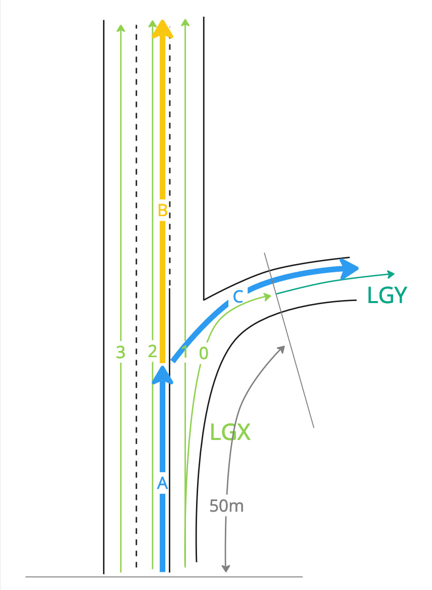

The total length of LGX would be computed now in terms of those links,
and would only add up to 50m.  The divider change happens halfway
along this length, therefore 25m.

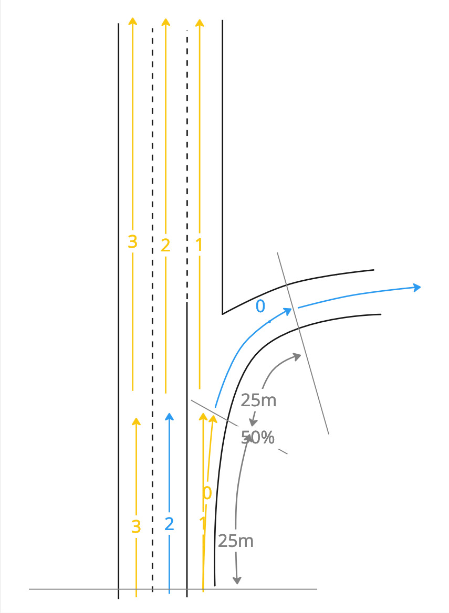

The result when rendered would still not be great, because it would
appear to show a path crossing the divider.  However, it seems much
more realistic.

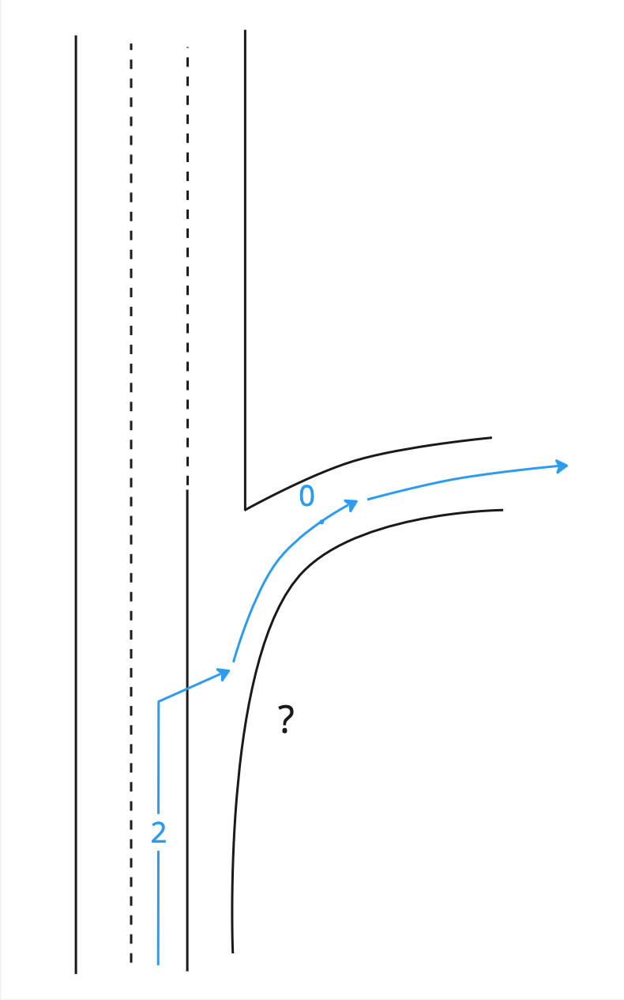

There is still a problem with this example: the displayed lane-level
route is impossible.  But I was only able to produce this contrived
example by using bad lane modelling.  If this was a real situation on
the road, it would not be modelled that way in the first place.

== References

Images taken from https://miro.com/app/board/uXjVLTnl9gg=/[this Miro board].
