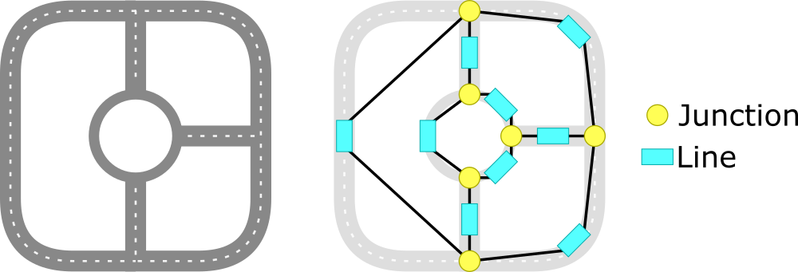
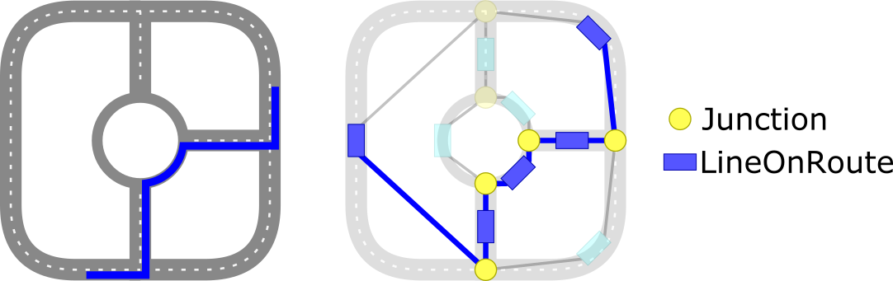

// Copyright (C) 2020 TomTom NV. All rights reserved.
//
// This software is the proprietary copyright of TomTom NV and its subsidiaries and may be
// used for internal evaluation purposes or commercial use strictly subject to separate
// license agreement between you and TomTom NV. If you are the licensee, you are only permitted
// to use this software in accordance with the terms of your license agreement. If you are
// not the licensee, you are not authorized to use this software in any manner and should
// immediately return or destroy it.

[[section-relation-to-map]]
== Relation to Map

=== Junction and Line

The basic entities of the junction model are `Junction` and `Line`.
A `Line` represents a stretch of road that connect just two junctions.
A `Junction` represents an intersection where the driver has a choice,
i.e. three or more lines.  However it is also valid for a junction to
connect to just one or two lines.

The junction model provides a view of these as a graph.  Each `Junction`
has a number of incoming and outgoing lines.  Each `Line` has one head
`Junction` and one tail `Junction`.

Using the object-oriented interface, the instruction engine can
navigate around this network by following an alternate sequence of
junctions and lines.

=== LineOnRoute

The junction model also provides a similar view of a route.  In this
view, the `Line` class is replaced by `LineOnRoute`.  Both of
these provide a start and end junction, from which other lines can be retrieved.  But
`LineOnRoute` also provides access to the single outgoing line
that follows the route.

Unlike `Line`, `LineOnRoute` has a defined ordering from
beginning to end.
