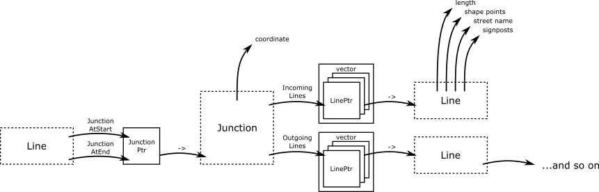
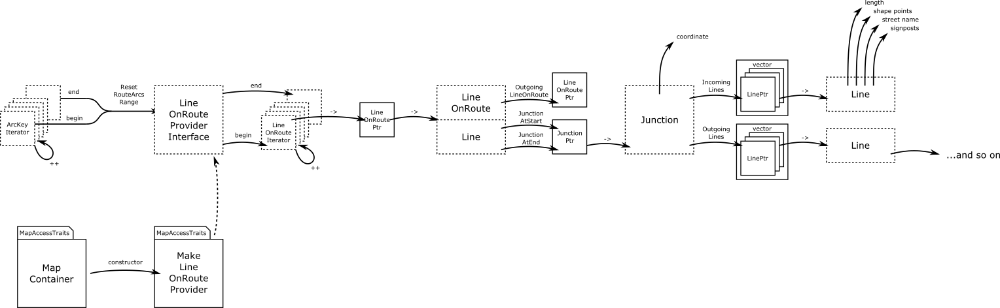
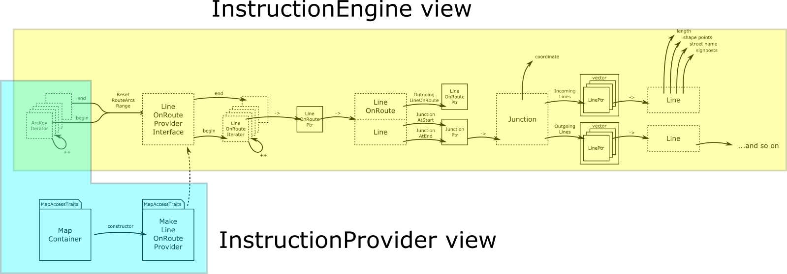

// Copyright (C) 2020 TomTom NV. All rights reserved.
//
// This software is the proprietary copyright of TomTom NV and its subsidiaries and may be
// used for internal evaluation purposes or commercial use strictly subject to separate
// license agreement between you and TomTom NV. If you are the licensee, you are only permitted
// to use this software in accordance with the terms of your license agreement. If you are
// not the licensee, you are not authorized to use this software in any manner and should
// immediately return or destroy it.

[[section-public-api]]
== Public API

=== Junctions and Lines

`Junction` and `Line` are abstract classes that provide access to the
majority of map data the instruction engine needs.  Most data is
retrieved from `Line`, such as street names and shape points.  There
are also a few properties retrieved from `Junction`, such as
coordinates.

From a `Junction` you can retrieve incoming and outgoing lines as a
`vector` of `shared_ptr` to `Line`.  From a `Line` you can retrieve a
`shared_ptr` to the `Junction` at the start of the `Line` and the
`Junction` at the end.  From there you can retrieve more `Line` and
`Junction` objects to navigate the graph.

`Junction` and `Line` are returned as `shared_ptr`.  This allows
clients to control the lifetime of the objects.  Currently we do not
have a separate object lifetime model defined.

=== LineOnRoute

The `LineOnRoute` class inherits from `Line`.  In addition to
retrieving head and tail junctions and from there a vector of incoming and outgoing lines through the
`Line` interface, you can retrieve the single incoming and outgoing
arc on the route.

Note that while it is easy to get access to a `Line` from a
`LineOnRoute`, it is not possible to retrieve the
`LineOnRoute` corresponding to a `Line`.

Since `LineOnRoute` is part of a defined sequence, they are
retrieved using an `Iterator` interface.  The
`LineOnRouteProviderInterface` provides an `Iterable` view of the
set of LineOnRoute objects, accessed using the usual `begin` and
`end` member functions.

=== LineOnRouteProvider

The implementation of the `LineOnRouteProviderInterface` is the
`LineOnRouteProvider`.  Unlike the other classes, this depends on
a specific implementation of the map.  This is specified by the
`MapAccessTraits` template parameter, and `MapContainer` object passed
to the factory method `MakeLineOnRouteProvider`.  `MakeLineOnRouteProvider` is the only part of
the public API that depends on a specific map implementation.

The source of the route information that the `LineOnRouteProvider`
needs is a defined sequence of `ArcKeyWithOffset` objects.  These
should be provided by an `Iterator` interface.  The begin and end
iterators should be supplied to the `LineOnRouteProvider` via the
interface's `ResetRouteArcsOnRange` member function.

=== Instruction Engine and Instruction Provider

These public APIs are designed to be used by the `InstructionEngine`
and the `InstructionProvider`.  Although that design is a separate
topic, we do understand that the `InstructionEngine` is responsible
for building individual instructions including all details such as
street names and road types, while the `InstructionProvider` provides
a single sequence of those instructions.

It is important to insulate the `InstructionEngine` from the details
of the map.  With this design the `InstructionEngine` interacts with
most of the API, but only via abstract interfaces.  The only feature
of the map that the `InstructionEngine` has to deal with is
`ArcKeyIterator`.

Meanwhile the `InstructionProvider` is the class that does deal with
the map directly, but it only interacts with a very small portion of
the public API.
