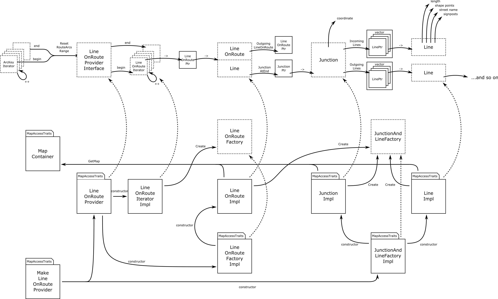

// Copyright (C) 2020 TomTom NV. All rights reserved.
//
// This software is the proprietary copyright of TomTom NV and its subsidiaries and may be
// used for internal evaluation purposes or commercial use strictly subject to separate
// license agreement between you and TomTom NV. If you are the licensee, you are only permitted
// to use this software in accordance with the terms of your license agreement. If you are
// not the licensee, you are not authorized to use this software in any manner and should
// immediately return or destroy it.

[[section-implementation]]
== Implementation

This diagram takes the public API and adds the classes that implement
the functionality.

Many of these classes are templates that take `MapAccessTraits` as a
parameter.  This allows them to use the same implementation with
different data access layers.  Where there are small differences,
template specializations can be used to implement both variants.

=== Junctions and Lines

There are `JunctionImpl` and `LineImpl` classes that implement the
bulk of the work of retrieving feature information from the map.  Both
classes keep a reference to the map data.  They currently retrieve
this information on demand, they do not cache it in any way.

Both `JunctionImpl` and `LineImpl` are constructed by an abstract
`JunctionAndLineFactory`.  The public interface hides the
implementation type, allowing use without depending on the map.  The
implementation `JunctionAndLineFactoryImpl`, however, does depend on
the map.

=== LineOnRoute

Similarly, there is a `LineOnRouteImpl` class that implements the
`LineOnRoute` interface.  `LineOnRouteImpl` objects are constructed by
an abstract `LineOnRouteFactory` which hides the implementation type,
so that it can be used without depending on the map.

=== LineOnRouteProvider

The implementation of `LineOnRouteProviderInterface` is
`LineOnRouteProvider`.  It constructs `LineOnRouteIteratorImpl`
objects to encapsulate the iterator functionality.  These iterators in
turn use the `LineOnRouteFactory` to construct the actual
`LineOnRouteImpl` objects.

=== MakeLineOnRouteProvider

We use dependency injection to minimise direct dependencies between
components and make them easier to test.  The top level factory method
is `MakeLineOnRouteProvider`, which instantiates the
`LineOnRouteProvider` and the `JunctionAndLineFactoryImpl` as the main
factory classes.
