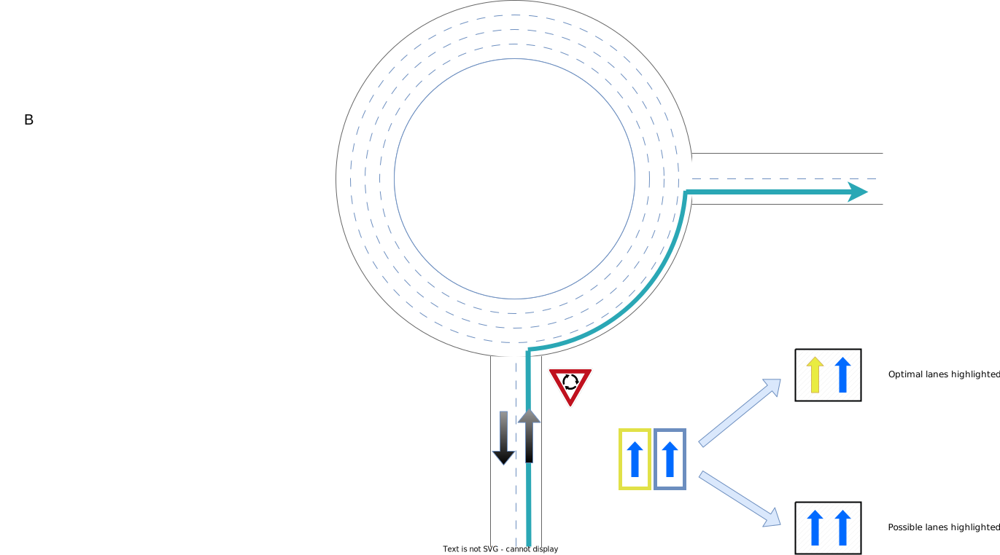

// Copyright (C) 2020 TomTom NV. All rights reserved.
//
// This software is the proprietary copyright of TomTom NV and its subsidiaries and may be
// used for internal evaluation purposes or commercial use strictly subject to separate
// license agreement between you and TomTom NV. If you are the licensee, you are only permitted
// to use this software in accordance with the terms of your license agreement. If you are
// not the licensee, you are not authorized to use this software in any manner and should
// immediately return or destroy it.

[[section-ux-requirements]]

== UX Requirements

=== Background

The core idea behind Lane Guidance is to instruct the driver to keep or change lanes as they drive along the route.
Even though the driver can usually choose the correct lane(s) by him/herself, the navigation system can assist with that
and reduce the cognitive load.

In general it can be said that the system _recommends_ which lanes the driver should take.
Whether this happens at the maneuver only, at some distance before the maneuver, or along the whole route, depends on
the product requirements and specification and the navigation system sophistication degree.

=== Types of Lane Guidance

It is important to distinguish between the different types of lane guidance:

* Simple Lane Guidance (SLG) - providing the driver with lane configuration at the maneuver.
Usually the configuration will consist of a widget which is essentially a top view schematic of the lane situation at
the maneuver point, with lanes separated by dividers, and each lane having an arrow depicting the direction the lane can
take the driver.
There is no attempt to reflect the real world situation, i.e. the arrows that are actually drawn on the road.
On top of that the navigation system recommends which lane(s) the driver should choose at that point.

* Lane Guidance Everywhere (or: Lane Level Navigation) - recommending the optimal lanes along the route not only at the
maneuver points but also as the driver drives from one maneuver towards another.
This is essentially dictated by the maneuvers between which the driver is located on the route, however in theory
traffic or lane closures can be taken into account to optimize driver's experience further.
This presents UI challenges to display such amount of information to the driver at once.

* Moving Lane Guidance (MLG) - providing any of the guidance elements described above, but contextually taking into
account in which lane the driver is located.
To provide such level of context the system would need to know the real driver position not only along the route but
also across the lanes.

=== Lane recommendations

A term which was mentioned several times above is _lane recommendation_.
It is being questioned the very days of writing of this document what exactly is lane recommendation.
But what is this recommendation, or more precisely, the lanes are recommended for _what_?

Consider the following two approaches:

. Lane is recommended when choosing it by the driver will ensure he/she can take the upcoming maneuver.
Not adhering to the recommendation will prevent the driver from taking the maneuver.
In everyday life in Guidance we call it *arrow recommendation*, simply because all _arrows_ pointing to the
same direction adhere to the condition in the previous sentence.
For example, if the maneuver is Turn Right, the driver must be on one of the lanes that have the Right arrow.  If more
than one lane exists that answers this condition then all of them will be recommended.
That is, the system recommends _possible_ lanes.

. Lane is recommended to minimize driver's effort of switching lanes before and after the maneuver, with the
consideration of where the driver is coming from (previous maneuver), the maneuver the driver needs to take immediately,
and the maneuver which follows to that one.
In Guidance we call it *lane recommendation*, because it operates on individual lane level based on lane change costs.
That is, the system recommends _optimal_ lanes.
More than one lane might be recommended as _optimal_ lanes, if the cost of changing to them is similar.
For example, driving on a highway past an exit, it would cost the same to take any of the lanes that keep the driver
on the highway.

Example for highway exits:

image::images/ux_requirements_highway_exit.svg[Highway Exit,align="center",width="500"]

Example for roundabouts:

(The above diagrams can be found and edited on link:https://confluence.tomtomgroup.com/x/imOEQw[this page]).

=== Exposing lane recommendations in TomTom SDKs

The problem that we have recently encountered reveals a discrepancy between the requirements of different TomTom
navigation SDK customers.
The lane guidance parts of the SDKs that we provide, NK2 SDK and GO SDK, are designed differently since different
customers had different requirements.

* For NK2 SDK and the HCP3 system the customer wanted to be able to recommend the _optimal_ lanes for the driver.
NK2 SDK public API was designed to provide both optimal and possible recommendations.
* For GO SDK and AmiGO the requirement was to recommend the _possible_ lanes for the driver.
GO SDK public API was designed to provide only the possible recommendations.

Given the data is provided in some way in the SDK, a possibility for the SDK client would be to consume both optimal and
possible recommendations, and then provide them to the driver by differentiating between them on visual and/or audio
levels.

=== Defining UX further

The question of optimal vs. possible lane recommendation remains relevant also as Lane Guidance Everywhere is being
designed.
The UX requirements for Lane Guidance are being rethought and brought together these days, while taking this question
into account and trying to answer it.
