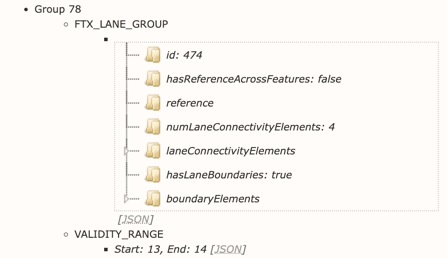
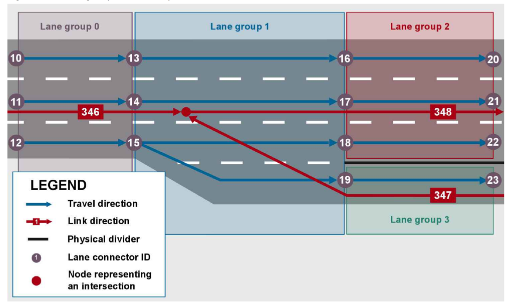
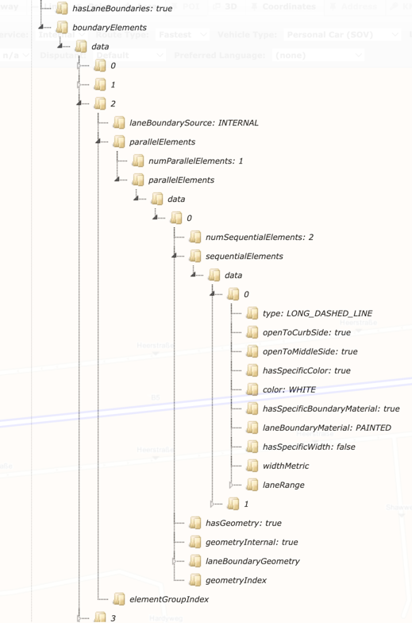
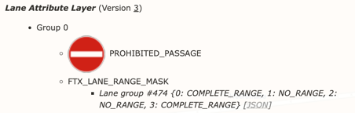
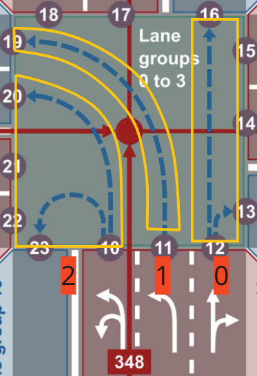

// Copyright (C) 2020 TomTom NV. All rights reserved.
//
// This software is the proprietary copyright of TomTom NV and its subsidiaries and may be
// used for internal evaluation purposes or commercial use strictly subject to separate
// license agreement between you and TomTom NV. If you are the licensee, you are only permitted
// to use this software in accordance with the terms of your license agreement. If you are
// not the licensee, you are not authorized to use this software in any manner and should
// immediately return or destroy it.

[[section-map-concepts]]
== Map Concepts

This chapter provides an overview of the basic concepts of FTX (Fast Track Extension) data structure, including `Lane Groups`, `Lane Connectivity Elements`, `Lane Boundaries`, and `Lane Range Masks`.
It also addresses important concepts that are missing from the FTX documentation, specifically the mapping between code and map terminology.

=== Map structure

This section will provide an overview of the fundamental concepts within FTX data structure.

==== Lane Groups

A lane group is a set of one or more lanes.
All lanes within one lane group have the same travel direction.

.`Lane group consists of:`
* Lane group ID - The lane group ID shall be unique per tile.
* References to other features
* Connected lanes
* Lane geometry
* Lane boundaries

Lane groups shall not overlap if they are assigned to the same base link or road geometry line and have the same travel direction.
A `VALIDITY_RANGE` attribute describes the length of a lane group on a link.
Lanes in one lane group are ordered from the curbside to the middle of the road.
Lane widths and lane lengths in one lane group may vary.

=== Lane Connectivity

The lane connectivity describes possible maneuvers between lanes.
Lane connectivity is modeled with lane connector IDs.
If two lane groups share a border, each driveable lane within those groups must be connected to a lane in the adjacent lane group.
The lane connector ID is used to establish the connection between the source lane and the destination lane.
There are two connector IDs `sourceLaneConnectorId` and `destLaneConnectorId` in the travel direction.
Lanes in two lane groups are connected if the `destLaneConnectorId` of a lane group equals the `sourceLaneConnectorId` of the following lane group.

The lanes of the group are defined in the `laneConnectivityElements` sequence of the `FTX_LANE_GROUP` attribute:

* `Lane type` - Normal lane, entry lane, exit lane, or combination of entry and exit lane
* `List of connected lanes` - Lane connector IDs of source and destination lanes that are used to model lane connectivity within one lane group or across multiple lane groups

image::images/map_concepts_lane_connectivity_elements.png[Lane Connectivity Elements,align="center"]

=== Lane Boundaries

Lane connectivity elements (LCE) in a lane group are separated by lane boundaries.
Lane boundaries are defined in the sequence `boundaryElements` of the `FTX_LANE_GROUP` attribute.
These lane boundaries are defined as a sequence of `boundaryElements` in a `laneBoundaryGroup`.
The first group always refers to the curbside boundary.
The number of lane boundary groups equals
`numLaneConnectivityElements`*2. Each `boundaryElement` can contain multiple `parallelElements`.
The first parallel element refers to the element closest to the curbside.
Each `parallelElement` may contain several `sequentialElements` with different lane boundary types, for example, if a dashed line changes to a solid line along the road.
Multiple sequential elements within one parallel element shall be ordered by travel direction.

Sequential elements in a lane boundary with multiple parallel elements shall be cut when the traversability of the grouped boundaries changes.
The `openToCurbSide` and `openToMiddleSide` values of each sequential element shall reflect the traversability of the lane boundary, not the individual lane boundary parallel element.
To determine whether a change to an adjacent lane is allowed, the following rules apply, considering the flags `openToCurbSide` and `openToMiddleSide` in the LaneBoundaryElement sequence:

* If the `openTo*` flag is set to FALSE, then the vehicle is never allowed to change to the adjacent lane.

* If the `openTo*` flag is set to TRUE, then prohibition on the adjacent lane should be checked before changing the lane.

=== Lane Range Masks

The `FTX_LANE_RANGE_MASK` attribute is utilized to determine the spatial coverage of lane attributes.
When `FTX_LANE_RANGE_MASK` is not applicable to the entire feature, it associates with a lane group within the relevant tile using `LaneGroupId`.
The lane range mask can be applied to all lanes within the lane group or only to specific lanes within the group.
The value of `numLanes` indicates the number of lanes within the group that are affected by the lane range mask.
The `FTX_LANE_RANGE_MASK` attribute provides the following range types:

* `NO_RANGE` and `COMPLETE_RANGE` - there are two constants, that serve the purpose of defining the absence of a range and denoting a full range, respectively.
Additionally, to specify that an attribute group is intended for a collection of lanes between two shape or attribute points, the process involves combining `FTX_LANE_RANGE_MASK` with `VALIDITY_RANGE` and subsequently assigning this combined group to the relevant base link or road geometry line.
* `PERCENTAGE_RANGE` and `PATH_RANGE` - these range types define the spatial extent based on the lane geometry.

The key point is that when dealing with attributes that are applicable to certain lanes, it is essential to establish the specific lanes to which those attributes apply.
For instance, in the provided image below, there is an attribute called `PROHIBITED_PASSAGE` that applies specifically to lanes 0 and 3 within `Lane Group 474`, while it does not apply to lanes 1 and 2.

=== Mapping between code and data

In the previous chapter, the basic concepts of the map were mentioned, and these concepts need to be somehow represented in code to obtain the final result of lane guidance.
This chapter will present how the concepts from the map are represented in code.

The map data contains `LANE_GROUP`, which is represented as lane segment in the code.
Each `LANE_GROUP` in the map data consists of connectivity elements that are considered as lanes in the map, but in the code, a new term `TRACK` is introduced.

==== What is the difference between track and lane?

Before we proceed with the answer to that question, it is important to note that the term lane is used both in the data and in the code.
In the data, a lane refers to the same concept as a connectivity element, which is what we refer to as a track in the code.
The main difference between tracks and lanes in the code is that a track is contained within a lane, meaning that one lane can contain multiple tracks.
A lane serves as an abstraction that groups together the map data elements known as connectivity elements (or lanes), or as we currently refer to them, tracks (in the code).

In the code, the yellow box represents lanes on the road, the blue dashed lines represent tracks, while in the map data, the lanes are actually blue dashed lines, also known as connectivity elements.

Additionally, it is worth noting that in the map data, terms like lane boundaries are used, while in the code, the term lane dividers is utilized.

===== Source: https://nds.tomtomgroup.com/documentation/view/275/[Lane FTX Documentation]
