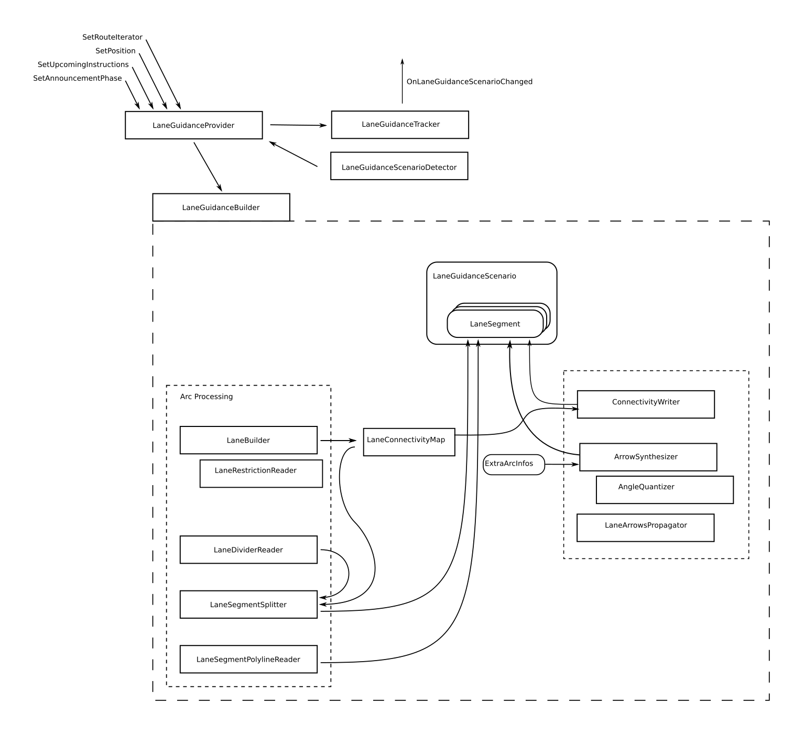

// Copyright (C) 2023 TomTom NV. All rights reserved.
//
// This software is the proprietary copyright of TomTom NV and its subsidiaries and may be
// used for internal evaluation purposes or commercial use strictly subject to separate
// license agreement between you and TomTom NV. If you are the licensee, you are only permitted
// to use this software in accordance with the terms of your license agreement. If you are
// not the licensee, you are not authorized to use this software in any manner and should
// immediately return or destroy it.

[[section-internal-components]]

== Individual Components

=== `LaneGuidanceProvider`
[plantuml, target=images/LaneGuidanceProvider, format=svg]
----
class LaneGuidanceProvider {
  +void SetRouteIterator(ArcKeyIterator, ArcKeyIterator, optional<CancellableArcIterableInterface>, std::string);
  +void Reset();
  +void SetPosition(Centimeters);
  +void SetScenarioInstructions(Instructions);
  +void SetAnnouncementPhase(Instruction, AnnouncementPhase);
  +void SetVehicleAttributes(VehicleAttributes);
  +bool IsScenarioNeeded() const;
  +RouteRange<ArcIntKey> GetRouteArcsRange();
  +Instructions GetUpcomingManeuverInstructions();
  +LaneGuidanceScenario BuildScenario(Instructions);
  +void SetScenario(LaneGuidanceScenario);
}
----

The external API for lane guidance used by NavKit2 is the `LaneGuidanceProvider`. This class is responsible for
`LaneGuidanceScenario` life cycle namely:

* determine the need for a new lane guidance scenario
* create a scenario
* track and update during the trip
* handle route change
* stop tracking

`LaneGuidanceProvider` uses following classes:

* `LaneGuidanceScenarioFactory` is a class encapsulating the lane guidance scenario creation logic. To create a scenario
the factory uses `LaneGuidanceBuilder`.
* `LaneGuidanceBuilder` encapsulates reading map data and building a lane guidance scenario.
* `LaneGuidanceTracker` is a class responsible for the keeping the scenario up-to-date. It also detects scenario changes.

=== `LaneGuidanceListenerInterface`
This external API is used by NavKit2 to communicate when the LaneGuidanceScenario has changed. The class shall that
inherits from this Interface shall provide the implementation of:
[source, cpp]
virtual void OnLaneGuidanceScenarioChanged(const LaneGuidanceScenario& scenario)

=== `LaneGuidanceScenario`

[plantuml, target=images/LaneGuidanceScenario_classDiagram, format=svg]
----
class LaneGuidanceScenario {
    +std::vector<LaneSegment> lane_segments;
    +SegmentId current_lane_segment;
    +SegmentId next_maneuver_segment_id;
    +AnnouncementPhase announcement_phase;
    +std::string router_id;
}
----
Apart from the scenario(list of lane segments) itself the class contains:

* announcement phase of the next maneuver instruction
* current lane segment
* next maneuver segment

=== `LaneGuidanceTracker`
[plantuml, target=images/LaneGuidanceTracker_classDiagram, format=svg]
----
class LaneGuidanceTracker {
  +optional<LaneGuidanceScenario> GetScenarioIfChanged();
  +void SetScenario(LaneGuidanceScenario);
  +void SetUpcomingManeuver(Centimeters, Centimeters, AnnouncementPhase);
  +void ResetUpcomingManeuver();
  +void SetProgress();
  +Centimeters GetProgress();
  +bool HasScenario() const;
  +bool HasEmptyScenario() const;
  +void ResetScenario();
  +void Reset();
}
----

This class owns the tracked scenario, finds the current lane segment and the next maneuver lane segment.
It tracks all the `LaneGuidanceScenario` fields and informs about scenario change by returning a not empty value via
`LaneGuidanceTracker::GetScenarioIfChanged()` call.

=== `LaneGuidanceScenarioFactory`

[source, cpp]
LaneGuidanceScenario CreateLaneGuidanceScenario(instructions,route_range,vehicle_attributes,route_progress)

The class finds `RoadStretch`(basically a list of arcs), off-route arcs and passes them togather with maneuver points
to `LaneGuidanceBuilder`.

Implements an abstract interface to simplify the testing process of `LaneGuidanceProvider`. This makes it possible to
write unit test w/o map data access instantiation and block the scenario build process to simulate different multithreading scenario.

=== `LaneGuidanceBuilder`
This diagram shows the core class of lane guidance, the
`LaneGuidanceBuilder`.

This is an engine that builds a complete `LaneGuidanceScenario`.  It
takes as inputs:

* Route, defined as a `RoadStretch`, which is a sequence of arc keys
plus start and end offsets
* A set of off-route arc keys that should also be included in the
scenario
* A set of maneuvers to include in the scenario, as a stripped-back
representation of the instructions

The output is a complete `LaneGuidanceScenario`, including:

* An array of ``LaneSegment``'s
* Indexes into ``LaneSegment``'s of interest: the current segment, and
the next maneuver segment
* The current announcement phase

The `LaneGuidanceBuilder` divides the work into two "chains".  The
"Arc Processing Chain" reads each Arc in turn and creates the
necessary ``LaneSegment``'s' from the ``LaneGroup``'s attached to the Arc.
This includes splitting the ``LaneSegment``'s to allow for changes in
dividers and at Arc boundaries.

While processing the Arcs, the `LaneGuidanceBuilder` populates some
intermediate data structures:

* `ExtraArcInfos` holds information related to each Arc. This
includes indexes of attached segments, and whether the arc is on the
route.
* `ExtraSegmentInfos` holds information related to each `LaneSegment`,
keyed by `SegmentId`.  This includes the index in the scenario of
the segment, the key of the associated Arc, and the restricted
lanes.
* `LaneConnectivityMap` holds information about individual connections
between lanes.  The map allows looking up a connection by segment
ID, lane ID, and direction.

The Arc Processing Chain consists of:

* `LaneRestrictionReader`
* `LaneDividerReader`
* `LaneSegmentSplitter`
* `LaneSegmentPolylineReader`

The second chain is the "Segment Processing Chain".  This part assumes
that the topology of the ``LaneSegment``'s is now established, and it
fills in detailed information.  This chain consists of:

1. `ConnectivityWriter`
2. `LaneLevelRouter`
3. `ArrowSynthesizer` (which makes use of `AngleQuantizer`)

These steps must be performed in the specified order.  See below for details.

=== `LaneRestrictionReader`

[plantuml, target=images/LaneRestrictionReader_classDiagram, format=svg]
----
class LaneRestrictionReader {
  +std::vector<LaneRestrictions> Read(LaneGroup);
}
----

This class returns a vector of `LaneRestrictions` using information from a
supplied `LaneGroup`.  It read the type of the lanes from the map, and at
the same time builds a vector of indexes of lanes that are restricted.
This restricted lane indices vector is used by `LaneBuilder` to know the
characteristics of the lanes.

=== `LaneBuilder`

[plantuml, target=images/LaneBuilder_classDiagram, format=svg]
----
class LaneBuilder {
  -LaneConectivityMap connectivity_;
  -LaneGroupResolution lane_group_resolution_;
  +LaneBuilder(LaneConnectivityMap, LaneGroupResolution);
  +AddLanes(LaneSegmentInternal);
  -bool IsTrackRestricted(size_t,std::vector<LaneRestrictions>);
  -bool IsTrackHov(size_t,std::vector<LaneRestrictions>);
}
----

This class creates lanes from lane connectivity elements (tracks).
It uses track connectors and restrictions to create a lane.
One lane is created for each unique source connector.
Restricted tracks are not added as lanes.
AddLanes method handles this and returns a map of lanes to tracks.

This class also updates the connectivity map, which is built up one
`LaneGroup` at a time.

=== `LaneDividerReader`

[plantuml, target=images/LaneDividerReader_classDiagram, format=svg]
----
class LaneDividerReader {
  -LaneSegmentsSplitter segment_splitter_;
  +LaneDividerReader(LaneSegmentSplitter);
  +void Read(LaneSegment,std::string, LaneGroupBoundaries,LanesToTracks);
}
----

This class reads divider information from a `LaneGroup` in order to
split an already created `LaneSegment`.  At the same time it stores
the discovered lane divider type in the `LaneSegment`.

The `LaneDividerReader` takes a reference to a `LaneSegmentSplitter`
as a constructor argument, and delegates to it the work of splitting
the segments.  This also provides writeable access to the
``LaneSegment``'s.

=== `LaneSegmentSplitter`

[plantuml, target=images/LaneSegmentSplitter_classDiagram, format=svg]
----
class LaneSegmentSplitter {
  -std::map<Centimeters,LaneSegment> lane_segments_splits_;
  -<members>...
  +LaneSegmentSplitter(std::function<SegmentId()>);
  +void Init(LaneSegment,std::string);
  +std::map<Centimeters,LaneSegment> GetSplits();
  +std::vector,LaneSegment> GetResultLaneSegments();
  +void Split(Centimeters);
}
----

This takes one `LaneSegment` (using `Init()`) and then allows
splitting it at a number of offsets.  The results can be retrieved as
a vector of new `LaneSegment`s.  The resulting segments have the
offsets adjusted, their polylines split at the appropriate place, and
connectivity adjusted.

Since this class creates new segments that do not correspond to
anything in the map, it needs to synthesise artificial segment and
connector IDs.  These are handled by provided generator functions passed
in the constructor.  In practice, we simply use a monotonically increasing
sequence of positive integers, since IDs from the map are guaranteed to be
positive integers.

=== `LaneSegmentPolylineReader`

This class updates a `LaneSegment` with a polyline taken from the map.

=== `ConnectivityWriter`

This class consumes the information stored in `LaneConnectivityMap`
and creates all of the lane connections in the `LaneGuidanceScenario`.

=== `LaneLevelRouter`

This class is in charge of creating `LaneLevelRouteSections` from all `LaneSegments`
in the `LaneGuidanceScenario`. It contains the costs of driving from all lanes in all segments
of the scenario to all lanes in the final segment of the scenario. Lanes with a
cost other than `infinite` can be used to reach the respective lane in the final
segment; the lower the cost, the easier it is to get there.

For more information see <<section-lane-level-router>>.

=== `ArrowSynthesizer`

This class takes both the `ExtraArcInfos` and `ExtraSegmentInfos` and
adds arrows to all the `LaneSegments`. Note that arrows are synthesized on the
last on route segment as elsewhere if there are multiple outgoing segments.
If not, straight arrows are assigned to the last segment. In both cases the arrows are propagated backwards
until an exit condition is encountered, usually a fork on the route or exceeding the maximum backward propagation distance.
It needs to retrieve `LaneSegments` based on a `SegmentId`, so the `LaneSegmentBuilder` passes a lambda function
for that purpose.
The class also receives a function that allows to determine if the segment is on route.

Arrow synthesis must happen after the connectivity has been built by
`ConnectivityWriter` and after `LaneLevelRouter` computes the routes.

For more information see <<section-arrow-synthesis>>.

=== `LaneArrowsPropagator`

* Propagates a segment's arrows to previous lane segments until a segment that already contains lane arrows
* During each propagation, decay will be applied while filling the segments located further than 1 km from propagation source
** This decay consists in turning each lane's non-empty arrow collection to a single straight element.
** The result element will be recommended if and only if original collection contains at least one recommended arrow.

=== `HovLaneRecommender`

This class sets the lane and arrow recommendation depending on the presence of HOV lanes and instruction available
in the `LaneGuidanceScenario`. This class shall be called at the end of the `LaneGuidanceScenario` creation, as it
can override/update the previous recommendations set before. If `HovLaneRecommender` determines an HOV stretch is
available, it will remove the lane and arrow recommendations that do not match this HOV lane.
See <<section-hov-recommendation-postprocessing,Hov Recommendation Postprocessing>> for more information.

=== `RoadInformationBuilder`

=== NDS Map intermediary components

==== `LaneGroupReader`
Given an arc key, it reads the lane group information from the map.

==== `LaneRestrictionReader`
Given the LaneGroupId, it reads the restrictions of it, such as if the lane is carpool lane (HOV), it has opposing traffic, etc.

==== `ProhibitionReader aka. LaneProhibitionReader`
It provides a way to know if a lane is unconditionally prohibited given a vector of prohibitions for the lane group.

==== `LaneSegmentPolylineReader`
Given the LaneGroupId, it fills the LaneSegment polyline vector.

==== `LaneTollPaymentTypesReader`
Given the LaneGroupId, it reads the types of tollpayment accepted in that given group. From cash and coins, cash bills only, subscription, etc.
