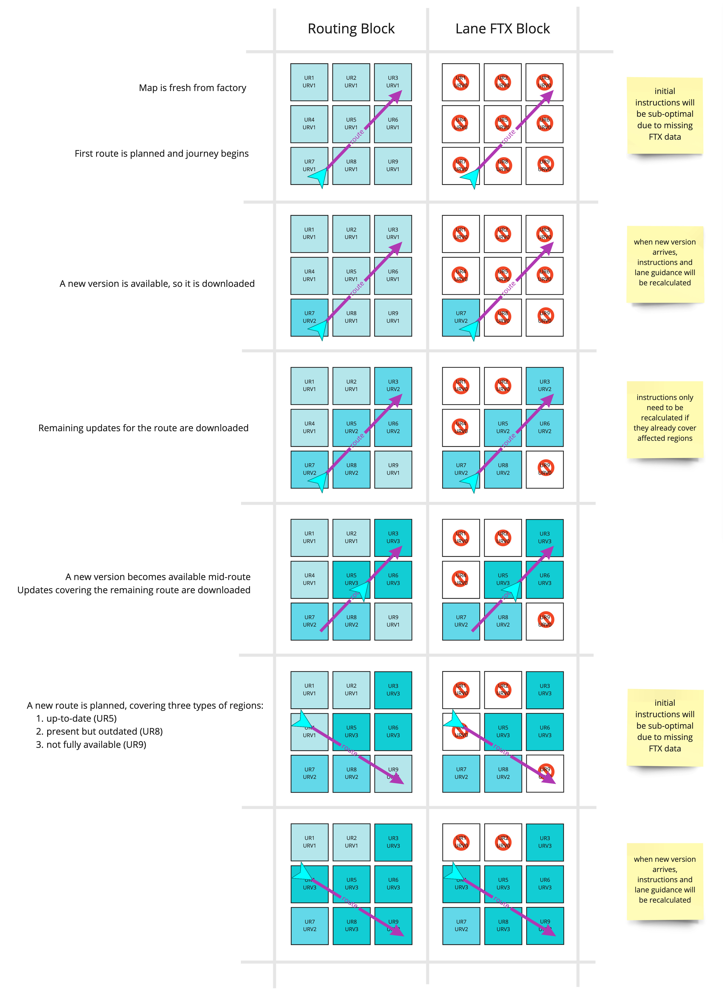
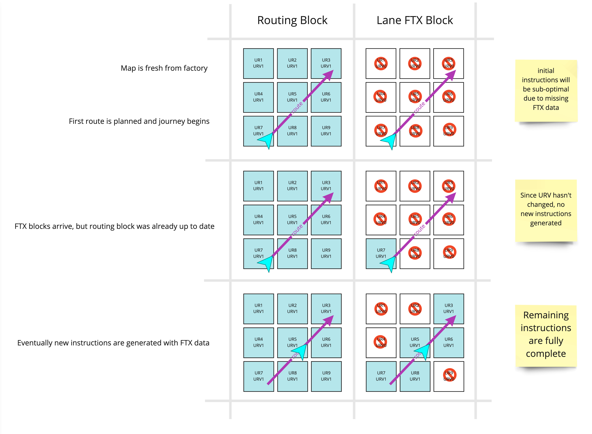

// Copyright (C) 2020 TomTom NV. All rights reserved.
//
// This software is the proprietary copyright of TomTom NV and its subsidiaries and may be
// used for internal evaluation purposes or commercial use strictly subject to separate
// license agreement between you and TomTom NV. If you are the licensee, you are only permitted
// to use this software in accordance with the terms of your license agreement. If you are
// not the licensee, you are not authorized to use this software in any manner and should
// immediately return or destroy it.

[[section-map-updates]]

== Map Updates

Lane Guidance is generated from lane information stored in the
https://nds.tomtomgroup.com/documentation/view/275/[Lane Fast Track
Extension (FTX) Building Block] of a map in NDS format.  NDS maps may
be updated on occasion in a process that may take a short period of
time.  These updates need not include all FTX blocks.  This document
describes how the Lane Guidance system handles map updates.

=== Building Blocks

The map data is divided into "building blocks" ("BB") targeted at
different applications.  The important building blocks for lane
guidance are the ROUTING BB and the LANE FTX BB.

The ROUTING BB contains almost all the information used to build
instructions.  This includes road geometry, road classes, road names,
and road signs.  These are attributes of map features, i.e. links and
geolines.  Also relevant are the NAME BB and the SPEECH BB, which
provide extra text information.

The LANE FTX BB contains a mostly-independent network of lane groups.
Each lane group includes information about connectivity between lane
groups and the dividers on either side of the lane.  The lane groups
are attached to map features as attributes.  Each lane group can be
attached to multiple map features.

=== Map Update Service

From the point of view of Lane Guidance, the map service provides two
features: locks and updates.

A map can be locked to indicate that it is currently being used and no
update should be performed.  Map users should try to hold map locks
for as little time as possible, so that map updates can be applied in
a timely fashion and the user is not guided by outdated map data.

The map service also provides callbacks to indicate map update
progress.  One callback indicates that a map update is about to
happen.  Listeners are allowed to wind down services that may be
running in the background before returning from the callback.  The
next callback indicates that a map update is complete.

The map service update callbacks do not indicate which region was
updated, and do not indicate the new or old versions.  The versions
can be queried from the NDS data access layer.  The precise behaviour
of the map service is still somewhat in flux, see
https://jira.tomtomgroup.com/browse/NAV-65137[the corresponding epic].

=== Map Versions

Changes in the map can be tracked with version numbers.  The map is
divided into update regions which are updated independently.
Therefore each update region has its own version.  Each version of
each update region has an ID, and this is referred to as the "Update
Region Version ID".  This should not be confused with the "Update
Region ID" or the "Update Region Version".  For handling map updates
in Lane Guidance, we use the Update Region Version ID to determine
when a map is invalidated.

Update Region Version IDs are opaque integers.  They may be compared
for equality, but in principle they have no meaningful ordering.  In
practice they count upwards from 1, with 0 indicating invalid data.
However we should strive not to rely on those facts.

In a given state of an NDS map, different building blocks in the same
update region may be in different states of update, with different
update region version IDs.  However, a single update region version ID
defines a consistent set of building block versions.

For example, suppose an update region has version IDs 1, 2, and 3, and
blocks A and B.  Suppose currently block A is at version 1 and block B
is at version 2.  It is guaranteed that there is, somewhere, a well
defined block A version 2.  In order to bring the blocks into
alignment, it is not necessary to skip to version ID 3.

In practice the data access layer of NK2 hides these details from the
instruction engine.  The map service ensures that all building blocks
are aligned before releasing the updated map to downstream consumers -
with the important exception of LANE FTX block data, about which see
below.  As a result, the instruction engine only has one update region
version ID for each update region, which is the maximum of the version
IDs of that update region in the map.  We are not able to distinguish
the update region version IDs of different building blocks.

=== Loading of Updated Map Data

For a navigation solution based on onboard maps, the NDS map is
delivered with all ROUTING BB data present, but no LANE FTX BB data.
This is because the Lane data is non-essential for navigation and very
large.  Therefore the update region version ID of the routing BB will
be some positive integer for all regions, and the update region
version ID of the LANE FTX BB will be 0 for all regions.  This is the
only exception to the rule that the update region version IDs for all
BBs must be the same for a given update region.

When a route is planned, there are two important situations.  Since
map updates are frequent, the usual case is that the
fresh-from-the-factory ROUTING BB will already be outdated.  Therefore
ROUTING BB and LANE FTX BB data will be loaded at the same time.  The
edge case is if there truly are no map updates to apply.  In that case
only the LANE FTX BB will be loaded.

The system also needs to save space by uninstalling LANE FTX BB data
in unnecessary update regions.  In principle this can result in a map
update clearing a LANE FTX BB that was previously present, even if
that update region covers an upcoming stretch of the current route.
This would normally be considered a bug, but in any case the system
should handle this gracefully.

// Below diagrams taken from https://miro.com/app/board/uXjVOW7Rab0=/?invite_link_id=103758547459

==== Usual Case: ROUTING and LANE FTX BBs updated

Map updates take time, and we intend to provide as small a time to
first instruction as possible.  Therefore the instruction generation
will quickly provide the first few instructions for the driver.  Since
there is not yet any LANE FTX BB, these instructions will be
sub-optimal.  Instructions that depend on lane information, such as
enter HOV instructions, may be omitted or incorrect.  However, the
routing BB should always be enough to generate correct instructions
that will safely guide the driver.

Once the map update is applied and the LANE FTX BB is available, the
instructions will be updated.  These should not contradict any earlier
instructions generated without the LANE FTX BB.  We might allow
instructions to be enhanced ("turn right" to "turn right from the
right-most two lanes"), or new instructions to be added ("change into
the right-hand lane").  But guidance should not confuse the driver,
e.g. by changing "turn left" into "bear right".

As the car drives, instructions may be generated for parts of the
route in upcoming update regions.  These may trigger more map updates.
However, these map updates should arrive early enough that the
instructions are already complete when they are presented to the
driver.

If a map update becomes available during navigation, instructions will
be regenerated from the current car position if that portion of the
route is affected.  Updates to update regions behind the current car
position may be applied, but would not cause instructions to be
regenerated.

==== Edge Case: Only LANE FTX BB updated

If the ROUTING BB is actually up-to-date and only the LANE FTX BB
needs to be updated, the overall update region version ID of the
update region will not change.  In this case the instruction engine is
unable to detect that any map change has occurred, and will not
automatically restart instruction generation.

This is a sub-optimal edge case in that instructions might not be
enriched with lane information even though that lane information
becomes available.  This is considered an acceptable degradation,
because it is very unlikely to occur in practice.

=== Handling Map Updates

Lane Guidance generation and map updates are both handled within the
trip service by the `TripGuidanceManager`, in both its
`OnboardTripGuidanceManager` and `OnlineTripGuidanceManager`
specialisations.  This document only covers the onboard case.

Lane Guidance scenarios are generated one at a time, in a background
thread.  When a lane guidance scenario is invalidated by a map update,
we discard the existing scenario and build a new one from scratch.

Routes are provided to the `LaneGuidanceProvider` as a sequence of
arcs defined by a pair of `ArcKeyIterator` objects representing the
start and end of the route.  Each arc key in the sequence contains the
update region version ID of the map data used to map-match the route.

The map may be updated between the arc sequence being read and the
lane guidance being generated.  The `LaneGuidanceProvider` locks the
map and makes it available to the `LaneGuidanceScenarioFactory`.  The
`LaneGuidanceScenarioFactory` checks each arc in the sequence against
the version reported by the map.  If a mismatch is detected, lane
guidance generation is aborted.

If there is a mismatch in versions, we can assume that eventually a
new map-matched sequence of arcs will be reported by the route by
`OnDataChanged`.  At that point lane guidance generation will be
attempted again.

One consequence of this approach is that if the map update does not
affect the portion of the route in front of the current car position,
we will not regenerate lane guidance.

=== Appendix: Sequence Diagram

This diagram shows what happens when a map update is applied during navigation.

[plantuml, map-update-applied, svg, alt="Sequence diagram of map update being applied during navigation"]

....

@startuml

participant MapService
participant RoutingEngine
participant TripGuidanceManager
participant LaneGuidanceProvider

MapService -> TripGuidanceManager : Map
RoutingEngine -> TripGuidanceManager : Route
TripGuidanceManager -> LaneGuidanceProvider : Arc Keys
LaneGuidanceProvider -> MapService : Lock
note right
lock is held until
one lane guidance
scenario is generated
end note
LaneGuidanceProvider -> TripGuidanceManager : Lane Guidance
LaneGuidanceProvider -> MapService : Unlock
...
MapService -> TripGuidanceManager : Begin Map Update
MapService -> TripGuidanceManager : End Map Update
RoutingEngine -> TripGuidanceManager : Route
TripGuidanceManager -> LaneGuidanceProvider : Arc Keys
LaneGuidanceProvider -> MapService : Lock
note right
lock is held until
one lane guidance
scenario is generated
end note
LaneGuidanceProvider -> TripGuidanceManager : Lane Guidance
LaneGuidanceProvider -> MapService : Unlock

@enduml

....
