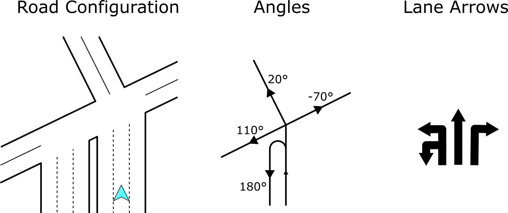
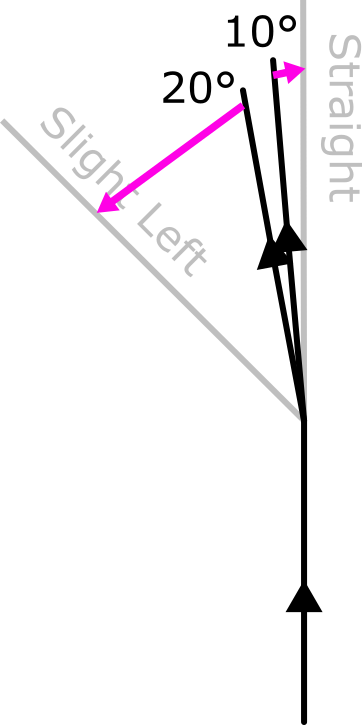
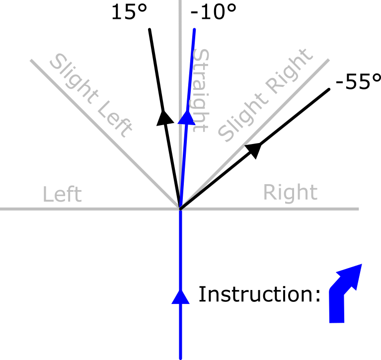
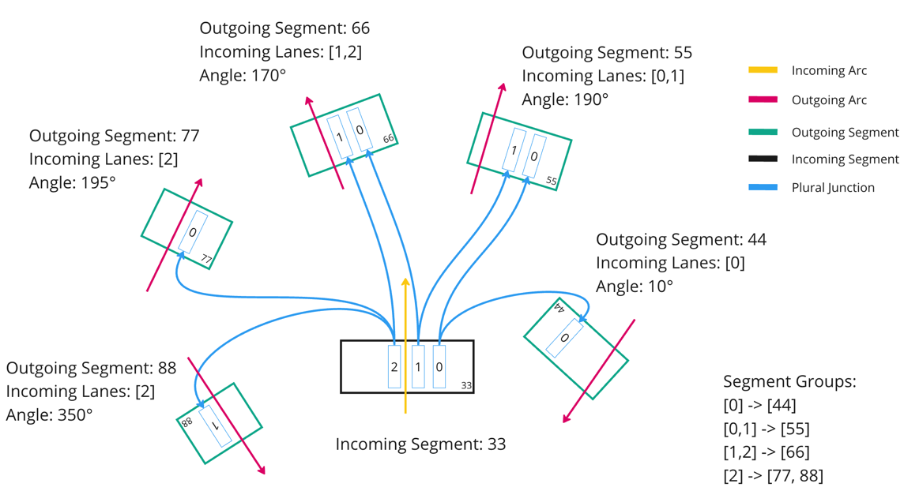

// Copyright (C) 2020 TomTom NV. All rights reserved.

[[section-arrow-quantization]]

== Arrow Quantization

At any intersection the map provides a number of road directions at an
angle in degrees.  This is too precise for drivers to take in,
especially at highway junctions where the angles involved are very
close to each other.  Therefore we provide a stylised view in which
each possible direction is represented as just one of nine possible
arrows, from left u-turn through continuing straight to right u-turn.
The task of mapping angles to these arrows is arrow quantization.

Since the simplified view contains less information than the source
data, this involves compromises and is necessarily imperfect.

=== Consistency With Instructions

Instructions also have a quantised turn direction.  The meaning can be
slighty different for different instruction types: for simple turns it
indicates the overall steering direction, for highway exits it
generally indicates the side of the highway on which the exit appears.

These directions are both shown visually and also read out to the
driver.  The audio instructions also have subtle variations in
meaning, for example "turn slight right" versus "bear right".

The
behaviour of instructions is defined in
https://confluence.tomtomgroup.com/pages/viewpage.action?spaceKey=FlaminGO&title=NIE_011.6+-+Turn+Angle+representation[the
UX spec].

Instruction directions and lane directions serve different purposes
and are calculated in different ways:

* Instruction arrows are computed with a particular route in mind and
  can look further ahead.
* Lane arrows must show alternatives not taken by the driver, which
  only makes sense on a shorter horizon.
* Lane arrows must be consistent with each other: we can't allow a
  lane on the left to have an arrow that implies crossing an arrow in
  a lane on the right.
* Instruction arrows are only computed at junctions, whereas lane
  arrows are a continuous feature along the route.

One effect of these constraints is that the rules for lane arrow
calculation are rather simpler than the business logic defined for
instruction arrow calculation.

Another effect is that lane arrows in maneuver segments can contradict
the equivalent arrows in the corresponding instruction.  We should try
to minimise these contradictions, because they can be very confusing
for the driver.  It's also necessary for the UI to be designed in a
way that emphasises that these are distinct types of information.

=== Desirable Properties

We would like the mapping to have the following properties if possible:

* Always use the same arrow to represent the same destination road
* Different destination roads have different arrows
* Arrows correspond to the direction as it appears to the driver
* Arrows match the ones painted on the road
* Arrows for the road you should take match the arrow for the corresponding instruction
* At a given intersection, the same set of arrows are generated regardless of which road is taken

Clearly these properties can conflict with each other.  For example if
there are three roads squeezed between "go straight" and "slight left",
either two must use the same direction, or at least one must not
correspond to the real angle on the road.

One desirable effect is that where one direction is overcrowded with
outgoing roads, the furthest roads can be "pushed" outwards, even if
that quantises them to an angle that is not the nearest.  For example
in the below example both of the outgoing roads, 10° and 20°, are
closest to going straight.  But since "go straight" is occupied by the
10° road, we prefer to quantise the 20° road to "slight left".

=== Implemented Heuristic

The key assumption of the implementation is that every angle falls
with a 45° sector between two directions, and the final result must be
one of those two.  For example if an angle is 20° we'll either
quantize it to straight (0°) or slight right (45°).  Then if there are
`N` outgoing roads, then the solution space consists of the 2^`N`^
combinations of those choices.

We furthermore assume that there are no more than 10 outgoing roads -
if there are more than 10 the solution will be suboptimal anyway, so
we just quantise each angle to its nearest direction.  This allows us
to compute a total "cost" for each of 2^10^ = 1024 possible solutions
and choose the one with the lowest cost.

The cost is computed as the difference in degrees between the angle
and the quantised angle.  In addition, there is a penalty of 100 when
the quantised angle is already occupied by another outgoing road.
There is also a penalty of 50 when the outgoing road is on route but
the quantised angle does not match that of the instruction.

It's important to note that in countries where driving is on the right side, it's not possible to get a `UTurnRight`
direction, just as in countries where driving is on the left side, it's not possible to get a `UTurnLeft` direction.
If one of these directions is calculated based on the angle, `SharpRight` and `SharpLeft` will be returned, respectively.

=== Example

Consider the following configuration of outgoing roads, where blue
marks the intended route.  The instruction at this point is to take a
slight right.

If we simply matched each arrow to the closest direction, we would end
up with the following costs.

[cols="1,1,1"]
|===
|Angle|Direction|Cost

|15°
|Straight
|15 + 100

|-10°
|Straight
|10 + 100 + 50

|-55°
|Slight Right
|10

|Total
|
|285
|===

There is a large penalty since two angles have the same direction, as
well as a penalty since the intended direction does not match the
instruction direction.

We can avoid the penalty for the same direction by having the angle
closest to straight "win" and push the other to the other side:

[cols="1,1,1"]
|===
|Angle|Direction|Cost

|15°
|Slight Left
|30

|-10°
|Straight
|10 + 50

|-55°
|Slight Right
|10

|Total
|
|100
|===

However, this still pays a penalty since the intended direction does
not match the instruction direction.  We can fix that by instead of
pushing the far left angle further to the left, we push the other two
to the right:

[cols="1,1,1"]
|===
|Angle|Direction|Cost

|15°
|Straight
|15

|-10°
|Slight Right
|35

|-55°
|Right
|35

|Total
|
|85
|===

Since this solution has the lowest cost, this is the one that is chosen.

=== Eliminating Conflicting Arrows

As already mentioned in the section <<Consistency With Instructions>>: `Lane arrows must be consistent with each other:
we can\'t allow a lane on the left to have an arrow that implies crossing an arrow in a lane on the right`.

Unfortunately, this has not been met and there were examples of arrows being conflicting.
Conflicting arrows are those that point towards routes that would intersect or cross paths with each other.
This issue can happen because of different reasons. These may include a bug in the map,
a wrong calculation of the source or target segment. The primary culprit often turns out to be the `plural junction` arcs.
This is because the angle calculation is performed solely for the `incoming` and `outgoing` arc,
neglecting the presence of multiple `plural junction` arcs between them.

In this section, we won't focus on how the angle is determined for arrow quantization, but solely on how to eliminate
conflicting arrows after the angles have already been calculated. It's important to know that there is a single
`incoming segment` and multiple `outgoing segments`. Each segment has corresponding arc, which is used for calculating the angle
between the `incoming` and `outgoing` segments.

<<<
The algorithm for eliminating conflicting arrows can be divided into four steps:

1. Sorting Outgoing Segments by Incoming Lane IDs
2. Creating Segment Groups Based on Lane IDs
3. Clamping Segments Angles belonging to Outer Groups
4. Adjusting Angles Among Groups

Before each step of the algorithm is explained, the following example will be used to demonstrate how conflicting
arrows can occur in the first place.

image::images/angle_quantization_4.png[width=800]

In the situation shown in the image, there are two directions: `straight` and `slight right` `(↑ ↗)`.
However, due to the presence of plural junction arcs, the angles calculated for the yellow and green arcs indicate
directions of `straight` and `slight left` `(↑ ↖)` which is conflicting.

==== Sorting Outgoing Segments by Incoming Lane IDs

The term `Lane ID` refers to the ordinal number assigned to a lane within a given lane segment, from the curb
towards the middle side.

Before we proceed to the first step of the algorithm, i.e., the sorting process, it's important to clarify the
relationships between the terms: `Incoming arc`, `Outgoing arc`, `Incoming segment`, `Outgoing segment` and `Angle`.
In the image below, all the previously mentioned terms can be observed, i.e., each segment has its own arc on which it is located.
From this, we have the `Incoming arc` and `Incoming Segment`, as well as the `Outgoing Arc` and `Outgoing Segment`.
The `Angle` is calculated between the `Incoming arc` and `Outgoing arc` and can be associated with the `Outgoing Segment`.

The first step of the algorithm is the most crucial part of the overall idea behind the algorithm itself.
The algorithm is based on sorting the `Outgoing Segments` by the `Incoming Lane IDs` of the `Incoming Segment`.
The sorting is done in such a way that the `Outgoing Segment` with the closest `Incoming Lane ID` to the curbside is placed first.

Sorting is a key part of the algorithm as it arranges the `Outgoing Segments` (along with the `Angles`) in an order such
that the directions towards these Segments shouldn't intersect. If during sorting two segments have identical
`Incoming Lane IDs`, i.e., we encounter a tie situation, the segments will be sorted based on their angles.
Specifically, for countries where driving is on the `right side`, they will be sorted in `non-ascending` order,
and for countries where driving is on the `left side`, they will be sorted in `non-descending` order. As mentioned above,
Segments are sorted from the curbside to the middle side. This means that for countries where driving is on
the right side, 360° is the angle (UTurnRight) that is closest to the curbside, while in countries where driving
is on the left side, that is 0° angle (UTurnLeft). Therefore, the sorting order is different for left and right driving sides.

In the example from the image, the interesting Segments are `88`, `77`, and `44`, which based on their angles indicate
completely different directions: `UTurnRight`, `UTurnLeft`, and `SlightRight`, respectively. With sorting, we can conclude
that something is off with these angles (e.g. we can't make `UTurnRight` from middle side lane) and that they need further processing.
The following steps of the algorithm deal with the processing of such angles.

==== Creating Segment Groups Based on Lane IDs

This part of the algorithm is merely a preparation for the next step. In this step of algorithm, segments are grouped based on
`Incoming Lane IDs`. If two segments can be reached using the same set of lanes, then such `Segments` are grouped.
In the example from the image, we have four groups:

* [0] -> [44]
* [0,1] -> [55]
* [1,2] -> [66]
* [2] -> [77, 88]

Segments `77` and `88` are in the same group because their `Incoming Lane IDs` are identical, i.e., both segments are only
reachable from lane `2`.

==== Clamping Segments Angles belonging to Outer Groups

As mentioned, in the image there are three problematic segments: `88`, `77`, and `44`. This part of the algorithm will process
segments which belongs to `Outer Groups`.
In the previous step of the algorithm, `Segment Groups` were created. `Outer Groups` refer to the groups from
created `Segment Groups` that are at the beginning and the end of the array, i.e., the groups that are closest to
the curbside and the middle side.

From the previously created groups, in this step of algorithm, two groups are used: `[44]`, which can be reached from lane 0,
and `[77, 88]`, which can be reached from lane 2. The issue with these groups is the exceeding of 360 degrees, specifically
the angles at segment `44` and `88`. Currently, based on the angle, `Segment 44` has the direction of the arrow as `UTurnLeft`,
while `Segment 88` has the direction as `UTurnRight`. Due to the sorting from the first step, we can conclude that these
angles have exceeded 360 degrees and need to be clamped. This is because, we can't make a `UTurnRight` from the middle lane
nor a `UTurnLeft` from the curbside lane (for right hand driving countries).

The angles can be clamped to either `0` or `360` degrees, depending on whether it's a `curbside` or `middle side` group, and on the `driving side`.
Therefore, we have four distinct cases:

1. Right hand driving side and a curbside group - Clamping to `360` degrees
2. Right hand driving side and a middle group - Clamping to `0` degrees
3. Left hand driving side and a curbside group - Clamping to `0` degrees
4. Left hand driving side and a middle group - Clamping to `360` degrees

However, the process for cases `1` and `4`, as well as for cases `2` and `3`, is essentially the same. Therefore, while we
technically have four different cases, we can effectively reduce this to two unique scenarios due to the repetition of the clamping process.
Now we can explain the clamping process in the previously mentioned two unique scenarios.

Groups can contain one or more segments. It's also important to note that a group can contain a segment with a correctly calculated angle,
and the clamping process should not change it. Clamping process is performed for each angle within the group, following these steps:

**Right hand driving side and a curbside group / Left hand driving side and a middle group**

* Subtract 45 degrees from the angle.
* Normalize the resulting value.
* Add 45 degrees to the normalized value.
* Check if this updated value is greater than or equal to 360.
* If the updated value is indeed greater than or equal to 360, the angle is clamped to 360. Otherwise, the angle retains its original value.

**Right hand driving side and a middle group / Left hand driving side and a curbside group**

* Add 45 degrees to the angle.
* Normalize the resulting value.
* Subtract 45 degrees from the normalized value.
* Check if this updated value is less than or equal to 0.
* If the updated value is indeed less than or equal to 0, the angle is clamped to 0. Otherwise, the angle retains its original value.

In other words, the process adjusts the angle by a fixed amount (`45` degrees), normalizes it to fall within the range
of 0 to 360 degrees, and then `subtracts`/`adds` back the `45` degrees.
The resulting angle is then compared to `0`/`360` degrees to determine if it needs to be clamped.

The value `45` is chosen because the angle between two directions (for example, Straight and Slight Right) is
around 45 degrees.

Finally, segments in the group are sorted based on the adjusted angles. The order of sorting is determined by the `driving side`.
If it's right-hand driving, the segments are sorted in `non-ascending` order of their angles.
If it's left-hand driving, the segments are sorted in `non-descending` order.

==== Adjust Angles Among Groups

At this stage, the only angle that still causes conflicting arrows in the example from the image is the angle belonging to `Segment 77 - 195°`.
Since the example from the image is for a right-hand driving side, the list of angles looks like this
(sorted from curbside to middle side): `360°, 190°, 170°, *195°*, 0°`. What can be observed is that only the angle of `195°`
disrupts the order of the sorted angles. Therefore, this step of the algorithm deals with adjusting angles after solving edge cases.

In this step of the algorithm, the aim is to resolve any conflicts in the order of the angles. This is achieved by making
slight adjustments to the angles to ensure they follow the correct order.

The process begins by identifying the `straightest` angle, which is the one closest to `180°`. This angle serves
as a reference point for the adjustments that will be made. If there are several angles equally close to `180°`, the last
such angle will be chosen.

The adjustment process then proceeds in two directions, towards the `curbside` and the `middle side`. For each angle,
the algorithm checks if it's in the correct order compared to the previous one. If an angle is found to be out of order,
it's adjusted to match the value of the last correct angle.

Depending on the `driving side` and whether the adjustment is towards the `curb` or `middle` side, a value of `1` is
either added or subtracted from the out-of-order angle. This ensures that the angles are in the correct order and
no conflicting arrows are present.

In the example from the image, the angle of `195°` will be adjusted to `169°`. Therefore, the final list of angles will
look like this: `360°, 190°, 170°, *169°*, 0°`.

It's important to note that if two identical angles are found in the list, they will also be adjusted (`180°, 180°` -> `181°, 180°`).
Additionally, angles cannot be less than `0°` or greater than `360°`.
