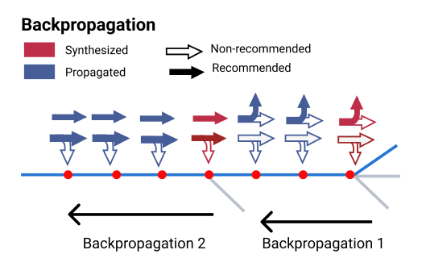
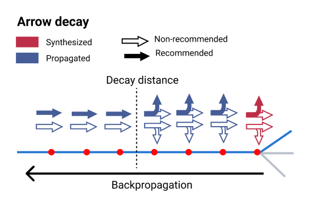
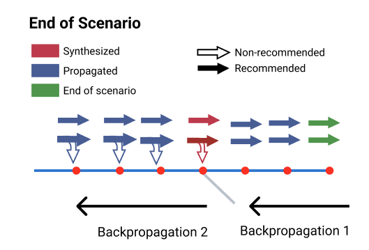

// Copyright (C) 2023 TomTom NV. All rights reserved.
//
// This software is the proprietary copyright of TomTom NV and its subsidiaries and may be
// used for internal evaluation purposes or commercial use strictly subject to separate
// license agreement between you and TomTom NV. If you are the licensee, you are only permitted
// to use this software in accordance with the terms of your license agreement. If you are
// not the licensee, you are not authorized to use this software in any manner and should
// immediately return or destroy it.

[[section-arrow-propagation]]

== Arrow Propagation

This section details how we fill in missing arrows for on-route lane segments, a
process referred to as arrow propagation.  Some of the lane groups must already
contain arrow data for arrow propagation to occur, and this data is assigned to
lane groups at the location where the number of lanes changes.

Arrow synthesis, as detailed in the <<section-arrow-synthesis>> section, only
fills in arrows at places where lane segments bifurcate. These bifurcation
points often differ from the segments containing maneuvers, which are the
primary data source for the Simple Lane Guidance widget.

Furthermore, some clients may wish to display arrow information at all segments
in a single view. To meet these needs and ensure comprehensive arrow
information, it becomes necessary to fill in the remaining arrows for the
remaining segments.

=== General (simplified) backpropagation process

In the following, we will refer to the arrows that the ArrowSynthesizer creates
as synthesized arrows and use the term propagated arrows for the one that result
from the backpropagation process. To backpropagate arrows, we start from a
segment that has synthesized arrows and we copy arrows backwards (backpropagate)
to fill the empty segments with propagated arrows, until we find another segment
with computed arrows. We then restart the process from this last segment, moving
backwards and backpropagating from this segment.

To successfully apply this general idea, we also need to consider a few other
issues we may encounter during the backpropagation process. They are mostly
handled by **"straightening"** all arrows (see next section) and keeping the
recommendations. Note that arrow recommendations are carried over when
straightening arrows as shown in the drawing.

=== Arrow decay and straightening arrows

As an introduction to arrow decay, imagine a scenario where there is on set of
synthesized arrows towards the end of the scenario. If, during backpropagation,
we kept copying the same arrows over for the whole length of the scenario, the
scenario would then start with arrows and lane recommendations that refer to a
lane configuration very different from the current environment. The further back
they are propagated, the higher the chance that arrows and recommendations will
be misinterpreted by the driver and lead them astray.

To avoid this, we let arrows "decay" to straight arrows after a certain distance
from the original synthesized arrows that we are copying over.

The arrow straightening mechanism is also used in the following cases.

=== Handling the end of the scenario

We want all segments to have arrows, and that also applies to segments after the
last synthesized arrows. To accomplish that we simply synthesize straight arrows
for the last on-route segment of the scenario.

=== Non-trivial connectivity

Most furcations that we encounter going backwards should have arrows and that
alone would stop backpropagation, but it is also possible that we encounter a
furcation that doesn't have arrows. In this case we stop the backpropagation
process before the fork and search backwards for a set of synthesized arrows to
resume from. In this case we would have a break in arrow recommendations
extending up to the point where we can restart.

=== Change in non-crossable dividers

Changes in the possibility of crossing lanes can lead to arrow recommendations
to become inconsistent with lane recommendations. In this case we again
"straighten the arrows", i.e. copy the arrows and their recommendation but then
set all the arrows to straight.

See also
link:../adr/2023-08-18T14:43:46+0200-arrow-propagation-forced-lane-change[Propagating Lane Arrows at Forced
Changes].

=== Lane or Segment merging

If going backwards we encounter a lane merge, where two lanes merge into one, we
also default to straight arrows for all lanes. The same happens if we encounter
a segment bifurcation going backwards.
