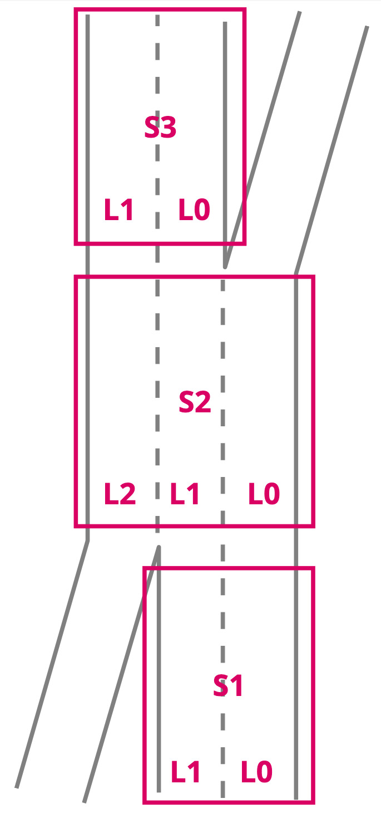
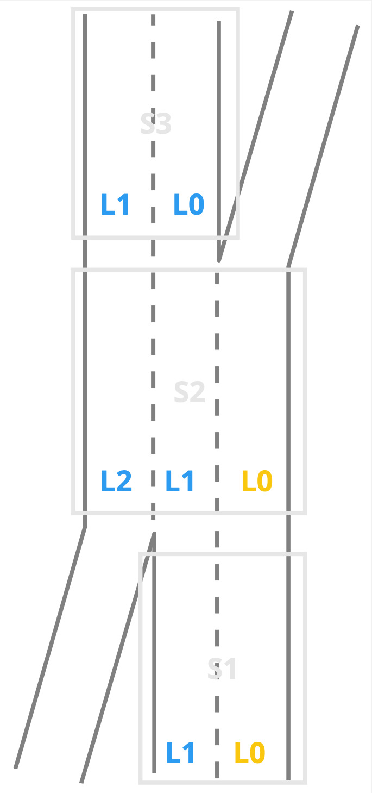
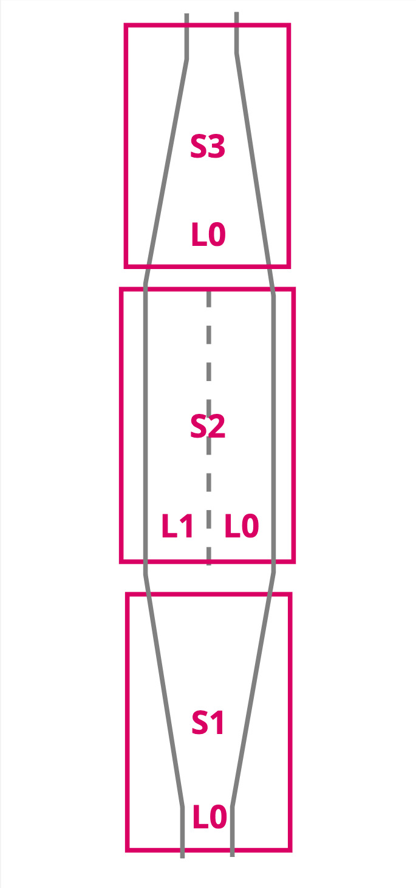
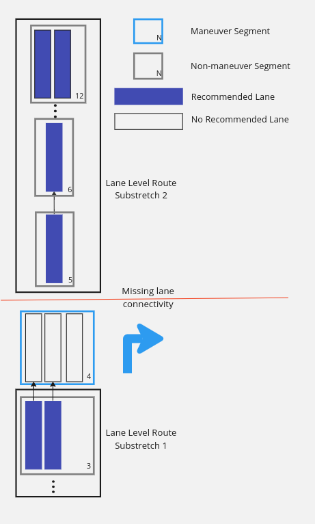

// Copyright (C) 2023 TomTom NV. All rights reserved.

[[section-lane-level-router]]

== Lane Level Router

The Lane Level Router (LLR) computes driveable paths through all
segments in a lane guidance scenario and assigns costs to each lane
for reaching all lanes in the last segment of the scenario. A cost is
"infinite", if there is no drivable path from some lane to a
destination lane. The lower the cost, the easier it is to reach that
destination lane.

The algorithm starts from the last segment and works its way backwards
through the segments in a dynamic programming fashion. In case of
broken connectivity, it will stop at the last connected segment and
restart the algorithm from the next segment. This is repeated
until all segments are processed.

It is used for deciding which lanes should be recommended to the
driver as the most optimal to use, and which arrows should be
recommended as continuing along the route.

=== Algorithm Details

A summary of the algorithm is as follows:

1. Construct a three-dimensional cost matrix giving a cost to travel
from each lane in each segment to each lane in the final segment.
2. Reconstruct the set of most-optimal routes from each lane in the
starting segment to each lane in the final segment.
3. For each lane in each segment that is part of one of those routes,
mark that lane as recommended.

==== Cost Matrix

The cost matrix is a three dimensional array of abstract "costs",
allowing the convenience of lanes to be compared against each other.
The lower the cost of a lane, the more convenient it is to travel from
that lane to a final lane.

===== Cost Values

The primary cost of a lane comes from the need to change lanes.  If
the only way to continue along the route from a lane is to change
one lane, that is a cost of `1`.  If it is necessary to change two lanes
at once, the cost is `4`.  In general, the cost of changing `N` lanes
is `2^N^`.

There are various other penalties and bonuses, such as for driving
along a merging lane, or being in a toll lane when you should not be.
These will not be exhaustively detailed here.

===== Dimensions

The cost matrix stores the costs of reaching any specific lane
in the final segment, from any lane in any other segment in
the scenario.

So the three dimensions are:

1. Index of the "from" segment in the scenario
2. Index of the "to" lane in the final segment of the scenario
3. Index of the "from" lane within the "from" segment

Note that these are in a somewhat counterintuitive order, for
historical reasons.

===== Next Indices

In addition to storing the cost of travelling in that lane, each
element of the cost matrix also stores a set of indices into lanes in
the next segment.  These are the lanes that must be taken in order to
achieve the recorded minimum cost.  Note that this may imply
performing a lane change maneuver.

===== Unreachable Lanes

Some lanes do not connect to the final segment at all.  In these cases
the cost is effectively infinite.  In practice we represent such a
case with a cost that is `MAXINT / 2`.  This provides space for
adjustment both up and down during cost matrix calculation.  Any value
above `MAXINT / 4` is considered unreachable.

===== Calculation

The key insight of the algorithm is that given the data structure
above, the cost to reach the final segment from any given segment `N`
can be computed from:

1. the local connectivity between `N` and its following segment `M`, and
2. the already computed costs for segment `M`.

Thus we can start at the last segment and proceed backwards along the
route, at each segment using the previous result to calculate the next
result.  To bootstrap the algorithm we compute the costs from each
lane in the final segment to each other lane in the final segment.
This is trivial: there is a cost of 0 from each lane to itself, and ∞
to each other lane.

===== Example

Consider the following simple lane network consisting of three
on-route lane segments, S1 S2 S3:

The final lane segment is S3.  Considering the costs with S3 as the
starting segment, they can be constructed trivially:

[%autowidth]
|===
|Lane|Cost to S3 L0|Cost to S3 L1

|S3 L0
|0
|∞

|S3 L1
|∞
|0
|===

Next consider S2.  This has three lanes.  S2 L2 connects directly to
S3 L1 with zero cost, and S2 L1 connects directly to S3 L0 with zero
cost.  L0 can only reach the final segment by changing lanes, to S3 L0
with cost `1` and to S3 L1 with cost `4`.  Similarly, S2 L1 can reach
S3 L1 by changing lanes, with cost `1` and S2 L2 can reach S3 L0 by
changing lanes, with cost `1`.

[%autowidth]
|===
|Lane|Cost to S3 L0|Cost to S3 L1

|S2 L0
|1
|4

|S2 L1
|0
|1

|S2 L2
|1
|0
|===

Finally, consider S1.  S1 L0 also must change lanes once to reach S3
L0, and twice to reach S3 L1.  However, these two lane changes can be
done one a time, as S1 L0 → S2 L1 → S3 L1, for a total cost of `2`.
This is the more efficient route.

The algorithm can determine this by comparing the cost of (S1 L0 → S2
L0) + (S2 L0 → S3 L1) against the cost of (S1 L0 → S2 L1) + (S2 L1 → S3 L1).
The second part of each calculation is already stored in the matrix,
so only the cost of transition from S1 to S2 needs to be calculated
fresh.  In this case, the second option is cheaper.

[%autowidth]
|===
|Lane|Cost to S3 L0|Cost to S3 L1

|S1 L0
|1
|2

|S1 L1
|0
|1
|===

===== Compact Representation

The three-dimensional matrix can be represented in a more compact
form as a two-dimensional table, where each value is a tuple of costs
to reach each of the final lanes.  This representation is printed in
the logs when running in debug mode.

However, confusingly, lanes are numbered starting from 0 at the curb
and increasing towards the middle.  Since most countries drive on the
right, this is the opposite of the order actually printed in the log.
The log lines are printed starting at the end and working backwards.
The results look something like this:

[%autowidth]
|===
|Segment|Lane 0|Lane 1|Lane 2

|S3
|(0, ∞)
|(∞, 0)
|

|S2
|(1, 4)
|(0, 1)
|(1, 0)

|S1
|(1, 2)
|(0, 1)
|
|===

==== Lane Level Routes and recommendations

The intent of the lane-level router was that it should not assume in
which lane the driver starts, and therefore recommend all reachable
lanes in the first segment.  Similarly, it should not assume anything
about in which lane the driver will finish, so all reachable lanes in
the final segment should also be recommended.

However, although we do accumulate the routes from each starting lane
to each final lane, we only include routes that have the lowest cost
to their final lane.  This has the effect of indeed recommending every
final lane, but it generally does not recommend every starting lane.

So, to calculate the Lane Level Routes it first finds the
most efficient lanes to start the route from the initial lane segment;
it then traverses forwards finding the connection between the lane
segments until a lane in the final segment.

The set of Lane Level Routes using the example from above would be the
following:

[%autowidth]
|===
| Lane in S1 | Lane in S3 | Lane Level Route | Total Cost

|L1
|L0
|S1 L1 -> S2 L1 -> S3 L0
|0

|L1
|L1
|S1 L1 -> S2 L2 -> S3 L1
|1
|===

The algorithm for lane and arrow recommendations is as simple as
recommending all lanes that appear on any of the Lane Level Routes.
In this case, every lane is recommended except for S1 L0 and S2 L0:

Note that not all of these routes "make sense".  Travelling from S1 L0
to S3 L1 requires two lane changes, when the driver could more easily
drive to S3 L0.  There is some discussion of changing this approach in
https://jira.tomtomgroup.com/browse/NAV-100618[NAV-100618].  For now,
however, we provide the maximal set of options to the driver.

Note also that in some cases there may be multiple equally optimal
routes between a particular starting and finishing lane.  For example:

In this case the final set of routes will include both optimal routes,
and both S2 L0 and S2 L1 will be recommended.  Note that this means
the set of optimal routes can be larger than just the number of
starting lanes times the number of finishing lanes.

=== Lane connectivity problems

The algorithm is designed to be resilient to breakage of lane
connectivity and tries its best to provide the best recommendations
despite missing lane level connectivity. Conceptually, we do this by splitting the
lane level router result into substretches; those substretches will
contain its independent cost matrix and lane level routes.

In practice, we don't need to perform splitting and routing as two
separate steps.  It's more efficient to allow the above algorithm to
run backwards until it finds no non-infinite cost at all.  At that
point we call the values computed so far a substretch, and restart the
algorithm with a new "final" segment.

We can see how the LLR can split the substretches when it encounters a
break in lane connectivity in the following example:

See also link:../adr/2023-12-11-lane-level-route-on-substretches[Lane
level route on substretches of route].

=== References

Images taken from https://miro.com/app/board/uXjVNujT5KM=/[this Miro
board].
