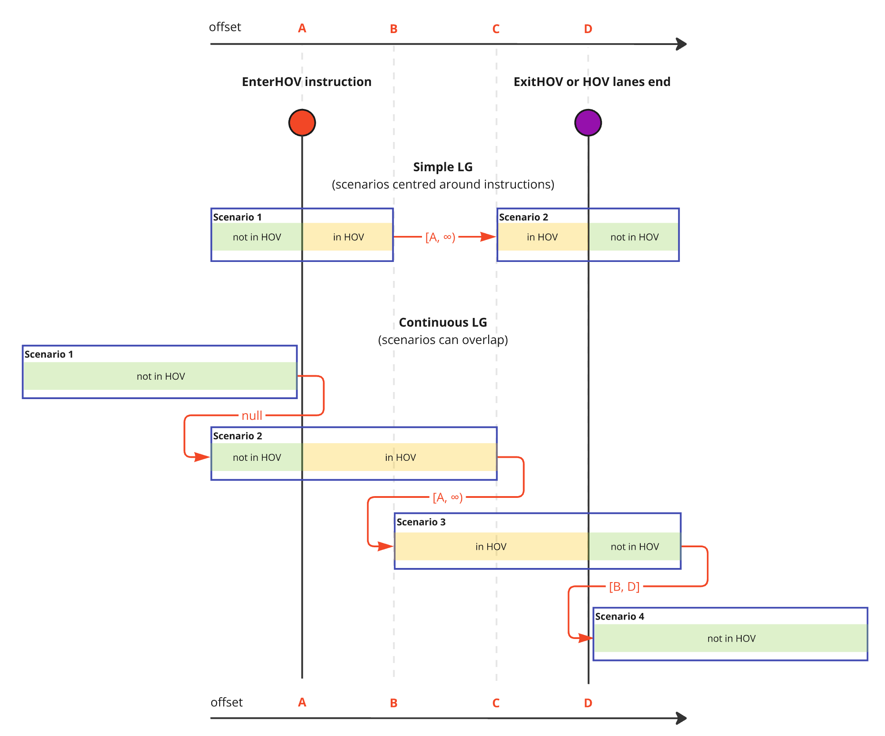

// Copyright (C) 2023 TomTom NV. All rights reserved.

[[section-hov-recommendation-postprocessing]]

== HOV Recommendation Postprocessing
HOV (High Occupancy Vehicle)lanes, also often called carpool lanes, are lanes
reserved for vehicles with a certain number of occupants. They are popular in
urban areas to encourage carpooling and reduce congestion. The instruction
engines analyzes the carpool situation and generates instructions to guide the
driver in and out of HOV lanes. There are currently two HOV instructions,
EnterHov and ExitHov.

While regular instructions like Turn or Exit require the driver to change links
on the road network at intersections, HOV instructions are somewhat special, in
that the maneuver is typically only a lane change to enter an HOV lane on the
same link. This has profound implications for the lane guidance builder because
the HOV status of the car (being in HOV or not as a consequence of EnterHov and
ExitHov instructions) must be taken into account when recommending lanes.

If the driver has received an EnterHov instruction in the past and has not yet
received an ExitHov instruction, the driver is expected to be in an HOV lane,
and the lane recommendation should reflect this and  only recommend HOV lanes.
Conversely, if the driver has received an ExitHov instruction in the past, the
lane recommendation should not recommend HOV lanes.

The lane level router does not take into account the HOV status of lanes when
computing lane-level routes. The resulting lane-level routes would typically be
wrong for HOV vehicles in presence of HOV lanes without some additional logic.

During and after the process that turns lane-level routes into lane
recommendations we perform a postprocessing step that adapts lane and arrow
recommendations to the HOV vehicle status. This chapter describes the process in
detail.

=== HOV Instructions

HOV instructions are generated by the instruction engine in presence of HOV
(High Occupancy Vehicle) lanes, i.e. carpool lanes.  The HOV instruction
generation process is complex and is described in the Instruction Engine
documentation, here is a brief summary of the fundamental concepts:

* HOV instructions are EnterHov and ExitHov, they invite the driver to enter or
exit HOV lanes.

* Rules for generating these instructions are complex and outside of the scope
of this document, but the code assumes that there will never be more than one
EnterHov and one ExitHov (each) in a scenario. This is a fairly reasonable
assumption because there is no point in entering an HOV lane for a very short
time, and very close HOV instructions are perceived as annoying by the driver
and are therefore avoided. +
*Note*: The above assumption holds only for SLG mode
(in which scenarios are centred around instructions). In continuous lane
guidance, scenarios can be of arbitrary length, and thus contain multiple HOV
instructions.

* There is typically some distance between EnterHov and ExitHov instructions,
and some instructions do not interrupt HOV, so the stretch in which the vehicle
is supposed to stay in HOV can span several scenarios. This means a vehicle can
enter a lane guidance scenario already in an HOV lane.

* ExitHov will not be present if the HOV lanes end naturally, in which case the
driver is expected to exit the HOV lanes without being told to do so. We call
this an "HOV interruption", and we need to detect it.

=== High-level code structure

In the series of steps that the lane guidance builder performs when computing a
scenario, HOV post-processing is executed as the very last step in the
`Generate` call by calling `AdjustRecommendedLanes`.

After `AdjustRecommendedLanes` has handled tollgate situations and
recommendations for toll gates, it delegates the handling of HOV lanes to an
implementation of the `HOVLaneRecommender` interface. The interface exposes only
one method, `SetLaneAndArrowRecommendation`, and currently has only one
implementation, the `HovLaneRecommenderImpl` class, so it may be that the
interface/impl idiom could be simplified in future refactorings.

The `SetLaneAndArrowRecommendation` method is called once and passed the
scenario and a list of maneuver present in the scenario.

`SetLaneAndArrowRecommendation` returns `void` and modifies the scenario in
place.

=== Processing the scenario

The algorithm can be clearly separated into four parts:

* Determining if the scenario starts in the HOV state
* Determining the part of the scenario on which to apply the HOV
post-processing. In the following we will refer to this as the "HOV override
stretch".
* Performing the HOV post-processing inside and outside the HOV override
* Remembering the HOV override stretch: an interval in which the vehicle is
expected to be in an HOV lane. It is used by the next scenario to determine
if it starts in the HOV state.

==== Determining if the scenario starts in the HOV state

The scenario begins in the HOV state if the previous scenario included an HOV
stretch and the current scenario's start offset falls within that stretch.
The range can be open-ended if the previous scenario did not exit the HOV lanes.
If the previous scenario did not include any HOV stretch, the range is empty.
This is illustrated in the diagram below, where the text above the red arrow
indicates the remembered HOV override range.

// source: https://miro.com/app/board/uXjVLfAAtFw=/?moveToWidget=3458764603483317032&cot=14

==== Delimiting the HOV override stretch

The code uses `FindHovOverrideStart` and `FindHovOverrideEnd` to find the start
and end of the stretch of the scenario on which to apply the HOV
post-processing.

Depending on these iterators pointing to an actual segment and not on
segments.end(), we then invoke `SetLaneArrowRecommendation` to set
recommendations for lanes and arrows.

===== FindHovOverrideStart

If we are entering the scenario in an in-HOV state and in the current list of
maneuvers there is no Enter HOV instruction, return segments.begin().
Otherwise, find the first segment containing an EnterHov instruction and return
an iterator to it. If there is no EnterHov in the scenario, it return
`segments.end()`.
We need to make sure the override stretch is done only on the stretch where
we have HOV lanes available. When implementing https://jira.tomtomgroup.com/browse/NAV-143938[continuous lane guidance], we
will generate overlapping scenarios, in which it might be the case that the
previous scenario ended in HOV, but in the new scenario we generate
it from a stretch where we're not yet on the HOV lane yet.

===== FindHovOverrideEnd

Look for an ExitHOV maneuver and return an iterator to it. Otherwise determine
whether we need to stop recommending HOV because the HOV lanes end naturally.
Finding an HOV interruption is delegated to `FindHovInterruption`

==== Performing HOV post-processing on the HOV override stretch

`SetLaneRecommendations` and `SetLaneArrowRecommendation` are used to recommend
lanes and lane arrows respectively. They both loop through the segments in the
range that needs overriding and change recommendations. In particular,
`SetLaneRecommendation` recommends all HOV lanes and unrecommends all the other
lanes. SetLaneArrowRecommendation has a more complex logic detailed in the next
section.

===== SetLaneArrowRecommendation

`SetLaneArrowRecommendation` starts with the assumptions that since HOV lanes
are keeping us on route, their arrows must already be recommended. All that
needs to be done is removing lane arrow recommendations in the appropriate
places. This means *outside* the HOV override stretch we need to remove *HOV*
lane arrow recommendations, while *inside* the override stretch we need to
remove *non-HOV* lane arrow recommendations.

Therefore the algorithm is as follows:

* Remove all HOV lane arrow recommendations from the start of the scenario to
the start of the override stretch
* Remove all HOV lane arrow recommendations from the end of the override stretch
to the end of the scenario
* Remove all non-HOV lane arrow recommendations from the start of the override
stretch to the end of the override stretch

Note that HOV lane arrow recommendations are removed *only* if the lane is HOV
and *not* recommended. This is to avoid situations where the only lanes
available are HOV, in which case we need to use the HOV lanes even outside of
the HOV override stretch. This is connected to specific code in
`SetRecommendedLanesFromRoute` (in `lane_guidance_utils.hpp`) to force using HOV
lanes in lane-level routes (which are normally avoided) if it's the only way to
route through the scenario.

Non-HOV lane arrow recommendation removal is much simpler, lane arrows
recommendations are simply removed if the lane is not HOV.

=== Limitations of the current approach

In case we have to deliver lane-level route polylines to the client (next on
our roadmap) the current approach has limitations:

* We cannot deliver lane-level routes as the lane-level router generates them
because they would not contain HOV lanes. With the current approach, we would to
run the HOV postprocessing step and then regenerate the lane-level-route polyine
from the lane recommendations. This is a complicated step and there may be
ambiguities when mapping lane recommendations to lane-level routes.

* In the same case, the lane changes for getting in and out of the HOV lanes
would be sudden and not smooth as the lane-level router would generate them.
Recommendations might advice changing multiple lanes at the same time. This is
because the postprocessing step does not take lane lengths and lane situation
into account.

* It may also be that some of the recommended lane changes would be not legal
since dividers after the HOV to non-HOV transition are ignored.

=== Future work

To address the current shortcoming we could reverse the approach, first
determining the HOV part of the scenario and then have the lane-level router
compute the routes over the whole scenario.

We could then set proper costs for the HOV lanes  to have the lane-level router
generate proper and correct routes for transitioning from HOV to non-HOV and
viceversa. There is anecdotal evidence that this approach has been tried and
failed (for unknown reasons) in the past, so a POC implementation should be
attempted first.
