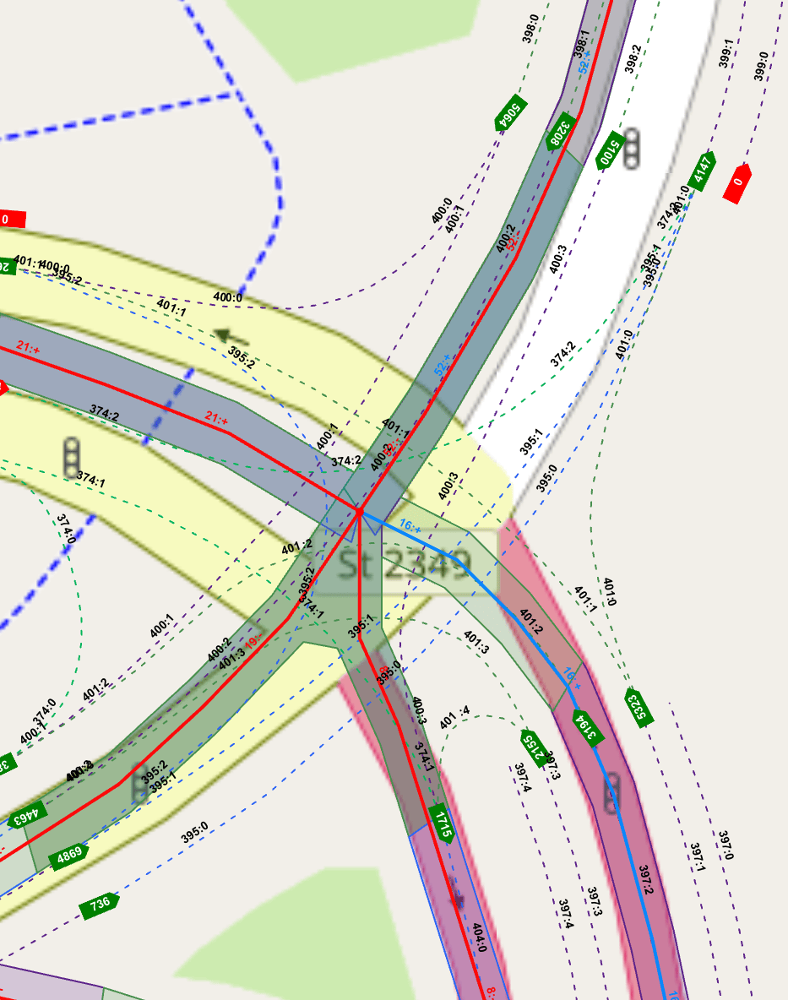
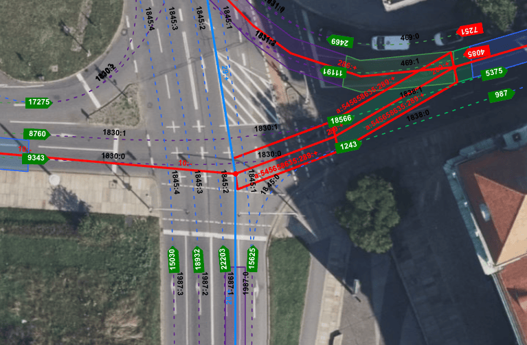
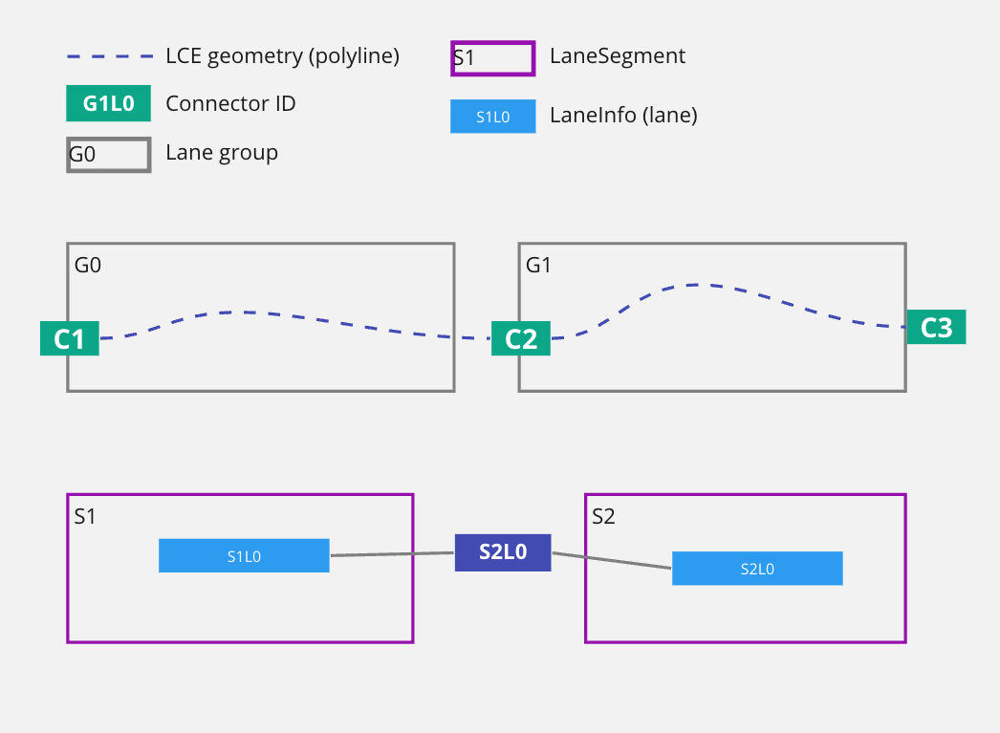
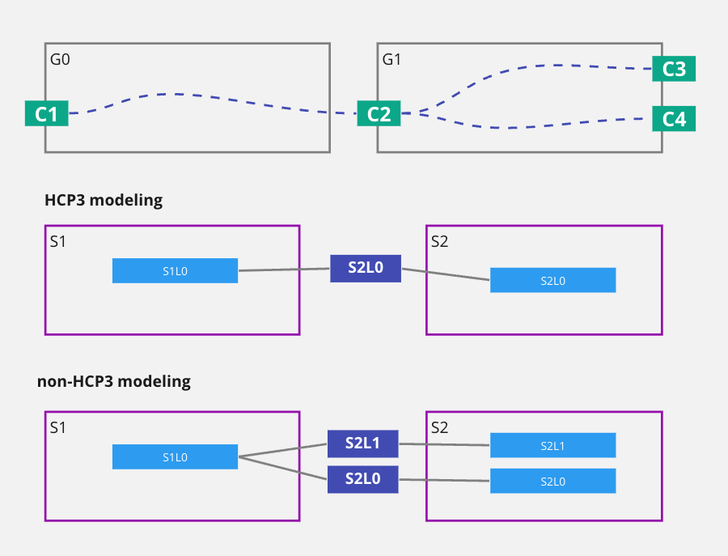
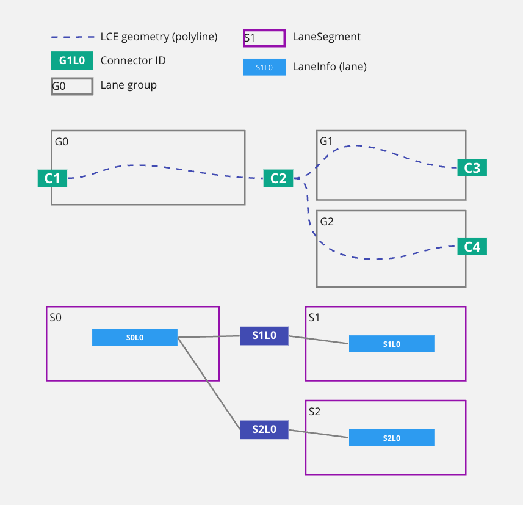
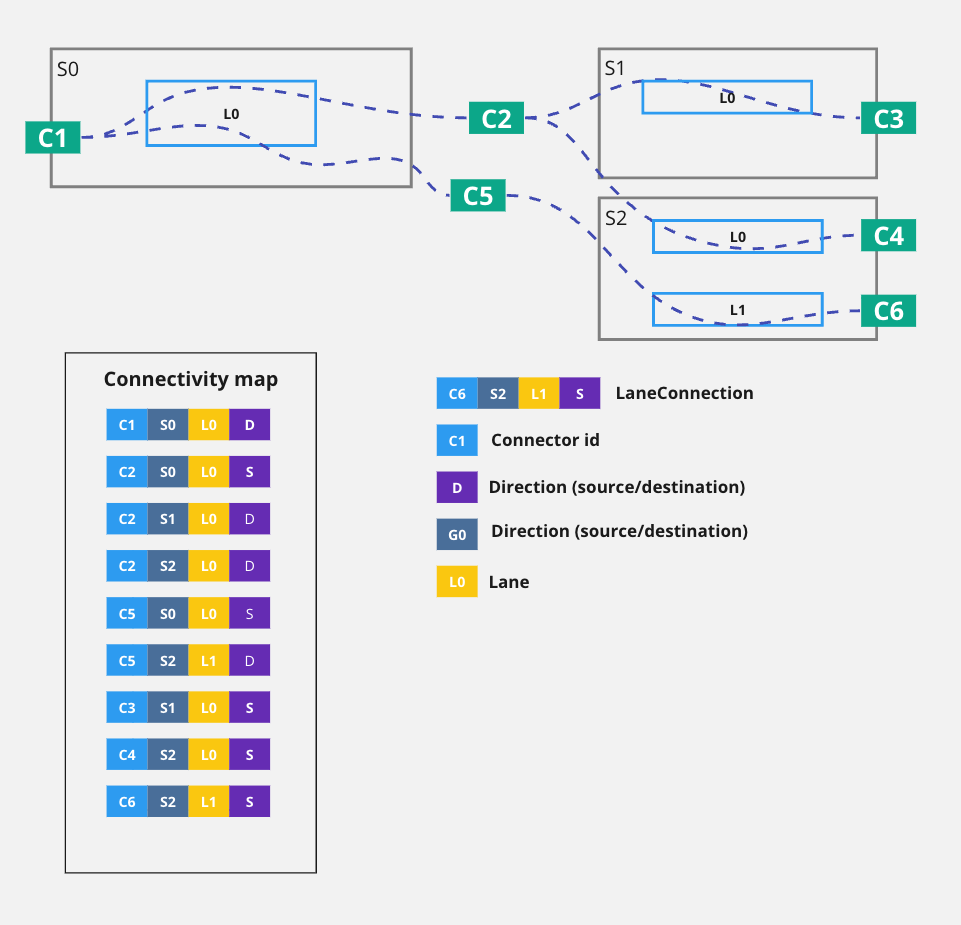
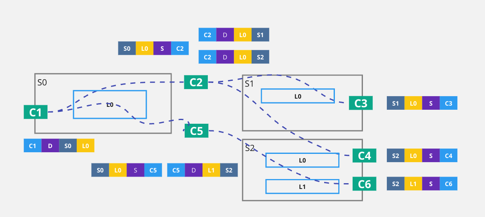

// Copyright (C) 2023 TomTom NV. All rights reserved.

[[section-lane-connectivity-processing]]

== Lane connectivity processing

=== Introduction

Lane connectivity processing is the process by which we load and process the
lane connectivity data from the FTX lane data map block. To understand the
following, it is essential to discuss the distinction between a
lane-guidance-builder lane and a lane in the map and establish proper
terminology. It may be useful to alternate reading this section with the next
one where connectivity representation is discussed.

* In the following, the term *LCE* will indicate a lane as it appears in the
map. LCE stands for FTX lane connectivity element.

* We will use the term *Lane* to refer to a lane guidance builder lane (LGB lane
sometimes). This is most often a representation of one LCE, but  in presence of
lane splits becomes a grouping of potentially multiple LCEs that share a source
connector ID. The intention is to  use the term lane when referring to lanes as perceived
by drivers. The term is also sometimes used for consistency with object names in
the code or common usage.

Lane connectivity information expresses how *LCEs* connect to each other at lane
group boundaries and also describe LCE splitting and merging. Lane connectivity
information in the map is optimized for size, introducing extra indices to
represent cross-references.  We process it to transform into a more convenient
format for lane-level routing, arrow synthesis, and general lane-level
information processing.

=== Representing connectivity in FTX lane blocks

The connection between LCEs is represented in the map using connectors and
connector IDs. Each lane in the map has a source and and a destination connector
ID field that describes its connections.

Two LCEs are in some topological relation if they share the same connector id.
This can happen in three different ways:

* Continuation: One LCE's destination connector ID is the same as the other's
source CID. The LCEs are connected and the driver can flow from one LCE to the
other without any action.

* Split: The LCEs share source connector ID.

* Merge: The LCEs share destination connector ID.

In the following we will use G1987:2  to refer e.g. to lane group 1987, LCE 2.
The images shows examples of all these situations:

* LCE 398:2 (top center) flows into G400:3 through C5100

* LCE G397:1 (bottom right) splits through C5323 into G401:0 and G401:1

* LCE G374:2, G401:0, G395:0, and G395:1 merge into G399:1 through C4147 (top right).

[[fig-real-world-examples]]
. Real world examples of different lane connectivity

=== Lane changes

Note the important difference between LCE connectivity and LCE changes (lane changes).

When two LCEs are connected a vehicle can flow seamlessly from one track to the
next. This happens naturally driving forward and it is not a considered an LCE
change or an LGB lane change. It is also not a "maneuver" from the perspective
of the driver.

As an example of LCE connection, in the following image we can see that e.g. LCE
2 of lane group 1987 is connected to G1845:3 through connector ID 18932.

We can see how the two LCEs  flow into each other. No action is needed to move
from one lane to the other.

[[fig-lane-changes-examples]]
. What is a lane change?

NOTE: Note that this would also be true if the LCEs were modeling a lane split at that connector ID, as it happens for LCEs G1830:2 and G1830:3. at connector ID 17275 (top left of the image). Even though the driver will have to steer and decide whether to take G1830:2 or G1830:3, either LCE that the driver can end up on is connected at the start with the LCE that they are coming from, so no lane change is needed.

On the other hand, if the driver wanted to move from G1845:2 to G1845:3, they would need to perform an LCE change, as the two LCEs are not connected.

Also note that the lane change is happening "halfway" through the start LCE and not at the connector ID location.

A simple rule is that a lane/LCE change can only happen between LCEs of the same lane group that do not share a source connector ID.

=== Lane connectivity in the LGB

In the lane guidance builder, we do not model LCEs but lanes (see above for
discussion)  and we model connectivity between lanes using LaneConnectionInfo
objects. A LaneConnectionInfo object models one direction of a lane connection.
There is always a dual LaneConnectionInfo modeling the opposite direction to
allow navigating the lane network in both directions.

All modeling of lane connectivity can be reduced to modeling trivial
connectivity, modeling lane merges and modeling lane splits.

* Trivial connectivity: Two LCEs are trivially connected if they share a source and
destination connector ID, and there is no other LCE sharing this CID. Also, the
origin LCE does not share an incoming connector id (CID) with any other lane.
This is the case of the continuation example below.

[[fig-connectivity-trivial]]
. Trivial connectivity example

* Lane split 1: origin LCE connects with multiple LCEs that belong to the same lane group. This is the case of the split example below. In this case (for HCP3 maps) we will merge the destination LCEs into one LaneInfo and will create one LaneConnectionInfo objects to model the topology. For non-HCP3 maps we will instead create two LaneInfo objects and two LaneConnectionInfo objects because we will count the two LCEs in G1 as two separate lanes.

NOTE: This is an important distinction to keep in mind when dealing with different map providers.

[[fig-lane-counting]]
. Lane counting in HCP3 and non-HCP3 maps

* Lane split 2: origin LCE shares CID with multiple LCEs that belong to different lane groups. This is the case of the split example below. In this case we will create two LaneConnectionInfo objects.

[[fig-connectivity-split]]
. Lane split connectivity example

* Lane merge: Two origin lanes share the same destination CID but with different source CID. We will create two LaneConnectionInfo objects.

=== Lane connectivity processing

Finally, we can look at how the lane guidance builder processes connectivity.
Going from connector IDs to LaneConnectionInfo objects is a two-step process:

* First, we process CIDs as we read LCEs from the map and store connectivity
information in the ConnectivityMap object.

* Then, after all lane groups in the scenario and their LCEs have been read, we
use the connectivity map to create LaneConnectionInfo objects.

==== The connectivity map

The connectivity map stores all connectivity information for all LCEs in the
scenario. It can be thought of a table that stores all connectivity information.
Each row in a table is a LaneConnection object and contains the following
information:

* Direction of the connection (whether this is a source or a destination
connection)

* Segment ID of the segment at the specified end of this connection (origin
segment for a source connection, destination segment for a destination
connection)

* Lane number of the lane at the specified end of this connection.

* Connector ID of the connection.

The table can be accessed through two indexes:

* By Direction, Segment ID and lane number. This is non-unique index.

* By Connector Id, Direction, Segment ID and lane number. This is a unique index.

Here is an example of a subset of the connectivity map contents for a simple lane split:

[[fig-connectivity-map-contents]]
. Connectivity map contents

A much more intuitive way to look at this representation is to place the
contents of the connectivity map close to the connections they represent, and to
reorder their fields so we can see how connector IDs match, as in the following
image, which will be used as a reference to describe the connectivity
processing.

[[fig-connectivity-map-visualized]]
. Connectivity map visualized

==== Reading connectivity information

For each LCE we read from the map we simply store the connectivity information
in the connectivity map. For each LCE we store two LaneConnection objects, one for
the source connector and one for the destination connector. For instance, when
reading LCE C1C2 we will store the following connections:

* Connection 1: Direction: Destination, Segment Id: S0, Lane Number: 0, Connector Id: C1
* Connection 2: Direction: Source, Segment Id: S0, Lane Number: 0, Connector Id: C2

We will proceed in the same way for all LCEs in the scenario, storing all
connections in the connectivity map. These connections will be used to create
LaneConnectionInfo objects in the next step. Adding connections is done calling
`ConnectivityMap.AddConnection`

==== Writing outgoing connectivity

In this phase we will create LaneConnectionInfo objects from the connectivity
map. We will only create outgoing connections in this step, as incoming
connections are created later in the process (described below)

Adding outgoing connectivity starts by calling
`ConnectivityWriter.AddOutgoingConnectionsWithTracks`. In this process we iterate over
each segment and lane and for each lane we individually process connections.
This is implemented by querying the connectivity map twice. This is better
explained with an example, let's reference the previous image and focus on
creating connections for S0L0.

* First we fetch the connection information for the current lane to retrieve the
connector ID of the outgoing end of the lane. In this case we would query with
S0L0 and Direction: Destination. This will return the source connection S0L0C2.

* We then fetch all connections  with the same
connector id but in the outgoing direction. In this case we would query with C2, Direction: Destination. This
will return the destination connections S1L0C2 and S2L0C2, as in the
<<fig-connectivity-split, image>> above.

For each connection we find we create a LaneConnectionInfo object and add it to the LaneInfo object of the current lane. In this example we would create `LaneConnectionInfo` objects for S0L0 -> S1L0 and S0L0 -> S2L0.

The connectivity map is not used after this step and can be discarded.

==== Writing incoming connectivity

As mentioned above, writing incoming connectivity is a much simpler process, each outgoing connection is simply followed to its target and then we add the target an incoming connection that points back to the source lane that we started from.
