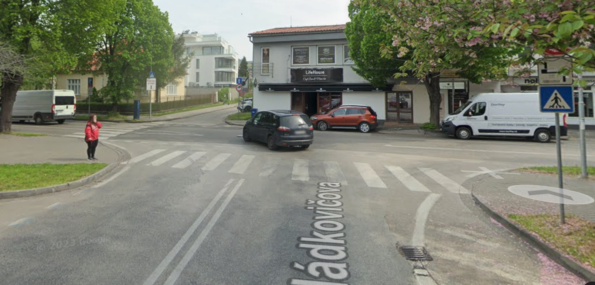

// Copyright (C) 2023 TomTom NV. All rights reserved.

= "End of Road" Landmark

The "End of Road" landmark is provided at a simple T-junctions, where a driver approaching the intersection from the
"tail of the T" is going to make a turn either to the right or the left side.

image::end-of-road.png[End of Road from driver perspective]

== "End of Road" cases
To avoid erroneous or misleading "End of Road"s, the software instates following conditions for inserting the landmark:

=== 1. "End of Road" placed at a simple T-junctions.
'''
* The T-junction should not have plural links.
** _Note: this condition should effectively remove also cases, where road joins double-carriageways or splits before junction._
* The incoming road should connect to the outgoing roads at nearly a right angle.
* Outgoing roads should not bend excessively within 40 meters near the junction.

=== 2. "End of Road" is not provided
'''
* For roads, that are part of a square. _A square is a paved area where a car can travel, but where there are no legally defined traffic paths._
* For roads, that are an entry, a part, or an exit of a service facility such as a highway rest area, parking facility, or golf course.
* For roads, that are part of a pedestrian zone or a pedestrian pathway.
* At exit ramps.

=== 3. Incoming and outgoing road should be different roads:
'''
* Should not have the same (non-empty) road name, administrative, and functional class.
* Incoming and outgoing roads should not be part of the same main road. This is typically indicated by priority signs.

=== 4. "End of Road" should be clearly visible from a distance.
'''
* The incoming path should not include any maneuvers (e.g., turns, exits from roundabouts, etc.) within 100 meters before the analyzed junction.

=== 5. T-junction should not have ambiguous side roads.
'''
* There should not be other roads that continue in the original driver's direction close to the analyzed junction.

.T-junction with ambiguous side road

