// Copyright (C) 2023 TomTom NV. All rights reserved.
//
// This software is the proprietary copyright of TomTom NV and its subsidiaries and may be
// used for internal evaluation purposes or commercial use strictly subject to separate
// license agreement between you and TomTom NV. If you are the licensee, you are only permitted
// to use this software in accordance with the terms of your license agreement. If you are
// not the licensee, you are not authorized to use this software in any manner and should
// immediately return or destroy it.

= CrossSimpleIntersectionHandler

A `CrossSimpleIntersectionHandler` applies to the road situations where the driver is driving the road that crosses another road.

Depending on the context the handler can:

* produce a go-straight instruction according to the UX specification: https://confluence.tomtomgroup.com/x/ClPiO
** when the driver is crossing an ambiguous multilane intersection (see link:./detectors/cross_ambiguous_multilane_intersection_detector.adoc[CrossAmbiguouosMultilaneIntersectionDetector]) (Example #1)
** when the driver is crossing the more important road at unsignalized intersection (Example #2)
** when the driver is leaving the main road at unsignalized intersection (Example #3)
* suppress an instruction (aka natural continuation) in all other cases (Example #4)

== Examples

=== Example #1 Go-straight when crossing ambiguous multilane intersection

Location: *52.0797765,5.1412395* +
We give a go-straight instruction to ensure the driver uses the second lane from the curbside since the lanes' topology is ambiguous at the intersection.

==== The actual route

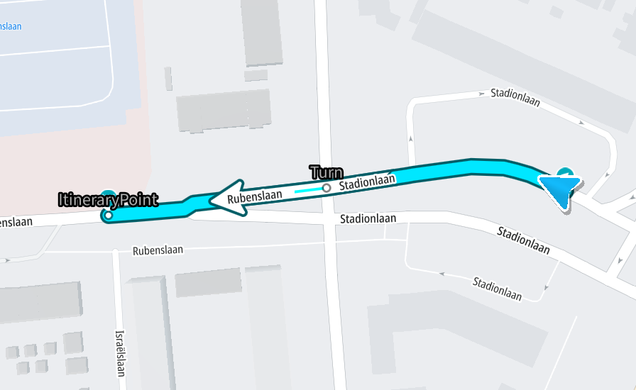

==== The situation from the satellite

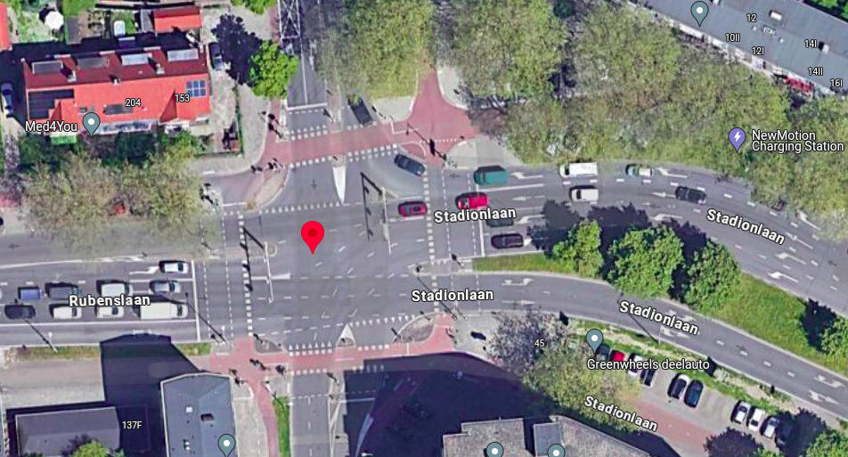

==== The situation from the driver's perspective

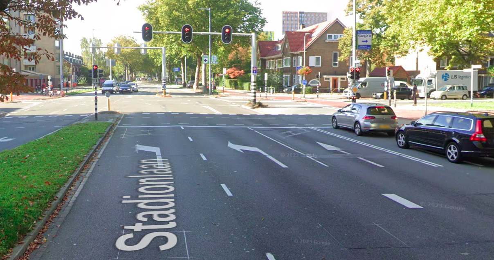

=== Example #2 Go-straight when crossing more important road at unsignalized intersection

Location: *41.6725952,-86.6413821* +
We give a go-straight instruction to the driver as he/she/they approach(es) the unsignalized intersection since the more important road usually makes a straight direction not so obvious.

==== The actual route

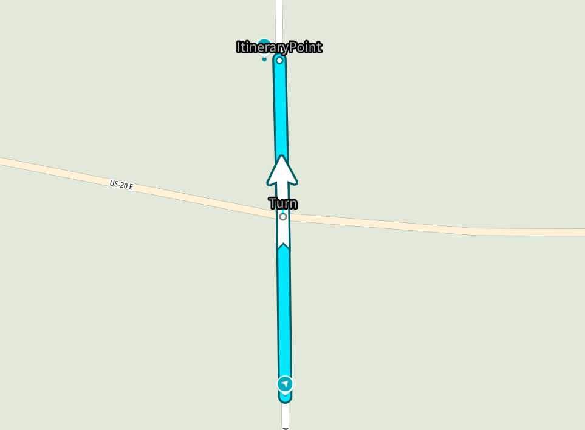

==== The situation from the satellite

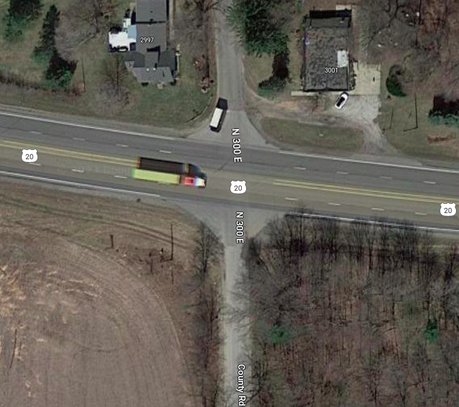

==== The situation from the driver's perspective

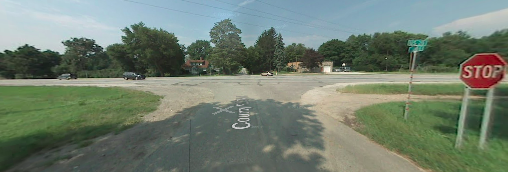

=== Example #3 Go-straight when leaving more important road at unsignalized intersection

Location: *51.3792157,12.4214387* +
We give a go-straight instruction here as the driver approaches the unsignalized intersection since the main road turns left and could be not so obvious driving straight with suppressed instruction.

==== The actual route

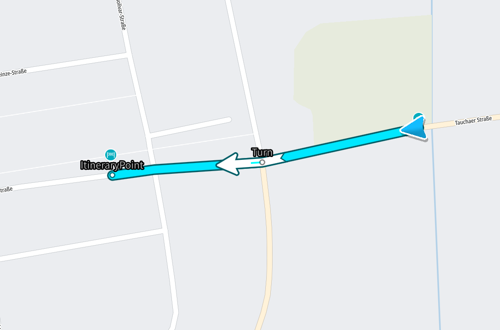

==== The situation from the satellite

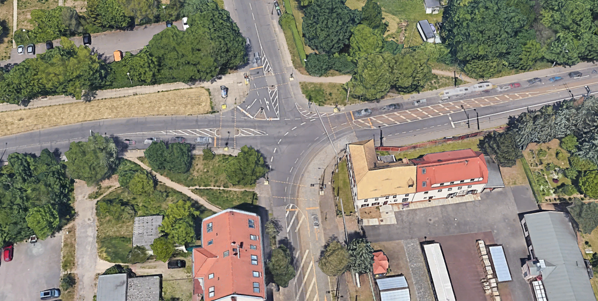

==== The situation from the driver's perspective

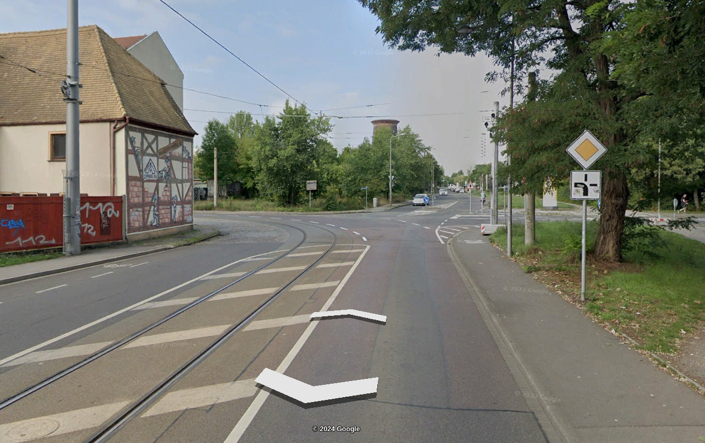

=== Example #4 Natural Continuation when crossing a simple intersecton

Location: *44.8329198,-0.5818248* +
The driver should not do anything but keep a body temperature around 36.6° to stay on the route.

==== The actual route

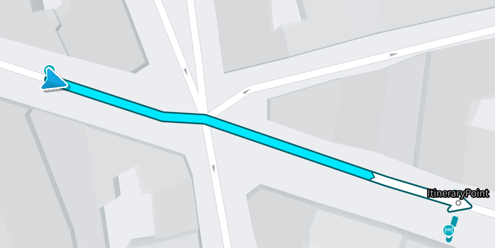

==== The situation from the satellite

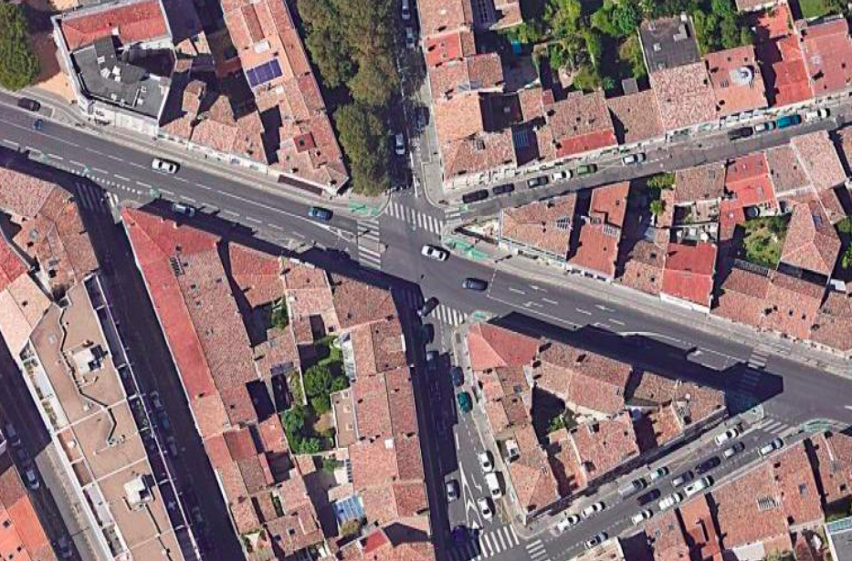

==== The situation from the driver's perspective

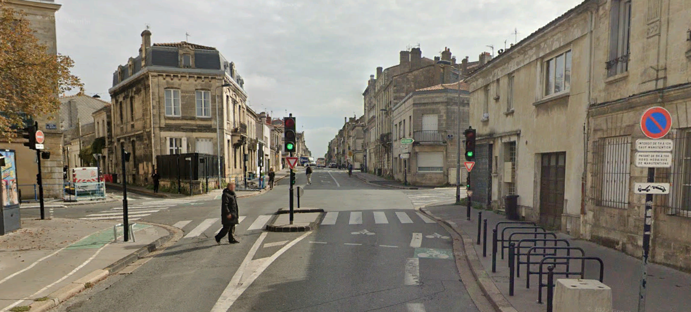

== Relations with other situation handlers

A `CrossComplexIntersectionHandler` should have priority over a `CrossSimpleIntersectionHandler` because the latter is not designed to handle complex intersections.
