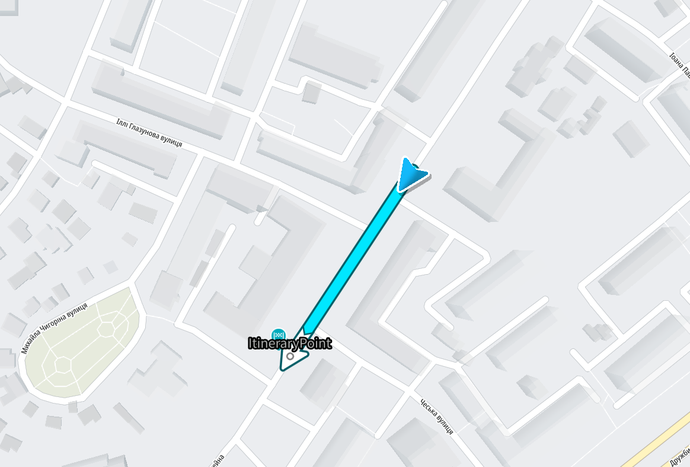
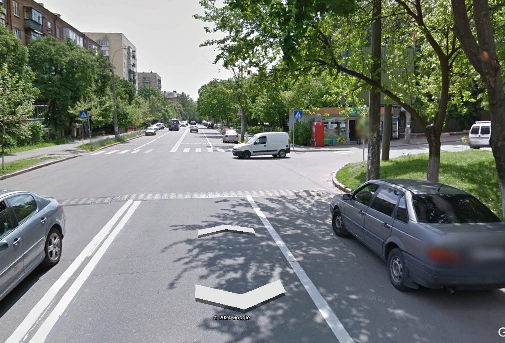
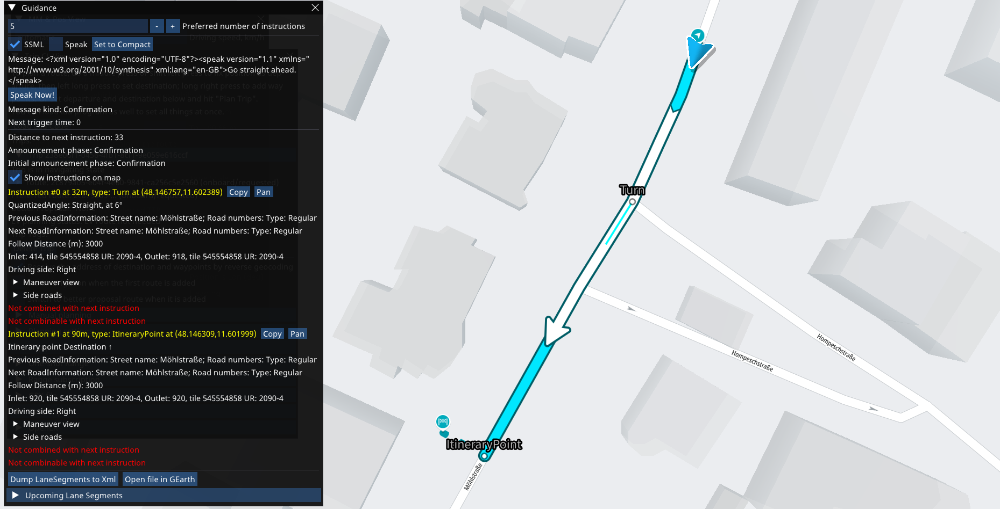
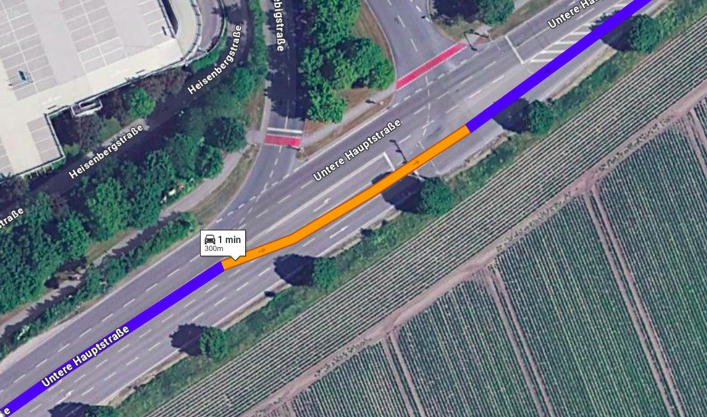
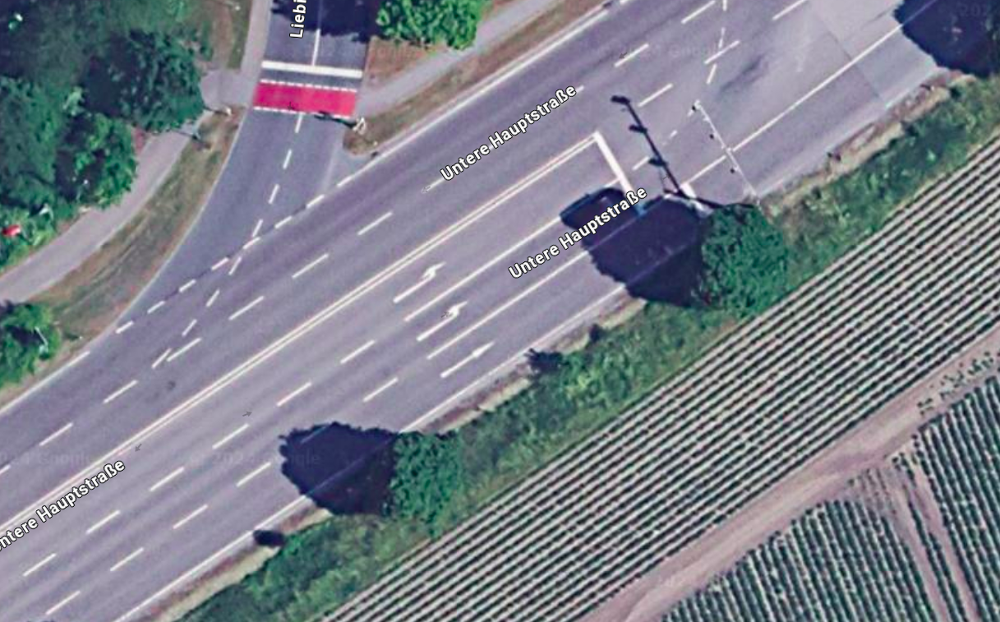
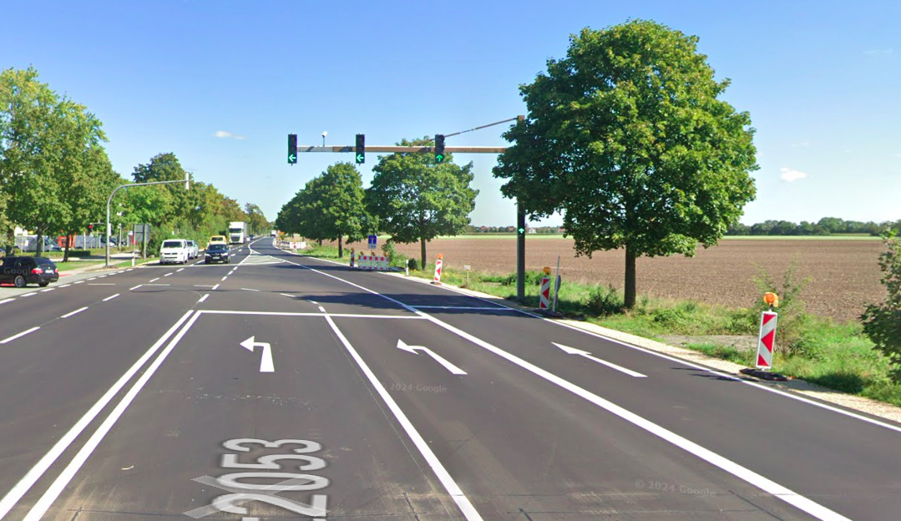

// Copyright (C) 2024 TomTom NV. All rights reserved.
//
// This software is the proprietary copyright of TomTom NV and its subsidiaries and may be
// used for internal evaluation purposes or commercial use strictly subject to separate
// license agreement between you and TomTom NV. If you are the licensee, you are only permitted
// to use this software in accordance with the terms of your license agreement. If you are
// not the licensee, you are not authorized to use this software in any manner and should
// immediately return or destroy it.

= CrossSimpleThreeWayJunctionHandler

A `CrossSimpleThreeWayJunctionHandler` is designed to handle the situations when the driver is crossing a simple three-way junction.
If such situation is detected, depending on a context, this handler can:

* produce a go-straight instruction:
** when the driver is leaving a more important road at unsignalized intersection (Example #2)
** when the straight continuation is ambiguous according to lanes topology (see link:./detectors/cross_ambiguous_multilane_intersection_detector.adoc[CrossAmbiguouosMultilaneIntersectionDetector]) (Example #3)
* suppress the instructions in the rest of the cases (Example #1)

== Examples

=== Example #1 Natural Continuation when crossing a simple three-way junction

Location: *50.41724,30.53764* +
The driver should not do anything but stay on the route.

==== The actual route

==== The situation from the satellite

image::images/crossing_simple_three_way_junction_satellite.png[Crossing the simple three-way junction in Ukraine (satellite view)]

==== The situation from the driver's perspective

=== Example #2 Go-straight when leaving more important road at unsignalized three-way junction

Location: *48.1467569,11.6023886* +

We provide a "go straight" instruction here as the driver approaches the unsignalized intersection where main road, or more important road based on administrative class, turns left. Without instructions, it may not be obvious to continue driving straight.

==== The actual route

==== The situation from the satellite

image::images/leaving_more_important_road_at_unsignalized_three_way_junction_satellite.png[Leaving more important road at simple three-way junction in Munich (satellite view)]

==== The situation from the driver's perspective

image::images/leaving_more_important_road_at_unsignalized_three_way_junction_drivers_view.png[Leaving more important road at simple three-way junction in Munich (driver's view)]

=== Example #3 Go-straight when crossing an ambiguous multilane three-way junction

Location: *48.3026447, 11.6360617* +

A situation is considered ambiguous when the number of lanes going off-route is greater or equal than the number of lanes staying on-route.
In this example, 2 lanes are only for the left turn and only 1 lane is for the straight continuation.
Taking this into account, the driver could be confused by the lanes topology if we don't produce a go-straight instruction.
This way, the guidance is necessary to ensure the driver to use rightmost lane to stay on the route.

==== The actual route

==== The situation from the satellite

==== The situation from the driver's perspective

== References

The go-straight instructions from the 2nd and 3rd examples are implemented according to the UX: https://confluence.tomtomgroup.com/x/ClPiO

== Relations with other situation handlers

A `CrossSimpleThreeWayJunctionHandler` should have priority over a `SimpleTurnHandler` since it's more specialized and does not need to involve link:./natural_continuation/intersections.adoc[generic scoring algorithm] to detect the natural continuation.
