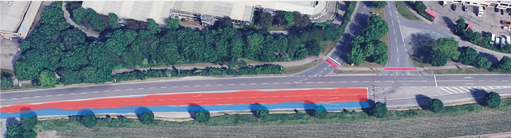
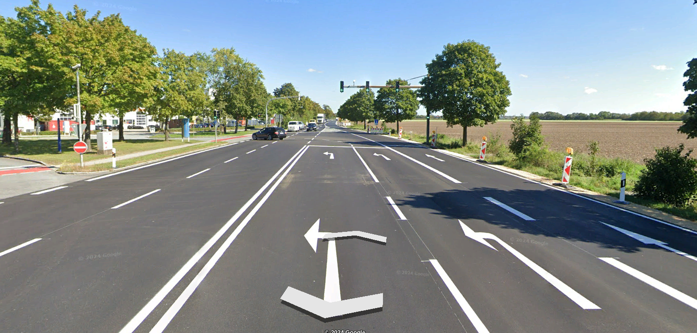
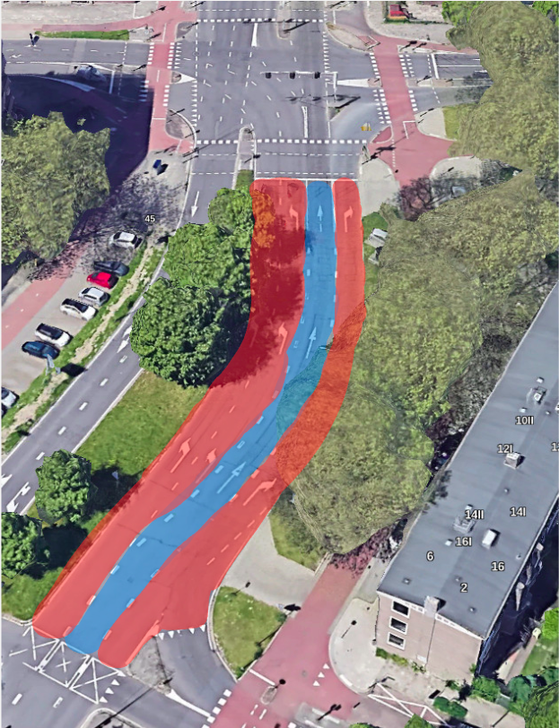
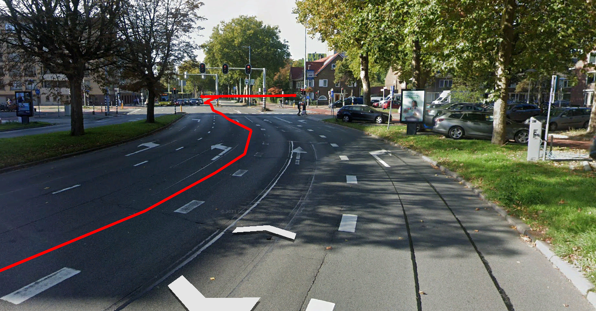
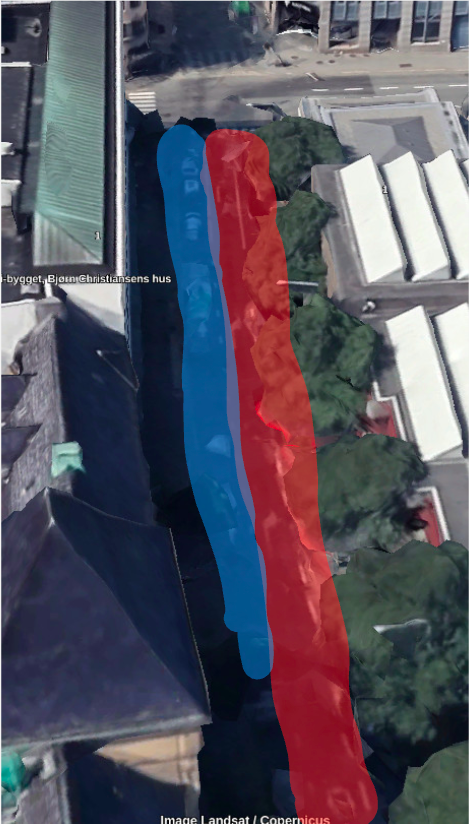
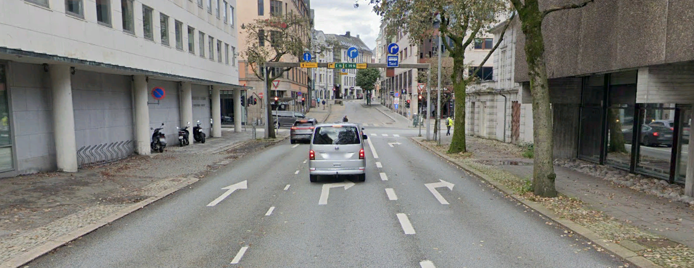
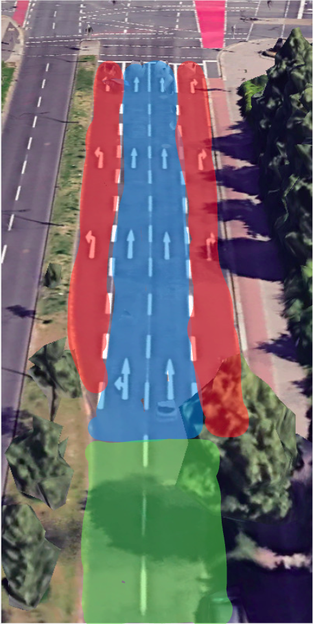
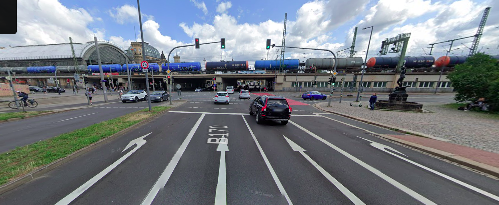
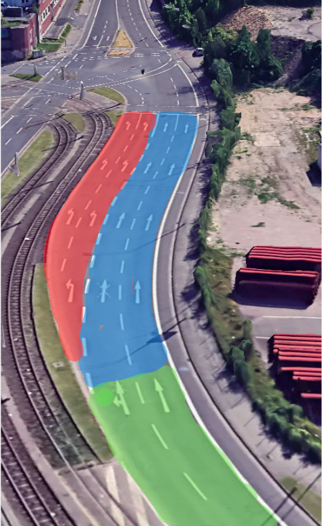
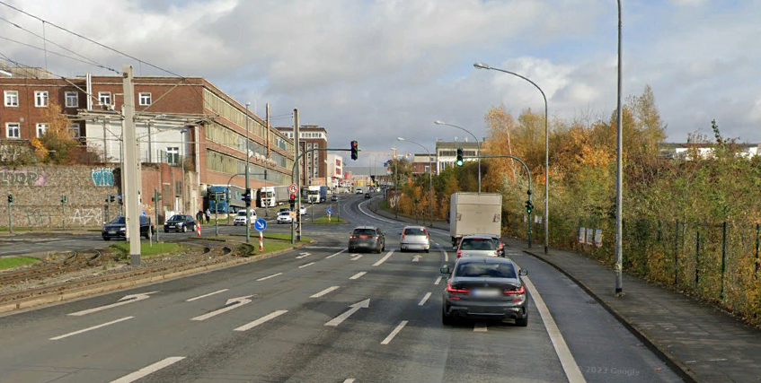

// Copyright (C) 2024 TomTom NV. All rights reserved.
//
// This software is the proprietary copyright of TomTom NV and its subsidiaries and may be
// used for internal evaluation purposes or commercial use strictly subject to separate
// license agreement between you and TomTom NV. If you are the licensee, you are only permitted
// to use this software in accordance with the terms of your license agreement. If you are
// not the licensee, you are not authorized to use this software in any manner and should
// immediately return or destroy it.

= CrossAmbiguousMultilaneIntersectionDetector

== Glossary

*On-route lane* - is a lane the driver should use to stay on the route. Highlighted in [blue]#blue# on the pictures below. +
*Off-route lane* - is a lane the driver must not use to stay on the route.
Otherwise, he/she will deviate from the route, and eventually end up in the wrong location. Highlighted in [red]#red# on the pictures below. +
*Segment with on-route lanes only* - is a road stretch before the intersection and contains only lane(s) on route. Highlighted in [green]#green# on the pictures below.

== Business logic

A `CrossAmbiguousMultilaneIntersectionDetector` is a helper class that is designed to be used by situation handlers +
to detect road situations where straight route continuation is ambiguous based on lanes topology and, thus, requires a go-straight instruction. +

Since lane retrieval and analysis is an expensive operation, several pre-conditions must be satisfied:

- a route stretch that goes through the intersection must be straight (does not bend more than 22°)
- there should not be a straighter road at the intersection than the road that lies on the route
- turn must be allowed at the intersection
- a route should not lay on the main road (usually, most lanes allow natural continuation along the main road in such cases)

If all conditions above are met, an `IntersectionLanesAnalyzer` takes place. +
An `IntersectionLanesAnalyzer` is a helper class that is being exclusively used by `CrossAmbiguousMultilaneIntersectionDetector` +
to retrieve and analyze lanes at a particular intersection. +
It fetches all lane segments from 500 meters before an intersection to 250 meters after the intersection. +
Then, it tries to find a lane segment at the intersection (a lane segment connected to multiple outgoing lane segments). +
Then, to understand which lanes are on-route and which are going off-route at the intersection, a `LanesOnRouteDetector` takes place (yet another helper class with a single purpose). +
If all of the steps above successfully being executed, an `IntersectionLanesAnalyzer` returns the following result:

- number of lanes staying on-route
- number of lanes going off-route
- total number of lanes
- whether on-route and off-route lanes are mirrored (e.g. |←|↑|→| or |←|↑|↑|→|)
- adjacent off-route lanes merge (used as an indicator of incorrectly digitized lanes, since all lanes that turn at the intersection should have its own separate outgoing lane)
- whether segment with on-route lanes only is present

When lane analysis is finished by `IntersectionLanesAnalyzer`, a `CrossAmbiguousMultilaneIntersectionDetector` decides whether an intersection crossing is ambiguous according to lane data.
A route continuation is considered to be ambiguous if all conditions below are met simultaneously:

- total number of lanes at the intersection is greater than two (the feature is disabled for minor roads due to poor lane data quality)
- adjacent off-route lanes do not merge (lane digitization is good)
- lanes are not mirrored
- segment with on-route lanes only is not present
- number of lanes going off-route is higher or equal to the number of lanes staying on-route

In such cases, `CrossAmbiguousMultilaneIntersectionDetector` lets its user classes (such as CrossSimpleIntersectionHandler) know that the continuation is ambiguous according to the lane topology, and a go-straight instruction should be generated.

== Example #1

Location coordinates: 48.3027112, 11.6362756 +

The first example depicts a three-way junction. The route comes from the West and goes to the East. +
Two off-route lanes are highlighted in red, and one on-route lane is highlighted in blue. +
Since an off-route lane is always present before an intersection and later splits into another off-route one, there's no guarantee a driver will use the rightmost on-route lane. +
This way, we produce a go-straight instruction to avoid deviation.

=== Satellite view

=== Street view

== Example #2

Location coordinates: 52.0797765, 5.1412395 +

The second example depicts a complex intersection. The route comes from the bottom and goes to the top. +
Three off-route lanes are highlighted in red, and one on-route lane is highlighted in blue. +
Since there's no guarantee the driver will use the middle (on-route) lane when approaching the intersection +
and considering the number of off-route lanes, we conclude that the straight continuation is not obvious for the driver due to the lane topology at the intersection. +
This way, a go-straight instruction is provided for such a case.

=== Satellite view

=== Street view

== Example #3

Location coordinates: 60.3900486, 5.3242198 +

The third example depicts a simple intersection. The route comes from the bottom and goes to the top, as in the previous example. +
Two off-route lanes are highlighted in red, and one on-route lane is highlighted in blue. +
The driver must deliberately change the lane to the leftmost one as he/she approaches an intersection to cross the street. +
This way, an instruction is needed to inform the driver. +
Otherwise, the driver might end up in the middle or rightmost lane, which turns right and does not allow straight continuation.

=== Satellite view

=== Street view

== Example #4

Location coordinates: 51.0387430, 13.7332878 +

The fourth example depicts a complex intersection. The route comes from the bottom and goes to the top. +
Two off-route lanes are highlighted in red, and two on-route lanes are highlighted in blue. A segment with on-route lanes only is highlighted in green +
Even though there are two off-route lanes at the intersection, they are mirrored and should not bother a driver since they appear just before an intersection and are separated by the lane marking. +
Since a segment with on-route lanes only is present, there's a low risk that the driver will accidentally leave the middle lanes and deviate from the route. +
This way, we treat such situations as a natural continuation and deliberately do not provide any guidance.

=== Satellite view

=== Street view

== Example #5

Location coordinates: 51.4541996, 6.9912475 +

The fifth example depicts a three-way junction. The route comes from the bottom and goes to the top. +
Two off-route lanes are highlighted in red, and two on-route lanes are highlighted in blue. A segment with on-route lanes only is highlighted in green +
As in the previous example, having a segment with on-route lanes only ensures the driver will end up in the two right lanes at the intersection. +
This makes the deviation probability quite low and "go-straight" guidance quite annoying. +
This way, we treat such a situation as a natural continuation and give no instruction.

=== Satellite view

=== Street view

