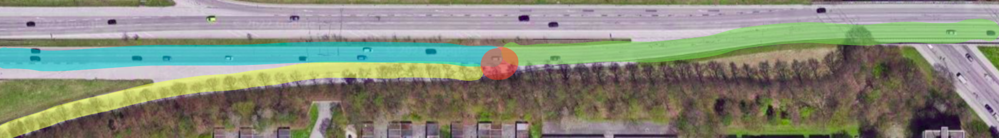
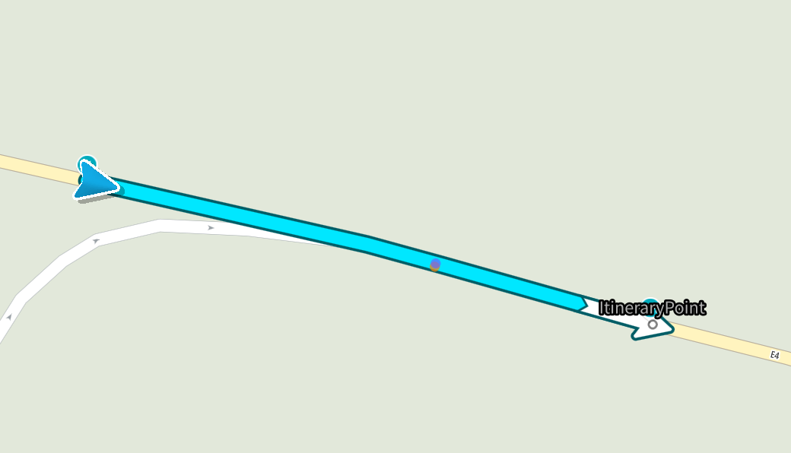
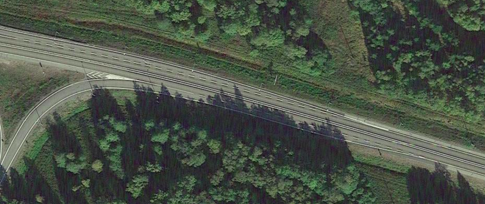
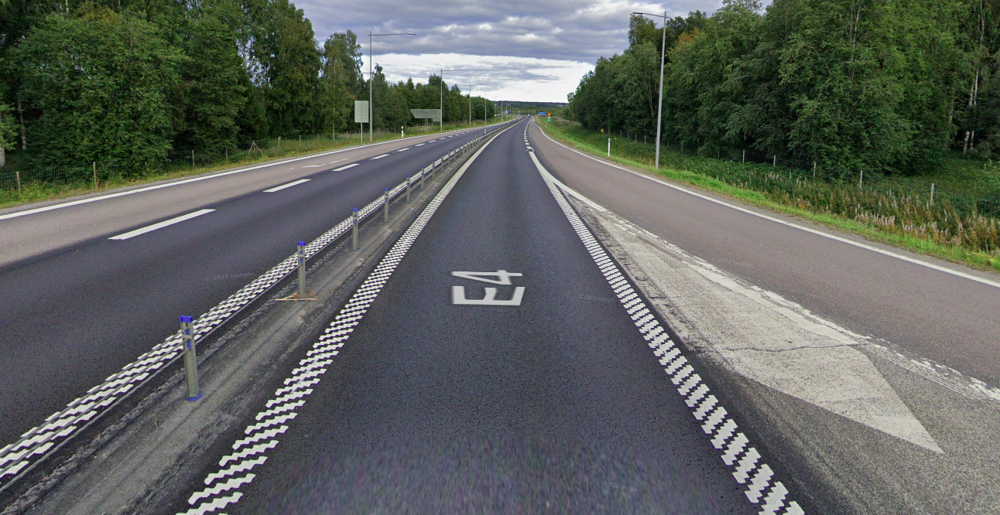

// Copyright (C) 2022 TomTom NV. All rights reserved.
//
// This software is the proprietary copyright of TomTom NV and its subsidiaries and may be
// used for internal evaluation purposes or commercial use strictly subject to separate
// license agreement between you and TomTom NV. If you are the licensee, you are only permitted
// to use this software in accordance with the terms of your license agreement. If you are
// not the licensee, you are not authorized to use this software in any manner and should
// immediately return or destroy it.

= DrivePastMergeHandler

A `DrivePastMergeHandler` is designed to handle road situations where the driver drives past a merge. +
*Drive past merge* is the situation when the ramp or minor road is merging into the main one, the driver is using.
In such situations a driver *always* has priority over drivers which are coming from the ramp/minor road.
With that being said, no instruction will be issued if a drive past merge is detected.

== Glossary

*Incoming off-route road* - the ramp or minor road that is merging into the *Incoming on-route road*. Highlighted in yellow. +
*Incoming on-route road* - the road the driver is using before merging with *Incoming off-route road*. Highlighted in blue. +
*Outgoing on-route road* - the road the driver is using after merging with *Incoming off-route road*. Highlighted in green. +

=== Drive past merge analysis depicted.

== Drive past merge detection

In the first step, we analyse the junction at the end of the incoming on-route road.
We collect all incoming off-route roads. There must be only 1 such road.
If no roads are found or there's more than 1 such road, then driving past the merge is not detected. +

In the second step, we check if incoming on-route road forms merge geometry together with the incoming off-route road.
If it's not the case, then drive past merge is not detected. +

In the third step, we check the similarity of the roads. The key point here is that the outgoing on-route road must be more similar to the incoming on-route road than to the incoming off-route road. If it's not the case, then drive past merge is not detected.
During the comparison, we take into account attributes like road name, road number, and so on. +

In the fourth step, we check whether the incoming and outgoing on-route roads form a single straight road.
If this is the case, then we consider such a road situation as driving past a merge.

In the fifth step, we analyse the lane configuration. If the driver may be forced to change his lane shortly after the road merge point, or if his lane goes off-route, then the situation is not considered as driving past a merge.

== Example

Location: *62.517820, 17.441091* +
Since the driver doesn't have any options except driving straight we should not issue any instructions for the particular road stretch.

=== 1.1 The actual route

=== 1.2 The situation from the satellite

=== 1.3 The situation from the driver's perspective

== Relations with other situation handlers

A `DrivePastMergeHandler` is flexible and does *not* have a fixed place in the situation handlers sequence.
Thus, when any new situation handler is introduced, `DrivePastMergeHandler` can be moved on demand if it badly affects a new handler.
At the moment it is placed after `RoundaboutHandler` and before `MergeHandler`.
